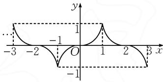
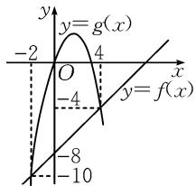
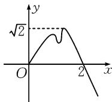
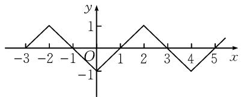
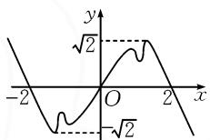
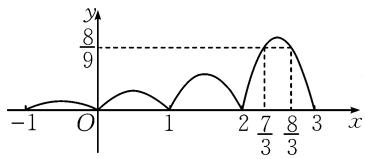
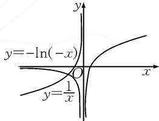

# 借助函数图象,数形结合应用

# ● 桂林市首附实验中学 钟琳

摘要: 正确理解并掌握对应函数的图象, 借助数形结合思维来分析或处理与之对应的函数性质及其综合问题, 成为函数模块知识考查的一个重要方向. 以对应的函数图象为依托, 结合典型实例, 数形结合处理一些与函数性质、不等式、参数值以及创新性综合应用有关的问题, 归纳总结解题技巧与策略, 以指导数学教学与复习备考.

关键词: 函数; 图象; 数形结合; 性质; 不等式; 参数

函数的图象作为函数中最为直观的一种表达形式,结合函数中“数”的基本属性创造了“形”的结构特征,直观形象地揭示了函数的基本性质.借助函数图象的直观性,化函数中“数”的问题为“形”的直观,合理数形结合,有时分析与解决起来更加简捷,成为解决一些函数综合应用问题中比较常用的一种基本技巧方法.

# 1 研究函数性质

例 1 （1）已知函数 $f(x)$ 对任意 $x \in R$ 都有 $f(x+2) = -f(x)$ ，且 $f(-x) = -f(x)$ ，当 $x \in (-1,1]$ 时， $f(x) = x^{3}$ ，则下列结论正确的是（）.

A.函数 $y = f(x)$ 的图象关于点 $(k,0)(k\in \mathbf{Z})$ 对称B.函数 $y = f(x)$ 的图象关于直线 $x = 2k(k\in \mathbf{Z})$ 对称

C. 当 $x \in [2,3]$ 时， $f(x) = (x - 2)^{3}$

D. 函数 $y = |f(x)|$ 的最小正周期为 2

(2)已知函数 $f(x)=x-8, g(x)=3x-x^{2}, x \in \mathbb{R}$ ，用 $M(x)$ 表示 $f(x), g(x)$ 中的较小者，记为 $M(x)=\min\{f(x), g(x)\}$ ，则函数 $M(x)$ 的最大值为

解析:(1)因为 $f(x+2)=-f(x)$ ，所以 $f(x)=-f(x-2)$ ，则 $f(x+2)=f(x-2)$ 。所以函数 $f(x)$ 的周期为 4。

又 $f(-x) = -f(x)$ ，所以 $f(-x) = f(x - 2)$ ，故 $f(x)$ 的图象关于直线 x = -1 对称.

又当 $x \in (-1, 1]$ 时， $f(x) = x^3$ ，故作出 $f(x)$ 的图象，如图1.

选项 A 中, 当 k=1
时, 函数 $y=f(x)$ 的图

text_image

-3
-2
O
1
2
3
x
y
-1
1
-1

图1

象不关于点 $(1,0)$ 中心对称,故选项A错误;

选项 B 中, 当 k=1 时, 函数 $y=f(x)$ 的图象不关于直线 x=2 对称, 故选项 B 错误;

选项 C 中，当 $x \in [2,3]$ 时，有 $x - 2 \in [0,1]$ ，则 $f(x) = -f(x - 2) = -(x - 2)^{3}$ ，故选项 C 错误；

选项 D 中, 由图象可知 $y = f(x)$ 的最小正周期为 4, 又 $|f(x + 2)| = |-f(x)| = |f(x)|$ , 所以 $y = |f(x)|$ 的最小正周期为 2, 故选项 D 正确.

故选择:D.

(2)依题,作出函数 $f(x)$ 与 $g(x)$ 的图象,如图 2 所示.

由图可知函数 $f(x)=x-8$ 与函数 $g(x)=3x-x^{2}$ 的交点为 $(4,-4),(-2,-10)$ ，则

$$
\begin{array}{c} {{M (x) = \min \{f (x), g (x) \} =}} \\ {{\left\{ \begin{array}{l l} {3 x - x ^ {2}, x \leqslant - 2 \text {或} x \geqslant 4,} \\ {x - 8, - 2 <   x <   4.} \end{array} \right.}} \end{array}
$$

line

| Point | x | y |
|---|---|---|
| -2 | -2 | -2 |
| -4 | 4 | 4 |
| -8 | -8 | -8 |
| -10 | -10 | -10 |

图2

所以 $M(x)_{\max}=M(4)=-4$ . 故填: -4.

点评:根据函数的图象,数形结合分析与判断函数的基本性质时,首先要根据函数解析式画出函数图象,然后借助图象分析函数的性质.如从图象的最高点、最低点分析函数的极值、最值;从图象的对称性分析函数的奇偶性;从图象的走向趋势分析函数的单调性、周期性等.

# 2 求解不等式

例 2 （1）函数 $f(x)$ 是周期为 4 的偶函数，当 $x \in [0, 2]$ 时， $f(x) = x - 1$ ，则不等式 $xf(x) > 0$ 在 $(-1, 3)$ 上的解集为

(2)已知定义在 $\mathbf{R}$ 上的奇函数 $f(x)$ 在 $[0, + \infty)$ 上的图象如图3所示，则不等式 $x^{2}f(x) > 2f(x)$ 的解集为（ ）.

  
图3

A. $(- \sqrt{2}, 0) \cup (\sqrt{2}, 2)$

B. $(-∞,-2)∪(2,+∞)$

C. $(-∞,-2)∪(-\sqrt{2},0)∪(\sqrt{2},2)$

D. $(-2,-\sqrt{2})\cup(0,\sqrt{2})\cup(2,+\infty)$

解析:(1)函数 $f(x)$ 的部分图象如图 4 所示.

line

| x | y |
|---|---|
| -3 | 0 |
| -2 | 1 |
| -1 | 0 |
| 0 | -1 |
| 1 | 0 |
| 2 | 1 |
| 3 | 0 |
| 4 | -1 |
| 5 | 0 |

图4

由图可知，当 $x \in (-1,0)$ 时， $f(x) < 0, xf(x) > 0$ ，符合题意；

当 $x \in (0,1)$ 时， $f(x) < 0, xf(x) < 0$ ，不符合题意；

当 $x \in (1,3)$ 时， $f(x) > 0, xf(x) > 0$ ，符合题意.

故填： $(-1,0)\cup(1,3)$ .

(2) 根据奇函数的图象特征, 作出 $f(x)$ 在 $(-∞,0)$ 上的图象, 如图 5 所示.

由 $x^{2}f(x) > 2f(x)$ ，得不等式 $(x^{2} - 2)f(x) > 0$ ，等价于$\left\{ \begin{array}{l}x^{2} - 2 > 0,\\ f(x) > 0 \end{array} \right.$ 或 $\left\{ \begin{array}{l}x^2 -2 <   0,\\ f(x) <   0. \end{array} \right.$ 结合图象得 x<-2 或 $\sqrt{2}<x<2$ 或 $-\sqrt{2}<x<0$ .

  
图 5

所以不等式解集为 $(- \infty, -2) \cup (-\sqrt{2}, 0) \cup (\sqrt{2}, 2)$ . 故选择: C.

点评:利用函数的图象,数形结合求解对应不等式时,当不等式问题不能用代数法求解但与函数有关时,常将不等式问题转化为两个函数图象的位置关系问题或函数图象与坐标轴的位置关系问题,从而利用数形结合法求解.

# 3 确定参数取值

例3 已知函数 $f(x)$ 的定义域为 $\mathbf{R}$ ，满足 $f(x) = 2f(x - 1)$ ，且当 $x \in (0,1]$ 时， $f(x) = x(1 - x)$ ，若 $x \in (-\infty, m]$ ，恒有 $f(x) \leqslant \frac{8}{9}$ ，则实数 $m$ 的取值范围是

解析:依题, $x\in(1,2]$ 时, $x-1\in(0,1]$ ,则 $f(x)=2f(x-1)=2(x-1)(2-x)=-2\left(x-\frac{3}{2}\right)^{2}+\frac{1}{2}\in\left[0,\frac{1}{2}\right]$ ;

当 $x \in (-1,0]$ 时， $x + 1 \in (0,1]$ ，则 $f(x) = \frac{1}{2} \times f(x + 1) = -\frac{1}{2} x(x + 1) = -\frac{1}{2}\left(x + \frac{1}{2}\right)^2 + \frac{1}{8} \in \left[0, \frac{1}{8}\right]$ .

故当 $x \in (2,3]$ 时， $x - 1 \in (1,2]$ ，则 $f(x) = 2 \times f(x - 1) = 2\left[-2\left(x - \frac{5}{2}\right)^2 + \frac{1}{2}\right] = -4\left(x - \frac{5}{2}\right)^2 +$ $1 \in [0,1]$ .

所以当 $f(x) = \frac{8}{9}$ 时， $-4\left(x - \frac{5}{2}\right)^2 + 1 = \frac{8}{9}$ ，则 $x = \frac{7}{3}$ 或 $x = \frac{8}{3}$ . 作出函数 $f(x)$ 的大致图象，如图6.

由图6可知，当 $m \leqslant \frac{7}{3}$ 时，恒有 $f(x) \leqslant \frac{8}{9}$ . 故填： $\left(-\infty, \frac{7}{3}\right]$ .

line

| x | y |
|---|---|
| -1 | 0 |
| 0 | 0 |
| 1 | 2 |
| 2 | 0 |
| 3 | 8/3 (peak) |
| 4 | 0 |
| 5 | 0 |

图6

点评: 利用函数图象, 数形结合确定参数的取值范围或最值, 当有关参数的不等式关系不易找出时, 可将函数(或方程)等价转化为方便作图的两个函数, 再根据题设条件和图象确定参数的取值范围.

# 4 创新综合应用

例3 已知函数 $f(x) = \begin{cases} \ln x, & x > 0, \\ g(x), & x < 0, \end{cases}$ 若 $\exists x_0 \in (-\infty, 0)$ ，使得 $f(x_0) + f(-x_0) = 0$ 成立，请写出一个符合条件的函数 $g(x)$ 的表达式 \_\_\_\_.（答案不唯一）

解析:依题,由 $\exists x_{0}\in(-\infty,0)$ , 使得 $f(x_{0})+f(-x_{0})=0$ 可得 $g(x_{0})=-f(-x_{0})$ .

易知 $y = \ln x$ 与 $y = -\ln (-x)$ 的图象关于原点对称.

如图7所示，当 $x < 0$ 时，取 $y = \frac{1}{x}$ ，则 $y = \frac{1}{x}$ 与 $y = -\ln (-x)$ 的图象在第三象限显然有一交点 $\left(x_0, \frac{1}{x_0}\right)$ ，故取 $g(x) = \frac{1}{x}$ 符合条件.

text_image

y
y=-ln(-x)
O
y=1/x
x

图7

故填: $g(x)=\frac{1}{x}$ (答案不唯一).

点评:解决此类创新综合应用问题的本质就是挖掘创新定义的内涵,抓住创新定义并结合对函数图象的直观分析,回归函数本质,利用数形结合或直观转化,可以使得问题更易于处理,避免一些不必要的逻辑推理与数学运算,优化解题过程,提升解题效益.

其实,依托函数图象的直观性,借助函数“数”的基本属性与图象“形”的结构特征之间的联系,“数”与“形”结合、转化,实现以“形”的直观与突破来切入并解决函数的“数”的问题,这对解决一些相关的函数综合问题有很好的用处,给问题的切入与展开创造一个更加直观创新的场景,优化数学思维品质,提升数学解题能力,培养数学核心素养. Z