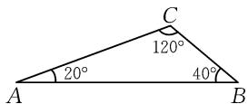
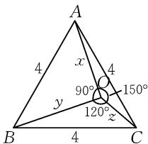
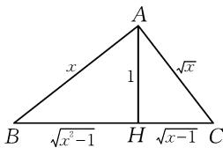
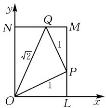

# 几何构造三角形,巧解强基竞赛题\*

● 陕西省商洛学院数学与计算机应用学院 晁福刚  
江西省吉安市第一中学曾伟

摘要:构造法是数学竞赛中的重要方法,几何构造更是数形结合思想的典型体现.本文中以构造三角形为核心解题手段,选取强基计划、国内外数学竞赛中的典型试题,对比常规代数解法与几何构造解法的差异,详细阐述如何挖掘题目隐含几何信息,通过构造贴合余弦定理、勾股定理的三角形,将抽象的代数条件赋予几何意义,实现复杂问题的转化与简便求解.同时,也补充了构造对偶式、向量等其他构造解法,体现了构造法的多样性与灵活性,为解决强基计划和数学竞赛中的相关问题提供新的解题思路与方法.

关键词: 构造法; 几何构造; 构造三角形; 强基计划; 数学竞赛

构造法是数学竞赛解题中一类极为重要的方法，体现在数学解题中并不直接运用逻辑推理一步一步地导出最后问题的结论，而是跳出原来问题的圈子，从新的角度，用新的观点观察、分析、解释对象，别开生面地依据题设条件的特点，用已知条件中的元素为“元件”，用已知数学关系式为“支架”，在思维中构造出一种新的数学形式，使原问题中隐晦不清的关系和性质在新构造中清楚地展现出来，从而简捷地解决问题[1].而其中的几何构造更加体现了数学中的数形结合思想，本文试图通过几何上构造三角形，巧妙解决强基计划或数学竞赛中的相关试题，从中体会几何构造的深刻与精美.

# 1 构造三角形求代数式的值

例 1 （2025 年西安交通大学强基计划试题）

$$
\sin^ {2} 2 0 ^ {\circ} + \cos^ {2} 5 0 ^ {\circ} + \sin 2 0 ^ {\circ} \cos 5 0 ^ {\circ} = \underline {{\quad}}.
$$

分析: 此题初看是一道三角函数中的求值问题, 若利用角度拆分、降幂公式、积化和差、和差化积、正弦平方差公式等方式处理, 可给出如下的三种解法.

解法一: 角度拆分.

$$
\begin{array}{l} \text {   原式   } = \sin^ {2} 2 0 ^ {\circ} + \cos^ {2} (2 0 ^ {\circ} + 3 0 ^ {\circ}) + \sin 2 0 ^ {\circ} \cdot \\ \cos (2 0 ^ {\circ} + 3 0 ^ {\circ}) \\ = \sin^ {2} 2 0 ^ {\circ} + \left(\frac {\sqrt {3}}{2} \cos 2 0 ^ {\circ} - \frac {1}{2} \sin 2 0 ^ {\circ}\right) ^ {2} + \\ \sin 2 0 ^ {\circ} \left(\frac {\sqrt {3}}{2} \cos 2 0 ^ {\circ} - \frac {1}{2} \sin 2 0 ^ {\circ}\right) \\ = \frac {3}{4} \sin^ {2} 2 0 ^ {\circ} + \frac {3}{4} \cos^ {2} 2 0 ^ {\circ} = \frac {3}{4}. \\ \end{array}
$$

解法二:降幂公式与和差积互化.

原式 $= \frac{1}{2} (1 - \cos 40^{\circ}) + \frac{1}{2} (1 + \cos 100^{\circ}) + \frac{1}{2} \times$

$$
\left[ \sin (2 0 ^ {\circ} + 5 0 ^ {\circ}) + \sin (2 0 ^ {\circ} - 5 0 ^ {\circ}) \right]
$$

$$
= \frac {3}{4} - \frac {1}{2} (\cos 4 0 ^ {\circ} + \cos 8 0 ^ {\circ}) + \frac {1}{2} \cos 2 0 ^ {\circ}
$$

$$
= \frac {3}{4} - \frac {1}{2} \times 2 \cos 6 0 ^ {\circ} \cos 2 0 ^ {\circ} + \frac {1}{2} \cos 2 0 ^ {\circ}
$$

$$
= \frac {3}{4}.
$$

解法三: 正弦平方差公式.

原式 $= \sin^2 20^\circ +\sin^2 40^\circ +\sin 20^\circ \sin 40^\circ$

$$
\begin{array}{l} = \sin^ {2} 2 0 ^ {\circ} + \sin^ {2} 4 0 ^ {\circ} + \sin^ {2} 3 0 ^ {\circ} - \sin^ {2} 1 0 ^ {\circ} \\ = \frac {1}{4} + \sin^ {2} 4 0 ^ {\circ} - \sin^ {2} 1 0 ^ {\circ} + \sin^ {2} 2 0 ^ {\circ} \\ = \frac {1}{4} + \sin 5 0 ^ {\circ} \sin 3 0 ^ {\circ} + \frac {1 - \cos 4 0 ^ {\circ}}{2} = \frac {3}{4}. \\ \end{array}
$$

对原式稍加整理, 注意角度之间的关系, 联想到平面三角形内角和为 $180^{\circ}$ , 则可从几何上构造三角形(如图

  
图1

1),凑出余弦定理的形式.巧妙求解.具体如下:

巧解：

原式 $= \sin^2 20^\circ +\sin^2 40^\circ +\sin 20^\circ \sin 40^\circ$

$$
\begin{array}{l} = \sin^ {2} 2 0 ^ {\circ} + \sin^ {2} 4 0 ^ {\circ} - 2 \sin 2 0 ^ {\circ} \sin 4 0 ^ {\circ} \cos 1 2 0 ^ {\circ} \\ = \sin^ {2} 1 2 0 ^ {\circ} = \frac {3}{4}. \\ \end{array}
$$

例 2 （2021 年中国科学技术大学少创班试题）若正数 x, y, z 满足 $x^{2} + y^{2} = z^{2} + x^{2} + \sqrt{3}$ $zx = y^{2} + z^{2} + yz = 16$ ，则 $2xy + zx + \sqrt{3}yz =$ \_\_\_\_.

分析:首先将题目看成是关于 x, y, z 的三元二次
非线性方程组 $\left\{\begin{aligned}x^{2}+y^{2}&=16,\\ z^{2}+x^{2}+\sqrt{3}zx&=16,\end{aligned}\right.$ 通过解出方程组， $y^{2}+z^{2}+yz=16$ 再计算代数式的值.

解析:由 $z^{2}+x^{2}+\sqrt{3}zx=y^{2}+z^{2}+yz$ 可得 $z=\frac{y^{2}-x^{2}}{\sqrt{3}x-y}$ ，再将 $z=\frac{y^{2}-x^{2}}{\sqrt{3}x-y}$ 代入 $y^{2}+z^{2}+yz=16$ ，可得 $\left(\frac{y^{2}-x^{2}}{\sqrt{3}x-y}\right)^{2}+y\left(\frac{y^{2}-x^{2}}{\sqrt{3}x-y}\right)=16-y^{2}=x^{2}$ 。由于 $x\neq0$ ，整理后可得 $(x^{2}+y^{2})(\sqrt{3}y-2x)=0$ ，则有 $x=\frac{\sqrt{3}}{2}y$ ，

于是 $y^{2} = \frac{64}{7}, z = \frac{y^{2} - \frac{3}{4} y^{2}}{\sqrt{3} \times \frac{\sqrt{3}}{2} y - y} = \frac{1}{2} y.$

故 $2xy + zx + \sqrt{3} yz = \sqrt{3} y^2 +\frac{y}{2}\cdot \frac{\sqrt{3}}{2} y + \sqrt{3} y\cdot$ $\frac{y}{2} = \frac{7\sqrt{3}}{4} y^{2} = 16\sqrt{3}.$

以上通过消元解方程组有些复杂,仔细观察题干中代数式的形式,很容易联想到三个余弦定理的形式,从几何上构造出一个符合题目条件的三角形.

巧解: 构造边长为 4 的等边三角形 ABC, 满足 OA = x, OB = y, OC = z, 且 $\angle AOB = 90^{\circ}$ , $\angle BOC = 120^{\circ}$ , $\angle COA = 150^{\circ}$ , 如图 2.

在 $\triangle AOB$ 中， $x^{2}+y^{2}=16$ ；在 $\triangle AOC$ 中， $z^{2}+x^{2}+\sqrt{3}zx=16$ ；在 $\triangle BOC$ 中， $y^{2} + z^{2} + yz = 16$ . 所以有 $2xy + zx + \sqrt{3}yz = 4(S_{\triangle AOB} + S_{\triangle AOC} + S_{\triangle BOC}) = 4S_{\triangle ABC} = 16\sqrt{3}$ .

点评:从以上两个例题可以看到如果用一般的方法求解,由已知条件一步一步推导要求的结果,其过程比较复杂;但是若跳出题干,经过几何上构造一个三角形后,题干变得非常清晰,其代数条件被赋予了几何意义,最终问题变得非常简单.而其中的关键在于要具有一双慧眼,发现并提取题目条件中的深层次的隐含信息,构造出符合相关题设的几何对象.

接下来将通过具体实例,呈现几何构造三角形在求解其他数学竞赛问题上的应用.

text_image

A
4
x
4
90°
150°
y
120°
z
B
4
C

图 2

# 2 构造三角形解方程

例 3 （1998 年加拿大数学奥林匹克题）求所有的实数 x，使得 $x = \sqrt{x - \frac{1}{x}} + \sqrt{1 - \frac{1}{x}}$ .

分析: 此题为解含根式的方程, 通常会考虑两边平方, 再进行代数变形, 可得如下解法.

解法一: 注意到 $x \in (1, +\infty)$ ，方程化为 $x \sqrt{x} = \sqrt{x^{2} - 1} + \sqrt{x - 1}$ ，两边平方后得 $x^{3} - x^{2} - x + 2 = 2 \sqrt{(x^{2} - 1)(x - 1)}$ ，再两边平方可整理得到 $x^{6} - 2x^{5} - x^{4} + 2x^{3} + x^{2} = 0$ 。又因为 $x^{6} - 2x^{5} - x^{4} + 2x^{3} + x^{2} = x^{2}(x^{2} - x - 1)^{2}$ ，得 $x^{2} - x - 1 = 0$ ，因为 x > 1，所以 $x = \frac{1 + \sqrt{5}}{2}$ 。

以上解法实际上比较繁琐,经历了两次平方,还要注意特殊因式的分解.接下来尝试从几何上构造三角形进行求解.

解法二: 原方程可化为 $\sqrt{x^{2}-1} + \sqrt{x-1} = x\sqrt{x}$ .

构造 $\triangle ABC$ ，使 $AB = x$ $AC = \sqrt{x}$ ，BC边上的高 $AH = 1.$ 如图3，则 $BH = \sqrt{x^2 - 1}$ $CH = \sqrt{x - 1}$

text_image

A
x
√x
1
B √(x²-1) H √(x-1) C

图3

因为 $\frac{AC}{BC}=\frac{\sqrt{x}}{x\sqrt{x}}=\frac{1}{x}=\frac{AH}{AB},\angle ACH=\angle BCA,$ 所以 $\triangle ACH\sim\triangle BCA$ ，有 $\angle BAC=\angle AHC=90^{\circ}$ .

在 $\triangle ABC$ 中，由勾股定理得 $AB^{2} + AC^{2} = BC^{2}$ 即 $x^{2} + x = x^{3}$ . 又 $x > 0$ ，则 $x^{2} - x - 1 = 0$ ，解得 $x = \frac{1 + \sqrt{5}}{2}$ .

以上解法重在几何上的构造,在找到构造出合适的三角形后,运算量非常小,与解法一相比,极大地简化了计算.此题还可考虑构造对偶与构造向量求解,具体过程如下.

解法三:(构造对偶)不妨记

$$
x = \sqrt {x - \frac {1}{x}} + \sqrt {1 - \frac {1}{x}}, \tag {①}
$$

$$
y = \sqrt {x - \frac {1}{x}} - \sqrt {1 - \frac {1}{x}}. \tag {②}
$$

①×②，得 xy=x-1，故 $y=\frac{x-1}{x}=1-\frac{1}{x}$ .

①+②，得 $x+y=2\sqrt{x-\frac{1}{x}}$ ，则有 $x+1-\frac{1}{x}=$

$2\sqrt{x-\frac{1}{x}}$ ，即 $\left(\sqrt{x-\frac{1}{x}}-1\right)^{2}=0.$

于是 $x - \frac{1}{x} = 1$ ，即 $x^{2} - x - 1 = 0$

解得 $x = \frac{1\pm\sqrt{5}}{2}$ . 又 $x > 1$ , 故 $x = \frac{1 + \sqrt{5}}{2}$ .

经检验知, $x=\frac{1+\sqrt{5}}{2}$ 是原方程的解.

解法四:(构造向量)显然 x>0, 则原方程可变形为 $\frac{1}{\sqrt{x}}\cdot\sqrt{1-\frac{1}{x^{2}}}+\sqrt{1-\frac{1}{x}}\cdot\frac{1}{x}=1$ . 构造向量 $a=\left(\frac{1}{\sqrt{x}},\sqrt{1-\frac{1}{x}}\right)$ , $b=\left(\sqrt{1-\frac{1}{x^{2}}},\frac{1}{x}\right)$ .

$$
\begin{array}{r l} & {\text {根据柯西一施瓦茨不等式}   a \cdot b \leqslant | a |   | b |  , \text {可得}} \\ & {1 = \frac {1}{\sqrt {x}} \cdot \sqrt {1 - \frac {1}{x ^ {2}}} + \sqrt {1 - \frac {1}{x}} \cdot \frac {1}{x} \leqslant \sqrt {\frac {1}{x} + 1 - \frac {1}{x}}  .} \end{array}
$$

$\sqrt{1-\frac{1}{x^{2}}+\frac{1}{x^{2}}}=1$ ，因此该不等式取等号，从而a与b共线同向，注意到 $|a|=|b|=1$ ，故a=b.

于是 $\frac{1}{\sqrt{x}} = \sqrt{1 - \frac{1}{x^2}}$ 且 $\sqrt{1 - \frac{1}{x}} = \frac{1}{x}$ ，可得 $\sqrt{x} = \sqrt{1 + \frac{1}{x}}$ ，解得 $x = \frac{1 + \sqrt{5}}{2}$ .

经检验,原方程的解为 $x=\frac{1+\sqrt{5}}{2}$ .

点评:解法三和解法四均为构造方法,但构造的对象不是几何上的三角形,而是分别构造相对应的对偶式和向量,解法亦灵活巧妙.

# 3 构造三角形求最值

例 4 （2021 年全国高中数学联合竞赛试题）设正实数 x, y 满足如下条件：存在 $a \in [0, x]$ ， $b \in [0, y]$ ，使得 $a^{2} + y^{2} = 2$ ， $b^{2} + x^{2} = 1$ ， $ax + by = 1$ ，则 $x + y$ 的最大值 \_\_\_\_.

分析:题干中有四个变量,三个约束条件,其中的 $a\in[0,x],b\in[0,y]$ 可尝试构造矩形边上变动的点,后三个约束条件 $a^{2}+y^{2}=2,b^{2}+x^{2}=1,ax+by=1$ 可理解为内部三角形的度量关系.引入辅助角后转化为求三角函数的最值.

解析:对于满足条件的正实数对 $(x,y)$ ，在平面直角坐标系xOy中取点 $L(x,0)$ ， $M(x,y)$ ， $N(0,y)$ ，则四边形OLMN为矩形，点 $P(x,b)$ ， $Q(a,y)$ 分别在边LM, MN 上, 如图 4 所示.

由于 $a^2 + y^2 = 2, b^2 + x^2 = 1$ ， $ax + by = 1$ ，因此

$$
\mid O P \mid = \sqrt {x ^ {2} + b ^ {2}} = 1,
$$

$$
\mid O Q \mid = \sqrt {a ^ {2} + y ^ {2}} = \sqrt {2},
$$

$$
\begin{array}{l} \mid P Q \mid = \sqrt {(a - x) ^ {2} + (y - b) ^ {2}} \\ = \sqrt {\left(a ^ {2} + y ^ {2}\right) + \left(b ^ {2} + x ^ {2}\right) - 2 (a x + b y)} \\ = \sqrt {2 + 1 - 2 \times 1} = 1. \\ \end{array}
$$

text_image

y
N Q M
√2 1
O P L x

图4

所以 $\triangle OPQ$ 是以 $P$ 为直角顶点的等腰直角三角形.于是可设 $\angle LOP = \theta ,\angle QON = \frac{\pi}{4} -\theta$ ，其中 $0\leqslant$ $\theta \leqslant \frac{\pi}{4}$ ，则

$$
\begin{array}{l} x + y = | O L | + | O N | = | O P | \cdot \cos \angle L O P + \\ \left| O Q \right| \cdot \cos \angle Q O N = \cos \theta + \sqrt {2} \cos \left(\frac {\pi}{4} - \theta\right) = \\ \end{array}
$$

$2\cos\theta+\sin\theta=\sqrt{5}\sin(\theta+\varphi)$ （其中 $\varphi=\arcsin\frac{2\sqrt{5}}{5}$ ）.

当 $\theta=\frac{\pi}{2}-\varphi$ (相应有 $x=\frac{2\sqrt{5}}{5}, y=\frac{3\sqrt{5}}{5}$ ) 时， $x+y$ 取到最大值 $\sqrt{5}$ .

点评:通过构造矩形内部的一个等腰直角三角形,巧妙地将原问题转为求以角度为变量的三角函数的最值,关键还是在于对题干条件的仔细观察来得到几何上的有效刻画.本题也可从代数上利用拉格朗日恒等式求解:因为 $(xy-ab)^{2}=(a^{2}+y^{2})(b^{2}+x^{2})-(ax+by)^{2}=1$ ,所以xy-ab=1,从而 $(x+y)^{2}+(a-b)^{2}=(a^{2}+y^{2})+(b^{2}+x^{2})+2(xy-ab)=5$ .于是 $x+y\leqslant\sqrt{5}$ ,当 $a=b=\frac{\sqrt{5}}{5},x=\frac{2\sqrt{5}}{5},y=\frac{3\sqrt{5}}{5}$ 时,等号成立.

例 3 和例 4 虽然呈现了多种解答方法,但是几何上构造三角形的方法仍不失为一种简洁优美的做法,其将代数形式赋予几何意义,极大地简化代数上的计算,而这需要深刻挖掘题干中可能隐含的几何信息,构造出合适的三角形,方可巧妙解决用常规思维不易解决的强基或竞赛试题.

# 参考文献：

[1]陈传理,张同君.竞赛数学教程[M].3版.北京:高等教育出版社,2022:284.Z