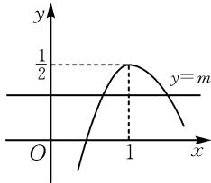
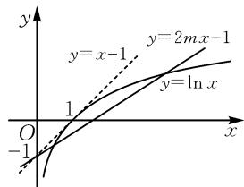
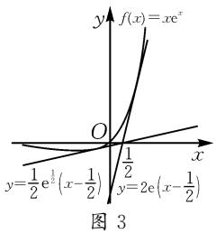
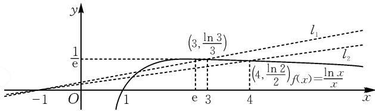

# 半分参法:求解参数范围问题的有效路径

# ● 天津市武清区杨村第一中学 韩品

摘要: 求参数的取值范围问题是学生的难点, 当采用参数讨论法、完全分参法探究参数范围遇阻时, 半分参法是一条可行性路径, 可将题设约束条件等价转化成一条定曲线与一条动直线的位置关系, 借助图形的直观、明了性, 顺利探究参数的取值范围.

关键词: 半分参法; 参数讨论法; 完全分参法

求参数的取值范围问题,是命题的热点,也是学生的难点.对于这类问题,采用参数讨论法,学生往往因分类冗长而半途而废;采用完全分离参数法,一般需要借助导数研究函数的单调性,往往计算量颇大.而采用“半分参”法,即先对题设等式(或不等式)实施适当变形,使得参数和部分变量放置在等式(或不等式)的某一边;再通过数形结合,可将题设约束条件等价转化成一条定曲线与一条动直线的位置关系;最后借助图形的直观、明了性,即可顺利探究参数的取值范围 $^{[1]}$ .以下结合实例作一探讨!

# 1 试题呈现

设函数 $f(x)=x\ln x-mx^{2}$ 有两个不同的极值点，则实数 m 的取值范围是 \_\_\_\_.

# 2 多解探究

方法 1: 由题意函数 $f(x)=x(\ln x-mx)$ 有两个不同极值点, 等价于其导函数 $f'(x)=\ln x-2mx+1$ 有两个不同的零点. 设函数 $g(x)=\ln x-2mx+1$ , 则 $g(x)$ 有两个不同的零点.

当 $m \leqslant 0$ 时, 易知函数 $g(x)$ 在定义域内单调递增, 此时该函数至多有一个零点, 显然不适合题意.

当 m>0 时，求导得 $g'(x)=\frac{1}{x}-2m$ . 据此可知：当 $0<x<\frac{1}{2m}$ 时， $g'(x)>0$ ; 当 $x>\frac{1}{2m}$ 时， $g'(x)<0$ . 因此，函数 $g(x)$ 在区间上 $\left(0,\frac{1}{2m}\right)$ 单调递增，在区间 $\left(\frac{1}{2m},+\infty\right)$ 上单调递减.

又易知当 $x \to 0$ 或 $x \to +\infty$ 时，均有 $g(x) \to -\infty$ 。于是可知，为了满足题意，则应使得 $g\left(\frac{1}{2m}\right) > 0$ ，解得 $0 < m < \frac{1}{2}$ 。故所求实数 $m$ 的取值范围是 $\left(0, \frac{1}{2}\right)$ 。

方法2:由题意知 $f'(x)=\ln x-2mx+1$ 有两个不同的零点, 则方程 $\ln x-2mx+1=0$ , 即 $m=\frac{\ln x+1}{2x}$ 有两个不同的实数解, 所以直线 y=m 与函数 $y=\frac{\ln x+1}{2x}$ 的图象有两个不同的交点. 因为 $y=\frac{\ln x+1}{2x}$ , 所以 $y'=-\frac{\ln x}{2x^{2}}$ . 据此可知当 0<x<1 时, $y'>0$ ; 当 x>1 时, $y'<0$ . 因此, 函数 $y=\frac{\ln x+1}{2x}$ 在 (0,1) 上单调递增, 在 $(1,+\infty)$ 上单调递减. 据此, 可画

出函数 $y=\frac{\ln x+1}{2x}$ 的图象,如图1所示.于是,让直线y=m上下“平移”分析即知,实数m的取值范围是 $\left(0,\frac{1}{2}\right)$ .

text_image

y
1/2
y=m
O
1
x

图 1

方法 3:依题,可得 $f'(x)=$ $\ln x+1-2mx$ ，令 $f'(x)=\ln x-2mx+1=0$ ，则变形得 $\ln x=2mx-1$ ，此时左边可构造定曲线，右边可构造含参数的直线。于是，函数 $y=x\ln x-mx^{2}$ 有两个不同的极值点，等价于导函数 $f'(x)=\ln x-2mx+1=0$ 有两个不同的零点，亦等价于函数 $y=\ln x$ 与y=2mx-1的图象有两个不同的交点。注意到直线

$y=2mx-1$ 恒过点 $(0,-1)$ ,
如图 2. 当直线 y = 2mx - 1
与 $y=\ln x$ 的图象相切时，设切点为 $(x_{0},\ln x_{0})$ ，由 $y'=\frac{1}{x}$ 可得切线的斜率为 $\frac{1}{x_{0}}$ ，则切

text_image

y
y=x-1
y=2mx-1
y=ln x
1
O
x
-1

图2

线方程为 $y-\ln x_{0}=\frac{1}{x_{0}}\cdot(x-x_{0})$ ，将点 $(0,-1)$ 代入得 $-1-\ln x_{0}=-1$ ，解得 $x_{0}=1$ ，即切线斜率为 1，则

2m=1, 所以 $m=\frac{1}{2}$ . 因此, 通过让动直线 y=2mx-1 绕着定点 $(0,-1)$ 旋转, 即可由图 2 知: 当 $0<m<\frac{1}{2}$ 时, $y=\ln x$ 与 y=2mx-1 的图象有两个交点, 则实数 m 的取值范围是 $\left(0,\frac{1}{2}\right)$ .

对比分析:本题求解的第一步是等价转化——函数 $f(x)=x(\ln x-mx)$ 有两个不同的极值点,等价于导函数 $f'(x)=\ln x-2mx+1$ 有两个不同的零点.方法1采用“参数讨论法”,比较繁琐一点,且在复杂问题下,参数讨论的标准往往不好确定,导致利用该方法较难顺利求解目标问题.方法2采用了“完全分离参数法”,需要先完全分离参数,构造函数,再通过求导画出函数图象,然后数形结合,以“上下平移”的方式可顺利获得参数的取值范围.方法3采用了“半分参法”(由 $\ln x-2mx+1=0$ ,得 $\ln x=2mx-1$ ),然后构造函数,数形结合,以“旋转分析”的方式可顺利求得参数的取值范围(注意根据图象中的临界位置——直线与曲线相切进行运算).因此,对比不同的解法可知:灵活运用“半分参法”,往往有利于简捷、巧妙获解,故值得我们去细细品味.

# 3 应用举例

# 3.1 不等式恒成立问题

例 1 若不等式 $xe^{x}-ax+\frac{1}{2}a\geqslant0$ 恒成立，则实数 a 的最大值为（）.

A. $\frac{1}{2}e^{-\frac{1}{2}}$

B.e+1

C.2e

D.e+4

解析: 原不等式变形为 $xe^{x} \geqslant ax - \frac{1}{2}a$ ，此时左边可构造定曲线，右边可构造含参数的直线。令 $f(x) = x\mathrm{e}^{x}$ ，则 $f'(x) = (x + 1)\mathrm{e}^{x}$ 。当 x > -1 时，有 $f'(x) > 0$ ；当 x < -1 时，有 $f'(x) < 0$ 。故 $f(x)$ 在 $(-∞, -1)$ 上单调递减，在 $(-1, +∞)$ 上单调递增。当曲线 $f(x) = x\mathrm{e}^{x}$ 与直线 $y = a\left(x - \frac{1}{2}\right)$ 相切时，设切点为 $(x_{0}, x_{0}\mathrm{e}^{x_{0}})$ ，则切线斜率 $a = f'(x_{0}) = (x_{0} + 1)\mathrm{e}^{x_{0}}$ ，所以该切线方程为 $y - x_{0}\mathrm{e}^{x_{0}} = (x_{0} + 1)\mathrm{e}^{x_{0}}(x - x_{0})$ 。注意到切线过点 $\left(\frac{1}{2}, 0\right)$ ，则 $0 - x_{0}\mathrm{e}^{x_{0}} = (x_{0} + 1)\mathrm{e}^{x_{0}} \cdot \left(\frac{1}{2} - x_{0}\right)$ ，整理可得 $2x_{0}^{2} - x_{0} - 1 = 0$ ，解得 $x_{0} = 1$ 或 $-\frac{1}{2}$ 。当 $x_{0} = 1$ 时， $a = f'(1) = 2e$ ；当 $x_{0} = -\frac{1}{2}$ 时，a =

$f'\left(\frac{1}{2}\right)=\frac{1}{2}e^{-\frac{1}{2}}$ . 借助直观图形, 如图 3, 可得实数 a 的取值范围为 $\left[\frac{1}{2}e^{-\frac{1}{2}},2e\right]$ , 即实数 a 的最大值为 2e. 故选: C.

text_image

y
f(x)=x e^x
O
1/2
y=1/2 e^(1/2)(x-1/2)
y=2e(x-1/2)
图 3

评注:本题若采用完全分离

参数法,则需要按照自变量 x 与 $\frac{1}{2}$ 的大小关系讨论分析,显然解题过程比较繁琐,不够简捷、明了,而根据题意转化为曲线 $f(x)$ 与直线 $y=a\left(x-\frac{1}{2}\right)$ 的位置关系,以相切为特殊位置,利用导数求过点 $\left(\frac{1}{2},0\right)$ 的切线斜率,借助直观图形,即可得结果.由此可见,“半分参法”对于不等式恒成立求参问题,既直观又有效.

# 3.2 不等式有解问题

例 2 已知关于 x 的不等式 $kx - \frac{\ln x}{x + 1} < 0$ 恰有 2 个不同的整数解，则 k 的取值范围是 \_\_\_\_.

解析: 可将 $kx - \frac{\ln x}{x + 1} < 0$ 变形为 $kx < \frac{\ln x}{x + 1}$ ，因为 x > 0，所以再变形得 $k(x + 1) < \frac{\ln x}{x}$ ，此时右边可构造定曲线（该曲线比较常见，需要熟练掌握），左边可构造含参数的直线.

令 $y=k(x+1)$ , $f(x)=\frac{\ln x}{x}$ , x>0，则 $f'(x)=\frac{1-\ln x}{x^{2}}$ . 故当 0<x<e 时， $f'(x)>0$ ; 当 x>e 时， $f'(x)<0$ . 所以 $f(x)=\frac{\ln x}{x}$ 在 x=e 上取得极大值，也是最大值，即 $f(\mathrm{e})=\frac{1}{\mathrm{e}}$ . 易知 x>1 时， $f(x)>0$ . 画出 $f(x)=\frac{\ln x}{x}$ 的图象，如图 4 所示.

line

| x    | y (solid line) | y (dashed line) |
| ---- | -------------- | --------------- |
| -1   | ~0             | ~0              |
| 0    | ~0             | ~0              |
| 1    | ~0.5           | ~0.2            |
| e    | (3, ln 3)      | ~0.5            |
| 3    | (3, ln 3)      | ~0.7            |
| 4    | (4, ln 2)      | ~0.8            |
| 5    | (4, ln 2)      | ~0.9            |

图4

而直线 $y=k(x+1)$ 过定点 $(-1,0)$ ，且当直线位于如图4所示的两条直线 $l_{1}:y=k_{1}(x+1)$ 与 $l_{2}:y=k_{2}(x+1)$ 之间（包含 $l_{2}$ ，不包含 $l_{1}$ ）时，满足恰有两个

整数解,其中 $k_{1}=\frac{\frac{\ln3}{3}}{3+1}=\frac{\ln3}{12},k_{2}=\frac{\frac{\ln2}{2}}{4+1}=\frac{\ln2}{10}$ . 故填:

$$
\left[ \frac {\ln 2}{1 0}, \frac {\ln 3}{1 2}\right).
$$

评注:本题若采用完全分离参数法,则由于新构造函数的单调性不易借助导数迅速分析获得,导致较难顺利求解.而采用“半分参法”将已知不等式化为 $k(x+1)<\frac{\ln x}{x}$ ,即可转化为一条定曲线与一条含参数直线的交点问题,借助直观图形,即可求出答案.对于不等式整数解个数问题,通常可转化为一条曲线与另一条曲线相交的图象问题,借助直观图形求解.

# 4 一点感悟

综上所述,我们不难发现,参数讨论法,在复杂问题下,参数讨论的标准往往不好确定,导致利用该方法较难顺利求解目标问题.完全分参法,得到的函数往往是分式函数,不易借助导数迅速进行分析,导致较难求解.而采用“半分参法”,曲线对应的函数易于作出图象,临界位置往往是直线与曲线相切,借助数形结合,能直观得出参数范围.由此可见,当采用参数讨论法、完全分参法探究参数范围遇阻时,“半分参法”是一条可行性路径,值得我们去细细品味探究 $^{[2]}$ .

# 参考文献：

[1]刘海涛.例析“半分参”法在解题中的应用[J].高中数学教与学,2021(1):10-12.  
[2]严鹏,顾忠.半分参在高中数学分类讨论中的巧用[J].数学学习与研究,2016(23):62.Z

# (上接第55页)

选上三好学生,而另一个落选,因为这种情况不论在学校、班级、家庭都不能被容忍.此时,两人同时就达到了一种平衡,这就是对偶性.再如均值不等式 $\frac{a+b}{2}\geqslant\sqrt{ab}$ 等号成立的条件,当且仅当a=b,就是一种对偶.

解法 2: 依据对偶性原理, 准确猜测出当目标函数 $f = \min\{(a_i - a_j)^2, i < j$ , 且 $i, j \in N^*$ 取得最大值时, 将 n 个实数 $a_i \in \mathbf{R} (i \in \mathbf{N}^*)$ , 重新按由小到大的次序排列, 恰好构成等差数列, 设其公差为 d, 可快速准确地解决本题.

解法3:利用阿贝尔恒等式 $\left(\sum_{i=1}^{n}a_{i}\right)^{2}=\sum_{i=1}^{n}a_{i}^{2}+2\sum_{1\leqslant i<j\leqslant n}a_{i}a_{j}$ 及幂和公式 $\sum_{i=1}^{n}i^{2}=\frac{1}{6}n(n+1)(2n+1)$ ，巧妙放缩，快速达到目标.

解法 4: 由 $\sum_{i=1}^{n} a_{i}^{2}=1$ 猜想满足条件时 $a_{i}^{2}=\frac{1}{n}$ ，对具体的自然数 n，分类变形归纳、猜想出命题结论，体现了考查学生对数学条件的敏锐观察、辨别、猜想能力.

下面两种解法是探究数列和式 $\sum_{1\leqslant i<j}^{n-1}(a_{i}-a_{j})^{2}$ 的最小值：

解法 5: (数学归纳法)为便于问题的顺利解决, 假设 $a_{1} \leqslant a_{2} \leqslant a_{3} \leqslant \cdots \leqslant a_{n}$ (用自然数 n 表示).

从 $n = 3$ 开始，可得出 $\sum_{1\leqslant i <   j}^{3 - 1}(a_i - a_j)^2\geqslant (2\times 1^2 +$ $1\times 2^{2})f$ ，归纳出 $\sum_{1\leqslant i <   j}^{n - 1}(a_i - a_j)^2\geqslant f\sum_{i = 1}^{n - 1}i(n - i)^2.$ 之后利用幂和公式 $\sum_{i = 1}^{n}i^{2} = \frac{1}{6} n(n + 1)(2n + 1)$ ，计算证明 $\sum_{i = 1}^{n - 1}i(n - i)^2 = \frac{1}{12} n^2 (n^2 -1).$

解法 6: (矩阵列表法) 将 $C_{n}^{2}$ 个目标元素 $(a_{i}-a_{j})^{2}$ 排列成上三角形矩阵, 通过计算得 $\sum_{1\leqslant i<j}^{n-1}(a_{i}-a_{j})^{2}\geqslant f\sum_{i=1}^{n-1}i(n-i)^{2}$ . 之后利用幂和公式 $\sum_{i=1}^{n}i^{2}=\frac{1}{6}n(n+1)\cdot(2n+1)$ , 计算证明 $\sum_{i=1}^{n-1}i(n-i)^{2}=\frac{1}{12}n^{2}(n^{2}-1)$ .

试题及下面试题链接的具体解析过程略,可扫码查看.

# 4 试题链接

链接 1 （2018 年山东预赛 T13 改编）单位球面上任意一点这 $P(x, y, z)$ ，试求 $f = \min\{(x - y)^{2}, (y - z)^{2}, (z - x)^{2}\}$ 的最大值.

链接 2 （2017 年山东预赛 T5）设 a, b, c 是非负实数，满足 $a + b + c = 8$ , $ab + bc + ca = 16$ ，设 $m = \min\{ab, bc, ca\}$ 的，则 m 的最大值是 \_\_\_\_.

# 5 检测后效果反馈

本原创题由于压轴目标性特别强,在目前高三学生学习任务重、时间紧张的条件下,不适宜大面积测试,因此我们仅选择本校最优秀群体——高三(1)班学生测试,全班40人参加测试,结果如下:

解答过程没有留下有研究价值信息的 17 人,有一点思考过程但运算进行不下去的 5 人,结论不正确但与正确结果沾边的 4 人,结论完全正确的 14 人(占本班 35%,占本校全年级理科 2.37%).

该原创题检测结果,基本吻合我校实际情况,与我们平时观测到的优秀学生的表现基本符合,拉开了优秀学生与普通学生之间的差距. Z