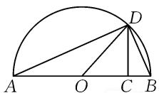
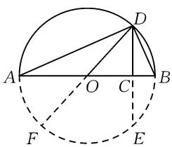
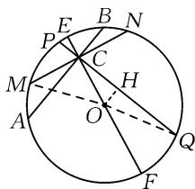
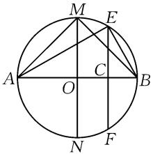
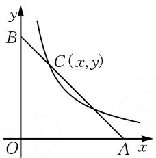
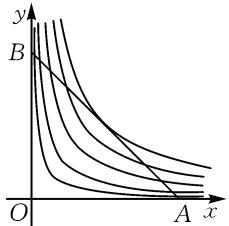
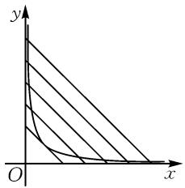

# 均值不等式的探究

# ● 东营职业学院 能源装备制造学院 郑国宗

摘要:根据新人教 B 版高中数学必修第一册“2.2.4 均值不等式及其应用”中提到的探索与研究专题,对均值不等式的几何意义进行探究,总结了另外几种几何意义.同时,还从函数角度研究了均值不等式与一次函数和反比例函数的关系,这些研究结果对于在教学中拓展学生思维具有一定的价值.

关键词: 均值不等式; 几何意义; 反比例函数; 一次函数

# 1 引言

在新人教 B 版数学必修第一册第二章“等式与不等式”中学习了均值不等式.

课本中定义: 给定两个正数 a, b, 数 $\frac{a+b}{2}$ 称为 a, b 的算术平均值; 数 $\sqrt{ab}$ 称为 a, b 的几何平均值.

课本给出了均值不等式的定义：

如果 a, b 都是正数, 那么

$$
\frac {a + b}{2} \geqslant \sqrt {a b},
$$

当且仅当 a=b 时, 等号成立.

利用完全平方的性质,可以很容易证明其成立.均值不等式也称为基本不等式,其本质是:两个正数的算术平均值不小于它们的几何平均值.课本中通过求解与矩形周长相等的正方形的面积得到均值不等式的一个几何意义:所有周长一定的矩形中,正方形的面积最大.

# 2 问题探究

在课本第一册第二章第四节“探索与研究”中给出如下内容：

“如图1的半圆中，AB为直径，O为圆心.已知AC=a，BC=b，D为半圆上一点，且DC⊥AB，算出OD和CD，给出均值不等式的另一个几何意义.

  
图1

# 2.1 均值不等式在圆中的几何意义

针对给出的已知条件,不妨设圆 O 半径为 R.

因为 AC=a, BC=b，所以 $AB=a+b$ ，则 $R=\frac{a+b}{2}$ .

(1) 在 Rt△ADB 中, ∠ADB = 90°, DC ⊥ AB 于点 C, 则有 $CD^{2} = AC \cdot CB = ab$ , 所以 $CD = \sqrt{ab}$ .

由均值不等式 $\frac{a+b}{2}\geqslant\sqrt{ab}$ ，可知 $R\geqslant CD$ .

根据图 2 可知 CD 为弦 DE 长度的一半, 考虑到点 C 随点 D 变化的任意性,此时的几何意义可表述为:“圆的半径长度大于等于圆的任意弦一半的长度.”

(2)若对均值不等式变形，可得 $a+b\geqslant2\sqrt{ab}$ .

text_image

Geometric diagram showing a circle with inscribed points A, B, C, D and auxiliary lines forming triangles and chords.

图2

因为 $a+b=AB,2\sqrt{ab}=2CD=DE$ ，所以可得 $AB \geqslant DE$ .

此时的几何意义可表述为: 圆的直径长度大于等于圆的任意弦的长度.

# 2.2 均值不等式在直角三角形中的几何意义

若考察图 2 中 Rt△ADB, 其中 AB 为斜边.

因为 O 为 AB 中点, 所以 $OD = \frac{1}{2} AB$ (直角三角形斜边中线等于斜边一半), 即 $OD = \frac{a + b}{2}$ .

由均值不等式,可得 $OD \geq CD$ .

此时的几何意义可表述为:直角三角形斜边的中线长度大于等于斜边的高.

# 2.3 两个结论的证明

课本中给出两个结论：

①当两个正数的积为常数时,它们的和有最小值;  
②当两个正数的和为常数时,它们的积有最大值.

下面给出证明：

对于结论①,先取两个已知正数 c,d,使 cd=K(常数),以 $c+d$ 长度为弦作任意圆 O,记半径为 R,如图 3.其中 AC=c,BC=d.过点 C 作直径 EF 和任意弦 PQ 以及垂直于 EF 的弦 MN.

text_image

E
P
B
N
C
M
H
O
A
Q
F

图3

记 $PC = a, QC = b$ ，则 $PQ = a + b$ .

过点 O 作 PQ 的垂线, 垂足为 H. 当 PQ 绕点 C 转动时, PC 和 CQ 可以看作可变的 a 和 b.

由圆的性质, 知 $PC \cdot CQ = MC \cdot NC = AC \cdot CB = K$ , 所以 ab = K 为常数.

由垂径定理得 MC = NC, PH = HQ，所以 $MC^{2} = K$ , PQ = 2HQ，故 $MC = \sqrt{K}$ 为定值.

在 Rt△OHC 中， $OH=OC\cdot\sin\angle OCH$ .

在 Rt $\triangle OHQ$ 中. 可知 $HQ = \sqrt{OQ^{2} - OH^{2}} = \sqrt{R^{2} - (OC \cdot \sin\angle OCH)^{2}} \geqslant \sqrt{R^{2} - OC^{2}}$ ，当 PQ 与 MN 重合时取“=”号.

在 Rt△OCM 中，CM = $\sqrt{R^{2}-OC^{2}}$ .

所以 $HQ \geqslant CM$ ，故 $PQ \geqslant 2\sqrt{K}$ .

当 PQ 与 MN 重合时, a=b, 此时 $PQ=2\sqrt{K}$ .

由于圆的任意性,PC 和 QC 可以取到任意正数,即得结论:

当正数 a 和 b 积为常数 K 时, 其和有最小值 $2\sqrt{K}$ .

对于结论②, 若正数 $a + b = K$ 为定值, 以 K 为直径作圆 O, AB 为直径, 取 AB 上任一点 C, 记 AC = a, BC = b, 过 C 作 AB 的垂线与圆 O 交于点 E, F, 过点 O 作 AB 的垂直直径 MN, 如图 4.

text_image

M
E
A
O
C
B
N
F

图 4

因为 AB 为直径, 所以 AB = K, 且 $\angle AEB = 90^{\circ}$ .

在 Rt△AEB 中, EC 为 AB 的高, 所以可以证得 $EC^{2} = AC \cdot CB$ .

当点 C 在 AB 上移动时, 可取得变化的 a 和 b, 因为 EF 为弦, MN 为直径, 所以 $EF \leqslant MN$ , 即 $EC \leqslant MO = \frac{a + b}{2} = \frac{K}{2}$ , 当点 C 与点 O 重合时取“=”号, 此时 a = b.

于是,可得结论:

当正数 a 和 b 之和为常数 K 时, 其积有最大值 $\left(\frac{K}{2}\right)^{2}$ .

# 3 拓展研究

# 3.1 两正数和与积的函数表示

给出两个正数 x, y 求其和，即求 $x + y$ ，不妨设 $m = x + y$ ，则有 $y = -x + m$ 。

若 x, y 取实数时，在平面直角坐标系内， $y = -x + m$ 表示的是一条斜率为 -1、纵截距为 m 的直线。若 x, y 均取正数，则为该直线在第一象限内的部分，如图 5 中的线段 AB（不包括端点 AB）。

text_image

y
B
C(x,y)
O
A x

图5

在 AB 上任取一点 $C(x, y)$ ，则 x, y 总是满足 $x + y = m$ ，记 k = xy，则点 C 确定一反比例函数 $y = \frac{k}{x} (x > 0, k > 0)$ .

# 3.2 均值不等式结论与函数关系

若 C 取不同位置的点, 就确定了一组不同的反比例函数, 其图象如图 6.

很显然,对反比例函数 $y=\frac{k}{x}(x>0,k>0)$ 而言,若 k 越大,则图象离原点越远,由图 6 可知,反比例曲线与直线 AB 相切时具有最大的 k 值,记为 $k_{max}$ ,此时,$\left\{ \begin{array}{l} y = -x + m, \\ y = \frac{k_{\max}}{x}, \end{array} \right.$ 可得 $\frac{k_{\max}}{x} = -x + m.$

text_image

y
B
O
A x

图6

整理, 得 $x^{2}-mx+k_{\max}=0$ .

由题意, 必有 $\Delta = 0$ , 即 $(-m)^{2} - 4k_{\max} = 0$ , 解得 $\sqrt{k_{\max}} = \frac{m}{2}$ .

图 6 中其他的反比例函数曲线, 必有 $k < k_{max}$ .

所以 $\sqrt{k} < \sqrt{k_{\max}}$ .一定成立.

综上所述,该组反比例函数对应的所有 k,总有 $\sqrt{k} \leqslant \frac{m}{2}$ 成立,即对于任意两个正数 x,y,总有 $\sqrt{xy} \leqslant \frac{x+y}{2}$ 成立.

根据函数图象关系,很容易解释均值不等式的两个推论.

(1)两个正数的和为常数时,它们的积有最大值.

如图 7, 固定直线 AB, 与 AB 有交点的反比例函数当其曲线与 AB 相切时有最大的 k 值, 即 xy 有最大值.

(2)两个正数的积为常数时，它们的和有最小值.

如图 8, 固定反比例函数 $y = \frac{k}{x}$ (k 为定值), 与反比例函数曲线有交点的直线 $x + y = m$ , 在与曲线相切时有最小的 m, 即 $x + y$ 有最小值.

# 4 结论

均值不等式是高中数学的一个重要公式,在高考中是常考

text_image

y
B
O
A x

图 7

text_image

y
O
x

图8

考点.本文通过深入研究,得出了其另外的几何意义,并结合一次函数和反比例函数对均值不等式进行了更深入的研究,利用函数观点解释了均值不等式的两个结论.将这些研究方法和结果应用到数学教学中,对提高学生学习兴趣和逻辑思维能力必定有一定的帮助作用.Z