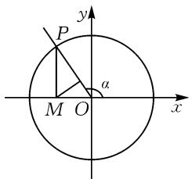
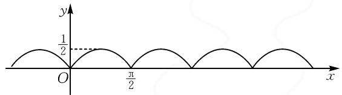

# 巧借三角定义,妙解三角问题

# 青岛市城阳第二高级中学 秦双红

在解决三角函数综合应用问题时,经常回归三角函数定义,借助定义来诠释三角函数的“数”的属性或“形”的特征,成为解决相关三角函数问题的一大“利器”.

# 1 对称角的确定

巧借三角函数的定义,从三角函数中的“形”的几何特征入手剖析一些与对称角相关的三角函数问题,进而结合“数”的基本属性来构建关系式,实现三角函数中与对称角相关的综合应用问题的求解.

例 1 [2023—2024 学年北京市顺义区高一(上)期末数学试卷] 若点 $A(\cos \alpha, \sin \alpha)$ 关于 x 轴的对称点为 $B\left(\cos \left(\alpha - \frac{\pi}{3}\right), \sin \left(\alpha - \frac{\pi}{3}\right)\right)$ ，则角 $\alpha$ 的一个取值可以为 \_\_\_\_.

分析:根据题设条件,通过点的对称关系,回归三角函数的定义,将问题转化为单位圆上角的对称关系,合理构建两角之间对称的代数关系式,进而确定满足条件的角,实现“数”与“形”的巧妙转化与应用.

解析:借助三角函数定义知点 $A(\cos \alpha, \sin \alpha)$ 、点 $B\left(\cos\left(\alpha - \frac{\pi}{3}\right), \sin\left(\alpha - \frac{\pi}{3}\right)\right)$ 分别是角 $\alpha$ 、角 $\alpha - \frac{\pi}{3}$ 的终边与单位圆的交点.

又由于点 A, B 关于 x 轴对称, 其等价于角 $\alpha$ 的终边与角 $\alpha - \frac{\pi}{3}$ 的终边关于 x 轴对称, 于是可以得到 $\frac{1}{2}\left(\alpha + \alpha - \frac{\pi}{3}\right) = k\pi, k \in \mathbf{Z}$ , 解得 $\alpha = \frac{\pi}{6} + k\pi, k \in Z$ .

令 $k = 0$ ，可取 $\alpha = \frac{\pi}{6}$ 故填： $\frac{\pi}{6}$ （答案不唯一，只要符合 $\alpha = \frac{\pi}{6} +k\pi ,k\in \mathbf{Z}$ 均可）.

点评: 在单位圆中, 借助三角函数的定义, 易知对应点之间的对称关系与对应角之间的对称关系是等价的. 基于此, 可以有效实现对应点或对称角“形”的几何特征与角之间代数关系“数”的基本属性的联系, 实现“数”与“形”的巧妙结合与应用.

# 2 函数值的求解

巧借三角函数的定义,从定义中“数”与“式”的视角切入,化相应的三角函数式为对应坐标参数 x,y,r的表达式,结合关系式与三角式的恒等变换,并结合函数与方程等来应用,实现三角函数值的求解.

例 2 （2024 年高考数学新高考Ⅱ卷·13）已知 $\alpha$ 为第一象限角， $\beta$ 为第三象限角， $\tan \alpha + \tan \beta = 4$ ， $\tan \alpha \tan \beta = \sqrt{2} + 1$ ，则 $\sin (\alpha + \beta) =$ \_\_\_\_ .

分析:根据题设条件,借助对应角的正切值的设置,利用三角函数的定义,通过对应角的终边上相关点的坐标以及单位圆半径来确定角的正弦值与余弦值,进而结合两角和的正弦公式加以分析与应用,实现三角函数值的求解.

解析:依题,由 $\alpha$ 为第一象限角, $\beta$ 为第三象限角,可得 $\sin\alpha>0,\cos\alpha>0,\sin\beta<0,\cos\beta<0.$

设 $\tan\alpha=m>0,\tan\beta=n>0$ , 根据 $\tan\alpha+\tan\beta=4,\tan\alpha\tan\beta=\sqrt{2}+1$ , 可得 $m+n=4,mn=\sqrt{2}+1$

根据三角函数的定义, 可知 $\sin \alpha = \frac{m}{\sqrt{1 + m^{2}}}$ , $\cos\alpha=\frac{1}{\sqrt{1+m^{2}}},\quad\sin\beta=-\frac{n}{\sqrt{1+n^{2}}},\quad\cos\beta=-\frac{1}{\sqrt{1+n^{2}}}.$

所以 $\sin (\alpha +\beta) = \sin \alpha \cos \beta +\cos \alpha \sin \beta =$ $-\frac{m + n}{\sqrt{1 + m^2}\times\sqrt{1 + n^2}} = -\frac{2\sqrt{2}}{3}$ ，这里 $(1 + m^2)(1+$ $n^2) = m^2 n^2 +m^2 +n^2 +1 = (m + n)^2 +(mn - 1)^2 = 18.$

故填： $-\frac{2\sqrt{2}}{3}$ .

点评:依托题设条件,借助角所在的象限确定各对应角的正弦值与余弦值的正负取值情况,根据对应角的正切值引入参数,结合三角函数的定义确定各对应的正弦值与余弦值,在此基础上,利用两角和的正弦公式加以转化,结合代数式的恒等变形来分析与求解.回归三角函数的定义,往往是解决问题的突破口.

# 3 范围(或最值)的应用

巧借三角函数的定义,依托三角函数的基础知识,结合三角函数的图象与性质等,实现与函数值等相关的取值范围(或最值)问题的求解与应用.

例 3 [2024 年北京八中高三(下)月考数学试卷 (3 月份)] 如图 1, 在平面直角坐标系 xOy 中, 角 $\alpha$ (0< $\alpha$ < $\pi$ ) 的始边为 x 轴的非负半轴, 终边与单位圆

O 交于点 P，过点 P 作 x 轴的垂线，垂足为 M。若记点 M 到直线 OP 的距离为 $f(\alpha)$ ，则 $f(\alpha)$ 的值域为 \_\_\_\_.

分析:根据题设,由三角函数的定义得点 P 的坐标以及对应的线段长度表达式,结合等面积法确定函数 $f(\alpha)$ 的关系式, 利用三角函数的图象与性质以及角 $\alpha$ 的取值范围来确定对应的值域.

text_image

P
y
α
M O x

图1

解析: 结合三角函数的定义可知 $P(\cos \alpha, \sin \alpha)$ , $|OP| = 1$ , $|OM| = |\cos \alpha|$ , $|MP| = |\sin \alpha|$ .

结合等面积可得 $\frac{1}{2} |OP| \cdot f(\alpha) = \frac{1}{2} |OM| \cdot |MP|$ ，则 $f(\alpha) = |\cos \alpha| \cdot |\sin \alpha| = \frac{1}{2} |\sin 2\alpha|$ ，易知函数 $f(\alpha)$ 的最小正周期为 $\frac{\pi}{2}$ ，其图象如图2所示。

text_image

y
1/2
O
π/2
x

图2

而 $0 < \alpha < \pi$ ，又 $f(0) = f\left(\frac{\pi}{2}\right) = f(\pi) = 0, f\left(\frac{\pi}{4}\right) = f\left(\frac{3\pi}{4}\right) = \frac{1}{2}$ ，所以 $f(\alpha)$ 的值域为 $\left[0, \frac{1}{2}\right]$ .

故填： $\left[0,\frac{1}{2}\right]$ .

点评:借助三角函数的定义,为对应的三角函数关系式的构建创造条件,也为进一步求解三角函数式的取值范围奠定基础.涉及三角函数中的单位圆问题,往往离不开三角函数的定义及其应用.

# 4 综合问题的判定

巧借三角函数的定义,可以给三角函数模块知识中的综合问题与应用创造条件.回归三角函数的定义,联系点、角、关系式等之间的关系,有“数”的内涵,有“形”的特征,合理联系,巧妙转化.

例 4 （2024 年浙江省温州市高考数学二模试卷）（多选题）已知角 $\alpha$ 的顶点在坐标原点，始边与 x 轴的非负半轴重合， $P(-3,4)$ 为其终边上一点。若角 $\beta$ 的终边与角 $2\alpha$ 的终边关于直线 y = -x 对称，则（）.

$$
\begin{array}{l} \mathrm{A.} \cos (\pi + \alpha) = \frac {3}{5} \\ \mathrm{B.} \beta = 2 k \pi + \frac {\pi}{2} + 2 \alpha , k \in \mathbf {Z} \\ \mathrm{C.tan} \beta = \frac {7}{2 4} \\ \end{array}
$$

D. 角 $\beta$ 的终边在第一象限

分析:根据题设条件,利用三角函数的定义,结合角的终边上点的坐标以及角之间的对称性,求解对应的三角函数值以及与之相关角终边上的点,进而结合三角恒等变换公式、诱导公式以及三角函数中的相关知识来综合与应用.

解析: 根据三角函数的定义, 可得 $\cos \alpha = -\frac{3}{5}$ , $\sin \alpha = \frac{4}{5}$ .

所以 $\sin 2\alpha = 2\sin \alpha \cos \alpha = -\frac{24}{25}, \cos 2\alpha = 2\cos^{2}\alpha - 1 = -\frac{7}{25}$ . 回归三角函数的定义, 可知 $Q(-7, -24)$ 是角 $2\alpha$ 终边上一点.

而角 $\beta$ 的终边与 $2\alpha$ 的终边关于直线 y = -x 对称，则知点 M(24,7) 是角 $\beta$ 的终边上一点，根据三角函数的定义，可得 $\cos \beta = \frac{24}{25}$ ， $\sin \beta = \frac{7}{25}$ .

对于选项 A, $\cos(\pi+\alpha)=-\cos\alpha=\frac{3}{5}$ ，故选项 A 正确；

对于选项 B, 若 $\beta = 2k\pi + \frac{\pi}{2} + 2\alpha, k \in Z$ 成立, 则有 $\cos \beta = \cos \left( 2k\pi + \frac{\pi}{2} + 2\alpha \right) = -\sin 2\alpha = \frac{24}{25}, \sin \beta = \sin \left( 2k\pi + \frac{\pi}{2} + 2\alpha \right) = \cos 2\alpha = -\frac{7}{25}$ , 与上面所求矛盾, 故选项 B 错误;

对于选项 C, 利用三角函数的定义, 可得 $\tan \beta = \frac{7}{24}$ , 故选项 C 正确;

对于选项D，由点 $M(24,7)$ 是角 $\beta$ 的终边上一点，可知角 $\beta$ 的终边在第一象限，故选项D正确.

综上分析,故选择:ACD.

点评:依托三角函数的定义,合理构建相应的三角函数值,以及对应角之间的关系、角之间的对称等,为进一步的综合应用创造条件,成为解决此类综合问题的突破口与切入点.综合问题中,有时回归三角函数的定义,解决问题更加简捷有效.

其实,巧借三角函数的定义,回归问题的本质与内涵,突出扎实基础、注重技能,深入系统知识、凝练思想,有效提升能力、发展素养.同时,巧借三角函数的定义,综合三角函数、函数与方程的基础知识,问题解决起来更有目的性、方向性,思路处理起来更加灵活、创新,高度契合“价值引领,素养导向,能力为重,知识为基”的高考命题理念,必然成为高考命题中的一道亮丽“风景线”.Z