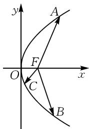
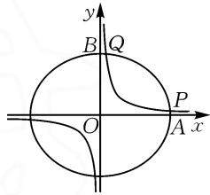

# 巧借特殊位置点,妙解圆锥曲线题

# ● 浙江省杭州市杭州第二中学富春学校 黄跃龙

摘要: 特殊值思维对于解决圆锥曲线及其综合问题中的定值或常值问题时, 吻合特殊性与一般性思维的联系与转化, 是解决一些相关问题中比较常用的一种基本思维方式. 借助圆锥曲线及其综合应用场景, 合理通过特殊位置点的选取, 以顶点、交点、极端点等比较常用的思维方式来实例剖析, 归纳总结解题技巧与规律, 以指导数学教学与解题研究.

关键词: 圆锥曲线; 特殊值; 顶点; 交点; 极端点

涉及圆锥曲线及其综合问题中的定值问题,特别是基于变化运动的动点场景中,经常借助特殊位置点的巧妙选取,以特殊代替一般,以个体代替全部,合理寻觅与挖掘综合问题的本质与内涵,进而采用特殊与一般的辩证数学思想方法,简单快捷地分析与处理一些小题(填空题或选择题).

基于圆锥曲线及其综合问题中的变化运动的动点应用问题,借助特殊思维,以特殊代替一般,以点代线,以线代面,从中探寻特殊场景下的定值问题,再回归一般,从而以巧妙的特殊思维,全面达到“动(手)后熟悉,熟后思考,思后悟理,悟后掌握”的良好解题效果.

# 1 顶点

涉及圆锥曲线及其综合问题中的定值问题,结合动点变化运动中的特殊位置,经常通过圆锥曲线中顶点等的选取,从特殊场景中运算与推理出对应的定值,从而探寻一般性场景下的结论.

例 1 （2025 届安徽省天一大联考最后一卷数学试卷·6）已知 A, B 为椭圆 $C: \frac{x^{2}}{3} + \frac{y^{2}}{2} = 1$ 上两点，O 为坐标原点，且 $OA \perp OB$ ，过点 O 作直线 AB 的垂线，垂足为 H，则点 H 的轨迹方程为（）.

A. $x^{2} + y^{2} = 1$

B. $x^{2} + y^{2} = \frac{3}{2}$

C. $x^{2}+y^{2}=\frac{5}{4}$

D. $x^{2}+y^{2}=\frac{6}{5}$

分析:可以从特殊顶点的选取切入,借助两动点分别为曲线在 x 轴、y 轴上的顶点,由此计算 $\left|OH\right|$ 的值,给垂足 H 轨迹方程的求解创造条件.

解析:依题,选取特殊顶点,当点 A 在右顶点,对应点 B 在上顶点时,满足 $OA \perp OB$ ,此时 $|OA| = \sqrt{3}$ , $|OB| = \sqrt{2}$ .

在 Rt△AOB 中, 易得 $\left|AB\right|=\sqrt{5}$ .

结合等面积法有 $|OA||OB|=|AB||OH|$ ，代入

解得 $|OH| = \frac{\sqrt{6}}{\sqrt{5}}$ . 设点 $H(x, y)$ , 则 $x^2 + y^2 = \frac{6}{5}$ .

故选择:D.

点评:借助圆锥曲线上特殊顶点的选取,结合特殊思维,利用“静止”状态来探寻此时相应的结论,回归问题的一般性,得以确定动点变化的“动态”过程,实现“动”向“静”的特殊转化,又借助“静”来研“动”的辩证过程,解决问题更加直接有效,处理起来也更加方便快捷,且不失一般性.

# 2 交点

涉及圆锥曲线及其综合问题中的定值问题,结合动点变化运动中的特殊位置,以其中一个特殊点的选取为条件,结合题设条件求解与之对应的其他相关交点,进而通过合理的逻辑推理与数学运算来深入分析与研究,实现一般性问题的特殊化处理.

例 2 如图 1 所示, 已知抛物线 $y^{2}=4x$ 的焦点为 F, A, B, C 为该抛物线上三点, 若 $\overrightarrow{FA}+\overrightarrow{FB}+\overrightarrow{FC}=0$ , 则 $\left|\overrightarrow{FA}\right|^{2}+\left|\overrightarrow{FB}\right|^{2}+\left|\overrightarrow{FC}\right|^{2}$ 的值为 \_\_\_\_.

分析: 可以从特殊交点的选取切入, 其中一个点为坐标原点, 另两个点关于 x 轴对称, 这样处理起来更加简单快捷.

text_image

y
A
F
O
C
x
B

图1

解析:依题,可知焦点 $F(1,0)$ .

根据 $\overrightarrow{FA} + \overrightarrow{FB} + \overrightarrow{FC} = 0$ 及填空题的特征知 $|\overrightarrow{FA}|^{2} + |\overrightarrow{FB}|^{2} + |\overrightarrow{FC}|^{2}$ 为定值. 假设点 A 与坐标原点 O 重合, B, C 两点关于 x 轴对称, 此时, 结合三角形重心的性质可知 $x_{A} + x_{B} + x_{C} = 3$ , 则有 $x_{B} = x_{C} = \frac{3}{2}$ .

将 $x = \frac{3}{2}$ 代入抛物线 $y^{2} = 4x$ ，则有 $y^{2} = 4\times \frac{3}{2} =$

6, 解得 $y = \pm \sqrt{6}$ .

此时 $|\overrightarrow{FA}|^2 = |\overrightarrow{FO}|^2 = 1, |\overrightarrow{FB}|^2 = |\overrightarrow{FC}|^2 = \left(\frac{3}{2} - 1\right)^2 + (\sqrt{6})^2 = \frac{25}{4}$ .

所以 $|\overrightarrow{FA}|^2 + |\overrightarrow{FB}|^2 + |\overrightarrow{FC}|^2 = 1 + \frac{25}{4} + \frac{25}{4} = \frac{27}{2}$ .

故填: $\frac{27}{2}$ .

点评:合理选取抛物线内接三角形三个顶点的特殊位置,以特殊条件下所求的结果回归一般性思维,实现问题的突破与求解.

例 3 已知点 F 为椭圆 $\Gamma: \frac{x^{2}}{2} + y^{2} = 1$ 的左焦点，同时，椭圆 $\Gamma$ 上有逆时针顺序的三个动点 A, B, C，设 $\overrightarrow{FA}, \overrightarrow{FB}, \overrightarrow{FC}$ 两两之间的夹角分别为 $\alpha, \beta, \gamma$ . 当 $\alpha = \beta = \gamma$ 时，则 $\frac{1}{|\overrightarrow{FA}|} + \frac{1}{|\overrightarrow{FB}|} + \frac{1}{|\overrightarrow{FC}|}$ 的值为 \_\_\_\_.

分析:可以从特殊交点的选取切入,以其中一点为椭圆的右顶点,结合条件确定另外两点的具体位置,进而来分析与求解.

解析:依题,可得 $a=\sqrt{2}$ , b=c=1.

不妨设点 A 是椭圆 $\Gamma$ 的右顶点，易知 $\alpha = \beta = \gamma = \frac{2\pi}{3}$ ，则 $|\overrightarrow{FA}| = c + a = 1 + \sqrt{2}$ .

设直线 FB 的方程为 $y = -\sqrt{3}(x + 1)$ ，代入椭圆 $\Gamma: \frac{x^{2}}{2} + y^{2} = 1$ 中，消参并整理可得到 $7x^{2} + 12x + 4 = 0$ ，解得 $x = \frac{-6 - 2\sqrt{2}}{7}$ 或 $x = \frac{-6 + 2\sqrt{2}}{7}$ （舍去）.

于是 $y_{B} = -\sqrt{3}\left(\frac{-6 - 2\sqrt{2}}{7} +1\right) = \frac{2\sqrt{6} - \sqrt{3}}{7},$ 则 $B\Big(\frac{-6 - 2\sqrt{2}}{7},\frac{2\sqrt{6} - \sqrt{3}}{7}\Big).$

结合图形的对称性, 可得到 $\left|\overrightarrow{FB}\right|=\left|\overrightarrow{FC}\right|=\sqrt{\left(\frac{-6-2\sqrt{2}}{7}+1\right)^{2}+\left(\frac{2\sqrt{6}-\sqrt{3}}{7}\right)^{2}}=\frac{2\sqrt{9-4\sqrt{2}}}{7}=\frac{2(2\sqrt{2}-1)}{7}.$

所以 $\frac{1}{|\overrightarrow{FA}|} +\frac{1}{|\overrightarrow{FB}|} +\frac{1}{|\overrightarrow{FC}|} = \frac{1}{1 + \sqrt{2}} +2\times$ $\frac{7}{2(2\sqrt{2} - 1)} = \sqrt{2} -1 + (2\sqrt{2} +1) = 3\sqrt{2}.$

故填: $3\sqrt{2}$ .

点评:借助圆锥曲线上特殊交点的选取,以特殊来代替一般,可以有效提升解题效率.

# 3 极端点

涉及圆锥曲线及其综合问题中的定值问题,结合动点变化运动中的极端位置,是动点不可达到的位置或不满足条件的位置,进而借助极限思维,利用运动变化的极端场景来分析,成为动点运动变化的一个特殊趋势,在此场景下探寻一般性的结论与应用.

例 4 [2025 届广东省四校联考高考模拟测试 (三) 数学试卷·8] 椭圆 $E: \frac{x^{2}}{4} + \frac{y^{2}}{3} = 1$ 与曲线 H: xy = k 在第一象限交于 P, Q 两点，则直线 PQ 的斜率为().

A. $-\frac{3}{4}$

B. $-\frac{4}{3}$

C. $-\frac{2\sqrt{3}}{3}$

D. $-\frac{\sqrt{3}}{2}$

分析:借助特殊位置点的选取,利用参数 $k \rightarrow 0$ 的极限思维,研究与之对应的极端点(即椭圆与坐标轴的交点),利用平行关系来转化,实现问题的突破与求解.

解析: 依题, 椭圆 $E: \frac{x^{2}}{4} + \frac{y^{2}}{3} = 1$ 与曲线 H: xy = k 的交点在第一象限内, 则知 k > 0. 如图 2 所示, 当 $k \to 0$ 时, 椭圆 E 与曲线 H 在第一象限内的交点 P, Q

text_image

y
B Q
O P
A x

图2

分别无限接近于右顶点 $A(2,0)$ ，上顶点 $B(0,\sqrt{3})$ ，在变化过程中直线 PQ 平行于直线 AB.

而直线 AB 的斜率为 $\frac{\sqrt{3}-0}{0-2}=-\frac{\sqrt{3}}{2}$ ，则知直线 PQ 的斜率为 $-\frac{\sqrt{3}}{2}$ 。故选择：D.

点评:借助圆锥曲线上极端点的选取,结合特殊思维,从动点运动变化中探寻极端点处的情形,给问题的突破与求解创造条件.本题极端点的选取,也可以借助两曲线相切时的极端位置,设置对应的切点坐标,结合过椭圆上相关点的切线方程,运用导数法研究双曲线的切线等,实现问题的突破与求解.

其实,在解决一些涉及动点运动变化场景下的圆锥曲线及其综合问题中的定值问题时,特别是有关的小题(以单项选择题或填空题为主),借助动点运动变化的特殊位置,从特殊思维视角切入与应用,结合特殊位置点的巧妙选取与合理确定,展示巧妙技巧策略的应用,优化数学问题的解决,全面提升学生的能力,促使其养成良好的数学思维品质,培养数学核心素养.

Z