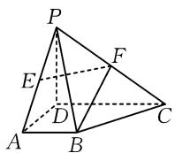
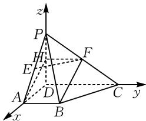
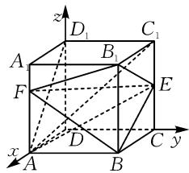
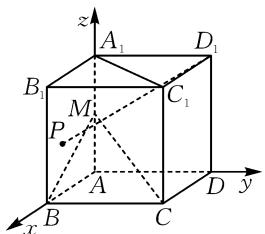
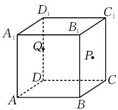
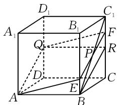

# 广东一模立体几何四大考点试题分析及教学应对

# 福建省三明市第二中学 黄璐明

在高中数学体系中,立体几何既是空间观念与逻辑推理能力的重要载体,也是高考命题的核心板块之一.围绕“直线与平面的位置关系”“空间向量应用”“几何体度量”等关键内容,试题呈现出结构综合化、方法多元化的发展趋势.本研究立足典型试题,从平行与垂直关系判定、向量建模分析与体积计算等四类高频考点展开系统梳理,通过对比不同题型的命题特征与解题路径,揭示其内在联系与思维共性,从而为在教学中实现方法整合、提升学生空间想象与模型建构能力提供针对性依据.

# 1 四大考点试题及解析

# 1.1 直线、平面平行的判定与性质

例 1 （2026·广东茂名·一模）如图 1，在四棱锥 P-ABCD 中， $PD \perp$ 平面 ABCD, $AB \parallel CD$ , $AB \perp AD$ , $AB = \sqrt{2}$ , $CD = 2\sqrt{2}$ , $PD = AD = 2$ , E, F 分别为 PA, PC 的中点.

  
图1

(1) 证明: $BF \parallel$ 平面 PAD.  
(2) 在线段 EF 上是否存在点 G，使得 $DG \perp$ 平面 PBC？若存在，求 EG 的长；若不存在，请说明理由.

解析:(1)如图2,取PD的中点H,连接FH,AH.因为

$$
A B = \sqrt {2}, C D = 2 \sqrt {2}, A B / /
$$

CD, 又 $FH = \frac{1}{2} CD, FH \parallel$

CD, 所以 FH = AB, FH //

AB, 可得四边形 ABFH 是平行四边形, 所以 $BF \parallel AH$ . 又 $BF \not\subset$ 平面 PAD, $AH \subset$ 平面 PAD, 所以 $BF \parallel$ 平面 PAD.

(2)如图2,建立空间直角坐标系,则 $P(0,0,2)$ , $B(2,\sqrt{2},0)$ , $C(0,2\sqrt{2},0)$ , $A(2,0,0)$ , $E(1,0,1)$ ,

$F(0,\sqrt{2},1)$ ，所以 $\overrightarrow{PB}=(2,\sqrt{2},-2)$ ， $\overrightarrow{PC}=(0,2\sqrt{2},-2)$ ， $\overrightarrow{EF}=(-1,\sqrt{2},0)$ 。设平面PBC的一个法向量为n=

$(x, y, z)$ ，则 $\left\{\begin{aligned}n & \cdot \overrightarrow{PB} = 0, \\ n & \cdot \overrightarrow{PC} = 0,\end{aligned}\right.$ 即 $\left\{\begin{aligned}2x + \sqrt{2}y - 2z &= 0, \\ 2\sqrt{2}y - 2z &= 0,\end{aligned}\right.$ 令

text_image

z
P
H
E
F
A
D
B
C
y
x

图2

$y=\sqrt{2}$ ，则 z=2, x=1，所以 $\boldsymbol{n}=(1,\sqrt{2},2)$ 。设 $\overrightarrow{EG}=\lambda\overrightarrow{EF}$ ，则 $\overrightarrow{DG}=\overrightarrow{DE}+\overrightarrow{EG}=\overrightarrow{DE}+\lambda\overrightarrow{EF}=(1-\lambda,\sqrt{2}\lambda,1)$ 。若 $DG\perp$ 平面 PBC，则 $\overrightarrow{DG}//n$ ，所以 $\frac{1}{1-\lambda}=\frac{\sqrt{2}}{\sqrt{2}\lambda}=\frac{2}{1}$ ，解得 $\lambda=\frac{1}{2}$ 。所以 $\overrightarrow{EG}=\left(-\frac{1}{2},\frac{\sqrt{2}}{2},0\right)$ ，则 $|\overrightarrow{EG}|=\sqrt{\left(\frac{1}{2}\right)^{2}+\left(\frac{\sqrt{2}}{2}\right)^{2}+0}=\frac{\sqrt{3}}{2}$ 。所以在线段 EF 上存在点 G，使得 $DG\perp$ 平面 PBC，且 EG 的长为 $\frac{\sqrt{3}}{2}$ 。

点评:该类试题以“线面平行的判定与性质”为核心,突出几何关系转化与多方法融合的特点.题目通常借助中点构造、平行四边形判定等手段,将空间问题转化为平面几何关系,从而实现线面平行的证明.同时,在综合设问中,常引入空间向量方法,通过建立空间直角坐标系,将“线面垂直”转化为“向量共线”或“与法向量平行”的代数问题,体现“几何—代数”双重表征的统一.整体来看,该类题型强调从“位置关系判定”到“数量关系求解”的递进结构,考查学生在不同表征之间灵活切换的能力.

# 1.2 直线、平面垂直的判定与性质

例 2 （2026·广东佛山·一模）（多选题）已知正方体 $ABCD-A_{1}B_{1}C_{1}D_{1}$ 的棱长为 2, E 为 $CC_{1}$ 的中点，F 为 $AA_{1}$ 上的动点，则下列说法正确的是（）.

A.AE⊥BD   
B. $BE \parallel$ 平面 $AD_{1}C_{1}$   
C. 直线 $AE$ 与平面 $ABCD$ 所成角的正切值为 $\frac{1}{3}$   
D. 三棱锥 $B_{1} - BEF$ 的体积为定值

解析: 对于选项 A, 以 D 为原点, 分别以 DA, DC, $DD_{1}$ 所在直线为 x, y, z 轴, 建立如图 3 所示的空间直角坐标系, 则 $A(2,0,0)$ , $B(2,2,0)$ , $C(0,2,0)$ , $D(0,0,0)$ , $A_{1}(2,0,2)$ , $B_{1}(2,2,2)$ , $C_{1}(0,2,2)$ , $D_{1}(0,0,2)$ . 由题意得

text_image

z
D₁ C₁
A B₁
F E
x D C y
A B

图3

$E(0,2,1)$ ，设 $F(2,0,t), t \in [0,2]$ ，易得向量 $\overrightarrow{AE} = (-2,2,1), \overrightarrow{BD} = (-2,-2,0)$ ，则 $\overrightarrow{AE} \cdot \overrightarrow{BD} = (-2) \times (-2) + 2 \times (-2) + 1 \times 0 = 0$ ，故 $AE \perp BD$ ，选项 A 正确；对于选项 B，平面 $AD_{1}C_{1}$ 即平面 $ABC_{1}D_{1}$ ，直线 BE 过该平面内一点 B 且点 E 不在该平面内，即直线 BE 与平面 ABG 相交，不平行，故选项 B 错误；对于选项 C，因为 $EC \perp$ 平面 ABCD，则 AC 为 AE 在平面 ABCD 内的射影，所以 $\angle EAC$ 即为直线 AE 与平面 ABCD 所成的角，在 Rt $\triangle ACE$ 中，EC = 1, AC = $\sqrt{2^{2} + 2^{2}} = 2\sqrt{2}$ ，则 $\tan \angle EAC = \frac{EC}{AC} = \frac{1}{2\sqrt{2}} = \frac{\sqrt{2}}{4} \neq \frac{1}{3}$ ，故选项 C 错误；对于选项 D， $S_{\triangle BEB_{1}} = \frac{1}{2} \times 2 \times 2 = 2$ ，因为 $AA_{1} // BB_{1}, AA_{1} \not\subset$ 平面 $BCC_{1}B_{1}, BB_{1} \subset$ 平面 $BCC_{1}B_{1}$ ，故 $AA_{1} //$ 平面 $BCC_{1}B_{1}$ ，所以 $AA_{1}$ 上所有点到平面 $BCC_{1}B_{1}$ 的距离恒为正方体棱长 2，因此 $V_{F-BEB_{1}} = \frac{1}{3} \times S_{\triangle BEB_{1}} \times 2 = \frac{3}{4}$ ，而 $V_{B_{1}-BEF} = V_{F-BEB_{1}}$ ，故选项 D 正确。故选：AD。

点评:该类试题以“垂直关系的判定与性质”为主线,侧重向量工具与几何意义的结合.典型问题通过构建空间直角坐标系,将线线垂直或线面垂直转化为向量数量积为零,从而实现快速判定.同时,试题往往设置多选结构,融合线面角、体积不变量等多维考查内容,要求学生在同一模型中进行多角度分析.其本质在于通过“向量化处理”降低空间想象难度,但同时对建系能力与运算准确性提出了更高要求,体现出较强的综合性与区分度.

# 1.3 空间向量的应用

例 3 （2026·广东茂名·一模）（多选题）在棱长为 2 的正方体 $ABCD-A_{1}B_{1}C_{1}D_{1}$ 中，M 为棱 $AA_{1}$ 的中点，P 为侧面 $ABB_{1}A_{1}$ 内的动点（包含边界），则下列说法正确的是（）.

A. 存在点 P 使得 $D_{1}P=4$   
B. 若 $D_{1}P \perp CM$ ，则点 P 的轨迹长度为 $\sqrt{5}$   
C. 若 $D_{1}P \parallel$ 平面 BCM，则四棱锥 P-ABCD 的外接球的体积的最大值为 $4\sqrt{3}\pi$   
D. 若 $PA_{1} + PD_{1} = 4$ ，则 $\triangle PBC$ 的面积的最小值为 $\frac{4\sqrt{2} - 3}{2}$

解析:以 A 为原点,以 AB 为 x 轴,AD 为 y 轴, $AA_{1}$ 为 z 轴,建立空间直角坐标系,如图4所示.由于 P 为侧面 $ABB_{1}A_{1}$ 内的动点(包含边界),因此设 $P(x,0,z),0\leqslant x\leqslant2,0\leqslant z\leqslant2.$

对于选项 A, 易知点 $D_{1}(0,2,2)$ , 所以 $D_{1}P=\sqrt{x^{2}+4+(z-2)^{2}}$ . 当 x=0, z=2 时, $D_{1}P$ 取得最小值为 2，此时点 P 与点 $A_{1}$ 重合；当 x=2, z=0 时， $D_{1}P$ 取得最大值为 $2\sqrt{3}$ ，此时点 P 与点 B 重合。因为 $2\sqrt{3}<4$ ，所以不存在点 P 使得 $D_{1}P=4$ ，即选项 A 错误。对于选项 B，易知 $M(0,0,1)$ ， $C(2,2,0)$ ，可

text_image

z
A₁
D₁
B₁
M
C₁
P
A
B
C
D
y
x

图 4

得 $\overrightarrow{D_1P} = (x, -2, z - 2), \overrightarrow{CM} = (-2, -2, 1)$ ，由 $D_1P \perp CM$ ，得 $\overrightarrow{D_1P} \cdot \overrightarrow{CM} = -2x + (-2) \times (-2) + (z - 2) \times 1 = -2x + z + 2 = 0$ ，即 $z = 2x - 2$ ，因此点 $P$ 的轨迹为直线 $z = 2x - 2$ 在四边形 $ABB_1A_1$ 内的线段。又 $x \in [0, 2], z \in [0, 2]$ ，可得 $x \in [1, 2]$ ，所以点 $P$ 的轨迹为 $AB$ 的中点到点 $B_1$ 的线段，因此点 $P$ 的轨迹长度为 $\sqrt{(2 - 1)^2 + (2 - 0)^2} = \sqrt{5}$ ，即选项 B 正确。对于选项 C，又 $B(2, 0, 0)$ ，所以 $\overrightarrow{BC} = (0, 2, 0), \overrightarrow{BM} = (-2, 0, 1)$ ，设平面 $BCM$ 的法向量为 $n = (a, b, c)$ ，所以 $\overrightarrow{BC} \cdot n = 2b = 0, \overrightarrow{BM} \cdot n = -2a + c = 0$ ，可得 $b = 0$ ，令 $a = 1$ ，则 $c = 2$ ，所以平面 $BCM$ 的法向量 $n = (1, 0, 2)$ 。若 $D_1P //$ 平面 $BCM$ ，则 $\overrightarrow{D_1P} \cdot n = x + 2(z - 2) = 0$ ，即 $x + 2z = 4$ ，又 $x \in [0, 2]$ ，即 $x = 4 - 2z \in [0, 2]$ ，解得 $1 \leqslant z \leqslant 2$ ，显然当 $z = 2$ ，即点 $P$ 与点 $A_1$ 重合时，满足题意，此时四棱锥 $P-ABCD$ 的外接球与正方体的外接球相同，其半径 $R$ 满足 $(2R)^2 = 2^2 + 2^2 + 2^2 = 12$ ，即 $R = \sqrt{3}$ ，所以外接球的体积为 $\frac{4}{3}\pi R^3 = 4\sqrt{3}\pi$ ，即选项 C 正确。对于选项 D，若 $PA_1 + PD_1 = 4$ ，由正方体性质可得 $A_1D_1 \perp$ 平面 $ABB_1A_1$ ，又 $PA_1 \subset$ 平面 $ABB_1A_1$ ，所以 $PA_1 \perp A_1D_1$ ，利用勾股定理可得 $PA_1^2 + A_1D_1^2 = PD_1^2 = (4 - PA_1)^2$ ，即 $PA_1^2 + 4 = PA_1^2 - 8PA_1 + 16$ ，解得 $PA_1 = \frac{3}{2}$ ，所以点 $P$ 的轨迹是以 $A_1$ 为圆心，半径为 $\frac{3}{2}$ 的圆在侧面 $ABB_1A_1$ 内的部分。此时点 $P$ 到 $BC$ 的最小距离为 $A_1B - \frac{3}{2} = 2\sqrt{2} - \frac{3}{2}$ ，所以 $\triangle PBC$ 的面积的最小值为 $\frac{1}{2} \times BC \times \left(2\sqrt{2} - \frac{3}{2}\right) = \frac{4\sqrt{2} - 3}{2}$ ，即选项 D 正确。故选：BCD。

点评:该类试题以空间向量为核心工具,呈现出“模型化、轨迹化、最值化”的显著特征.通过设点坐标,将动点问题转化为参数问题,再利用向量运算建立方程,进而刻画点的轨迹或求解最值.例如将垂直条件转化为数量积为零,或将线面平行转化为向量与法向量垂直等,进一步结合轨迹性质与几何意义,可实现对长度、面积或体积的优化分析.整体而言,该类题型体现出由“静态关系”向“动态分析”的转变,是空间向量

工具深度应用的典型代表.

# 1.4 空间几何体的表面积与体积

例 4 （2026·广东·一模）如图 5 所示，正方体 ABCD-A₁B₁C₁D₁ 的棱长为 4，P 为正方形 BCC₁B₁ 的中心，Q 为棱 DD₁ 的中点，过点 A，P，Q 的平面将正方体分成上、下两部分，则较小的部分体积大小为（）.

text_image

D₁
A₁ B₁ C₁
Q
P
D C
A B

图5

A.16

B.18

C. $\frac{64}{3}$

D.24

解析: 如图 6, 取 $CC_{1}$ 的中点 R, 连接 BR, QR, 过点 P 作直线 $EF \parallel BR$ , 分别交 $BB_{1}, CC_{1}$ 于点 E, F, 连接 $BC_{1}, QF, AE$ . 由 P 为正方形 $BCC_{1}B_{1}$ 的中心, 得 $BC_{1} \cap EF = P$ , 则 $BP = C_{1}P$ , 易得 $BE = C_{1}F = FR = \frac{1}{2}C_{1}R =$

text_image

D₁
A₁
B₁
C₁
Q
F
R
D
E
C
A
B

图6

$\frac{1}{4}CC_{1}=1.$ 又因为 Q 为棱 $DD_{1}$ 的中点，则易得 $QR \parallel DC \parallel AB, QR = DC = AB$ ，即四边形 ABRQ 为平行四边形，则 $BR \parallel AQ$ ，所以 $AQ \parallel EF.$ 于是，平面 AEFQ 即过点 A, P, Q 的截面。显然正方体被截面分成的较小部分为多面体 ADQ-BEFC，记其体积为 V，则 $V = V_{三棱柱ABE-QRF} + V_{三棱柱ADQ-BCR} = \frac{1}{2} \times 4 \times 1 \times 4 + \frac{1}{2} \times 4 \times 2 \times 4 = 24.$

点评:该类试题以几何体的分割与重组为主要考查形式,强调对空间结构的整体把握能力.通过构造辅助线或截面,将复杂几何体转化为若干规则几何体(如棱柱、三棱锥)的组合,再利用体积公式进行计算.关键在于准确识别截面位置及其与原几何体的关系,实现“复杂问题简单化”.此外,该类问题往往隐含平行关系与比例关系,需要借助几何推理确定关键线段长度.总体来看,其核心在于空间结构分析与体积计算方法的有机融合,体现了较强的综合应用价值.

# 2 试题分析

从整体结构看,四类考点在命题立意上呈现出由“位置关系判定”向“综合建模分析”的递进关系.其中,直线与平面平行、垂直两类问题以几何关系判定为核心,强调定理应用与图形结构分析,解题路径相对稳定,通常通过构造辅助线或建立空间直角坐标系完成转化;而空间向量应用与几何体体积问题则更侧重模型建构与数量关系刻画,体现出明显的代数化与综合化特征.在方法层面,前两类问题偏重“几何直观+逻辑推理”，如利用平行四边形、线面关系定理实现证明；后两类问题则突出“坐标化+向量运算”，通过参数设定与方程构建解决轨迹、最值或体积问题。这种差异反映出立体几何由直观感知向抽象表达过渡的命题趋势，也体现出对学生多表征转换能力的层级化要求。

进一步比较可发现,不同考点之间并非孤立存在,而是在具体试题中呈现出交叉融合的特征.例如,在平行问题中引入向量法求解垂直关系,在垂直判定中渗透体积不变量分析,在向量问题中嵌入轨迹与最值探究,在体积计算中依赖平行关系确定截面结构.这种“多考点叠加”的命题方式显著提升了试题的综合性与区分度.同时,各类问题在思维要求上也存在差异:平行与垂直问题强调条件转化与定理匹配能力,空间向量问题强调代数表达与运算控制能力,体积问题则侧重空间分割与结构重构能力.由此可见,高中立体几何的核心不在于单一方法的掌握,而在于不同方法之间的整合与迁移,这也是当前命题对学生高阶思维能力考查的集中体现.

# 3 教学应对

在教学应对上,应以“结构统整与方法贯通”为主线,重构立体几何知识体系.针对直线与平面平行、垂直两类基础考点,教学中不宜停留于定理记忆与单一证明模式,而应引导学生建立“判定—性质—转化”的完整认知链条:一方面,通过典型图形反复训练中点构造、平行四边形模型等基本策略,强化几何直观;另一方面,有意识渗透向量方法,将线面关系转化为向量共线或数量积为零的问题,使学生形成“几何问题代数化”的基本意识.同时,应通过对比同一问题的多种解法(如几何法与向量法),帮助学生理解不同方法的适用情境与内在联系,避免解题路径的单一化,从而提升方法选择的灵活性与合理性.

值得关注的是，在空间向量应用与几何体体积计算的教学中，应突出“模型建构与问题转化能力”的培养。教师需引导学生规范建立空间直角坐标系，强化坐标设定的合理性与简洁性训练，使其能够高效完成参数表示与方程构建；在此基础上，通过典型动点、轨迹与最值问题，培养学生从条件中抽象数学模型的能力。同时，在体积问题中，应加强“空间分割—结构重组”的思维训练，通过截面分析与等体积转化，将复杂几何体拆解为基本模型进行处理。更为关键的是，要通过综合性问题设计，将平行、垂直、向量与体积等考点有机融合，构建“多方法协同”的解题框架，使学生在实践中形成稳定的分析路径与策略体系，真正实现由知识掌握向能力提升的转化。Z