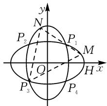
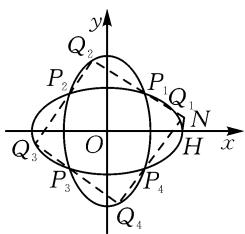
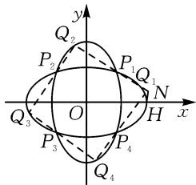

# 椭圆旋转 $90^{\circ}$ 后定点定值存在性研究：一般性与特殊性分析

——以 2025 届武汉市四月联考真题为例

● 华中师大一附中贵阳学校 徐李林 何勇  
● 贵阳市白云区第二高级中学 卢锡娟

# 1 试题及评价

(2025 届武汉市四月联考第 19 题) 椭圆 $\Gamma_{1}:\frac{x^{2}}{m}+\frac{y^{2}}{n}=1(m>n>0),\Gamma_{2}:\frac{x^{2}}{n}+\frac{y^{2}}{m}=1$ ，已知 $\Gamma_{1}$ 右顶点为 $H(2,0)$ ，且它们的交点分别为 $P_{1}(1,1),P_{2}(-1,1),P_{3}(-1,-1),P_{4}(1,-1)$ .

(1) 求 $\Gamma_{1}$ 与 $\Gamma_{2}$ 的标准方程；  
(2)如图1所示,过点 $P_{1}$ 作直线MN,交 $\Gamma_{1}$ 于点M,交 $\Gamma_{2}$ 于点N,设直线 $P_{3}M$ 的斜率为 $k_{1}$ ,直线 $P_{3}N$ 的斜率为 $k_{2}$ ,求 $\frac{k_{2}}{k_{1}}$ ; (上述各点均不重合)  
(3)如图2所示，点 $Q_{1}$ 是 $\Gamma_1$ 上的动点，直线 $Q_{1}P_{1}$ 交 $\Gamma_{2}$ 于点 $Q_{2}$ ，直线 $Q_{2}P_{2}$ 交 $\Gamma_{1}$ 于点 $Q_{3}$ ，直线 $Q_{3}P_{3}$ 交 $\Gamma_{2}$ 于点 $Q_{4}$ 直线 $Q_{4}P_{4}$ 与直线 $Q_{1}P_{1}$ 交于点 $N$ ，求点 $G$ 坐标，使直线NG与直线NH的斜率之积为定值.(上述各点均不重合）

试题评价:第(3)问是本题难点,通过多组直线与椭圆相交构建复杂关系,求使直线斜率之积为定值的点的坐标.不仅要求学生熟练掌握直线与椭圆联立求解交点坐标的方法,还需对代数式进行复杂变形和分析,以确定满足定值条件的坐标,考查学生逻辑思维和运算的耐心与细致程度.本题对学生能力培养意义重大,通过解题可锻炼数学运算、逻辑推理、数学抽象等核心素养.教学中应注重椭圆基础知识的深入讲解,强化直线与椭圆综合问题的训练,引导学生掌握联立

text_image

y
N
P₂
P₁
M
Q
H x
P₃
P₄

图1

text_image

y
Q₂
P₂
P₁
Q₁
N
O
H
x
Q₃
P₃
P₄
Q₄

图2

方程、化简代数式等解题技巧,提升学生对复杂问题的分析和解决能力.

# 2 解法探讨

第(1)(2)问的具体解法略,答案如下:

(1) $\Gamma_{1}$ 和 $\Gamma_{2}$ 的标准方程分别为 $\frac{x^{2}}{4} + \frac{y^{2}}{\frac{4}{3}} = 1, \frac{x^{2}}{\frac{4}{3}} + \frac{y^{2}}{4} = 1.$   
(2) $\frac{k_{2}}{k_{1}}=9.$   
(3) 解法 1: 多次联立直线与椭圆方程.

设四条直线 $Q_{1}Q_{2}, Q_{2}Q_{3}, Q_{3}Q_{4}, Q_{4}P_{4}$ 的斜率分别是 $k_{1}, k_{2}, k_{3}, k_{4}$ .

易知直线 $Q_{1}Q_{2}$ 的方程为 $y=k_{1}(x-1)+1$ ，直线 $Q_{2}Q_{3}$ 的方程为 $y=k_{2}(x+1)+1$ 。

联立直线 $Q_{1}Q_{2}$ 与直线 $Q_{2}Q_{3}$ 的方程, 可得

$$
\left\{ \begin{array}{l l} y = k _ {1} (x - 1) + 1, \\ y = k _ {2} (x + 1) + 1, \end{array} \right. \text {解得} \left\{ \begin{array}{l l} x = \frac {k _ {1} + k _ {2}}{k _ {1} - k _ {2}}, \\ y = \frac {2 k _ {1} k _ {2}}{k _ {1} - k _ {2}} + 1. \end{array} \right.
$$

所以 $Q_{2}\left(\frac{k_{1}+k_{2}}{k_{1}-k_{2}},\frac{2k_{1}k_{2}}{k_{1}-k_{2}}+1\right)$ 且 $Q_{2}$ 在椭圆 $\Gamma_{2}$ :

$$
\frac {x ^ {2}}{\frac {4}{3}} + \frac {y ^ {2}}{4} = 1 \text {上, 即有} \frac {\left(\frac {k _ {1} + k _ {2}}{k _ {1} - k _ {2}}\right) ^ {2}}{\frac {4}{3}} + \frac {\left(\frac {2 k _ {1} k _ {2}}{k _ {1} - k _ {2}} + 1\right) ^ {2}}{4} = 1.
$$

化简得 $3(k_{1}+k_{2})^{2}+4k_{1}^{2}k_{2}^{2}+4k_{1}k_{2}(k_{1}-k_{2})-3(k_{1}-k_{2})^{2}=0.$

继续化简得 $k_{1}k_{2}+k_{1}-k_{2}+3=0$ ，即 $k_{2}=\frac{k_{1}+3}{1-k_{1}}$ .

同理可得 $k_{3}=\frac{k_{2}+1}{1-3k_{2}}, k_{4}=\frac{k_{3}+3}{1-k_{3}}$ ，则

$$
\begin{array}{l} k _ {3} = \frac {k _ {2} + 1}{1 - 3 k _ {2}} = \frac {\frac {k _ {1} + 3}{1 - k _ {1}} + 1}{1 - 3 \times \frac {k _ {1} + 3}{1 - k _ {1}}} = - \frac {1}{k _ {1} + 2}; \\ k _ {4} = \frac {k _ {3} + 3}{1 - k _ {3}} = \frac {- \frac {1}{k _ {1} + 2} + 3}{1 + \frac {1}{k _ {1} + 2}} = \frac {3 k _ {1} + 5}{k _ {1} + 3}. \\ \end{array}
$$

设 $N(x_0, y_0)$ ，则有 $k_4 = \frac{y_0 + 1}{x_0 - 1}, k_1 = \frac{y_0 - 1}{x_0 - 1}$ ，

$$
k _ {N H} = \frac {y _ {0}}{x _ {0} - 2}.
$$

所以 $\frac{y_0 + 1}{x_0 - 1} = \frac{\frac{3(y_0 - 1)}{x_0 - 1} + 5}{\frac{y_0 - 1}{x_0 - 1} + 3} = \frac{5x_0 + 3y_0 - 8}{3x_0 + y_0 - 4}$ .

化简，得 $5x_{0}^{2}-16x_{0}-y_{0}^{2}+12=0$ .

整理得 $(x_{0}-2)(5x_{0}-6)=y_{0}^{2}$ .

所以 $\frac{y_0}{x_0 - 2} \cdot \frac{y_0}{x_0 - \frac{6}{5}} = 5.$

由此可知存在点 $G\left(\frac{6}{5},0\right)$ ，使得 $k_{NH} \cdot k_{NG} = 5$ .

方法点评:该思路较为常规,基于直线与椭圆联立方程求解交点坐标这一基本方法,符合解析几何解决问题的一般思路,容易被学生理解和接受.但计算量庞大,需要多次联立直线与椭圆方程,反复求点的坐标以及进行复杂的代数式化简,过程繁琐,极易出错,对学生的运算能力和耐心要求极高.

解法 2: 利用椭圆斜率定值性质与中点坐标公式.

解法 2 的具体过程略, 可扫码阅读.

方法点评:此解法巧妙运用椭圆斜率定值性质和中点坐标公式,简化了部分计算过程,相比解法1,在一定程度上减少了计算量.同时,这种解法体现了知识之间的综合运用,有助于

  
扫码查看

学生加深对椭圆性质的理解.但对学生的知识储备和综合运用能力要求较高,需要学生熟悉椭圆斜率定值性质,并能准确运用中点坐标公式.解题过程中涉及多个步骤和知识点的衔接,任何一个环节出现问题都可能导致错误.

# 3 椭圆旋转中定点定值的拓展分析

对于任意的椭圆绕原点旋转 $90^{\circ}$ ，是否都存在点 G，使直线 NG 与直线 NH 的斜率之积为定值呢？还是只对既定的椭圆才存在定点与定值呢？如果是既定的椭圆，对应椭圆的离心率是多少？在此基础之上求出对应的定点与定值.

# 3.1 一般化问题构建

如图 3, 椭圆 $\Gamma_{1}:\frac{x^{2}}{a^{2}}+\frac{y^{2}}{b^{2}}=$

$1(a>b>0),\Gamma_{2}:\frac{x^{2}}{b^{2}}+\frac{y^{2}}{a^{2}}=1,$ 已知 $\Gamma_{1}$ 的右顶点为 $H(a,0)$ ，且它们在第一、二、三、四象限的交点分别为 $P_{1}, P_{2}, P_{3}, P_{4}$ .

text_image

y
Q₂
P₂
P₁
Q₁
N
O
H
x
Q₃
P₃
P₄
Q₄

图3

点 $Q_{1}$ 是 $\Gamma_{1}$ 上的动点，直线 $Q_{1}P_{1}$ 交 $\Gamma_{2}$ 于点 $Q_{2}$ ，直线 $Q_{2}P_{2}$ 交 $\Gamma_{1}$ 于点 $Q_{3}$ ，直线 $Q_{3}P_{3}$ 交 $\Gamma_{2}$ 于点 $Q_{4}$ ，直线 $Q_{4}P_{4}$ 与直线 $Q_{1}P_{1}$ 交于点 N，求点 G 坐标，使直线 NG 与直线 NH 的斜率之积为定值。（上述各点均不重合）.

# 3.2 拓展探究

假设对任意的椭圆 $\Gamma_{1}:\frac{x^{2}}{a^{2}}+\frac{y^{2}}{b^{2}}=1(a>b>0)$ 绕原点旋转 $90^{\circ}$ ，得到椭圆 $\Gamma_{2}:\frac{x^{2}}{b^{2}}+\frac{y^{2}}{a^{2}}=1$ .

两个椭圆在第一、二、三、四象限的交点分别记为 $P_{1}, P_{2}, P_{3}, P_{4}$ ，由两椭圆的对称可知， $P_{1}$ 的横坐标与纵坐标相等，设 $P_{1}(t, t), t > 0$ ，代入椭圆的方程，易得 $t = \sqrt{\frac{a^2b^2}{a^2 + b^2}}$ .

设直线 $Q_{1}Q_{2}, Q_{2}Q_{3}, Q_{3}Q_{4}, Q_{4}P_{4}$ 的斜率分别是 $k_{1}, k_{2}, k_{3}, k_{4}$ .

易知直线 $Q_{1}Q_{2}$ 的方程为 $y=k_{1}(x-t)+t$ ，直线 $Q_{2}Q_{3}$ 的方程为 $y=k_{2}(x+t)+t$ 。

联立直线 $Q_{1}Q_{2}$ 的方程与直线 $Q_{2}Q_{3}$ 的方程, 得

$\left\{ \begin{array}{l} y = k_{1}(x - t) + t, \\ y = k_{2}(x + t) + t, \end{array} \right.$ 解得 $\left\{ \begin{array}{l} x = \frac{k_1 + k_2}{k_1 - k_2} t, \\ y = \frac{2k_1k_2 + k_1 - k_2}{k_1 - k_2} t. \end{array} \right.$

所以 $Q_{2}\left(\frac{k_{1}+k_{2}}{k_{1}-k_{2}}t,\frac{2k_{1}k_{2}+k_{1}-k_{2}}{k_{1}-k_{2}}t\right)$ 且 $Q_{2}$ 在椭圆 $\Gamma_{2}:\frac{x^{2}}{b^{2}}+\frac{y^{2}}{a^{2}}=1$ 上，即有

$$
\frac {\left(\frac {k _ {1} + k _ {2}}{k _ {1} - k _ {2}} t\right) ^ {2}}{b ^ {2}} + \frac {\left(\frac {2 k _ {1} k _ {2} + k _ {1} - k _ {2}}{k _ {1} - k _ {2}} t\right) ^ {2}}{a ^ {2}} = 1.
$$

化简得 $a^{2}(k_{1}+k_{2})^{2}t^{2}+b^{2}(2k_{1}k_{2}+k_{1}-k_{2})^{2}t^{2}-a^{2}b^{2}(k_{1}-k_{2})^{2}=0.$

把 $t=\sqrt{\frac{a^{2}b^{2}}{a^{2}+b^{2}}}$ 代入上式，化简得 $a^{2}(k_{1}+k_{2})^{2}+b^{2}(2k_{1}k_{2}+k_{1}-k_{2})^{2}-(a^{2}+b^{2})(k_{1}-k_{2})^{2}=0.$

继续化简，得可 $a^2 + b^2 (k_1 k_2 + k_1 - k_2) = 0$ ，即

$$
k _ {2} = \frac {\frac {a ^ {2}}{b ^ {2}} + k _ {1}}{1 - k _ {1}}.
$$

同理, 可得 $k_{3}=\frac{\frac{b^{2}}{a^{2}}(1+k_{2})}{\frac{b^{2}}{a^{2}}-k_{2}}, k_{4}=\frac{\frac{a^{2}}{b^{2}}+k_{3}}{1-k_{3}}.$

令 $h = \frac{a^2}{b^2}$ , 则 $k_2 = \frac{h + k_1}{1 - k_1}, k_3 = \frac{\frac{1}{h}(1 + k_2)}{\frac{1}{h} - k_2} = \frac{1 + k_2}{1 - hk_2}, k_4 = \frac{h + k_3}{1 - k_3}$ .

所以 $k_{3} = \frac{1 + k_{2}}{1 - hk_{2}} = \frac{1 + \frac{h + k_{1}}{1 - k_{1}}}{1 - h\cdot\frac{h + k_{1}}{1 - k_{1}}} = \frac{1}{1 - h - k_{1}},$

$$
k _ {4} = \frac {h + \frac {1}{1 - h - k _ {1}}}{1 - \frac {1}{1 - h - k _ {1}}} = \frac {h ^ {2} - h - 1 + h k _ {1}}{h + k _ {1}}.
$$

设 $N(x_0, y_0)$ ，则 $k_4 = \frac{y_0 + t}{x_0 - t}, k_1 = \frac{y_0 - t}{x_0 - t}, k_{NH} = \frac{y_0}{x_0 - a}$ .

故 $\frac{y_0 + t}{x_0 - t} = \frac{h^2 - h - 1 + hk_1}{h + k_1} = \frac{h^2 - h - 1 + h \cdot \frac{y_0 - t}{x_0 - t}}{h + \frac{y_0 - t}{x_0 - t}}.$

化简得 $y_{0}^{2}=(h^{2}-h-1)x_{0}^{2}+2t(1-h^{2})x_{0}+(h^{2}+h)t^{2}$ .

要使 $k_{NG} \cdot k_{NH}$ 为定值，则 $(h^{2}-h-1)x_{0}^{2}+2t(1-h^{2})x_{0}+(h^{2}+h)t^{2}$ 可分解为 $(h^{2}-h-1) \cdot (x_{0}-a)(x_{0}-Z)$ ，其中 Z 为常数；

又 $(h^2 - h - 1)(x_0 - a)(x_0 - Z) = (h^2 - h - 1) \cdot x_0^2 - (a + Z)(h^2 - h - 1)x_0 + aZ(h^2 - h - 1)$ ，由待定系数法可得如下关系

$$
\left\{ \begin{array}{l} 2 t (1 - h ^ {2}) = - (a + Z) (h ^ {2} - h - 1), \\ (h ^ {2} + h) t ^ {2} = a Z (h ^ {2} - h - 1), \end{array} \right.
$$

其中 $t = \sqrt{\frac{a^2b^2}{a^2 + b^2}}$ ，即需要两个方程中的 $Z$ 相同，消去其中的 $Z$ ，于是有 $\frac{h^2 + h}{a(h^2 - h - 1)}\cdot \frac{a^2b^2}{a^2 + b^2} = -a-$ $\frac{2(1 - h^2)}{h^2 - h - 1}\sqrt{\frac{a^2b^2}{a^2 + b^2}}.$

又因为 $h = \frac{a^2}{b^2}$ 所以 $\frac{\frac{a^4}{b^4} + \frac{a^2}{b^2}}{a\left(\frac{a^4}{b^4} - \frac{a^2}{b^2} - 1\right)} \cdot \frac{a^2b^2}{a^2 + b^2} =$

$$
- a - \frac {2 \left(1 - \frac {a ^ {4}}{b ^ {4}}\right)}{\frac {a ^ {4}}{b ^ {4}} - \frac {a ^ {2}}{b ^ {2}} - 1} \sqrt {\frac {a ^ {2} b ^ {2}}{a ^ {2} + b ^ {2}}}.
$$

化简得 $\frac{a^3b^2}{a^4 - a^2b^2 - b^4} = -a + \frac{2(a^4 - b^4)}{a^4 - a^2b^2 - b^4}\cdot$ $\frac{ab}{\sqrt{a^2 + b^2}}.$

继续化简，得 $\frac{a^4 - b^4}{a^4 - a^2b^2 - b^4} = \frac{2(a^4 - b^4)}{a^4 - a^2b^2 - b^4}$ · $\frac{b}{\sqrt{a^2 + b^2}}$ ，解得 $a^2 = 3b^2$

此时 $t^2 = \frac{a^2b^2}{a^2 + b^2} = \frac{1}{4} a^2, h = \frac{a^2}{b^2} = 3$ ，则有 $Z = \frac{h^2 + h}{a(h^2 - h - 1)} t^2 = \frac{3}{5} a$ .

所以 $y_{0}^{2}=(h^{2}-h-1)x_{0}^{2}+2t(1-h^{2})x_{0}+t^{2}\cdot(h^{2}+h)=5(x_{0}-a)\left(x_{0}-\frac{3}{5}a\right)$ .

进一步，有 $\frac{y_0^2}{(x_0 - a)\left(x_0 - \frac{3}{5} a\right)} = 5.$

由此可得如下结论：

结论: 当椭圆: $\frac{x^{2}}{a^{2}} + \frac{y^{2}}{b^{2}} = 1 (a > b > 0)$ 满足 $a^{2} = 3b^{2}$ ，即椭圆的离心率为 $\frac{\sqrt{6}}{3}$ 时，存在定点 $\left(\frac{3}{5}a, 0\right)$ ，使直线 NG 在直线 NH 的斜率之积为定值 5.

# 4 结语

本研究以2025届武汉市四月联考椭圆试题为载体，系统探究了椭圆旋转 $90^{\circ}$ 后的定点定值存在性问题.通过对试题第(3)问解法的剖析（联立方程法、代数变形法等），结合对称性分析与一般化拓展，明确了仅当椭圆满足 $a^2 = 3b^2\left(\text{离心率为} \frac{\sqrt{6}}{3}\right)$ 时，存在定点 $\left(\frac{3}{5} a, 0\right)$ 使相应直线斜率之积为定值5.拓展探究揭示了椭圆旋转问题中特殊性与一般性的辩证关系：特定离心率条件下的定点定值规律，既为教学中解析几何综合题的讲解提供了多元视角，也为命题设计提供了可量化的理论依据，深入挖掘几何变换与定点定值问题的内在联系，可为解析几何的深度学习提供更丰富的理论支撑.本研究不仅解决了具体试题中的问题，还为解析几何教学提供了丰富资源，对培养学生的数学核心素养、推动数学教育发展具有重要意义.未来研究可进一步拓展椭圆旋转问题，如探究不同旋转角度下的性质，或结合其他几何图形深入挖掘解析几何的奥秘.