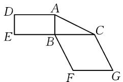
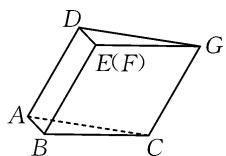
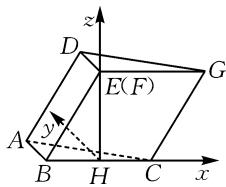
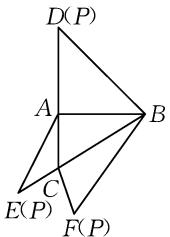
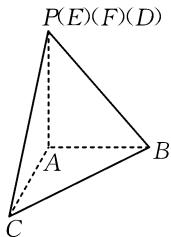
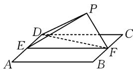
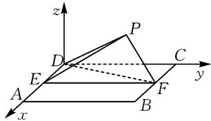
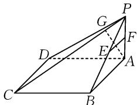

# 立体几何中翻折问题的静态化处理

# 山东省莘县第一中学 沈华

摘要:立体几何动态问题是高考考查空间想象能力与逻辑推理能力的重要载体.翻折问题是典型动态问题,解决关键是将动态过程转化为静态图形,分析翻折前后几何元素的位置与数量关系,进而建立可求解的数学模型.本研究阐述了“抓不变、定关键、化静为动”的静态化处理策略,识别翻折过程中的不变量,确定翻折后关键点的位置,即可将动态翻折问题转化为静态的空间几何证明与计算问题.该策略可帮助学生梳理解题思路,降低解题难度,提高解题效率.

关键词: 立体几何; 翻折问题; 动态问题; 静态化处理

《普通高中数学课程标准(2017年版2020年修订)》明确考查学生的空间想象、逻辑推理等数学核心素养.立体几何翻折问题是契合上述要求的典型题型.其由平面图形经翻折运动转化为空间图形而来,涉及点、线、面位置关系与度量关系的动态变化.此类问题因含“动态”特征,常使学生解题受阻.探索动态问题静态化路径,厘清翻折过程中的“变”与“不变”,对提升学生解题能力、落实核心素养培养具有现实意义.

# 1 翻折问题类型

翻折问题可按呈现形式与考查重心,分为两种常见类型.平面图形翻折为其一,试题通常给出平面图形,指定沿某条直线翻折,进而形成空间几何体.这类问题侧重考查翻折后空间几何体的结构特征,以及翻折过程中几何元素位置关系的变化,包括线线、线面关系,以及由此衍生的空间角度与距离计算.另一类是空间几何体的表面展开与还原,试题通常给出多面体表面展开图,要求还原为立体图形,或进行反向操作.此类问题考查空间构型能力,也常结合几何体表面最短路径等问题综合设计.两类问题表现形式不同,本质均为空间图形与平面图形的相互转化.解决两类问题的关键,在于明确翻折或展开前后几何元素关系的变与不变.明确两类问题的差异,可帮助学生快速识别问题本质,选择合适的静态化处理路径.

# 2 立体几何中动态问题的静态化处理

# 2.1 利用折痕同侧关系不变证明共面与垂直

平面图形翻折时,图形运动呈连续性,部分几何关系却保持恒定.折痕同侧的所有点、线、面,翻折前后的相对位置与几何关系完全保留于同一平面.翻折前的平行、共线、共面等位置关系,线段长度、角度大小等数量关系,若涉及的几何元素均在折痕同侧,这些关系在翻折后的立体图形中保持不变.该特性是空间几何证明的重要依据,可在平面图形中预先确定不变关系,将动态空间构造问题转化为静态几何命题.

例 1 图 1 是矩形 ABED, Rt△ABC 和菱形 BF-GC 组成的一个平面图形, 其中 AB=1, BE=BF=2, ∠FBC=60°. 将其沿 AB, BC 折起使得 BE 与 BF 重合, 连接 DG, 如图 2.

(1)证明: A, C, G, D 四点共面, 且平面 $ABC \perp$ 平面 BCGE;  
(2)求二面角 B-CG-A 的大小.

text_image

Geometric diagram with labeled points A, B, C, D, E, F, G forming connected polygons

图1

  
图2

(1) 证明: 在图 1 中, 因为 $AD \parallel BE$ , $CG \parallel BF$ , 所以图 2 中 $AD \parallel CG$ .

由平行公理, 知 AD 与 CG 确定一个平面, 因此 A, C, G, D 四点共面.

在平面图形图 1 中， $AB \perp BE, AB \perp BC$ ，翻折过程中，这一垂直关系保持不变，故在立体图形图 2 中有 $AB \perp BE, AB \perp BC$ .

又 $BE \cap BC = B, BE, BC \subset$ 平面 BCGE，所以 $AB \perp$ 平面 BCGE。而 $AB \subset$ 平面 ABC，故平面 $ABC \perp$ 平面 BCGE。

(2) 解: 建立如图 3 所示的空间直角坐标系. 计算得平面 ACGD 的法向量 $\boldsymbol{n} = (3, 6, -\sqrt{3})$ ，平面 BCGE 的法向量可以取为 $\boldsymbol{m} = (0, 1, 0)$ ，则 $\cos\langle\boldsymbol{n}, \boldsymbol{m}\rangle = \frac{\boldsymbol{n} \cdot \boldsymbol{m}}{|\boldsymbol{n}| | \boldsymbol{m}|} =$

text_image

z
D
E(F)
G
A
y
B
H
C
x

图3

$\frac{6}{\sqrt{9+36+3\times1}}=\frac{\sqrt{3}}{2}$ . 故二面角 B-CG-A 的大小为 $30^{\circ}$ .

翻折问题中的线线角问题,通常将空间中两条异面直线的垂直问题转化为平面内两直线的问题,即空间问题平面化,解决这个问题的关键是抓住点在平面的射影位置 $^{[1]}$ .解决翻折问题需先回归原始平面图形,识别折痕同侧的几何元素,明确其翻折前的关系,重点是平行与垂直关系.以这些“不变”关系为基础,可在翻折后的立体图形中确立线面关系,进而完成证明.该方法可将动态翻折转化为静态图形性质的应用,降低学生对空间图形的理解难度.

# 2.2 利用与折痕垂直的线段关系不变求解角度

翻折问题中,与折痕垂直的线段具有特殊作用.这类线段的长度在翻折前后保持不变,这一特征较为直观.其与折痕的垂直关系,在翻折后同样保持不变.翻折本质是绕折痕的旋转运动,垂直于折痕的线段在旋转中,与折痕的夹角始终为直角.该性质具备显著的实用意义.求解二面角时,构造平面角是常用思路,垂直于棱的线段可作为构造平面角的核心素材.求解异面直线所成角时,寻找与两直线垂直或相关的线段,同样需依托该性质.因此,在平面图形中识别所有与折痕垂直的线段,分析其相互关系,是化动为静的关键策略之一.

例 2 在三棱锥 P-ABC 的平面展开图(如图 4)中, AC = 1, AB = AD = $\sqrt{3}$ , AB ⊥ AC, AB ⊥ AD, $\angle CAE = 30^{\circ}$ , 则 $\cos \angle FCB =$ \_\_\_\_.

text_image

D(P)
A
B
C
E(P)
F(P)

图 4

text_image

P(E)(F)(D)
A
B
C

图 5

解析: 将平面展开图还原为三棱锥, 如图 5. 其中, 折痕为 AC, AB, AD 等. 关键点 F 为展开图中 CF 与 BF 的交点, 还原后点 F 在棱 PC 上.

由展开图图4知， $AB\bot AC,AB\bot AD$ ，故翻折后 $AB\bot$ 平面ACP.在 $\triangle CAE$ 中， $AC = 1,\angle CAE = 30^{\circ}$ $AE = AD = \sqrt{3}$ ，则根据余弦定理可以得到 $CE =$ $\sqrt{1 + 3 - 2\times 1\times\sqrt{3}\cos 30^{\circ}} = 1.$

在翻折后的立体图形图5中，点 $F$ 在 $PC$ 上，且 $CF = CE = 1.$ 在 $\triangle FCB$ 中，有 $BC = \sqrt{AB^2 + AC^2} =$ $\sqrt{3 + 1} = 2,BF = BD = \sqrt{AB^2 + AD^2} = \sqrt{3 + 3} = \sqrt{6}.$

由余弦定理，得 $\cos\angle FCB=\frac{CF^{2}+BC^{2}-BF^{2}}{2CF\cdot BC}=$ $\frac{1^{2}+2^{2}-(\sqrt{6})^{2}}{2\times1\times2}=-\frac{1}{4}.$

故填： $-\frac{1}{4}$ .

本题求解过程呈现了翻折问题的经典处理思路：由平面展开图逆向还原立体图形。这一过程中，关键在于确定翻折后各顶点的准确空间位置。“与折痕垂直的线段关系不变”这一原则，为顶点定位提供了关键依据。借助这一原则，可将平面图形中的角度与长度信息迁移至立体图形对应部分，进而将空间角度计算转化为三角形内的余弦定理应用问题。这一过程贯彻了静态化处理思路，即将空间问题转化为可计算的平面图形进行求解。

# 2.3 利用关键点位置确定解决探索性问题

立体几何中的“动态问题”，是借助空间图形中某些点、线（直线）、面（平面）位置关系的“动态”变化而构成的一类不确定的、可变的开放问题。因其点、线、面位置的不确定性，往往成为学生进行常规分析、问题思考、视角转化时的障碍 $^{[2]}$ 。关键点多为折痕上的固定点、翻折前后的对应点，以及由这类点衍生的特殊点。图形的动态变化，由这些关键点的位置变化带动。解决翻折类探索性问题，关键是准确确定关键点翻折后的空间位置。确定位置需综合分析约束条件，翻折前后对应点到折痕的距离相等，已知长度与角度关系在翻折后保持不变，题目额外给出的空间位置条件也需纳入考量。整合上述条件可逐步锁定关键点空间坐标，把不确定的动态几何体转化为确定的静态模型，为后续证明与计算奠定基础。

例 3 四边形 ABCD 为正方形, E, F 分别为 AD, BC 的中点, 以 DF 为折痕把 $\triangle DFC$ 折起, 使点 C 到达点 P 的位置, $PF \perp BF$ , 如图 6.

  
图6

(1) 证明: 平面 $PEF \perp$ 平面 ABFD;  
(2) 求 DP 与平面 ABFD 所成角的正弦值.

(1) 证明: 由翻折知, PF = CF, PD = CD. 在正方形中, $EF \perp BF$ . 翻折后, 又 $PF \perp BF$ , $PF \cap EF = F$ , 所以 $BF \perp$ 平面 PEF.

text_image

z
P
D
C
E
A
F
B
x
y

图 7

又 $BF \subset$ 平面 ABFD，
所以平面 $PEF \perp$ 平面 ABFD.

(2) 解: 建立如图 7 所示空间直角坐标系. 设正方

形边长为 2，则 $B(2,2,0)$ ， $F(1,2,0)$ ， $D(0,0,0)$ .

作 $PH \perp EF$ 于点H，由(1)易得 $PH \perp$ 平面ABFD.

由(1)可得 $DE \perp PE$ ，又 DP = 2, ED = 1，所以 $PE = \sqrt{3}$ .

又 $PE = \sqrt{3}, EF = 2$ ，易知 $PE \perp PF$ ，则 $PH = \frac{\sqrt{3}}{2}, EH = \frac{3}{2}$ 故 $P\left(1, \frac{3}{2}, \frac{\sqrt{3}}{2}\right)$ .

易得 $\overrightarrow{DP}=\left(1,\frac{3}{2},\frac{\sqrt{3}}{2}\right)$ .

平面 ABFD 的法向量可取 $\boldsymbol{n}=(0,0,1)$ . 设直线 DP 与平面 ABFD 所成角为 $\theta$ , 则

$$
\sin \theta = | \cos \langle \overrightarrow {D P}, \boldsymbol {n} \rangle | = \frac {| \overrightarrow {D P} \cdot \boldsymbol {n} |}{| \overrightarrow {D P} | | \boldsymbol {n} |} = \frac {\sqrt {3}}{4}.
$$

将立体几何中的线面关系、空间角、体积等知识点整合复习，采用开放式问题和一题多解的方式，培养学生的空间想象和创造性思维素养[3].解题起点为分析折痕性质及关键点的移动规律，结合翻折过程中的不变量与题目新增条件，可推导更多隐藏线面关系，进而证明结论并完成计算.过程注重逻辑连贯与推理严密,动态翻折构想需转化为分步严谨的静态几何论证.面对翻折问题,需保持清晰思路,聚焦“确定关键点位置”与“利用不变关系”,通过静态论证转化动态问题,简化求解过程.

翻折问题是立体几何动态问题的典型类型,解题思路为“以静制动”.抓取平行、垂直、长度等不变关系,明确关键点位置,即可将复杂动态过程转化为熟悉的静态几何模型.教学中需引导学生掌握该静态化处理方法,结合典型例题剖析,提升空间想象与逻辑推理能力,以应对高考中立体几何动态问题的考查.

# 参考文献：

[1] 刘旭飞. 基于数学问题链的主题教学——以立体几何的翻折问题为例 [J]. 中学数学研究 (华南师范大学版), 2024(18): 20-22.

[2]齐淑珍.立体几何中的“动态问题”及应用[J].数学之友，2024(7):36-37.

[3]张默.基于直观想象素养的高三复习课的实践与思考——以《立体几何中的动态翻折》为例[J].数学之友，2023,37(21):28-31.Z

# (上接第86页)

解析:由 PA=AB, $PB=\sqrt{2}AB$ ，结合勾股定理的逆定理易得 $PA\perp AB$ ，又 $PA\perp AD$ ， $AB\cap AD=A$ ，则 $PA\perp$ 平面 ABCD。由 ABCD 为矩形，得 $AB\parallel CD$ ，则 $PA\perp CD$ ，易知棱 PC 为球 O 的直径。

由 $CD \perp AD, AD \cap PA = A$ ，得 $CD \perp$ 平面 PAD.

如图 6 所示, 过点 A 作 PD 的垂线, 垂足为 G, 取 PB 和 PA 的中点分别为点 E、点 F, 连接 EF, 则 $AG \perp PD, EF \parallel AB$ . 又 $AG \subset$ 平面 PAD, 则 $CD \perp AG$ , 而 $PD \cap CD = P$ , 则 $AG \perp$ 平面 PCD.

text_image

Geometric diagram of a pyramid with labeled vertices and internal points, used for spatial geometry problems.

图 6

又 $EF \not\subset$ 平面 $PCD$ , 因此要求点 $E$ 到平面 $PCD$ 的距离, 即求点 $F$ 到平面 $PCD$ 的距离, 易得该距离为 $\frac{1}{2} AG$ .

设球 O 的半径为 R，根据球 O 的体积为 $\frac{32\pi}{3}$ 可以得到 $\frac{4}{3}\pi R^{3} = \frac{32\pi}{3}$ ，进一步可解得 R = 2。易知 $R = \frac{\sqrt{AB^{2} + AD^{2} + AP^{2}}}{2} = \frac{\sqrt{(2\sqrt{2})^{2} + 2AP^{2}}}{2} = 2$ ，解得 AP = 2。在 Rt△PAD 中，结合勾股定理可得 PD =

$\sqrt{AD^{2}+PA^{2}}=\sqrt{(2\sqrt{2})^{2}+2^{2}}=2\sqrt{3}$ ，则由等面积法可得 $AG=\frac{AP\cdot AD}{PD}=\frac{2\times2\sqrt{2}}{2\sqrt{3}}=\frac{2\sqrt{6}}{3}$ ，所以棱 PB 的中点到平面 PCD 的距离为 $\frac{1}{2}AG=\frac{1}{2}\times\frac{2\sqrt{6}}{3}=\frac{\sqrt{6}}{3}$ .

点评:该题考查空间中线面关系的证明、球、勾股定理等知识.解题时应能基于对四棱锥性质的认识以及已知条件确定PC为球O的直径,尤其是能够通过直线与平面的平行,将点E到平面PCD的距离转化为点F到平面PCD的距离,而后借助等面积法、几何图形的性质计算出结果.

综上所述,高中立体几何中求点面距离的习题情境多变,其中定义法、等体积法、向量法以及平行转化法在解题中应用广泛.为更好地应用这四种方法解题,应做好这四种方法的研究,明确这四种方法的区别以及适合的习题类型,并加强应用训练,积累经验,提升应用水平.

# 参考文献：

[1]韩阳.常见空间距离的求解策略[J].中学生数理化(高考数学),2021(2):41-42.

[2]潘继军.求“点面距离”常用的几种基本方法[J].数学学习与研究,2019(9):138-139.Z