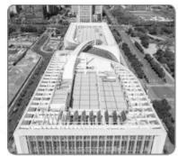
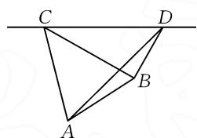
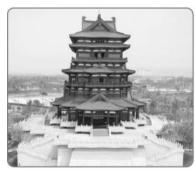
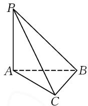
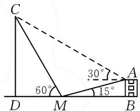
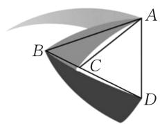
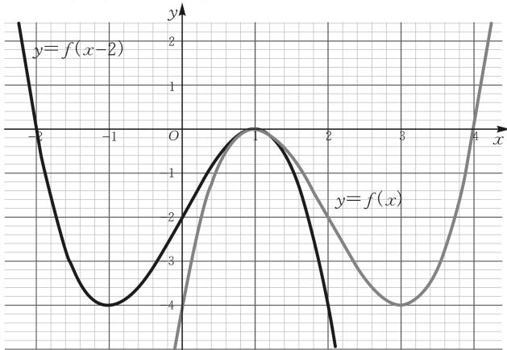

# 解三角形的实际应用类型与技巧

# ● 重庆市女子职业高级中学 林小波

摘要:借助解三角形知识与思维来分析与处理一些相关的实际应用问题,是解三角形综合应用中的一个重要情境.结合解三角形实际应用的三种基本类型——距离问题、高度问题与角度问题,通过典型实例加以剖析与应用,归纳总结解题技巧与应对策略,指导数学教学与复习备考.

关键词: 解三角形; 实际应用; 距离; 高度; 角度

在解三角形的实际应用问题中,应用正弦定理、余弦定理来分析与解决,是考查学生数学应用意识的重要素材.对于一些实际创新问题中的解三角形,通常运用正弦定理、余弦定理,考查求解距离、高度、角度等实际应用问题.解决此类问题的关键是准确理解题意,分清已知与所求,将要求解的问题加以合理归结,通过转化到一个或几个确定的三角形中,利用解三角形的基础知识与基本应用来建立数学模型,然后正确求解.具体解题与应用过程中,要算法简练,计算要准确,最后作答.

# 1 距离问题

解三角形实际应用中的距离问题,其实质就是借助实际应用问题,合理构建平面几何模型,回归平面几何图形本质,通过解三角形思维与方法求解相应三角形的边长,即为实际应用中的距离问题.

例 1 （2024 年山东省济南市高考数学模拟试卷）在一些主体建筑中，经常会有一些特殊的图形或符号。如山东省科技馆（如图 1）就巧妙将数学符号“∞”嵌入主体建筑中去。如图 2，为了确定科技馆最高点 A 与科技馆旁边一建筑物楼顶 B 之间的距离，在同一铅垂平面内，无人机在点 C 处测得 A 和 B 两点处的俯角分别为 $75^{\circ}$ 和 $30^{\circ}$ ，随后无人机沿水平方向飞行 600 m 到点 D 处，测得 A 和 B 两点处的俯角分别为 $45^{\circ}$ 和 $60^{\circ}$ ，则 A, B 两点之间的距离为 \_\_\_\_ m.

  
图1

text_image

C
D
A
B

图2

解析:由题意,知 $\angle DCB = 30^{\circ}, \angle CDB = 60^{\circ}$ , 所以 $\angle CBD = 90^{\circ}$ . 于是在 Rt△CBD 中, $BD = \frac{1}{2}CD =$

$$
3 0 0 (\mathrm{m}), B C = \frac {\sqrt {3}}{2} C D = 3 0 0 \sqrt {3} (\mathrm{m}).
$$

又 $\angle DCA=75^{\circ},\angle CDA=45^{\circ}$ , 所以 $\angle CAD=60^{\circ}$ . 在 $\triangle ACD$ 中, 由正弦定理得 $\frac{AC}{\sin 45^{\circ}}=\frac{CD}{\sin 60^{\circ}}$ , 所以

$$
A C = \frac {6 0 0}{\frac {\sqrt {3}}{2}} \times \frac {\sqrt {2}}{2} = 2 0 0 \sqrt {6} (\mathrm{m}).
$$

在 $\triangle ABC$ 中， $\angle ACB = \angle ACD - \angle BCD = 75^{\circ} - 30^{\circ} = 45^{\circ}$ ，由余弦定理得 $AB^{2} = AC^{2} + BC^{2} - 2AC \cdot BC \cdot \cos \angle ACB = (200\sqrt{6})^{2} + (300\sqrt{3})^{2} - 2 \times 200\sqrt{6} \times 300\sqrt{3} \times \frac{\sqrt{2}}{2} = 150\,000$ ，所以 $AB = 100\,\sqrt{15}$ （m）.

故填: $100\sqrt{15}$ .

点评:解决此类涉及解三角形中的距离及其应用问题,关键是合理构建几何图形,并选定与题设条件对应的三角形,确定三角形中相关的边长、角度等要素以及未知变量,通过已知量与未知量之间的关系,结合解三角形中的相关定理(正弦定理或余弦定理)、公式(面积公式等)加以综合应用,进而通过求解三角形的边长实现距离问题的解决.

# 2 高度问题

解三角形实际应用中的高度问题,其实质就是借助实际应用问题,合理构建特殊的平面几何模型,诸如山或塔垂直于地面或海平面等,合理回归平面几何图形本质,化立体为平面,借助平面几何中的距离等来求解相应实际应用中的高度问题.

例 2 （1）（2024 年四川省绵阳市高考数学模拟试卷）四川省成都东安湖体育公园主体育场中东安阁（如图 3），以唐代高阁的建筑风格，成为成都市文化的新地标之一。为了探测东安阁的高度，某数学兴趣小组选取与阁底 A 在同一水平面的 B，C 两处作为观测点,如图4,通过测量,测得 $BC=36\ m,\ \angle ABC=45^{\circ},\ \angle ACB=105^{\circ}$ ,同时在 C 处测得阁顶 P 的仰角为 $45^{\circ}$ ,根据这些相关数据,可以探测东安阁的高度 AP 为( ) (精确到 0.1 m, 参考数据: $\sqrt{2}\approx1.41$ ).

A. $72.0 \mathrm{~m}$ B. $51.0 \mathrm{~m}$ C. $50.8 \mathrm{~m}$ D. $62.3 \mathrm{~m}$

  
图3

  
图4

(2)〔2023—2024学年吉林省长春市绿园区新解放学校高一(下)期中数学试卷〕某数学兴趣小组为了探测如图5所示的天文台CD的高度,选择附近一幢建筑三楼的一个阳台A,根据

text_image

C
60°
30°
15°
D M B

图5

实测, 测得点 A 到地面的距离 $AB = (15 - 5\sqrt{3})$ m, 在同一铅垂平面内, 在天文台与建筑之间的地面上的点 M 处测得阳台 A、天文台顶 C 两点处的仰角分别是 $15^{\circ}$ 和 $60^{\circ}$ , 在阳台 A 处测得天文台顶 C 的仰角为 $30^{\circ}$ . 根据这些相关数据, 可以探测天文台 CD 的高度为 \_\_\_\_ m.

解析:(1)依题,在 $\triangle ABC$ 中, $\angle BAC=180^{\circ}-(\angle ABC+\angle ACB)=30^{\circ}$ .

由正弦定理, 可得 $\frac{BC}{\sin\angle BAC} = \frac{AC}{\sin\angle ABC}$ , 所以

$$
A C = \frac {B C \sin \angle A B C}{\sin \angle B A C} = \frac {3 6 \times \frac {\sqrt {2}}{2}}{\frac {1}{2}} = 3 6 \sqrt {2} (\mathrm{m}).
$$

在 $\triangle APC$ 中， $\angle PAC = 90^{\circ}$ ， $\angle ACP = 45^{\circ}$ ，所以 $\triangle APC$ 为等腰直角三角形，可得 $AP = AC = 36\sqrt{2} \approx 50.8(\text{m})$ .

故选择:C.

(2) 在 Rt△ABM 中, 有 $AM=\frac{AB}{\sin15^{\circ}}$ .

在 $\triangle ACM$ 中， $\angle CAM=30^{\circ}+15^{\circ}=45^{\circ}$ ， $\angle AMC=180^{\circ}-15^{\circ}-60^{\circ}=105^{\circ}$ ， $\angle ACM=180^{\circ}-105^{\circ}-45^{\circ}=30^{\circ}$ .

由正弦定理得 $\frac{AM}{\sin\angle ACM} = \frac{MC}{\sin\angle CAM}$ , 则 $MC = \frac{\sin\angle CAM}{\sin\angle ACM} \cdot AM = \frac{\sin 45^\circ}{\sin 30^\circ} \cdot \frac{AB}{\sin 15^\circ} = \frac{\sqrt{2} AB}{\sin 15^\circ}$ .

在 Rt△CDM 中, 可以得到 $CD = MC \cdot \sin 60^{\circ} =$

$$
\frac {\sqrt {2} A B}{\sin 1 5 ^ {\circ}} \times \sin 6 0 ^ {\circ} = \sqrt {2} \times \frac {1 5 - 5 \sqrt {3}}{\frac {\sqrt {6} - \sqrt {2}}{4}} \times \frac {\sqrt {3}}{2} = 3 0 (\mathrm{m}).
$$

故填:30.

点评:解决此类涉及解三角形中的高度及其应用问题,关键是合理构建几何图形(包括平面图形与立体图形等),并选定与题设条件对应的三角形,特别是与高度有关的三角形,利用平面几何与空间几何中的基本性质,抓住高度问题所涉及的实际应用场景中的要素与水平面是垂直的特点,构建平面几何与空间几何之间的联系,将空间问题平面化,进而借助解三角形场景来分析与解决.

# 3 角度问题

解三角形实际应用中的角度问题,其实质就是借助实际应用问题,合理构建特殊的平面几何模型,通过合理回归平面几何图形本质,巧妙将所求角度转化为平面几何图形中的角度,进而结合解三角形思维来处理与应用.

例 3 [2023—2024 学年浙江省精诚 2 高一(下)联考数学试卷(3 月份)]冬奥会会徽以汉字“冬”为灵感来源,结合中国书法的艺术形态,将悠久的中国传统文化底蕴与国际化风格融为一体(如图 6),呈现出中国在新时代的新形象、新梦想.某同学查阅资料得知,书法中的一些特殊笔画都有固定的角度,比如在弯折位置通常采用 $30^{\circ}, 45^{\circ}, 60^{\circ}, 90^{\circ}, 120^{\circ}, 150^{\circ}$ 等特殊角度.为了判断“冬”的弯折角度是否符合书法中的美学要求,该同学取端点绘制了 $\triangle ABD$ ,如图 7 所示,测得 $AB = 5, BD = 6, AC = 4, AD = 3$ ,若点 $C$ 恰好在边 $BD$ 上,则 $\sin \angle ACD = (\quad)$ .

A. $\frac{5}{9}$ B. $\frac{2\sqrt{14}}{9}$ C. $\frac{\sqrt{22}}{6}$ D. $\frac{\sqrt{14}}{6}$

natural_image

Abstract grayscale ribbon-like design with flowing curves (no text or symbols)

图6

natural_image

Geometric diagram showing a 3D triangular prism with labeled vertices A, B, C, D (no text or symbols present)

图 7

解析:依题,在 $\triangle ABD$ 中,由余弦定理的推论得 $\cos\angle ADB=\frac{AD^{2}+BD^{2}-AB^{2}}{2AD\cdot BD}=\frac{9+36-25}{2\times3\times6}=\frac{5}{9}.$

因为 $\angle ADB\in (0,\pi)$ ，所以可得 $\sin \angle ADB =$ $\sqrt{1 - \cos^2\angle ADB} = \sqrt{1 - \left(\frac{5}{9}\right)^2} = \frac{2\sqrt{14}}{9}.$

在 $\triangle ACD$ 中，由正弦定理得 $\frac{AC}{\sin\angle ADB} = \frac{AD}{\sin\angle ACD}$ 所以 $\frac{4}{\frac{2\sqrt{14}}{9}} = \frac{3}{\sin\angle ACD}$ ，解得 $\sin \angle ACD = \frac{\sqrt{14}}{6}$ .

故选择:D.

点评: 解决此类涉及解三角形中的角度及其应用问题, 关键是合理构建几何图形, 正确确定对应三角形的边长与内角等, 特别要注意角度中的一些特殊名词(如方位角、方向角等), 正确与三角形的内角加以联系, 通过平面几何图形的直观分析, 结合解三角形中的相关定理与公式来综合与应用, 进而通过求解三角形的内角实现角度问题的解决.

基于解三角形的实际应用问题,可以全面考查解三角形、三角函数、平面几何等相关的数学知识,对于数学运算、直观想象、数学建模等核心素养或数学应用意识有很高的要求,成为全面考查数学“四基”与“四能”的一个重要命题场景.

在解三角形实际应用问题中,除了本文中涉及的有关距离问题、高度问题、角度问题,还涉及其他一些解三角形及其综合应用问题与数学模型,包括立体空间中的解三角形及其相关应用问题,以及物理学科中的力的分解、合成相关应用等.不论实际应用场景如何改变,只要抓住实质,具体问题具体分析,都能利用三角形实际应用问题的一般解题思路求解:

(1)审题,剖析问题场景,把握问题立意,确定已知条件与所求结论;  
(2) 构形, 将所求问题合理应用到对应的三角形中去, 可以是一个或几个三角形, 合理构建模型, 并结合相应的公式、定理等建立相应的关系式;  
(3) 利用问题的正确求解, 再结合实际问题加以剖析与应用.

其实,涉及解三角形中的实际应用问题,解题的本质就是根据实际应用场景合理构建平面几何或立体几何模型,进而将问题进一步转化为平面几何中的平面图形问题,通过解三角形知识与思想的应用,转化为求解三角形问题中的边长或角度等,并结合实际应用的现实意义进一步加以对比与转化,从而实现实际应用问题的求解与突破. Z

# (上接第103页)

思维的敏捷性,要求学生能够洞察到题目隐藏信息,快速反应,高效执行.从本文提供的角度入手,要求学生观察到3为 $\pi$ 的近似估计,再联系到对称中心 $(\pi,0)$ ,则可以直达问题的本质,快速解决问题.

再如,2024年全国高考数学I卷第10题(多选题):

设函数 $f(x)=(x-1)^{2}(x-4)$ ，则（）.

A. $x = 3$ 是 $f(x)$ 的极小值点  
B.0<x<1 时， $f(x)<f(x^{2})$   
C.1<x<2 时，-4<f(2x-1)<0  
D.-1<x<0 时， $f(2-x)>f(x)$

求导得 $f'(x)=2(x-1)(x-4)+(x-1)^{2}=(x-1)(3x-9)$ . 所以当 x<1 或 x>3 时， $f'(x)>0$ ， $f(x)$ 单调递增；当 1<x<3 时， $f'(x)<0$ ， $f(x)$ 单调递减.

对于选项 D, 因为 $f(2-x)-f(x)=(x-1)^{2} \cdot (-2-x)-(x-1)^{2}(x-4)=-2(x-1)^{3}$ ，当 -1<x<0 时，此式恒大于 0，所以 $f(2-x)>f(x)$ ，故选项 D 正确.

如果学生能够将本次讲评课的知识进行迁移,则可知 $f(2-x)$ 与 $f(x)$ 的图象关于直线 x=1 成轴对称图形, 函数图象如图 4 所示, 则很明显, 当 -1 < x < 0 时, 有 $f(2 - x) > f(x)$ , 故选项 D 正确.

line

| x    | y=f(x) | y=f(x-2) |
| ---- | ------ | -------- |
| -2   | -4     | -4       |
| -1   | -2     | -2       |
| 0    | 0      | 0        |
| 1    | 0      | 0        |
| 2    | -2     | -2       |
| 3    | -4     | -4       |
| 4    | 0      | 0        |

图4

以上呈现的是一堂思维的纵向探究课.教学中,我们以简单问题为载体,引导学生深度思考;通过层层递进的设问和多元变式拓展,师生共研,让学生经历深度思维活动,达成灵活运用知识,突破思维界限,优化解题策略,培育思维品质的教学目标.Z