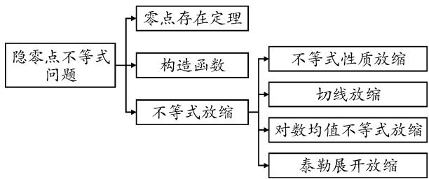
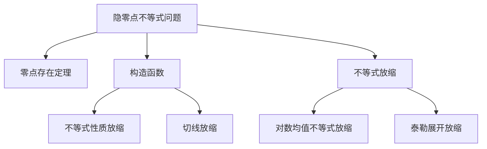
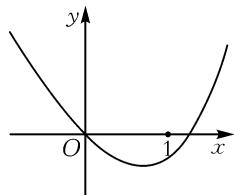
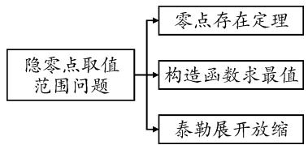
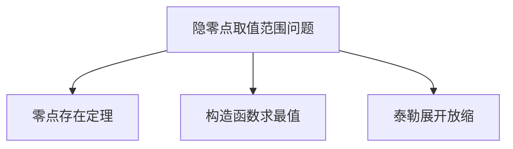
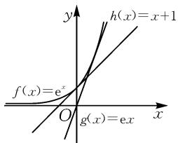

# 解决一类含参隐零点不等式问题的常用方法

——以一道高考压轴题解决策略为例

● 浙江省杭州第七中学 刘富裕  
● 浙江省音乐学院附属音乐学校 胡 晓

摘要: 在处理含参数的不等式、方程或函数问题时, 参数分离或半分离是常用方法. 本文中所涉及的高考压轴题的创新之处在于已知参数的范围, 证明含参不等式问题, 无法使用参数分离或半分离为些, 主要以构造函数(求最值)、换元法、放缩法等基本方法为工具, 探析2020年高考浙江卷压轴题第二小题含参隐零点不等式问题的解法. 对题目所考查的难点及核心素养进行再反思和归纳, 为师生寻找一个解决这类问题的突破口, 提供一个引导教学的方向标.

关键词: 含参不等式; 隐零点; 函数最值; 不等式放缩; 核心素养

2020年浙江省高考压轴题结构保持一贯简洁的风格，而试题形式的创新和内容的选取考查了学生的数学综合能力与数学核心素养.尤其第（Ⅱ）问两小题更加注重难度的区分，服务于高考的选拔性.最后一小题则对逻辑推理、数学建模、数学运算、直观想象等核心素养提出了更高的要求.整体布局合理，考查全面，为高校选拔人才和学生后续学习所需的应用知识储备与创新意识培养提供导向[1].

# 1 原题呈现

已知 $1 < a \leqslant 2$ ，函数 $f(x) = e^{x} - x - a$ ，其中 e = 2.71828……为自然对数的底数.

(Ⅰ)证明:函数 $y=f(x)$ 在 $(0,+\infty)$ 上有唯一零点;  
（Ⅱ）记 $x_{0}$ 为函数 $y=f(x)$ 在 $(0,+\infty)$ 上的零点，证明：

(i) $\sqrt{a - 1} \leqslant x_0 \leqslant \sqrt{2(a - 1)}$ ;

(ii) $x_0f(\mathrm{e}^{x_0})\geqslant (\mathrm{e} - 1)(a - 1)a.$

# 2 题目剖析

对于第(Ⅱ)(i)小题,根据函数单调性及零点存在定理,只需证明函数在两个端点处的值等于零,或结合单调性证明函数值异号.而对于第(ii)小题,前面(i)中已经证得 $x_{0}\geqslant\sqrt{a-1}$ ,因此有两个常见思考方向:①不等式两边可以先约去一部分,对不等式进行简化.②根据 $x_{0}$ 是函数 $f(x)$ 的零点,即有 $e^{x_{0}}=x_{0}+a$ ,利用该式消去超越函数部分,转化成我们熟悉的二次函数去研究.

因此总结这类问题的思考途径(如图1)，以此探究第(Ⅱ)问两小题的常见几种解法.

flowchart

图1

# 3 解法探析

# 3.1 第(i)小题解法探究

# 3.1.1 零点存在定理法

法一: 对 $f(x)$ 求导得 $f'(x) = \mathrm{e}^{x} - 1$ ，当 $x \in (0, +\infty)$ 时， $f'(x) > 0$ 恒成立，所以函数 $f(x)$ 零点 $x_{0}$ 唯一，问题转化为即证 $f(\sqrt{a-1}) \leqslant f(x_{0}) = 0 \leqslant f(\sqrt{2(a-1)})$ .

令 $\sqrt{a - 1} = t$ ，则 $a = t^2 + 1, t \in (0,1]$ . 由 $\mathrm{e}^{x_0} = x_0 + a$ ，得 $f(\sqrt{a - 1}) = \mathrm{e}^t - t - t^2 - 1 = g(t)$ . 下证： $t \in (0,1]$ 时， $g(t) \leqslant 0$ 恒成立，即证 $g(t)_{\max} \leqslant 0$ . 因此需要判断 $g(t)$ 的单调性，但 $g'(t) = \mathrm{e}^t - 1 - 2t$ 无法判断其符号，所以我们不妨对其进行二阶求导.

由 $g''(t)=\mathrm{e}^{t}-2=0$ , 得 $t=\ln 2$ .

易得 $g'(t)_{\min}=g'(\ln2)=1-2\ln2<0.$

另外可以发现， $t\in(0,\ln2)$ 时， $g'(t)$ 递减； $t\in(\ln2,1)$ 时， $g'(t)$ 递增； $g'(0)=0,g'(1)=e-3<0.$ 数形结合，如图2所示，可得 $g'(t)<0,t\in(0,1]$ .所以 $g(t)$ 在 $(0,1]$ 上单调递减，则$g(t)<g(0)=0$ , 即 $f(\sqrt{a-1})<0$ .

text_image

y
O
1
x

图2

同理，令 $\sqrt{2(a - 1)} = m$ 得 $a = \frac{m^2}{2} + 1, 0 < m \leqslant \sqrt{2}$ .

易得， $f(2\sqrt{a - 1}) = \mathrm{e}^{m} - m - \frac{m^2}{2} -1 = h(m).$

下证 $h(m)\geqslant 0,m\in (0,\sqrt{2} ].$

求导得 $h'(m) = \mathrm{e}^{m} - 1 - m > 0$ ，则 $h'(m)$ 在 $(0, \sqrt{2}]$ 上单调递增，所以 $h'(m) > h'(0) = 0$ .

因此 $h(m)$ 在 $m \in (0, \sqrt{2}]$ 单调递增，则 $h(m) > h(0) = 0$ ，即 $f(\sqrt{2(a - 1)}) > 0$ .

故 $\sqrt{a - 1} \leqslant x_0 \leqslant \sqrt{2(a - 1)}$ 得证.

评析:这种根据零点存在定理,通过求导求最值证明的方法多数学生是能想到的,这也是这类题目最常规的解题思路,但有一部分学生在二次求导判断符号时容易出现障碍.另外,由于课本对二阶导函数没作要求,因此部分学生不敢尝试用二阶导函数去研究问题.所以我们对此方法尝试优化,避开求二阶导数.

# 3.1.2 指数找“基友”法

法二:换元过程同上,对于证明 $g(t)=\mathrm{e}^{t}-t-t^{2}-1\leqslant0$ , 即证 $t^{2}+t+1\geqslant\mathrm{e}^{t}$ , 可两边同除以 $e^{t}$ , 变形为 $p(t)=\frac{t^{2}+t+1}{\mathrm{e}^{t}}\geqslant1$ , 则直接判断出 $p'(t)=\frac{\mathrm{e}^{t}\cdot t(1-t)}{(\mathrm{e}^{t})^{2}}=\frac{t(1-t)}{\mathrm{e}^{t}}\geqslant0$ 在 $t\in(0,1]$ 恒成立.

所以 $p(t)=\frac{t^{2}+t+1}{\mathrm{e}^{t}}(0,1]$ 上单调递增，故 $p(t)>p(0)=1$ 恒成立，得证.

同理，令 $h(m) = \mathrm{e}^{m} - m - \frac{m^2}{2} - 1 \geqslant 0$ ，则转化为证 $q(m) = \frac{m + \frac{m^2}{2} + 1}{\mathrm{e}^m} \leqslant 1.$

易得 $q^{\prime}(m) = -\frac{m^{2}}{2\mathrm{e}^{m}}\leqslant 0$ ，所以 $q(m)$ 单调递减，则 $q(m) <   q(0) = 1$ 恒成立，得证.

综上所述， $\sqrt{a-1}\leqslant x_{0}\leqslant\sqrt{2(a-1)}$ .

评析: 不等式两边同除以 $e^{t}$ 新构造的函数求导后的计算更为简洁, 解题过程也容易理解. 但是怎么构造一个容易求导的函数, 对于学生来讲是一个难点. 其实上述两种方法都涉及了构造新函数, 然后去研究其性质, 找到我们想要的结果. 既然是构造新的函数, 那能否最初就看成关于零点 $x_{0}$ 的函数, 直接转化为恒成立问题来证明呢? 我们不妨简单尝试下.

# 3.1.3 直接构造函数法

法三：要证 $x_0 \leqslant \sqrt{2(a - 1)} (x_0 > 0)$ ，只需证 $x_0^2 \leqslant$ $2(a - 1)$ ，即证 $x_0^2 \leqslant 2(\mathrm{e}^{x_0} - x_0 - 1)$

令 $h(x_0) = 2\mathrm{e}^{x_0} - 2x_0 - x_0^2 -2,x_0\in (0, + \infty)$ ，即证 $h(x_0)\geqslant 0$

易得 $h'(x_{0})=2\mathrm{e}^{x_{0}}-2x_{0}-2=2(\mathrm{e}^{x_{0}}-x_{0}-1)>0.$

所以 $h(x_{0})$ 在 $(0,+\infty)$ 上单调递增，则 $h(x_{0})>h(0)=0$ .

故 $x_0^2 \leqslant 2(\mathrm{e}^{x_0} - x_0 - 1)$ 得证，而且得到 $x_0 \leqslant \sqrt{2(a - 1)} \leqslant \sqrt{2}$ .

下证 $x_0^2 \geqslant a - 1$ .

只需证 $x_0^2 \geqslant \mathrm{e}^{x_0} - x_0 - 1$ . 令 $g(x_0) = x_0^2 - \mathrm{e}^{x_0} + x_0 + 1, x_0 \in (0, \sqrt{2})$ ，即证 $g_{\min}(x_0) \geqslant 0$ .

求导得 $g'(x_{0})=2x_{0}-\mathrm{e}^{x_{0}}+1$ ，令 $g''(x_{0})=2-\mathrm{e}^{x_{0}}=0$ ，得 $x_{0}=\ln2$ .

所以 $g'(x_{0})$ 在 $(0, \ln 2)$ 在单调递增，在 $(\ln 2, \sqrt{2})$ 上单调递减，且 $g'(0) = 0, g'(\sqrt{2}) = 2\sqrt{2} - e^{\sqrt{2}} + 1 < 0.$ 所以 $g'(x_{0})$ 的值先正后负，则 $g(x_{0})$ 先增后减。所以 $g_{\min}(x_{0}) = \min\left\{g(0), g(\sqrt{2})\right\}$ .

又 $g(0) = 0, g(\sqrt{2}) = 2 - \mathrm{e}^{\sqrt{2}} + \sqrt{2} + 1 > 0$ ，所以 $g(x_0) \geqslant 0$ 恒成立.

故 $x_0^2 \geqslant \mathrm{e}^{x_0} - x_0 - 1$ 得证.

综上所述， $\sqrt{a-1}\leqslant x_{0}\leqslant\sqrt{2(a-1)}$ .

评析: 直接构造函数, 转化成不等式恒成立问题, 然后求导求最值, 思维顺畅, 也是学生很容易想到的, 不可避免的是上述方法都有一定的运算量. 于是, 我们尝试寻找一种新方法, 以避开复杂的运算, 考虑将指数函数转化, 简化该题. 通过高等数学中的泰勒展开式 $e^{x} \geqslant 1 + x + \frac{1}{2} x^{2}$ 放缩, 能把指数函数的部分消去, 转化成我们最熟悉的多项式函数, 这样再去研究就更简单了.

# 3.1.4 泰勒展开放缩法

法四:由于 $x \in (0, +\infty)$ 时， $e^{x} \geqslant 1 + x + \frac{1}{2} x^{2}$ 且 $e^{x_{0}}-x_{0}-a=0$ ，因此 $x_{0}+a \geqslant 1+x_{0}+\frac{1}{2}x_{0}^{2}$ ，可得 $a \geqslant 1+\frac{1}{2}x_{0}^{2}$ ，即 $x_{0} \leqslant \sqrt{2(a-1)}$ 。左边的证明同上。

评析:对于泰勒展开,高中阶段不作要求,只有部分参加数学竞赛的学生对此有过研究,但在高考解题中完全可以放心使用.只要能熟练掌握泰勒展开式,绝大部分的不等式证明就可得心应手.

简单梳理本题解题思路,得到如图 3 所示的思维导图.

flowchart

图3

# 3.2 第(ii)小题解法探究

# 3.2.1 零点代换,构造函数法

法一: 因为 $x_{0}f(\mathrm{e}^{x_{0}})=(\mathrm{e}^{a}-1)x_{0}^{2}+a(\mathrm{e}^{a}-2)x_{0}$ 且 $1<a\leqslant2$ ，所以 $e^{a}-1>0, a(e^{a}-2)>0.$

又 $x_0 \geqslant \sqrt{a - 1}$ , 则 $x_0 f(\mathrm{e}^{x_0}) \geqslant (a - 1)(\mathrm{e}^a - 1) + a(\mathrm{e}^a - 2)\sqrt{a - 1}$ .

由于 $a - 1 \in (0,1]$ ，则 $\sqrt{a - 1} \in (0,1]$ ，因此 $\sqrt{a - 1} \geqslant a - 1$ ，这里可以采用一次放缩。

所以， $x_0f(\mathrm{e}^{x_0})\geqslant (a - 1)(\mathrm{e}^a -1) + a(\mathrm{e}^a -2)(a - 1).$

于是，即证 $\mathrm{e}^a - 1 + a(\mathrm{e}^a - 2) \geqslant (\mathrm{e} - 1)a$ ，即证 $(a + 1)\mathrm{e}^a - (\mathrm{e} + 1)a - 1 \geqslant 0$ .

令函数 $F(a)=(a+1)\mathrm{e}^{a}-(\mathrm{e}+1)a-1.$

求导, 得 $F'(a) = \mathrm{e}^{a} + (a + 1)\mathrm{e}^{a} - (\mathrm{e} + 1) > 3\mathrm{e}^{a} - (\mathrm{e} + 1) > 2\mathrm{e} - 1 > 0$ , 所以 $F(a)$ 在 $(1, 2]$ 上单调递增, 故 $F(a) > F(1) = 2\mathrm{e} - \mathrm{e} - 2 = \mathrm{e} - 2 > 0$ .

所以 $x_0f(\mathrm{e}^{x_0})\geqslant (\mathrm{e} - 1)(a - 1)a$ 得证.

评析:本题主要考查的就是零点问题,所以零点代换的方法是很容易想到的,但本题不仅仅需要零点代换,还需要对不等式进行放缩,而后构造新的函数,把不等式恒成立的证明转化为求函数值域问题.而对于上述零点的放缩,还可以进一步优化.本题不等式证明的难点,主要是函数 $f(x)$ 中 $e^{x}$ 产生的,因此对其采用 $e^{x} \geqslant ex$ 切线放缩来处理,超越函数的部分就大大简化了运算 $^{[2]}$ .

# 3.2.2 零点代换, $e^{x}\geqslant ex$ 切线放缩

法二：因为 $\mathrm{e}^{x_0} - x_0 = a$ ，所以可得 $x_0f(\mathrm{e}^{x_0}) = x_0f(x_0 + a)$

又 $f(x_0 + a) = \mathrm{e}^{x_0 + a} - x_0 - 2a = \mathrm{e}^a (x_0 + a) - x_0 - 2a$ ，所以 $x_0f(\mathrm{e}^{x_0}) = (\mathrm{e}^a -1)x_0^2 +(\mathrm{e}^a -2)ax_0.$

由 a > 1，可得 $e^{a} - 2 > e - 2 > 0$ ，所以 $a(e^{a} - 2) \cdot x_{0} > 0$ .

又由已证 $x_0 \geqslant \sqrt{a - 1}$ , 可得 $x_0^2 \geqslant a - 1$ , 所以 $x_0 f(\mathrm{e}^{x_0}) = (\mathrm{e}^a - 1)x_0^2 + a(\mathrm{e}^a - 2)x_0 \geqslant (\mathrm{e}^a - 1)x_0^2 \geqslant (\mathrm{e}^a - 1)(a - 1)$ .

又 $e^{x} \geqslant ex$ (求导易证 y = ex 为 $e^{x}$ 在 x = 1 处的切线方程)，且 a > 1，则 $(\mathrm{e}^{a} - 1)(a - 1) > (\mathrm{e}a - 1)(a - 1) > (\mathrm{e}a - a)(a - 1) = (\mathrm{e} - 1)(a - 1)a$ .

所以 $x_0f(\mathrm{e}^{x_0})\geqslant (\mathrm{e} - 1)(a - 1)a$ 得证.

评析:这里由于 $x_{0}f(\mathrm{e}^{x_{0}})$ 为 x 的二次函数, 其一次项系数 $a(\mathrm{e}^{a}-2)x_{0}>0$ , 所以放缩直接把其舍去. 这样要证明的不等式的放缩就很简洁, 也是我们最熟悉的只有二次项的一元二次不等式, 然后再利用 $e^{x}$ $\geqslant ex$ 切线放缩进行处理.这种切线放缩对于学生来说也是一个难点,其实,常见的 $e^{x}\geqslant x+1$ 也属于切线放缩,对于本题也适用(如图4).另外如第(i)题中,我们也可以利用泰勒展开放缩,消去 $e^{x}$ 部分.

text_image

f(x)=e^x
g(x)=ex
h(x)=x+1
O
x
y

图 4

# 3.2.3 泰勒展开, $e^{x}\geqslant1+x+\frac{1}{2}x^{2}$ 放缩

法三:首先,要证 $x_{0}f(\mathrm{e}^{x_{0}})\geqslant(\mathrm{e}-1)(a-1)a$ , 只需证 $x_{0}f(x_{0}+a)\geqslant(\mathrm{e}-1)(a-1)a$ .

由于 $\left[xf(x+a)\right]'=f(x+a)+xf'(x+a)>f(x+a)$ ，又 $x+a>a$ ，则 $f(x+a)>f(a)=\mathrm{e}^{a}-2a\geqslant1-a+\frac{a^{2}}{2}>0$ ，所以 $\left[xf(x+a)\right]'>0.$

所以函数 $y = xf(x + a)$ 是单调函数，因此 $x_0 \cdot f(x_0 + a) \geqslant \sqrt{a - 1} f(\sqrt{a - 1} + a)$ .

要证 $x_0f(\mathrm{e}^{x_0}) = x_0f(x_0 + a)\geqslant (\mathrm{e} - 1)(a - 1)a$ 只需证 $\sqrt{a - 1} f(\sqrt{a - 1} +a)\geqslant (\mathrm{e} - 1)(a - 1)a.$

即证 $f(\sqrt{a - 1} + a) \geqslant (\mathrm{e} - 1)a\sqrt{a - 1}$ .

即证 $\mathrm{e}^{\sqrt{a - 1} + a} - \sqrt{a - 1} -2a\geqslant (\mathrm{e} - 1)a\sqrt{a - 1}.$

由于 $\mathrm{e}^x\geqslant 1 + x + \frac{1}{2} x^2$ ，则只需证

$$
1 + \frac {1}{2} (\sqrt {a - 1} + a) ^ {2} - a \geqslant (\mathrm{e} - 1) a \sqrt {a - 1}.
$$

即证 $a^2 - (\sqrt{a - 1})^2 - 2(\mathrm{e} - 2)a\sqrt{a - 1} \geqslant 0$ ，只需证 $\frac{a}{\sqrt{a - 1}} - \frac{\sqrt{a - 1}}{a} \geqslant 2(\mathrm{e} - 2)$ .

由于 $\frac{a}{\sqrt{a - 1}} = \frac{1}{\sqrt{a - 1}} +\sqrt{a - 1}\in [2, + \infty)$ ，则 $\frac{a}{\sqrt{a - 1}} -\frac{\sqrt{a - 1}}{a}\geqslant 2 - \frac{1}{2} = \frac{3}{2}\geqslant 2(\mathrm{e} - 2).$

得证.

评析:正如第(i)小题中讲到的,对于泰勒展开,高中生仅有为数不多的人能熟练的应用,但只要敢大胆地运用,绝大多数不等式的放缩都可以解决.不等式放缩在浙江高考中从不缺席,而对数均值不等式在解决2019年高考压轴题中起到了重要作用,因此2020年站在此角度也尝试用来解决该题.

# 3.2.4 对数均值不等式放缩法

引理 若 $b > a > 0$ ，则 $\sqrt{ab} < \frac{b - a}{\ln b - \ln a} < \frac{a + b}{2}$

(对数均值不等式).

法四：令 $t = \mathrm{e}^{x} > 1$ ，则 $x_0 = \ln t, a = \mathrm{e}^{x_0} - x_0 = t - \ln t, f(\mathrm{e}^{x_0}) = f(t) = \mathrm{e}^t - 2t + \ln t.$

要证明 $x_0f(\mathrm{e}^{x_0})\geqslant (\mathrm{e} - 1)(a - 1)a$ ，只需证明 $\ln t(\mathrm{e}^t -2t + \ln t)\geqslant (\mathrm{e} - 1)(t - \ln t)(t - \ln t - 1).$

即证 $\frac{\mathrm{e}^t - t}{t - \ln t} - 1 \geqslant (\mathrm{e} - 1) \left( \frac{t - 1}{\ln t} - 1 \right)$ .

由对数均值不等式, 可以得到 $\frac{e^{t}-t}{t-\ln t} > \sqrt{te^{t}}$ , $\frac{t-1}{\ln t} < \frac{t+1}{2}$ .

因此，只需证 $\sqrt{te^{t}}-1>\frac{e-1}{2}(t-1)$ .

令 $F(t)=\sqrt{te^{t}}-\frac{e-1}{2}(t-1)-1$ ，则

$$
F ^ {\prime} (t) = \frac {(t + 1) \mathrm{e} ^ {t}}{2 \sqrt {t \mathrm{e} ^ {t}}} - \frac {\mathrm{e} - 1}{2} > \frac {\sqrt {t \mathrm{e} ^ {t}} - (\mathrm{e} - 1)}{2} > 0.
$$

所以 $F(t)$ 在 $(1, +\infty)$ 上单调递增.

故 $F(t) > F(1) = \sqrt{e} - 1 > 0$ , 证毕.

评析:对数均值不等式的放缩,其实就是考查函数的凸凹性.其作为高等数学的重要性质之一,虽然在高中教材中没有具体要求,但该性质是对高中教材中基本函数图象的研究,是今后高等数学研究的一个重要方向,从而成为历年高考命题的热门素材.

# 4 反思总结

虽然本题是一道老高考题,但却是非常经典的含参不等式证明创新题,值得我们细细品味、慢慢研究.它既考查了不等式、方程、函数三者之间的联系,又对学生构造函数、利用导数工具解决函数问题的能力提出了更高的要求,还能考查学生的数学运算、逻辑推理、数学抽象等核心素养.

本题聚焦学科主干内容,凸显对数学关键能力和学科素养的考查,在解题过程中也给了我们很多启示,引导我们在高考评价体系下重新审视数学题的价值.在平时的高中数学教学过程中,要重视基础知识的全面覆盖,加大对学生的“通解通法”的教学指导,不可过多地强调“巧妙方法”,同时要真正重视对学生数学逻辑思维能力的逐步培养.

# 参考文献：

[1] 洪昌强. 立足能力考查 彰显函数思想 蕴含特色文化——北京、浙江近 3 年数学高考压轴题(理)比较分析 [J]. 中学教研(数学), 2018(6): 44-47.

[2]杨西龙.例析“放缩法”证明不等式的解题策略[J].福建中学数学,2018(3):43-45.Z

# (上接第71页)

# 3备考建议

# 3.1 培养深度思维, 提高解题能力

提升学生的深度思维水平,需对概念进行理解和内化,核心是透彻理解概率和统计的基本概念,如概率、概率分布、期望和方差.运用实际例子与应用情形,引导学生将这些概念内化为自身素养,让学生可以灵活运用.依靠问题链或步骤逻辑推导,引导学生逐渐明白每个解题步骤背后的逻辑与原因.培养学生从多角度分析问题,领悟问题的多阶梯架构,进而提升他们的深度思维素养 $^{[1]}$ .举例而言,可通过多次修改实验条件、调整核心假设,精准观察二者对结果的影响规律.在具体教学过程中,引导学生解题期间独立思考,切实剖析复杂难题,并把它划分成更小的问题.在处理多步骤概率和统计问题时,这种技能起着尤为关键的作用.解题不能盲目套用公式以及解题步骤,应该培养学生的创新思考意识,增强其解决问题时的灵活适配能力.

# 3.2 创设多种概率与统计情境,增强学生的探究能力

# (1)设计多样化的实际问题情境

真实问题情境能激起学生的学习兴趣和探究热情.例如：

①社会现象综合分析:参照社会热点,如疫情相关数据分析、人口普查结果数据、交通流量信息统计等,制定相关问题,指导学生依据概率与统计知识分析解答.

②经济及金融相关场景:如股票市场分析、保险费率的测算、商业利润的预测等,促使学生领会概率与统计在实际经济生活中的应用,增强处理实际问题的本领.

# (2) 进行多元数据分析

教师可引入多种类型的数据集,教导学生进行数据分析并说明结果.结合教学实践,可以从以下三个方面推进.①多维数据汇总集:引入存有多维数据的数据集,如学生的考试成绩、运动统计数据、健康状况数据等,引领学生做多维数据分析,理解不同变量间的关联.②各类图表解读:采用各类样式的图表,指导学生针对数据做可视化分析,理解数据背后潜藏的信息.③开展假设检验:辅导学生进行假设检验,提高学生的推理及分析水平.

# 参考文献：

[1]罗毅,李勇.高考数学“概率与统计”试题的特点及其教学启示[J].中学数学,2024(9):55-57.Z