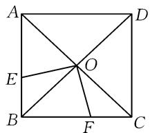

# 运用辩证思维策略 提升数学解题能力

# 江苏省张家港高级中学 苗学雷

摘要: 辩证思维是运用运动的和联系的观点和方法来思考, 用辩证法揭示事物的本质. 在解题教学中, 运用辩证思维思考, 不仅能帮助学生更快地触及问题的本质, 而且能够找到更优、更可持续的解决方案. 本文中从具体实例入手, 以常用的辩证法思想为背景, 阐述其在提升解题能力、优化解题路径及落实数学核心素养等方面的应用.

关键词: 辩证思维; 提升解题能力; 优化解题路径

学习数学离不开解题,而数学题目千变万化,解题方法也多种多样,如何优化解题教学,提升解题效率是一个值得深入研究的话题.在解题教学中,笔者尝试引导学生运用辩证法的观点去审视问题,正确揭示其中的辩证关系,让学生认清问题的本质,提高解题效率.

# 1 特殊与一般

有些特殊问题的解决,需要我们通过一般性规律的研究来处理;而对于具有一般性的问题,我们也常通过考察其特殊情况揭示一般规律.可见,特殊与一般既相互区别又相互联系,二者是对立统一的关系.作为一种辩证的数学解题思想,通过特殊化能使我们认识问题更加全面,通过一般化可以让我们认识问题更加深刻,合理运用特殊与一般的思想方法,有利于提高解题速度和解题能力.

例 1 求证: $\sin 70^{\circ} + \sin 10^{\circ} > \sin 100^{\circ} > \sin 70^{\circ} - \sin 10^{\circ}$ .

分析: 若按照一般解法去分析, 需要分别证明 $\sin 70^{\circ} + \sin 10^{\circ} > \sin 100^{\circ}$ 和 $\sin 100^{\circ} > \sin 70^{\circ} - \sin 10^{\circ}$ . 不过经过观察发现, 该题中所涉及的三个角的和刚好是 $180^{\circ}$ , 于是联想将其放在三角形中研究, 进而将问题转化为证明 $\sin A + \sin B > \sin C > \sin A - \sin B$ . 在三角形中, 常用的不等关系为“两边之和大于第三边, 两边之差小于第三边”, 而运用“定弦定理”可以实现边角之间的转化. 由正弦定理得 $\frac{a}{\sin A} = \frac{b}{\sin B} = \frac{c}{\sin C} = k$ , 由三角形三边关系得 $a + b > c > a - b$ , 于是可得 $k \sin A + k \sin B > k \sin C > k \sin A - k \sin B$ , 即 $\sin A + \sin B > \sin C > \sin A - \sin B$ . 特殊地, 将 $A = 70^{\circ}, B = 10^{\circ}, C = 100^{\circ}$ 代入不等式, 即可证明结论.

例 2 已知函数 $y=a\sin2x+\cos2x$ 的图象的一条对称轴是 $x=\frac{\pi}{8}$ ，则 a= \_\_\_\_.

分析:结合已有知识经验可知,正弦函数、余弦函数的图象具有轴对称性和中心对称性,且函数图象的对称轴通过最高点或最低点.因为函数 $y=a\sin2x+\cos2x$ 的对称轴为 $x=\frac{\pi}{8}$ ,所以 $f(0)=f\left(\frac{\pi}{4}\right)$ ,即 $a\sin0+\cos0=a\sin\frac{\pi}{2}+\cos\frac{\pi}{2}$ ,解得a=1.

从以上解题过程来看,有时会从特殊到一般进行推理,有时会从一般到特殊进行推理,灵活运用特殊与一般这对思想方法,能有效突破思维瓶颈,找到解题路径,提升解题效率 $^{[1]}$ .

# 2 整体与部分

整体由部分构成,部分离不开整体,部分的变化会影响整体,整体的状态也会制约部分,二者既相互区别,又相互联系.整体与部分的辩证思想贯穿高中数学各个领域,是理解和解决数学问题的重要哲学武器和思维工具,它强调从整体把握研究对象的同时,关注部分与部分、部分与整体之间的联系与制约,从而更深刻地认识问题和解决问题.

例 3 已知 $\sin \alpha + \cos \alpha = \frac{1}{5}$ ，若 $\alpha$ 是第二象限的角，求 $\sin \alpha - \cos \alpha$ 的值.

分析: 若想求 $\sin\alpha-\cos\alpha$ 的值, 只要求出 $\sin\alpha$ 和 $\cos\alpha$ , 问题即可迎刃而解. 结合已有知识可知 $\sin^{2}\alpha+\cos^{2}\alpha=1$ , 又 $\sin\alpha+\cos\alpha=\frac{1}{5}$ , 若二者联立, 即可求出 $\sin\alpha$ 和 $\cos\alpha$ 的值. 运用方程思想求得 $\cos\alpha=-\frac{3}{5}$ 或 $\cos\alpha=\frac{4}{5}$ , 又 $\alpha$ 是第二象限角, 所以 $\cos\alpha=-\frac{3}{5}$ , 则 $\sin\alpha=\frac{4}{5}$ , 于是 $\sin\alpha-\cos\alpha=\frac{7}{5}$ .

以上解法其实就是从部分到整体,也是学生最易于想到的.当然,该题的解法并不唯一,也可以从整体

出发，比如将 $\sin \alpha + \cos \alpha = \frac{1}{5}$ 两边平方，化简得到 $\sin \alpha \cos \alpha = -\frac{12}{25}$ . 因为 $\alpha$ 是第二象限角，所以 $\sin \alpha > 0, \cos \alpha < 0$ ，于是 $\sin \alpha - \cos \alpha = \sqrt{(\sin \alpha - \cos \alpha)^2} = \sqrt{1 - 2\sin \alpha \cos \alpha} = \frac{7}{5}$ .

可见,整体方法更简洁,而部分方法更基础,更易于学生理解和接受.在日常解题教学中,教师应重视引导学生从不同角度审视问题,以此加深对基础知识的理解,提高学生解题技能,培养学生发散思维,提升教学有效性.

# 3 运动与静止

运动是绝对的,意味着一切事物都在不断地变化和发展,没有不运动的物质.静止是相对的,指的是在一定条件下,事物的空间位置或状态可以保持不变,但这是暂时的、有条件的.运动的绝对性和静止的相对性是对立统一的关系,它们相互依存、相互渗透,动中有静,静中有动.数学中“运动”是变换过程,“静止”是不变规律.在研究问题时,既可以用运动的观点处理静止问题,也可以用相对静止的观点处理运动问题,在变化中把握不变,这正是辩证法的核心.

例 4 已知 $\triangle ABC$ 中, BC = 2, $AB = \sqrt{2} AC$ , 求 $S_{\triangle ABC}$ 的最大值.

分析: BC=2 是确定的, 若想求 $\triangle ABC$ 面积的最大值, 实际上就是求 BC 边上高 h 的最大值. 若想解决这个问题可以分为如下两种情形. 其一, 若能确定点 A 的位置, 这样就可求出 BC 边上高 h 的最大值; 其二, 若不能确定点 A 的位置, 分析点 A 的轨迹, 看看是否能够确定高 h 的最大值. 显然, 根据已知条件不能确定点 A 的位置, 于是尝试求出点 A 的运动轨迹, 故解题时可以尝试运用解析法来研究. 以直线 BC 为 x 轴, 以 BC 边的中垂线为 y 轴建立平面直角坐标系, 则点 B 和点 C 的坐标分别为 $(-1,0)$ , $(1,0)$ . 设点 A 的坐标为 $(x,y)$ , 根据 $AB=\sqrt{2}AC$ 得 $\sqrt{(x+1)^{2}+y^{2}}=\sqrt{2}\sqrt{(x-1)^{2}+y^{2}}$ , 化简得 $(x-3)^{2}+y^{2}=8$ , 且 $y\neq0$ , 由此可知, 点 A 的轨迹是一个去掉与 x 轴交点的圆. 根据点 A 的轨迹方程可知, 当 x=3 时, h 最大, 所以 $\triangle ABC$ 面积的最大值为 $\frac{1}{2}\times2\times2\sqrt{2}=2\sqrt{2}$ .

从以上解题过程不难看出,其解法是让静的问题动起来,在运动中寻找不变的因素,从而认清问题的本质特征,顺利找到解决问题的突破口.在求解运动型问题时,若能抓住这些不变的性质或不变量作为解题的突破口,视动态为静态进行分析,往往可以得到意向不到的效果.

例 5 如图 1, 已知正方形 ABCD 的边长是 1, O 是对角线的交点, 过点 O 作 $OE \perp OF$ , 分别交 AB, AC 于 E, F. 求四边形 OEBF 的面积.

text_image

A
D
E
O
B
F
C

图1

分析:在研究该问题时,大多数学生选择证明 $\triangle BOE\cong\triangle COF,\triangle AOE\cong\triangle BOF$ ,于是将求四边形OEBF的面积转化为求 $\triangle BOE$ 和 $\triangle AOE$ 的面积之和.显然证明全等需要较多的时间和精力,其实在解题时,不妨让 $\angle EOF$ 动起来,将其转到 $\angle BOC$ 的位置上,由此不难发现,所求面积其实就是 $\triangle BOC$ 的面积,由此,问题即可迎刃而解.

可见,虽然静态下也能解决问题,但是其过程可能过于繁琐,如果变静为动,即通过运动的特殊状态来研究一般的情形,可以达到避繁就简的效果,有利于提升解题效率.

动静转换策略在数学解题中的应用比较广泛,对研究多个动点问题有特效.在日常教学中,教师应重视动态与静止这一辩证思想方法的渗透,这样不仅能提高学生解决问题的能力,而且能促进学生养成自觉联想、自觉调整思维方向的思考习惯,提升数学素养 $^{[2]}$ .

# 4 共性与个性

共性是一类事物共同具有的特点,而个性是同一类事物中不同个体所具有的独特特点,共性与个性是对立统一关系.在求解有些选项或填空题时往往可以小题小做,利用特殊点或数形结合等特殊方法,避免小题大做,提高解题效率.

例 6 若过点 $(a,b)$ 可作曲线 $y=e^{x}$ 的两条切线，则().

$$
\mathrm{A.e} ^ {b} <   a \quad \mathrm{B.e} ^ {b} <   b \quad \mathrm{C.0} <   a <   \mathrm{e} ^ {b} \quad \mathrm{D.0} <   b <   \mathrm{e} ^ {a}
$$

分析:本题利用数形结合法,在 x 轴上方,在 y 轴右侧,在曲线的下方任取一点都可以做两条切线.易得答案为选项 D.

总之，在高中数学解题教学中，教师应重视引导学生用辩证的眼光去分析问题，学会用辩证的思维解决数学问题，勇于打破传统解题教学的限制，有效提高学生的解题效率和解题能力，促进学生数学能力与数学素养的全面发展.

# 参考文献：

[1]林庆勇.基于辩证思维的高中数学例题讲解策略[J].名师在线,2019(30):5-6.

[2]侯飞建.辩证思想在高考数学命题中的渗透[J].数学之友,2022(17):89-91.Z