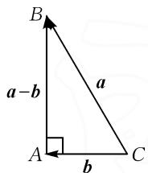
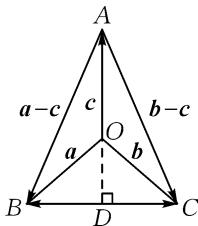
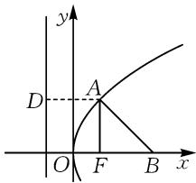
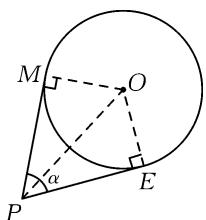
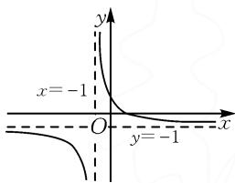
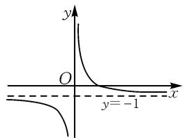
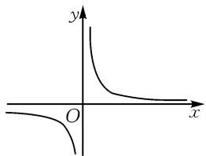

# 高考数学选择题中简单自然解法的探析\*

# - 太原师范学院 黄忠侠 韩龙淑 刘芳

摘要: 结合近年来高考真题分析了特殊值法和数形结合法在选择题中的运用, 旨在探析高考数学选择题中简单自然的解法, 并据此提出借助题型特征探寻解决问题的简单方法和建立知识间的联系追求解题思路的自然生成等教学启示.

关键词: 特殊值法; 数形结合法; 高考数学选择题; 简单自然解法

# 1 引言

选择题是高考数学试卷中的重要题型之一,由题干和选项两部分组成且无需书写运算、推理等解答过程,故在解题时要找准“切入点”,切忌小题大做,尽量找到简单自然的解法,如特殊值法和数形结合法,从而突出“选”而非“做”,以便灵活、巧妙、快速和准确地解决选择题 $^{[1]}$ .

# 2 高考数学选择题中简单自然解法的探析

# 2.1 特殊值法在高考数学选择题中的运用

特殊值法是指题干比较复杂,采用通性通法得出答案有困难,但是题目或者选项容易找到符合要求的特例,通过选择符合要求的特殊函数、特殊数值或者特殊图形等代入题干或结论中 $^{[2]}$ ,排除发生矛盾的选项,从而确定正确选项的方法.采用此方法有利于降低题目复杂度、减少运算量,从而更快速准确地完成选择题的解答.

# 2.1.1 特殊值法在向量问题中的运用

例 1 （2019 年全国新课标 I 卷理科第 7 题）已知非零向量 a, b 满足 $\left|a\right|=2\left|b\right|$ ，且 $(a-b)\perp b$ ，则 a 与 b 的夹角为（）.

A. $\frac{\pi}{6}$

B. $\frac{\pi}{3}$

C. $\frac{2\pi}{3}$

思路分析:结合向量的数量积和向量夹角大小可运算出正确结果,但是运算量较大.由向量a,b是非零向量,得向量a,b的模大于0.又因为出现了2倍关系和垂直,故以向量a为斜边,向量b为短直角边,构造如图1所示的直角三角形求解,有利于减小运算量.

D. $\frac{5\pi}{6}$

text_image

B
a-b
a
A
b
C

图1

解析: 如图 1, Rt△ABC 中, ∠BAC = 90°, 满足

$(a - b) \perp b$ . 又因为 $\angle ABC = 30^{\circ}$ , 满足 $|a| = 2|b|$ , 所以 $\angle BCA = 180^{\circ} - \angle BAC - \angle ABC = 180^{\circ} - 90^{\circ} - 30^{\circ} = 60^{\circ}$ , 即向量 $a$ 与向量 $b$ 的夹角为 $\frac{\pi}{3}$ . 故选: B.

例 2 （2023 全国甲卷理科第 4 题）向量 $\left|a\right|=\left|b\right|=1,\left|c\right|=\sqrt{2}$ 且 $a+b+c=0$ ，则 $\cos\langle a-c,b-c\rangle=$ （）.

A. $-\frac{1}{5}$

B. $-\frac{2}{5}$

C. $\frac{2}{5}$

D. $\frac{4}{5}$

思路分析:由 $a+b+c=0$ 得 $(a+b)+c=0$ ，说明 $a+b$ 与 c 互为相反向量。又因为 $|a|=|b|=1$ ， $|c|=\sqrt{2}$ ， $c=-(a+b)$ ，将 $c=-(a+b)$ 两边平方得 $|c|^{2}=|a|^{2}+|b|^{2}+2a\cdot b$ ，即 $2=1+1+2a\cdot b$ ，得 $a\cdot b=0$ ，即 $a\perp b$ ，所以可构造等腰三角形，如图 2。利用等腰三角形的直观性，将抽象问题形象化，有利于降低解题难度。

解析: 构造如图 2 所示的等腰三角形, 延长 AO 交 BC 于 D, 易知 $AD \perp BC$ , 要求 $\cos\langle a - c, b - c\rangle$ , 即求 $\cos\angle BAC$ . 在 Rt△OBC 中, 因为 $BC = \sqrt{OB^{2} + OC^{2}} = \sqrt{2}$ , 所以 $DC = \frac{1}{2} BC = \frac{\sqrt{2}}{2}$ . 在 Rt△ODC 中,

text_image

A
a-c     c     b-c
O
a       b
B     D     C

图2

因为 $OD = \sqrt{OC^{2} - DC^{2}} = \sqrt{1^{2} - \left(\frac{\sqrt{2}}{2}\right)^{2}} = \frac{\sqrt{2}}{2}$ ，所以
AD=AO+OD= $\sqrt{2}+\frac{\sqrt{2}}{2}=\frac{3\sqrt{2}}{2}$ . 在 Rt△ADC 中，因为 AC= $\sqrt{AD^{2}+DC^{2}}=\sqrt{\left(\frac{3\sqrt{2}}{2}\right)^{2}+\left(\frac{\sqrt{2}}{2}\right)^{2}}=\sqrt{5}$ ，所以 $\cos\angle DAC=\frac{AD}{AC}=\frac{\frac{3\sqrt{2}}{2}}{\sqrt{5}}=\frac{3\sqrt{10}}{10}$ . 于是可得

$\cos \angle BAC = \cos 2\angle DAC = 2\cos^2\angle DAC - 1 = 2\times$ $\left(\frac{3\sqrt{10}}{10}\right)^2 -1 = \frac{4}{5}.$ 故选：D.

# 2.1.2 特殊值法在函数问题中的运用

例 3 （2014 年全国新课标 I 卷理科第 3 题）设函数 $f(x)$ ， $g(x)$ 的定义域都为 R，且 $f(x)$ 是奇函数， $g(x)$ 是偶函数，则下列结论正确的是（）.

A. $f(x)\cdot g(x)$ 是偶函数  
B. $|f(x)|\cdot g(x)$ 是奇函数  
C. $f(x)\cdot\left|g(x)\right|$ 是奇函数  
D. $|f(x)\cdot g(x)|$ 是奇函数

思路分析: 此题考查了判断函数奇偶性的方法, 用函数奇偶性的定义是解题的一般思路, 但是此思路运算较繁琐. 考虑到 $f(x)=x^{3}$ 和 $g(x)=x^{2}$ 恰好满足定义域为 R 且 $f(x)$ 是奇函数、 $g(x)$ 是偶函数两个条件, 因此可以通过特殊值法来判断选项的正误. 又因为 $f(x)=x^{3}$ 和 $g(x)=x^{2}$ 是常见的基本初等函数且它们之间的运算较简单, 故采用此法有利于减小运算量.

解析: 令 $f(x)=x^{3}$ , $g(x)=x^{2}$ . 对于选项 A, 可得 $f(x)\cdot g(x)=x^{3}\cdot x^{2}=x^{5}$ 为奇函数, 矛盾, 排除选项 A; 对于选项 B, 因为 $|f(x)|\cdot g(x)=|x^{3}|\cdot x^{2}=|x^{5}|$ 为偶函数, 矛盾, 排除选项 B; 对于选项 C, 因为 $f(x)\cdot|g(x)|=x^{3}\cdot|x^{2}|=x^{5}$ 为奇函数, 与选项 C 相符; 对于选项 D, 因为 $|f(x)\cdot g(x)|=|x^{3}\cdot x^{2}|=|x^{5}|$ 为偶函数, 矛盾, 排除选项 D, 故选: C.

例 4 （2017 年全国新课标Ⅰ卷理科第 5 题）函数 $f(x)$ 在 $(-∞, +∞)$ 上单调递减且为奇函数。若 $f(1) = -1$ ，则满足 $-1 \leqslant f(x - 2) \leqslant 1$ 的 x 的取值范围是（）。

A. $[-2, 2]$ B. $[-1, 1]$ C. $[0, 4]$ D. $[1, 3]$

思路分析: $f(x)$ 为抽象函数, 可利用函数的性质求解, 但是对思维层次要求较高, 不易想到. 考虑到 $f(x) = -x$ 恰好满足在 $(-∞, +∞)$ 上单调递减、 $f(1) = -1$ 且为奇函数这三个条件, 所以此题可化一般为特殊, 使原问题变得具体、简单, 更易求解.

解析: 令 $f(x) = -x$ ，则 $f(x-2) = -(x-2) = -x+2$ 。要求满足 $-1 \leqslant f(x-2) \leqslant 1$ 的 x 的取值范围实际上就是求一元一次不等式 $-1 \leqslant -x + 2 \leqslant 1$ 的解集，通过解此不等式得 $\{x \mid 1 \leqslant x \leqslant 3\}$ ，即 $x \in [1,3]$ 。故选：D.

# 2.2 数形结合法在高考数学选择题中的运用

数形结合法是指通过题干的描述能较快画出图形,利用图形的直观性理解题目含义,较快得到正确答案的方法.此方法有利于把代数式的精确刻画和几何图形的直观描述结合起来,实现抽象思维和形象思维的优势互补,从而更易发现解题的途径 $^{[3]}$ .

# 2.2.1 数形结合法在圆锥曲线问题中的运用

例 5 （2022 年全国高考乙卷第 5 题）设 F 为抛物线 C: $y^{2}=4x$ 的焦点，点 A 在 C 上，点 B(3,0)，若 $|AF|=|BF|$ ，则 $|AB|=(\quad)$ .

A.2 B. $2\sqrt{2}$ C.3 D. $3\sqrt{2}$

思路分析:解决此问题的一般思路是先画出抛物线,根据已知条件计算出点A的横坐标后,设出点A的纵坐标,再代入抛物线的方程 $y^{2}=4x$ 中求出点A的纵坐标,最后利用两点间的距离公式求出 $|AB|$ .显然,一般思路计算量偏多,不是做选择题的最佳方法.考虑到由已知条件和抛物线的定义可知 $AF\perp BF$ ,如图3所示,而 $|AB|$ 恰好为 $Rt\triangle ABF$ 的斜边长,所以可利用勾股定理求出 $|AB|$ .后者将代数刻画的精确性和图象描述的直观性结合起来,有利于减少运算量和改变学生的思维定势 $^{[4]}$ ,也是学生较易理解的方法.

解析:由题意可知,抛物线的焦点坐标为 $(1,0)$ ,准线为x=-1,因为 $|AF|=|BF|$ 且 $|BF|=2$ ,所以 $|AF|=2$ .由抛物线的定义知 $|AD|=|AF|=2$ ,得点A的横坐标为1.又因为点A的横坐标和

text_image

y
D
A
O
F
B
x

图3

点 F 的横坐标相同, 所以 $AF \perp BF$ , 可作出如图 3 所示的图形. 在 Rt $\triangle AFB$ 中, 由勾股定理得 $|AB| = \sqrt{|AF|^{2} + |BF|^{2}} = \sqrt{2^{2} + 2^{2}} = 2\sqrt{2}$ . 故选: B.

例 6 （2023 年全国新课标 I 卷第 6 题）若过点 $P(0, -2)$ 与圆 $x^{2} + y^{2} - 4x - 1 = 0$ 相切的两条直线的夹角为 $\alpha$ ，则 $\sin \alpha = (\quad)$ .

A.1 B. $\frac{\sqrt{15}}{4}$ C. $\frac{\sqrt{10}}{4}$ D. $\frac{\sqrt{6}}{4}$

思路分析:由题意画出示意图,如图4.将题干呈现的代数信息和几何图形的直观描述结合起来易找到量与量之间的关系,再结合切线的性质、三角形全等的判定定理、二倍角公式运算出 $\sin\alpha$ ,避免了采用余弦定理或设切线方程等较复杂的运算过程,有利于达到化繁为简、节省时间的目的.

解析: 因为 $x^{2} + y^{2} - 4x - 1 = 0$ ，即 $(x - 2)^{2} + y^{2} = 5$ ，所以圆心 O 为 $(2, 0)$ ，半径 r 为 $\sqrt{5}$ 。根据题意可作出图形，如图 4 所示。又因为 PM 和 PE 为切线，所以 $\angle PMO$ 和 $\angle PEO$ 为直角。由切线长定理知

text_image

M
O
α
P
E

图4

PM=PE，所以根据 $OM=OE=\sqrt{5}$ ，PM=PE 知$\mathrm{Rt}\triangle PMO \cong \mathrm{Rt}\triangle PEO.$ 在 $\mathrm{Rt}\triangle PMO$ 中，有 $\sin \angle OPM = \frac{OM}{OP} = \frac{\sqrt{5}}{\sqrt{(2 - 0)^2 + (0 + 2)^2}} = \frac{\sqrt{5}}{2\sqrt{2}} = \frac{\sqrt{10}}{4}$ ，于是可得

$$
\cos \angle O P M = \sqrt {1 - \sin^ {2} \angle O P M} = \sqrt {1 - \left(\frac {\sqrt {1 0}}{4}\right) ^ {2}} =
$$

$\frac{\sqrt{6}}{4}$ ，所以 $\sin\alpha=\sin2\angle OPM=2\sin\angle OPM\cdot$

$\cos \angle OPM = \frac{\sqrt{15}}{4}$ . 故选: B.

# 2.2.2 数形结合法在函数问题中的运用

例 7 （2023 年全国新课标 I 卷第 4 题）设函数 $f(x)=2^{x(x-a)}$ 在区间 $(0,1)$ 单调递减，则 a 的取值范围是（）.

A. $(-∞,-2]$

B. $[-2,0)$

C.(0,2]

D. $[2,+\infty)$

思路分析: 易知 $f(x)$ 为复合函数, 若令函数 $u = x(x - a)$ , 则 $f(x) = 2^{u}$ 且 u 的单调性决定了 $f(x)$ 的单调性, 而 u 的单调性又与 a 有关, 所以可结合草图对 a 进行分类讨论, 有利于学生直观感受 a 的取值对函数单调性的影响, 减少学生的思维障碍.

解析: 易知 $u = x(x - a) = x^{2} - ax$ 的图象开口向上, 对称轴为 $x = -\frac{-a}{2} = \frac{a}{2}$ . 当 a < 0 时, u 在 $x \in (0,1)$ 上单调递增, 不符合题意, 排除选项 A 和 B. 当 a > 0 时, 要使 $f(x)$ 在 $x \in (0,1)$ 上单调递减, 只需 u 在 $x \in (0,1)$ 上单调递减, 易知 $\frac{a}{2} \geqslant 1$ 即可, 所以 $a \geqslant 2$ . 故选: D.

例 8 （2021 年全国乙卷理科第 4 题）设函数 $f(x)=\frac{1-x}{1+x}$ ，则下列函数中为奇函数的是（）.

A. $f(x-1)-1$

B. $f(x-1)+1$

C. $f(x+1)-1$

D. $f(x+1)+1$

思路分析: 观察到函数 $f(x)$ 和反比例函数较相似, 而反比例函数的图象又是熟知的, 故可以将函数 $f(x)$ 进行变换得到 $f(x)=\frac{2}{1+x}-1$ , 向反比例函数靠近, 然后采用数形结合法求解. 相较于根据每一个选项算出函数表达式, 再根据奇函数的定义判断是否为奇函数的解法有效减小了运算量.

解析:依题,可得 $f(x)=\frac{1-x}{1+x}=\frac{2}{1+x}-1$ , 所以其图象大致如图5所示. 要使 $f(x)$ 成为奇函数, 只需将图象平移至关于原点对称即可. 由图易知

text_image

x = -1
O
y = -1

图 5

只需将 $f(x)$ 的图象向右平移一个单位长度，得到 $f(x-1)$ 的图象大致如图 6 所示，再向上平移一个单位长度，得到 $f(x-1)+1$ 的图象大致如图 7 所示。故选：B.

text_image

y
O
x
y=-1

图 6

text_image

y
O
x

图 7

# 3 教学启示

# 3.1 借助题型特征探寻解决问题的简单方法

数学学习离不开解题,但是数学学习的主要任务并不是解题,而是应该通过解一道题或几道题发现题型特征,获得解决一类问题的数学机智 $^{[5]}$ .反思以上高考题目,都是借助题型特征找到了解决问题的简单方法.如例3和例4,根据题目的描述易找到符合题目要求的特例,故采用特殊值法能避免繁琐的推理运算,从而化繁为简,较快速地找到正确答案.再如例6,根据题目的描述能较快画出几何图形,通过数形结合法将代数刻画的精确性和几何图形描述的直观性结合起来,易找到量与量之间的关系,有利于降低思维难度,发现简单的解题方法.

# 3.2 建立知识间的联系追求解题思路的自然生成

数学是以理性思维见长的科学,思维在学生的头脑中生成.因此,教师在教学中需要突出知识间的横向和纵向联系,帮助学生建立认知结构网络,从而自然而然地发现解题思路.如上述例1,如果采用向量的数量积运算,那么运算量较大且繁琐.若能建立起向量模长和向量垂直与直角三角形的关系,那么自然能联想到通过 $(a-b)\perp b$ 和 $|a|=2|b|$ 构造出有一个角为30°的直角三角形,从而找到简单自然的解题思路.

# 参考文献：

[1] 张衡. 例谈新课标高考数学选择题的解答方法 [J]. 中学数学, 2023(5): 82-83, 97.  
[2] 李希胜. 特殊值法解题探讨 [J]. 中学数学研究, 2013(5): 33-35.  
[3]耿德伦.激活思维 创新思考 追求高效——例谈高考数学选择题和填空题速解策略[J].中学数学月刊,2020(6):55-57.  
[4]蒋亚军,魏定波.巧用数形结合法破解绝对值函数的最值[J].中学数学研究,2018(7):38-40.  
[5]韩龙淑,杨柳.一道中考数学题的不同解法及其启示[J].中学数学,2022(2):80-81,93.Z