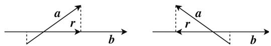
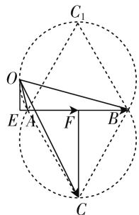
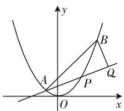
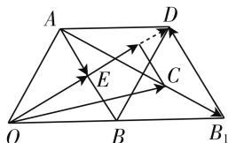
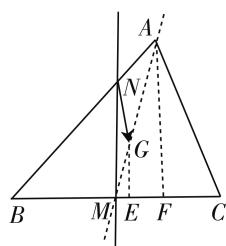
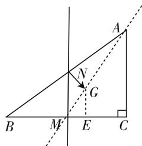

# 不忘初心 本质为先

—— 投影思想在向量数量积问题中的核心作用

● 浙江省湖州市练市中学 曹琪强  
● 浙江省湖州市第二中学 曹亚奇

# 一、问题呈现

例 1 已知正三角形 ABC 的边长为 4, O 是平面 ABC 上的动点, 且 $\angle AOB = \frac{\pi}{3}$ , 则 $\overrightarrow{OC} \cdot \overrightarrow{AB}$ 的最大值为 \_\_\_\_. (2018 年 3 月绍兴、湖州模拟卷 16 题)

此题是笔者经历过的模拟考试的一个填空题,笔者看来题目并不难,应该得分较高,但事与愿违,得分甚至比最后一个填空题还要低!由此引起了笔者兴趣,对此问题背后向量的数量积这一内容与大家进行一番探讨.

# 二、背景分析

向量是近代数学中重要和基本的数学概念,它是沟通代数、几何与三角函数的一种工具,同时又是数形结合思想运用的典范.向量作为代数对象,它可以运算;作为几何对象,它有方向和长度.正是由于向量既有几何形式又有代数形式的双重身份,所以其成为中学数学知识的一个交汇点,向量的数量积更是把向量的基本知识、方法和其他知识内容融会贯通于一体,所以成为近几年浙江高考的一个热点.

平面向量的数量积在数学课程标准(2017版)要求是:①通过物理中功等实例,理解平面向量数量积的概念及其物理意义,会计算平面向量的数量积;②通过几何直观,了解平面向量投影的概念及投影向量的意义.

数量积有多种表达形式:①平面向量 a 与 b 的数量积的模、夹角形式(定义) $a \cdot b = |a| |b| \cos \theta$ ;②数量积的投影形式(几何意义) $a \cdot b = |a| (|b| \cos \theta) = |b| (|a| \cos \theta)$ ;③数量积的坐标形式 $a \cdot b = x_{1} x_{2} + y_{1} y_{2}$ ;④数量积的余弦定理形式 $a \cdot b = \frac{1}{2} [a^{2} + b^{2} -$

$(a-b)^{2}$ ; ⑤ 数量积极化恒等式形式 $a \cdot b = \frac{1}{4}[(a + b)^{2} - (a - b)^{2}]$ 等. 根据教育部最新的课程标准, 笔者认为最重要、最核心的还是数量积的几何意义(本质), 即向量数量积的投影形式.

向量的投影是高维空间到低维子空间的一种线性变换,得到的是低维空间向量.如图1,在空间中,向量a在向量b的投影,是指向量a在与向量b共线的向量构成的子空间的投影,得到的是与向量b共线的向量r.向量r称为向量a在向量b方向的投影向量,即 $a\cdot b=(|b||a|\cos\theta)=b\cdot r=\pm|b||r|$ ,即投影可以用 $|a|\cos\theta=\frac{a\cdot b}{|b|}=\pm|r|$ 表示.

text_image

a
r
b
a
r
b

图1

# 三、思维落实与解题切入

此题比较简洁,个性鲜明,内涵丰富,是整张试卷的一个亮点.命题者以三角形为载体,将动点问题与平面向量的数量积问题相结合,具有一定的思维量.因此,首要任务就是要解决点O的轨迹问题,由AB=4为定值, $\angle AOB=\frac{\pi}{3}$ ,满足定边对定角(正弦定理),就可以得到O的轨迹为三角形ABC外接圆的弦AB所对优弧 $\overrightarrow{ACB}$ 或 $\overrightarrow{AC_{1}B}$ ,由于上下对称,故有两部分.然后求 $\overrightarrow{AB}$ 与 $\overrightarrow{OC}$ 的数量积,笔者前面提了我们平时在教学时应不忘初心,优先考虑本质,就是几何意义(投影形式).

解析:如图2,由题意,O在两段弧上运动,作 $OE \perp AB,CF \perp AB,F$ 为AB中点,当OE与圆弧相切时(靠近A), $\overrightarrow{OC}$ 在 $\overrightarrow{AB}$ 上的投影向量 $\overrightarrow{EF}$ 长度最大为R且与 $\overrightarrow{AB}$ 方向相同，故只需求出外接圆半径 $R = \frac{4\sqrt{3}}{3},\overrightarrow{OC}\cdot \overrightarrow{AB} =$ $|\overrightarrow{AB}||\overrightarrow{EF} |\leqslant 4\cdot \frac{4\sqrt{3}}{3} = \frac{16\sqrt{3}}{3}.$

此方法不仅求得了最大值，也马上得到了 $\overrightarrow{OC} \cdot \overrightarrow{AB} \in \left[-\frac{16\sqrt{3}}{3}, \frac{16\sqrt{3}}{3}\right]$ .

text_image

C₁
O
E A F B
C

图2

反思:这题解答正确的学生很少,主要是在于两个方面:(1)定边对定角(圆模型),这其实是正弦定理的本质,学生显然还没有很好地掌握与理解;(2)动态向量数量积问题,特别是一个向量确定,另一个向量是运动向量时,优先考虑本质即投影形式.

# 四、真题回顾

例 2 （2017·浙江卷）如图 3，已知抛物线 $x^{2}=y$ ，点 $A\left(-\frac{1}{2},\frac{1}{4}\right),B\left(\frac{3}{2},\frac{9}{4}\right)$ ，抛物线上的点 $P(x,y)\left(-\frac{1}{2}<x<\frac{3}{2}\right)$ 。过点 B 作直线 AP 的垂线，垂足为 Q。

(I) 略.

(Ⅱ) 求 $\left|AP\right|\cdot\left|PQ\right|$ 的最大值.

分析:联想是新旧事物建立联系的产物, 是形象思维, 是一种记忆方法和思维方法. 数学解题的思路寻求应该基于已有的认知结构进行思维方法联想. 问题中没有明显的向量内容, 但是从 $\left|AP\right|$ .$|PQ|, BQ \perp AP$ 的形式，可以联想到 $\overrightarrow{PQ}$ 是 $\overrightarrow{PB}$ 在 $\overrightarrow{AP}$ 上的投影向量，即 $|AP| \cdot |PQ| = \overrightarrow{AP} \cdot \overrightarrow{PQ} = \overrightarrow{AP} \cdot \overrightarrow{PB}$ ，从而利用向量有关知识来解决问题，然后选用坐标形式或者极化恒等式形式来解决。具体解答略。

text_image

y
A
B
P
Q
O
x

图 3

这道题是浙江省 2017 年的高考试题, 是向量小题, 方法很多, 但是学生感觉无从下手, 如果从投影思想出发构建两向量在单位向量上的投影之和, 再结合图像, 则此题就迎刃而解了. 平面向量与解析几何相结合, 通常涉及夹角、长度、垂直、共线、轨迹等问题, 解题方法通常是将几何问题向量化, 然后坐标化, 再进一步运算. 或者考虑向量运算的几何意义, 利用几何意义来解决.

# 五、高考猜想

由于 2016、2017 连续两年对向量数量积的几何意义若隐若现的考查, 笔者认为高考可能会延续前几年的风格, 考查数量积问题, 且只要与数量积有关, 投影思想就有它的用武之地.

以下选取了两个较典型的问题供大家参考.

例 3 （2018 年高三温州六校协作题）已知平面向量 a, b, c 满足 $\left|a\right| = \left|b\right| = a \cdot b = 2, \left|c - a\right| + \left|c - 2b\right| = 2\sqrt{3}$ ，则 $c \cdot (a + b)$ 的取值范围是（）.

A. $[4,10]$

B. $[6,+\infty)$

C. $[6,12]$

D. $\left[12,+\infty\right)$

解析: 令 $\overrightarrow{OA} = a, \overrightarrow{OB} = b, \overrightarrow{OB_{1}} = 2b, \overrightarrow{OC} = c.$ 由题意知, $\triangle OAB$ 为边长为 2 的正三角形, $c - a = \overrightarrow{AC}, c - 2b = \overrightarrow{B_{1}C}$ , 且 $|AB_{1}| = 2\sqrt{3}$ , 如图 4, C 点轨迹为线段 $AB_{1}$ .

text_image

A
D
E
C
O
B
B₁

图 4

又 $a + b = \overrightarrow{OD}, |\overrightarrow{OD}| = 2\sqrt{3}, c \cdot (a + b) = \overrightarrow{OC} \cdot \overrightarrow{OD}.$ 由图4，当C与A重合时， $\overrightarrow{OC}$ 在 $\overrightarrow{OD}$ 上投影最小为 $\overrightarrow{OE}$ ，长度为 $\sqrt{3}$ ; 当 C 与 $B_{1}$ 重合时， $\overrightarrow{OC}$ 在 $\overrightarrow{OD}$ 上投影最大为 $\overrightarrow{OD}$ ，长度为 $2\sqrt{3}$ 所以 $c \cdot (a + b) \in [6, 12]$ .

例 4 在 $\triangle ABC$ 中, BC=6, G 为 $\triangle ABC$ 的重心, BC 的中垂线交 AB 于 N, 且 $\overrightarrow{NG} \cdot \overrightarrow{NC} - \overrightarrow{NG} \cdot \overrightarrow{NB} = 6$ , 则 $\overrightarrow{BA} \cdot \overrightarrow{BC} =$ \_\_\_\_.

text_image

A
N
G
B
M
E
F
C

text_image

Geometric diagram with labeled points and lines, including triangle ABC and auxiliary constructions

图5

解析: $\overrightarrow{NG} \cdot \overrightarrow{NC} - \overrightarrow{NG} \cdot \overrightarrow{NB} = \overrightarrow{NG} \cdot \overrightarrow{BC} = |\overrightarrow{BC}| \cdot |\overrightarrow{NG}| \cos\langle\overrightarrow{NG}, \overrightarrow{BC}\rangle = 6$ , 如图 5, 作 $GE \perp BC, AF \perp BC$ , 即 $\overrightarrow{NG}$ 在 $\overrightarrow{BC}$ 上的投影 $|\overrightarrow{NG}| \cdot \cos\langle\overrightarrow{NG}, \overrightarrow{BC}\rangle = |ME| = 1, \frac{EF}{ME} = \frac{AG}{GM} = \frac{2}{1}, BM = \frac{1}{2} BC = 3$ , 所以 $BF = BC = 6, \overrightarrow{BA} \cdot \overrightarrow{BC} = |\overrightarrow{BC}|^{2} = 36.$

数学问题的呈现是千变万化的,但问题背后的本质是不变的.特别是我们高三复习应该回归概念的本质,做到以不变应万变,揭示数学问题背后的本质,让学生掌握通性通法,分析问题时思维落实与解题切入自然,从而为解决千变万化的数学问题提供帮助.

# 六、教学反思

# 1. 小题小做

在每年的高考中,向量问题都是以选择、填空形式出现,承担着考查学生思维品质的重要任务,因此,解题的正确率和灵活性就显得尤为重要.我们应该寻求最简洁、最方便的做法,即小题小做.在平时的教学中,教师要有意识地挖掘和培养,对于此问题的外延与内涵要加以强化,从而提升学生的思维品质.

# 2. 方法优化

有些问题虽然没有直接用向量作为已知条件,但如果运用向量知识来解决,会显得自然、简便,极大地简化了运算.涉及三点共线、长度乘积、面积等形式,利用向量知识来解决具有极大的优越性.我们在复习时要注重知识间的相互联系,挖掘隐性知识,学会用不同的视角观察问题、分析问题、解决问题.

平面向量时常作为工具在使用,建立向量运算与几何图形之间的关系后,把对图形的研究推进到运算的水平,向量运算的应用则把向量与几何、代数有机地联系在了一起.

# 3. 提炼本质

《普通高中数学课程标准(实验)》中指出：“高中数学课程应该返璞归真，努力揭示数学概念、法则、结论的发展过程和本质。数学课程要讲逻辑，更要讲道理，通过典型例题的分析和学生自主探索活动，使学生理解数学概念、结论逐步形成的过程，体会蕴涵在其中的思想方法，追寻数学发展的历史足迹，把数学的学术形态转化为学生易于接受的教育形态。”我们高三复习课要强调本质。这里的本质指的是概念的本质和思想方法的本质。我们高三教师一定要在凸显概念本质和提炼思想方法本质的教学上狠下功夫，使学生掌握问题的本质，从而实现会一题、通一类、连一片多题一解的目的，让更多的学生脱离题海战术。

# 参考文献：

[1] 中华人民共和国教育部. 普通高中数学课程标准 (2017 年版) [S]. 北京: 人民教育出版社, 2018.  
[2] 曹凤山. 微专题二十五 平面向量 [J]. 中学数学教学参考 (上), 2018(3).  
[3] 王勇强, 凌红. 重基础 重本质 重联系 [J]. 中学教研, 2018(3). F

# (上接第22页)

(4) $\left[(a-1)x-1\right](x-1)\geqslant0$ 在 $(0,+\infty)$ 上恒成立等价于对任意 $x_{1},x_{2}\in(0,+\infty)$ 且 $x_{1}<x_{2}$ ， $h(x_{1})>h(x_{2})$ ；而由方程①②知， $0<x_{1}<1<x_{2}$ ， $x_{1},x_{2}$ 不可能同时在 $(0,1),(1,+\infty)$ 上，而是分别在 $(0,1),(1,+\infty)$ 上，而且有两个方程 $x_{1}x_{2}=1,x_{1}+x_{2}=a$ 连接相关，这里的a是与x相关的变量而不是常量，不符合单调性的前提条件，这里寻找的充分条件要求太高.

通过学生独立完成——小组分享优化——班级分享优化——问题生成分享——生成问题解决这一系列课堂建构活动，为学生构建极值点偏移问题解题方法模块提供了丰富的素材与思路.

在数学解题教学中,如何破解学生解题时的各种思维障碍,即如何让学生直观地体验解题思维的形成过程、如何清晰地了解学生的解题想法,让学生形成自己的解题思维,是第二轮复习的重点.

解决问题是数学的核心思维活动. 在教学实践中, 教师对解题教学是普遍重视的, 但对解题训练的核心价值的短视和缺乏对学生解题学习的有效指导，使数学解题教学滑向了题海战术的深渊。如，希望用大量的题目来覆盖考试试题，用大量训练来达成“熟练”水平；热衷于“多讲多练”“多快好省”，采用“放映式”“快节奏”的问题讲解。一节课（特别是复习课）讲7、8道甚至10多道题目的现象层出不穷，造成的后果是学生的学习“蜻蜓点水”，学习负担超重和学习效率低下。如果不对所做试题归类总结，从不同的视角对问题多作研究，很难达到一定的高度。第二轮复习，教师必须引导学生对自己存在的问题（审题、思路设计、运算等）作一些小模块（解题工具），形成自己的方法，才能提升数学抽象、逻辑推理、数学建模等素养，才能站在至高点上，驾驭高考题。

# 参考文献：

[1] 吴伟鸿. 高中生如何在数学解题中突破思维障碍 [J]. 中国数学教育(高中版), 2018(5).  
[2] 吴增生. 数学解题指导教学策略初探 [J]. 中国数学教育 (初中版), 2012(6). F