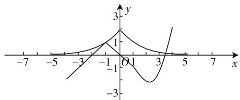
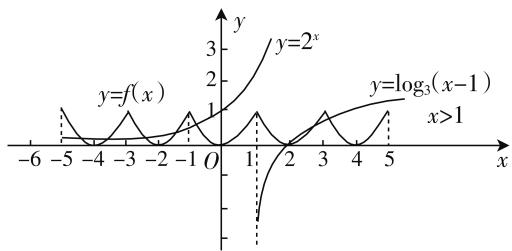

# 以“函数与方程思想”为例谈数学思想的教学

● 江苏省宜兴市和桥高级中学 白雪松

数学教师要意识到我们不能只着眼于学生数学知识的学习,也要关注学生其他方面素养的培养,数学思想的教育尤其关键,它直接影响着学生思维品质的优化,对学生理解数学知识,提升问题解决效率有着非常重要的作用.下面,我们就以“函数与方程思想”为例,探讨一下具体的教学操作.

# 一、引导学生重视数学思想的价值

对很多学生来讲,数学思想貌似是一个遥不可及的东西,毕竟数学概念可以在教材上找到原话,很多定理和公式都在频繁使用,在学习中甚至可以采用记背的方式来进行强化和巩固.在实际教学中,很多学生都对数学概念、数学定理、数学公式等显性知识有着明确的认识,而且相当重视,但是对数学思想却不甚了了,他们也没有这种意识和习惯在日常学习中对相关内容进行总结.因此,我们谈数学思想的教育,首先就要指导学生强化对数学思想价值的理解,只有让学生充分意识到它们的价值,他们才会有积极的意识来面对它,强化它.

以“函数与方程思想”为例,它立足于函数与方程的概念及其关联,在数学问题的分析中有着非常重要的意义.函数思想需要学生对函数基本概念形成本质性的认识,然后还需要学生能够结合函数的基本知识和观点来对问题进行观察、解构和处理,方程思想则是基于学生对方程的本质性理解,要求学生能够结合问题建立方程或者方程组,进而完成对问题的解决.函数与方程之间本就有着非常紧密的关系,很多数学问题的解决需要综合运用这两个工具,而且需要学生进行灵活的转化,比如函数 $y = f(x)$ ,当我们让 y 等于 0 时,就可以将其转化为方程 $f(x) = 0$ ,当然也可以将上述函数式子视为一个二元方程 $y - f(x) = 0$ .

在实际教学中,我们首先要让学生意识到这种数学思想的存在,然后才能让学生在具体问题解决过程中引起足够的关注,教师在引导学生探索问题时,务必要引导学生总结和反思,将数学思想提炼出来,由此来引起学生重视.

例 1 已知函数 $f(x)=2\cos^{2}x+\cos x-1$ , $g(x)$ $= \cos^2 x + a(\cos x + 1) - \cos x - 3.$ 若 $y = f(x)$ 与 $y = g(x)$ 的图像在 $(0,\pi)$ 内至少有一个公共点.试求 $a$ 的取值范围.

上述问题的分析可以按照以下思路进行探讨: $y = f(x)$ 与 $y = g(x)$ 的图像在 $(0, \pi)$ 内至少有一个公共点, 即 $\left\{\begin{aligned}y &= f(x), \\ y &= g(x)\end{aligned}\right.$ 有解, 即令 $g(x) = f(x)$ , $\cos^{2}x + a(\cos x + 1) - \cos x - 3 = 2\cos^{2}x + \cos x - 1$ , $a(1 + \cos x) = (\cos x + 1)^{2} + 1$ . 因为 $x \in (0, \pi)$ , 所以 $0 < 1 + \cos x < 2$ . 所以 $a = 1 + \cos x + \frac{1}{1 + \cos x} \geqslant 2$ , 当且仅当 $1 + \cos x = \frac{1}{1 + \cos x}$ , 即 $\cos x = 0$ 则等号成立. 所以当 $a \geqslant 2$ 时, $y = f(x)$ 与 $y = g(x)$ 在 $(0, \pi)$ 内有解, 即 $y = f(x)$ 与 $y = g(x)$ 的图像在 $(0, \pi)$ 内至少有一个公共点.

这个问题处理结束之后,教师要及时引导学生对问题展开探讨,让学生意识到这原本只是一个函数的问题,但是最终处理却可以将其转变为方程,从方程的角度来实现问题的解决,而且从这个角度来进行分析,的确让问题显得更加简单.

# 二、让学生在合作学习中感悟数学思想

数学思想的教育在于一种感悟和体验,这是一个强调过程的学习活动.换言之,为什么我们以往的教学很难让学生对数学思想获取深刻的理解和认知,其关键就在于我们过分重视结果,一个问题抛给学生,只要学生给我们提供了结果,那就一切 OK.这种思想无形之中会给学生的学习造成了负面的示范.久而久之,学生在自己的问题的处理过程中,往往也是匆匆而过,对他们来讲,结果意味着考分,过程则等同于煎熬.既然将答案已经探究出来,那就没有必要突出过程.事实上,这是绝对错误的.教师务必要加强引导,要让学生在问题处理中充分关注过程的体验,并由此促进他们对数学思想的感悟.

笔者认为,让学生以合作学习的方式来处理问题,往往能够降低过程的乏味程度,面对一个难题,不同的学生个体往往都会有自己的想法和观点,这种情况下,教师鼓励学生畅所欲言,引领学生从不同角度来思考问题,进而探明问题.事实上,面对同一个问题,殊途同归的解题策略背后往往隐含着丰富的数学思想,细加体味能够加强学生的理解,让学生产生深刻的印象.

例 2 已知 a, b 是两个正数, 且它们满足 $ab = a + b + 3$ , 求 ab 的取值范围.

在教学过程中,笔者让学生从合作学习的角度出发,指导他们展开探究,鼓励学生将自己灵光一现的思路展示出来,并引导学生展开更加深入的讨论,最终形成多样化的问题解决思路.

思路一: 因为 $ab = a + b + 3$ ，所以 $a \neq 1$ ，所以 $b = \frac{a + 3}{a - 1}$ ，而 b > 0，所以 $\frac{a + 3}{a - 1} > 0$ ，即 a > 1 或 a < -3。又 a > 0，所以 a > 1，故 a - 1 > 0。所以 $ab = a \cdot \frac{a + 3}{a - 1} = \frac{(a - 1)^2 + 5(a - 1) + 4}{a - 1} = (a - 1) + \frac{4}{a - 1} + 5 \geqslant 9$ ，当且仅当 $a - 1 = \frac{4}{a - 1}$ ，即 a = 3 时取等号。又 a > 3 时， $f(a) = (a - 1) + \frac{4}{a - 1} + 5$ 是关于 a 的单调增函数。所以 ab 的取值范围是 $[9, +\infty)$ 。

思路二: 因为 a, b 为正数, 所以 $a + b \geqslant 2\sqrt{ab}$ . 又 $ab = a + b + 3$ , 所以 $ab \geqslant 2\sqrt{ab} + 3$ . 即 $(\sqrt{ab})^{2} - 2\sqrt{ab} - 3 \geqslant 0$ , 解得 $\sqrt{ab} \geqslant 3$ 或 $\sqrt{ab} \leqslant -1$ (舍去), 所以 $ab \geqslant 9$ . 所以 ab 的取值范围是 $[9, +\infty)$ .

思路三:若设ab=t，则 $a+b=t-3$ ，所以a,b可看成方程 $x^{2}-(t-3)x+t=0$ 的两个正根.从而 $\left\{\begin{aligned}\Delta=(t-3)^{2}-4t&\geqslant0,\\ a+b=t-3&>0,\\ ab=t&>0,\end{aligned}\right.$ 即 $\left\{\begin{aligned}t&\leqslant1或 t\geqslant9,\\ t&>3,\\ t&>0,\end{aligned}\right.$ 解得 $t\geqslant$

9, 即 $ab \geqslant 9$ . 所以 ab 的取值范围是 $[9, +\infty)$ .

上述三个思路,思路一从函数角度出发,将问题转化为函数值域来研究,思路二则将问题转化为不等式的解集,思路三则立足于方程展开处理,这些方法其实都是对函数与方程思想的运用.当学生完成问题解决之后,我们指导学生进行交流,可以加深学生对相关方法与数学思想的理解.

# 三、通过变式训练强化学生的理解

数学思想的教学需要教师有意识地引导,帮助学生达成一种强化的效果.在日常教学中,笔者认为通过一些变式训练,让学生在相似的问题处理过程中,展开比较和区分,由此让学生完成对数学思想的体验,这能起到更好的效果.

例 3 已知有分段函数 $f(x)=\left\{\begin{aligned}&1-|x+1|(x<1),\\&x^{2}-4x+2(x\geqslant1),\end{aligned}\right.$ 则函数 $g(x)=2^{|x|}f(x)-2$ 的零点个数为 \_\_\_\_.

line

| x    | y (Curve 1) | y (Curve 2) |
| ---- | ----------- | ----------- |
| -7   | -3          | -3          |
| -5   | -1          | -1          |
| -3   | 0           | 0           |
| -1   | 1           | 1           |
| 1    | 3           | 3           |
| 3    | 1           | 1           |
| 5    | 0           | 0           |
| 7    | -1          | -1          |

图 1

这个问题的分析,需要学生立足于函数及其基本性质,结合图像特点来进行研究.基本分析如下:函数 $g(x)=2^{|x|}f(x)-2$ 零点的个数,即方程 $f(x)=\frac{2}{2^{|x|}}$ 根的个数,也就是 $y=f(x)$ 与 $y=\frac{2}{2^{|x|}}$ 的图像的交点个数,分别作出 $y=f(x)$ 与 $y=\frac{2}{2^{|x|}}$ 的图像,如图1所示,由图像知 $y=f(x)$ 与 $y=\frac{2}{2^{|x|}}$ 的图像有两个交点,函数 $g(x)$ 有2个零点.

随后教师可以安排变式训练：

若定义在 $\mathbf{R}$ 上的函数 $y = f(x)$ 满足 $f(x + 1) = -f(x)$ ，且当 $x \in [-1,1]$ 时， $f(x) = x^2$ ，函数 $g(x) = \begin{cases} 2^x (x \leqslant 1), \\ \log_3(x - 1)(x > 1), \end{cases}$ 则函数 $h(x) = f(x) - g(x)$ 在区间 $[-5,5]$ 内有几个零点？

line

| x    | y=f(x) | y=log₃(x-1) |
| ---- | ------ | ----------- |
| -6   | 1      | 0           |
| -5   | 0      | 0           |
| -4   | 1      | 0           |
| -3   | 0      | 0           |
| -2   | 1      | 0           |
| -1   | 0      | 0           |
| 0    | 1      | 0           |
| 1    | 0      | 1           |
| 2    | 1      | 0           |
| 3    | 0      | 1           |
| 4    | 1      | 0           |
| 5    | 0      | 1           |

图 2

分析思路如下: 因为 $f(x+1)=-f(x)$ ，所以 $f(x+2)=f(x)$ ，又 $x\in[-1,1]$ 时， $f(x)=x^{2}$ ，所以 $f(x)$ 的图像如图 2 所示，在同一坐标系中作出函数 $g(x)$ 的图像，可见 $y=f(x)(-5\leqslant x\leqslant5)$ 与 $y=2^{x}(x\leqslant1)$ 有 5 个交点， $y=f(x)(-5\leqslant x\leqslant5)$ 与 $y=\log_{3}(x-1)(x>1)$ 的图像有 3 个交点，所以共有 8 个交点，即 $h(x)$ 在 $[-5,5]$ 上有 8 个零点.