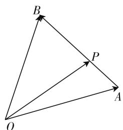
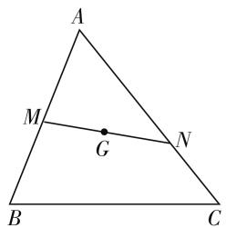
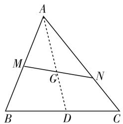
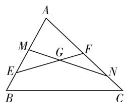
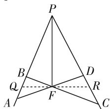
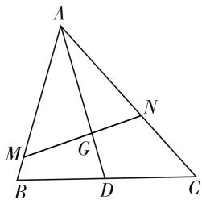
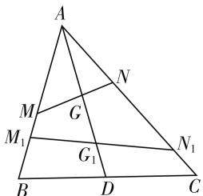
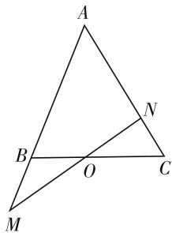
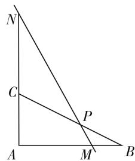

# 例谈定比分点公式在平面几何中的应用

# ● 浙江师范大学教师教育学院 刘鹏

平面几何中,线段定比分点公式的应用非常广泛.而高中阶段,学生对向量形式的定比分点公式却显得陌生.笔者以一道向量习题的证明过程为例,阐述其在解题当中的妙用,并引出几个变式.下面,先简单介绍向量形式的定比分点公式的具体内容.

# 一、定比分点公式

如图 1, 已知 $\overrightarrow{AP} = \lambda \overrightarrow{PB}$ , 则 $\overrightarrow{OP} = \frac{\overrightarrow{OA} + \lambda \overrightarrow{OB}}{1 + \lambda}$ . 使用时要注意公式的特点: P, A, B 三点共线, $\overrightarrow{OP}, \overrightarrow{OA}, \overrightarrow{OB}$ 三向量共起点, 且 $\overrightarrow{OP}$ 前的系数等于 $\overrightarrow{OA},\overrightarrow{OB}$ 前系数之和,所以更多时候使用 $(1+\lambda)\overrightarrow{OP}= \overrightarrow{OA}+\lambda\overrightarrow{OB}.$

text_image

B
P
O
A

图 1

# 二、例题呈现

如图2所示, 过 $\triangle ABC$ 重心 G 的一条直线分别交 AB, AC 于点 M, N, $\overrightarrow{AM} = \lambda_{1}\overrightarrow{AB}, \overrightarrow{AN} = \lambda_{2}\overrightarrow{AC}$ , 求证: $\frac{1}{\lambda_{1}} + \frac{1}{\lambda_{2}} = 3$ .

text_image

A
M
G
N
B
C

图2

text_image

A
M
G
N
B
D
C

图3

证法 1: 如图 3, 因为点 G 为 $\triangle ABC$ 的重心, 所以 $\overrightarrow{AG} = \frac{2}{3}\overrightarrow{AD}$ . 由于点 D 为 BC 的中点, 从而 $\overrightarrow{AD} = \frac{1}{2}(\overrightarrow{AB} + \overrightarrow{AC})$ , 于是 $\overrightarrow{AG} = \frac{2}{3}\overrightarrow{AD} = \frac{1}{3}\overrightarrow{AB} + \frac{1}{3}\overrightarrow{AC}$ .

另一方面，点 $M, G, N$ 共线，因此存在 $p, q$ 满足 $p + q = 1$ ，使得 $\overrightarrow{AG} = p\overrightarrow{AM} + q\overrightarrow{AN}$ . 结合 $\overrightarrow{AM} = \lambda_1\overrightarrow{AB}$ 和 $\overrightarrow{AN} = \lambda_2\overrightarrow{AC}$ ，可得 $\overrightarrow{AG} = p\lambda_1\overrightarrow{AB} + q\lambda_2\overrightarrow{AC}$ . 又 $\overrightarrow{AB}$

与 $\overrightarrow{AC}$ 不共线，从而 $\left\{ \begin{array}{l} p\lambda_{1} = \frac{1}{3}, \\ q\lambda_{2} = \frac{1}{3}, \end{array} \right.$ 解得 $\left\{ \begin{array}{l} p = \frac{1}{3\lambda_1}, \\ q = \frac{1}{3\lambda_2}. \end{array} \right.$ 于是 $\frac{1}{3\lambda_1} + \frac{1}{3\lambda_2} = 1$ ，即 $\frac{1}{\lambda_1} + \frac{1}{\lambda_2} = 3.$

证法 2: $\overrightarrow{AD} = \frac{1}{2} (\overrightarrow{AB} + \overrightarrow{AC})$ ，于是 $\overrightarrow{AG} = \frac{2}{3} \overrightarrow{AD} = \frac{1}{3} \overrightarrow{AB} + \frac{1}{3} \overrightarrow{AC}$ .

由 $\overrightarrow{AB} = \frac{1}{\lambda_1}\overrightarrow{AM},\overrightarrow{AC} = \frac{1}{\lambda_2}\overrightarrow{AN}$ ，得 $\overrightarrow{AG} = \frac{1}{3\lambda_1}\overrightarrow{AM} +$ $\frac{1}{3\lambda_2}\overrightarrow{AN}$ ，即 $\frac{1}{\lambda_1} +\frac{1}{\lambda_2} = 3.$

著名数学家波利亚曾经说过：“没有任何一道题是可以解决得十全十美的，总剩下些工作要做，经过充分地探讨，总会有点滴发现，总能改进这个解答，而且在任何情况下，我们总能提高自己对这个解答的理解水平。”证法1是多数学生采用的，运用向量中的共线定理的推论和方程思想证得，其关键是M,G,N共线，由 $p+q=1$ 推得 $\overrightarrow{AG}=p\overrightarrow{AM}+q\overrightarrow{AN}$ .笔者思考，从向量形式的定比分点公式出发，能否使得这一关键更具有一般性呢？由此引出证法2，使得证明过程简单很多.

# 三、变式应用

变式 1: 如图 4, 直线 EF 和直线 MN 过 $\triangle ABC$ 的重心 G, 直线 EF, MN 与直线 AB, AC 交于点 E, F, M, N 且 $\overrightarrow{AM} = \lambda_{1}\overrightarrow{AB}, \overrightarrow{AN} = \lambda_{2}\overrightarrow{AC}, \overrightarrow{AE} = \mu_{1}\overrightarrow{AB}, \overrightarrow{AF} = \mu_{2}\overrightarrow{AC}$ , 求证: $\frac{1}{\lambda_{1}} + \frac{1}{\lambda_{2}} = \frac{1}{\mu_{1}} + \frac{1}{\mu_{2}}$ .

text_image

A
M
G
F
E
N
B
C

图4

text_image

P
B
Q
A
F
D
R
C

图5

证明:由定理1可直接得到 $\frac{1}{\lambda_{1}}+\frac{1}{\lambda_{2}}=3,\frac{1}{\mu_{1}}+\frac{1}{\mu_{2}}=$ 3. 故等式成立.

变式2:如图5,已知F为 $\angle P$ 平分线上任意一点,过F任作两条直线AD,BC交 $\angle P$ 的两边于A,D,B,C,求证: $\frac{1}{PA}+\frac{1}{PD}=\frac{1}{PB}+\frac{1}{PC}.$

证明: 过 F 作 PF 的垂线交 PA, PC 于 Q, R, $\triangle PQR$ 是等腰三角形, 则 $2\overrightarrow{PF} = \overrightarrow{PQ} + \overrightarrow{PR} = \frac{PQ}{PA}\overrightarrow{PA} + \frac{PR}{PD}\overrightarrow{PD}, A, F, D$ 三点共线, 得 $\frac{PQ}{PA} + \frac{PR}{PD} = 2, \frac{1}{PA} + \frac{1}{PD} = \frac{2}{PQ}$ . 同理 $\frac{1}{PB} + \frac{1}{PC} = \frac{2}{PQ}$ , 即 $\frac{1}{PA} + \frac{1}{PD} = \frac{1}{PB} + \frac{1}{PC}$ .

变式 3: 如图 6, AD 是 $\triangle ABC$ 的中线, M, N 分别在 AB, AC 上, 且 $\frac{BM}{MA} + \frac{CN}{NA} = 1$ , MN 交 AD 于点 G, 求证: G 为 $\triangle ABC$ 的重心.

证明:由 $\frac{BM}{MA}+\frac{CN}{NA}=1$ ,得 $\frac{AB}{AM}+\frac{AC}{AN}=3$ .又 $2\overrightarrow{AD}=\overrightarrow{AB}+\overrightarrow{AC},2\frac{AD}{AG}\overrightarrow{AG}=\frac{AB}{AM}\overrightarrow{AM}+\frac{AC}{AN}\overrightarrow{AN}$ ，于是 $2\frac{AD}{AG}=\frac{AB}{AM}+\frac{AC}{AN}=3$ ，所以G为 $\triangle ABC$ 的重心.

text_image

A
M
G
B
D
C
N

图6

text_image

A
M
G
N
M₁
G₁
B
D
C
N₁

图 7

变式4:如图7,AD是 $\triangle ABC$ 的中线,点G沿中线AD所在直线进行运动,且 $\overrightarrow{AG}=m\overrightarrow{AD}$ ,过点G的直线分别交直线AB和直线AC于点M,N.设 $\overrightarrow{AM}=\lambda_{1}\overrightarrow{AB},\overrightarrow{AN}=\lambda_{2}\overrightarrow{AC}$ ,则 $\frac{1}{\lambda_{1}}+\frac{1}{\lambda_{2}}=\frac{2}{m}$ .

证明:由于点 D 为 BC 的中点,从而 $\overrightarrow{AD}=\frac{1}{2}(\overrightarrow{AB}+\overrightarrow{AC}),\overrightarrow{AG}=m\overrightarrow{AD}=\frac{m}{2}\overrightarrow{AB}+\frac{m}{2}\overrightarrow{AC},\overrightarrow{AB}=\frac{1}{\lambda_{1}}\overrightarrow{AM},\overrightarrow{AC}=\frac{1}{\lambda_{2}}\overrightarrow{AN}$ ,于是 $\overrightarrow{AG}=\frac{m}{2\lambda_{1}}\overrightarrow{AM}+\frac{m}{2\lambda_{2}}\overrightarrow{AN}$ ,即 $\frac{1}{\lambda_{1}}+\frac{1}{\lambda_{2}}=\frac{2}{m}$ .

应用 1: 如图 8, 在 $\triangle ABC$ 中, 点 $O$ 是 $BC$ 的中点, 过点 $O$ 的直线分别交直线 $AB$ , $AC$ 于不同的两点 $M$ , $N$ , 若 $\overrightarrow{AB} = m\overrightarrow{AM}, \overrightarrow{AC} = n\overrightarrow{AN}$ , 则 $m + n$ 的值为 \_\_\_\_. (2007 年江西省高考试题)

解答: 当 m=1，即点 G 与点 D 重合的特殊情形，则 $2\overrightarrow{AO}=\overrightarrow{AB}+\overrightarrow{AC}=m\overrightarrow{AM}+n\overrightarrow{AN}$ ，直接得出 $m+n=2$ .

text_image

A
B
O
C
M
N

图 8

text_image

N
C
P
A
M
B

图9

变式5:如图9,在Rt△ABC中,P是斜边BC上一点,且满足 $\overrightarrow{BP}=\frac{1}{2}\overrightarrow{PC}$ ,点M,N在过点P的直线上,若 $\overrightarrow{AM}=\lambda\overrightarrow{AB},\overrightarrow{AN}=\mu\overrightarrow{AC},\lambda,\mu>0$ ,求 $\lambda+2\mu$ 的最小值.

解答:连接AP,可得 $3\overrightarrow{AP}=\overrightarrow{AC}+2\overrightarrow{AB}$ .又 $\overrightarrow{AM}=\lambda\overrightarrow{AB},\overrightarrow{AN}=\mu\overrightarrow{AC}$ ,得 $3\overrightarrow{AP}=\frac{1}{\mu}\overrightarrow{AM}+\frac{2}{\lambda}\overrightarrow{AN},\frac{1}{\mu}+\frac{2}{\lambda}=3$ ,则 $(\lambda+2\mu)\left(\frac{2}{\lambda}+\frac{1}{\mu}\right)\geqslant(\sqrt{2}+\sqrt{2})^{2}=8$ ,当且仅当 $\lambda=\frac{4}{3},\mu=\frac{2}{3}$ 时等号成立.

故最小值为 $\frac{8}{3}$ .

# 四、结语

横看成岭侧成峰, 远近高低各不同. 同一个数学问题的不同证法, 可以有美丑之分. 而简洁明快是一种数学美. 在数学解题教学中, 尝试引导学生寻求更美的证明方法. 另一方面, 我们可以窥见, 对于一道平面几何中的向量习题, 通过向量的定比分点公式架构桥梁, 将向量和几何联系在了一起. 正如陈昌平、张奠宙等诸位先生所说: 向量和几何的融合, 已是不可阻挡的潮流.

# 参考文献：

[1] 波利亚. 怎样解题: 数学教学法的新面貌 [M]. 涂泓, 冯承天, 译. 上海: 上海科技教育出版社, 2002. F