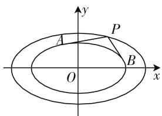

# 动静相互结合,同心相似椭圆

—— 一道浙江模拟题的探究

● 江苏省海门中学 王娟

若两个椭圆的中心、长轴一致，且长轴和短轴对应成比例，此类特殊的两个椭圆不妨称之为同心相似椭圆。在实际的一些建筑模型、景观设置等特殊结构的视图中，我们经常会碰到此类同心相似椭圆的图案。深入探究两个同心相似椭圆的关系，除了优美的平面直观外，还有众多特殊的几何性质。

# 一、试题呈现

问题:(2019年11月浙江省温州一模高三数学试题·9)如图1,P为椭圆 $E_{1}$ :

$$
\frac {x ^ {2}}{a ^ {2}} + \frac {y ^ {2}}{b ^ {2}} = 1 (a > b > 0) \text {上}
$$

text_image

y
A
P
O
B
x

图 1

的一动点, 过点 P 作椭圆 $E_{2}:\frac{x^{2}}{a^{2}}+\frac{y^{2}}{b^{2}}=\lambda(0<\lambda<1)$ 的两条切线 PA, PB, 斜率分别为 $k_{1}, k_{2}$ . 若 $k_{1} \cdot k_{2}$ 为定值, 则 $\lambda=(\quad)$ .

A. $\frac{1}{4}$

B. $\frac{\sqrt{2}}{4}$

C. $\frac{1}{2}$

D. $\frac{\sqrt{2}}{2}$

此题以两个同心相似椭圆为问题背景,借助外层椭圆上的一动点 P 作内层椭圆的两条切线,结合两切线的斜率的积为定值,进而来确定内层椭圆方程中的相关参数值问题.随着外层椭圆上的一动点 P 的变化,直接带动过点 P 作内层椭圆的两条切线,通过“动”态变化,再结合两切线的斜率的积为定值的“静”态数值,动静结合,相辅相成.

# 二、试题破解

# 方法 1: 定值比例法

设出过点 P 的椭圆 $E_{2}$ 的切线方程，并与椭圆 $E_{2}$ 的方程联立，消参得到关于 x 的二次方程，利用判别式为 0 确定参数之间的关系式，进而转化为关于 k 的二次方程，利用根与系数的关系建立 $k_{1} \cdot k_{2}$ 的关系式，借助其为定值的比例性质来求解相关的参数值.

解:设过点 P 的椭圆 $E_{2}$ 的切线方程为 $y=kx+$ m，点 $P(x_{0},y_{0})$ ，则有 $m=y_{0}-kx_{0}$ ，联立 $\left\{\begin{aligned}&y=kx+m,\\ &\frac{x^{2}}{a^{2}}+\frac{y^{2}}{b^{2}}=\lambda,\end{aligned}\right.$ 消去参数 y，并整理可得

$$
\left(b ^ {2} + a ^ {2} k ^ {2}\right) x ^ {2} + 2 k m a ^ {2} x + a ^ {2} \left(m ^ {2} - \lambda b ^ {2}\right) = 0,
$$

所以 $\Delta=4k^{2}m^{2}a^{4}-4(b^{2}+a^{2}k^{2})\cdot a^{2}(m^{2}-\lambda b^{2})=0$ ，化简可得 $(b^{2}+a^{2}k^{2})\lambda=m^{2}$ .

将 $m = y_0 - kx_0$ 代入，可得 $(b^2 + a^2k^2)\lambda = (y_0 - kx_0)^2$ ，展开并整理可得 $(\lambda a^2 - x_0^2)k^2 + 2x_0y_0k + \lambda b^2 - y_0^2 = 0$ ，利用根与系数的关系可得 $k_1 \cdot k_2 = \frac{\lambda b^2 - y_0^2}{\lambda a^2 - x_0^2} = \frac{\lambda b^2 - b^2\left(1 - \frac{x_0^2}{a^2}\right)}{\lambda a^2 - x_0^2} = \frac{(\lambda - 1)b^2 + \frac{b^2}{a^2}x_0^2}{\lambda a^2 - x_0^2}$ 为定值，则有 $\frac{\lambda - 1}{\lambda} \cdot \frac{b^2}{a^2} = -\frac{b^2}{a^2}$ ，即 $\frac{\lambda - 1}{\lambda} = -1$ ，解得 $\lambda = \frac{1}{2}$ . 故选C.

# 方法 2: 特殊值法

根据题目条件可知相应的结论与椭圆中的参数 $a, b$ 的值无关，与点 $P$ 的位置无关，为了方便破解，不妨取特殊椭圆与特殊点来处理，分别取点 $P$ 位于 $x$ 轴、 $y$ 轴上的顶点位置，与椭圆 $E_2$ 的方程联立，进而确定参数之间的关系式，利用对称性得以确定 $k_1 \cdot k_2$ 的关系式，借助两种不同情况下的关系式相等来求解相关的参数值.

解:不妨设椭圆 $E_{1}:\frac{x^{2}}{4}+y^{2}=1$ ，椭圆 $E_{2}:\frac{x^{2}}{4}+y^{2}=\lambda(0<\lambda<1)$ ，取点 $P(2,0)$ ，设过点 P 的椭圆 $E_{2}$ 的切线方程为 $y=k(x-2)$ ，联立 $\left\{\begin{aligned}y&=k(x-2),\\ \frac{x^{2}}{4}+y^{2}&=\lambda,\end{aligned}\right.$ 消去参数 y 并整理可得 $(1+4k^{2})x^{2}-16k^{2}x+16k^{2}-4\lambda=0$ ，所以 $\Delta=256k^{4}-4(1+4k^{2})(16k^{2}-4\lambda)=0$ ，整理可得 $4k^{2}=\frac{\lambda}{1-\lambda}$ 。根据对称性可知， $k_{1}$ 与 $k_{2}$ 互为相反数，则有 $k_{1}\cdot k_{2}=-\frac{\lambda}{4(1-\lambda)}$ 。

取点 $P(0,1)$ ，同理可得 $k_{1} \cdot k_{2} = -\frac{1 - \lambda}{4\lambda}$ .

根据题目条件知, $k_{1}\cdot k_{2}$ 为定值,则有 $-\frac{\lambda}{4(1-\lambda)}=-\frac{1-\lambda}{4\lambda}$ ,解得 $\lambda=\frac{1}{2}$ .故选C.

# 方法 3: 仿射变换法

通过仿射变换, 把相应的椭圆变换为圆, 设出动点 P 的坐标, 并设出过点 P 的圆的切线方程, 利用坐标原点到切线的距离与半径的关系建立关系式, 进而转化为关于 k 的二次方程, 利用根与系数的关系建立 $k_{1} \cdot k_{2}$ 的关系式, 借助其为定值性质来求解相关的参数值.

解: 令 $\frac{x}{a}=x',\frac{y}{b}=y'$ ，则椭圆 $E_{1}$ 变换为圆： $x'^{2}+y'^{2}=1$ ，椭圆 $E_{2}$ 变换为圆： $x'^{2}+y'^{2}=\lambda(0<\lambda<1)$ ，设点 $P(x_{0}^{'},y_{0}^{'})$ ，则有 $x_{0}^{'2}+y_{0}^{'2}=1$ ，设过点 P 的圆： $x'^{2}+y'^{2}=\lambda$ 的切线方程为 $y^{'}-y_{0}^{'}=k(x^{'}-x_{0}^{'})$ ，即 $kx^{'}-y^{'}-kx_{0}^{'}+y_{0}^{'}=0$ ，那么坐标原点 O 到切线的距离 $d=\frac{|-kx_{0}^{'}+y_{0}^{'}|}{\sqrt{k^{2}+1}}=\sqrt{\lambda}$ ，展开并整理可得 $(x_{0}^{'2}-\lambda)k^{2}-2x_{0}^{'}y_{0}^{'}k+y_{0}^{'2}-\lambda=0$ ，利用根与系数的关系可得 $k_{1}\cdot k_{2}=\frac{y_{0}^{'2}-\lambda}{x_{0}^{'2}-\lambda}=\frac{1-x_{0}^{'2}-\lambda}{x_{0}^{'2}-\lambda}=-\frac{x_{0}^{'2}-1+\lambda}{x_{0}^{'2}-\lambda}$ ，根据题目条件知， $k_{1}\cdot k_{2}$ 为定值，则有 $-1+\lambda=-\lambda$ ，解得 $\lambda=\frac{1}{2}$ 。故选 C.

# 方法 4: 仿射变换 + 特殊值法

通过仿射变换,把相应的椭圆变换为圆,分别取点P位于x轴、y轴上的特殊位置,设出过点P的圆的切线方程,利用坐标原点到切线的距离与半径的关系建立关系式,结合定值的条件,借助两种不同情况下的关系式相等来求解相关的参数值.

解: 令 $\frac{x}{a}=x'$ , $\frac{y}{b}=y'$ , 则椭圆 $E_{1}$ 变换为圆: $x'^{2}+y'^{2}=1$ , 椭圆 $E_{2}$ 变换为圆: $x'^{2}+y'^{2}=\lambda(0<\lambda<1)$ .

取点 $P(1,0)$ ，则过点 P 的圆： $x'^{2} + y'^{2} = \lambda$ 的切线方程为 $y' = k(x' - 1)$ ，即 $kx' - y' - k = 0$ ，那么原点坐标 O 到切线的距离 $d = \frac{|-k|}{\sqrt{k^{2} + 1}} = \sqrt{\lambda}$ ，展开并整理可得 $k^{2} = \frac{\lambda}{1 - \lambda}$ ，根据对称性可知， $k_{1}$ 与 $k_{2}$ 互为相反数，则有 $k_{1} \cdot k_{2} = -\frac{\lambda}{1 - \lambda}$ ;

取点 $P(0,1)$ ，同理可得 $k_{1} \cdot k_{2} = -\frac{1 - \lambda}{\lambda}$ .

根据题目条件知, $k_{1}\cdot k_{2}$ 为定值,则有 $-\frac{\lambda}{1-\lambda}=-\frac{1-\lambda}{\lambda}$ ,解得 $\lambda=\frac{1}{2}$ .故选C.

点评:破解此题较为复杂,常见思维就是方法1中的定值比例法,通过设置相关的切线方程,利用直线与椭圆的位置关系来深入研究,从而借助函数与方程思维、比例性质等加以处理;而方法2中的特殊值法,通过特殊椭圆与特殊点的取值,可以更为快捷地求此类确定值问题;而方法3与方法4中的仿射变换法,都是通过换元思维进行仿射变换,把相应的椭圆问题转化为圆的问题来处理,思维巧妙.

# 三、规律总结

结论:如图1所示,P为椭圆 $E_{1}:\frac{x^{2}}{a^{2}}+\frac{y^{2}}{b^{2}}=1(a>b>0)$ 上的一动点,过点P作椭圆 $E_{2}:\frac{x^{2}}{a^{2}}+\frac{y^{2}}{b^{2}}=\frac{1}{2}$ 的两条切线PA,PB,斜率分别为 $k_{1},k_{2}$ ,则 $k_{1}\cdot k_{2}$ 恒为定值 $-\frac{b^{2}}{a^{2}}$ .

证明:设过点 P 的椭圆 $E_{2}$ 的切线方程为 $y=kx+m$ ，点 $P(x_{0},y_{0})$ ，则有 $m=y_{0}-kx_{0}$ ，联立 $\left\{\begin{aligned}y=kx+m,\\ \frac{x^{2}}{a^{2}}+\frac{y^{2}}{b^{2}}=\frac{1}{2},\end{aligned}\right.$ 消去参数 y 并整理可得 $(b^{2}+a^{2}k^{2})x^{2}+2kma^{2}x+a^{2}\left(m^{2}-\frac{1}{2}b^{2}\right)=0$ ，所以 $\Delta=4k^{2}m^{2}a^{4}-4(b^{2}+a^{2}k^{2})\cdot a^{2}\left(m^{2}-\frac{1}{2}b^{2}\right)=0$ ，化简可得 $b^{2}+a^{2}k^{2}=2m^{2}$ ，将 $m=y_{0}-kx_{0}$ 代入，可得 $b^{2}+a^{2}k^{2}=2(y_{0}-kx_{0})^{2}$ ，展开并整理可得 $(a^{2}-2x_{0}^{2})k^{2}+4x_{0}y_{0}k+b^{2}-2y_{0}^{2}=0$ ，利用根与系数的关系可得 $k_{1}\cdot k_{2}=\frac{b^{2}-2y_{0}^{2}}{a^{2}-2x_{0}^{2}}=\frac{b^{2}-2b^{2}\left(1-\frac{x_{0}^{2}}{a^{2}}\right)}{a^{2}-2x_{0}^{2}}=\frac{-b^{2}+\frac{2b^{2}}{a^{2}}x_{0}^{2}}{a^{2}-2x_{0}^{2}}=-\frac{b^{2}}{a^{2}}$ 为定值.

点评:对于以上结论,当椭圆中的参数 a、b 的值变化时,对应定值 $k_{1} \cdot k_{2}$ 也随之变化,可以借助具体参数 a、b 的值来设置相关的问题,进而求解相关的定值问题. F