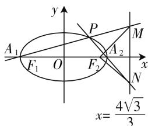
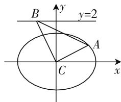
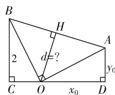

# 基于笛卡儿数学思想的高中解析几何的教学策略

北京市密云区第二中学 王德臣  
北京市密云区第二中学 关玉华

# 一、笛卡儿的解析几何思想

17 世纪 30 年代以前, 几何和代数都已经有了相当的发展, 但它们是互相分离的两个学科, 各自相互独立, 互不联系. 法国哲学家笛卡儿主张, 寻求一种包含这两门学科的好处而没有它们的缺点的方法. 在这个思想的指导下, 通过坐标系, 把代数方法用于几何研究, 创立了解析几何. 解析几何的发展史, 是一部人类认识世界、改造世界的壮丽史诗. 恩格斯说: “数学的转折点是笛卡儿的变数, 有了变数, 运动进入了数学; 有了变数, 辩证法进入了数学; 有了变数, 微分和积分就成为可能的了……” 解析几何被认为是笛卡儿在其著作《方法论》的附录几何学中创立的, 解析几何学的中心思想是通过代数的方法去解决相关的几何问题, 尤其是一些作图问题.

# 二、对解析几何的思想方法的理解

引用数学史的内容进入课堂,不但能激发学生对数学的学习兴趣,而且能激发学生对数学研究的创造意识,数学史还记载着数学家对知识的探索历程,这里面既蕴含了大量的数学思想方法,将这些包含数学思想方法的素材呈现在课堂上,引导学生分析研究,可以使学生体验到知识的产生原因及过程,由此感悟到其中的数学知识包含的思想方法.解析几何是研究运动变化几何问题的重要工具,学习解析几何,主要是掌握其基本思想方法,而不是仅仅记住某几个结论.著名几何学家格列诺夫说:“解析几何没有严格的规定内容,对它来说,决定性的因素不是研究对象,而是思想方法.”

# （一）用关于 $x, y$ 的二元方程表示曲线

研究图形的几何性质,把几何性质用点的坐标或曲线的方程表示,建立形与数的对应关系,这是进行形数转化的基础和保障.如:以(1,1)为圆心,2为半径的圆的方程为 $(x-1)^{2}+(y-1)^{2}=4$ ,反之,方程为 $(x-1)^{2}+(y-1)^{2}=4$ 表示以(1,1)为圆心,2为半径的圆,两者是等价关系.

# （二）用方程研究曲线的性质

解析几何是一种研究几何问题的新方法,通过坐标系将平面上的曲线用含有两个变量的方程来表示，使得图形的几何关系在方程的性质中表现出来.

例 1 如果把一个平面区域内两点间距离的最大值称为此区域的直径,那么曲线 $x^{4} + y^{2} = 2$ 围成的平面区域的直径是 \_\_\_\_.

分析:容易发现,曲线 $x^{4}+y^{2}=2$ 关于 x 轴、y 轴及坐标原点对称,所以,平面区域的“直径”的两个端点必然关于 x 轴、y 轴及坐标原点对称,由 $x^{4}=2-y^{2}\leqslant2$ ,得 $|x|\leqslant\sqrt[4]{2}$ . 同理, $y^{2}=2-x^{4}\leqslant2$ , 得 $|y|\leqslant\sqrt{2}$ . 设 $P(x,y)$ 为曲线上任意一点,则 $|OP|=\sqrt{x^{2}+y^{2}}=\sqrt{-x^{4}+x^{2}+2}=\sqrt{-\left(x^{2}-\frac{1}{2}\right)^{2}+\frac{9}{4}}\leqslant\frac{3}{2}$ . 因为 $2\sqrt[4]{2}<2\sqrt{2}<3$ , 所以平面区域的直径为 3.

# 三、解析几何的解题策略

解析几何是用坐标法研究运动变化几何图形的性质,所以教学过程中,要指导学生重视作图,掌握几何图形的构建过程及变化规律,再把这一过程逐一坐标化,让学生真正体会到解析几何的思想方法.

例 2 若动点 P 为椭圆 $\frac{x^{2}}{4} + y^{2} = 1$ 上任意一点， $F_{2}$ 为其右焦点， $A_{1}, A_{2}$ 分别为椭圆的左、右顶点，直线 $A_{1}P$ ， $A_{2}P$ 分别交定直线 $x = \frac{4\sqrt{3}}{3}$ 于 M, N 两点，证明以 MN 为直径的圆过右焦点 $F_{2}$ .

分析: 解析法解题过程与几何图形构建过程对比, 在椭圆上任取一点 $P \Leftrightarrow$ 设 $P(x_{0}, y_{0})$ , 则 $\frac{x_{0}^{2}}{4} + y_{0}^{2} = 1$ .

过点 $A_{1}, P$ 作直线 $\Leftrightarrow$ 直

text_image

y
A₁
F₁ O
P
M
A₂
x
N
x=4√3/3

图 1

线 $A_{1}P: y = \frac{y_{0}}{x_{0} + 2}(x + 2)$ ，直线 $A_{1}P$ 与直线 $x = \frac{4\sqrt{3}}{3}$ 的交点 $M \Leftrightarrow$ 令 $x = \frac{4\sqrt{3}}{3}$ 得 $M\left(\frac{4\sqrt{3}}{3}, \frac{(6+4\sqrt{3})y_{0}}{3(x_{0}+2)}\right)$ .

过点 $A_{2}, P$ 作直线 $\Leftrightarrow$ 直线 $A_{2}P: y = \frac{y_{0}}{x_{0} - 2}(x - 2)$ , 直线 $A_{1}P$ 与直线 $x = \frac{4\sqrt{3}}{3}$ 的交点 $N \Leftrightarrow$ 令 $x = \frac{4\sqrt{3}}{3}$ 得 $N\left(\frac{4\sqrt{3}}{3}, \frac{(6 - 4\sqrt{3})y_{0}}{3(x_{0} - 2)}\right)$ .

连接 $F_{2}M, F_{2}N \Leftrightarrow \overrightarrow{F_{2}P} = \left(\frac{4\sqrt{3}}{3} - \sqrt{3}, \frac{(6 - 4\sqrt{3})}{3(x_{0} + 2)}\right)$ , $\overrightarrow{F_{2}P} = \left(\frac{4\sqrt{3}}{3} - \sqrt{3}, \frac{(4\sqrt{3} - 6)y_{0}}{3(x_{0} - 2)}\right)$ .

$\overrightarrow{FM_2} \cdot \overrightarrow{F_2N} = \left(\frac{\sqrt{3}}{3}, \frac{(6 - 4\sqrt{3})}{3(x_0 + 2)}\right) \cdot \left(\frac{\sqrt{3}}{3}, \frac{(4\sqrt{3} - 6)y_0}{3(x_0 - 2)}\right)$ $= \frac{1}{3} + \frac{4}{3} \times \frac{y_0^2}{x_0^2 - 4} = \frac{1}{3} - \frac{4}{3} \times \frac{y_0^2}{4y_0^2} = 0$ ，所以以 $MN$ 为直径的圆过右焦点 $F_2$ 。

笛卡儿的解析几何思想, 就是“在坐标系中, 用点的坐标、曲(直)线的方程, 把几何问题转化成代数问题, 通过代数运算解决问题”的思想, 对解析几何教学具有普遍的指导意义. 通过以上几何图形的构建过程与解题过程对比分析表明, 在解析几何教学活动中, 指导学生作图, 让学生把握几何图形的构建方法非常重要, 可以说: “几何图形的构建过程的逐一代数化方法就是解析几何问题的解题方法.”

# 四、解析几何的难点分析及策略

# （一）几何条件与代数化

我们已经掌握“把几何图形的构建过程逐一代数化，就得到解析几何的解题过程”。但是，并不是所有的几何条件都容易代数化，几何条件代数化首先需要形与形的转化，需要找到易于代数化的形。如：例2中“以MN为直径的圆过右焦点 $F_{2}$ ”，这里涉及两个几何要素，MN为圆的直径及圆周上一点 $F_{2}$ ，所以 $F_{2}M\perp F_{2}N$ ，两者之间是等价关系，后者易于坐标化。

# （二）由数到形的转化

由数到形的转化,首先注意数与数的转化,在于找到有明确几何含义的代数结构.如: $\sqrt{x^{2}+y^{2}-2x+1}$ 没有明显的几何含义,由于 $\sqrt{x^{2}+y^{2}-2x+1}=\sqrt{(x-1)^{2}+y^{2}}$ ,所以,代数式表示为平面内点(x,y)到(1,0)的距离.

# （三）几何背景与代数运算

以北京2014年高考理科数学解析几何试题为例，2014年高考后，该题目一直是《北京市高考数学考试说明》中的经典案例，很好地体现了解析几何的思想方法，几何背景十分浓厚，既可以用代数的方法研究几何问题。反之，几何图形对代数运算有很好的指导意义,凸显解析法的一道经典试题.

例 3 （2014 年北京高考）如图 2，已知椭圆 $C: x^{2} + 2y^{2} = 4$ ，设 O 为原点，若点 A 在椭圆 C 上，点 B 在直线 y = 2 上，且 $OA \perp OB$ ，求直线 AB 与圆 $x^{2} + y^{2} = 2$ 的位置关系，并证明你的结论.

解法1: 点A在椭圆 $C:x^{2}+2y^{2}=4$ 上 $\Leftrightarrow$ 设 $A(x_{0},y_{0})$ ，且 $x_{0}^{2}+2y_{0}^{2}=4$ ;

点 B 在直线 y=2 上 $\Leftrightarrow$ 设 $B(m,2)$ .

$$
O A \perp O B \Leftrightarrow \overrightarrow {O A} \cdot \overrightarrow {O B} = 0 \Leftrightarrow m x _ {0} + 2 y _ {0} =
$$

$4 \Leftrightarrow B\left(-\frac{2y_{0}}{x_{0}}, 2\right)$ ，问题可转化成：如图3，在直角梯形ABCD中，已知 $AD=|y_{0}|, OD=|x_{0}|$ ，其中 $x_{0}^{2}+2y_{0}^{2}=4, CB=2, OH \perp AB$ ，求OH长.

解法 2: $\left|OA\right|=\sqrt{x_{0}^{2}+y_{0}^{2}}=\sqrt{4-y_{0}^{2}}$ ,

$$
\mid O B \mid = \sqrt {\frac {4 y _ {0} ^ {2}}{x _ {0} ^ {2}} + 4} = \sqrt {\frac {4 y _ {0} ^ {2} + 4 x _ {0} ^ {2}}{x _ {0} ^ {2}}},
$$

$$
\mid A B \mid = \sqrt {\frac {4 y _ {0} ^ {2} + 4 x _ {0} ^ {2}}{x _ {0} ^ {2}} + (4 - y _ {0} ^ {2})} = \sqrt {\frac {(4 - y _ {0} ^ {2}) (4 + x _ {0} ^ {2})}{x _ {0} ^ {2}}}.
$$

在直角三角形 AOB 中，因为 $\left|OA\right|\cdot\left|OB\right|=\left|AB\right|\cdot\left|OH\right|$ ，所以 $\left|OH\right|=\frac{2\sqrt{4-y_{0}^{2}}}{\sqrt{4+x_{0}^{2}}}=2\sqrt{\frac{4-y_{0}^{2}}{8-2y_{0}^{2}}}=\sqrt{2}$ .

所以直线 AB 与圆 $x^{2} + y^{2} = 2$ 相切.

text_image

B
y=2
A
C
x

图2

text_image

B
H
d=?
2
C O x₀ D
A
y₀

图3

# 结束语

《高中数学课程标准》指出,我们可以用不同的观点、不同的角度、不同的呈现方式来观察数学.笛卡儿的解析几何思想,开创了近现代数学的先河,将变量和坐标观念引入了数学;开创了机械化的计算方法,提出一切问题都可以归结为解方程的通用数学方案;科学方法论的突破,提出将数学作为一种方法科学的直观.解析几何的基本思想方法是在直角坐标系中,利用点的坐标与曲线的方程解决几何问题,文章中展示了解决解析几何题的“套路”,从数学史中了解笛卡儿的解析几何思想,指导我们数学地思考问题的方式,提高学生数学思维能力,培育学生理性精神.