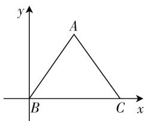
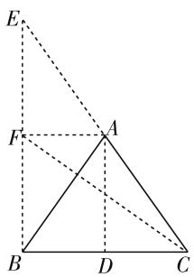

# 基于高中数学探究式阅读教学的实践与思考\*

—— 以一道浙江模拟题的多解与拓展为例

# - 江苏省海门中学 樊陈卫

平面向量一直是每年高考、自主招生、竞赛等考试中考查的热点与重点问题之一。而以三角形为问题背景，利用平面向量的相关知识来巧妙设置问题，变化多端，创新性强，新颖性高，也是数学中知识交汇与融合的理想载体，是考试中能力齐全、方法多样、思维各异的主战场。

# 一、问题呈现

问题:(2020届浙江省十校联盟2019年10月高三联考·9)在 $\triangle ABC$ 中,若 $\overrightarrow{AB}\cdot\overrightarrow{BC}=\overrightarrow{BC}\cdot\overrightarrow{CA}=2\overrightarrow{CA}\cdot\overrightarrow{AB}$ ,则 $\frac{|\overrightarrow{AB}|}{|\overrightarrow{BC}|}=(\quad)$ .

A. 1 B. $\frac{\sqrt{2}}{2}$ C. $\frac{\sqrt{3}}{2}$ D. $\frac{\sqrt{6}}{2}$

此题以三角形为问题背景,利用三条边所对应的平面向量的数量积的构建关系式,进而达到有机确定对应的三角形,得以求解相应边的比值.如何巧妙转化三条边所对应的平面向量的数量积的关系式,是破解此题的关键.结合相关的平面向量的数量积的关系式,可以通过解三角形、坐标或平面几何等相关的角度来处理,结合相应的知识来处理与转化,回归本源.

# 二、问题破解

方法 1: 解三角形法

解: 由 $\overrightarrow{AB} \cdot \overrightarrow{BC} = \overrightarrow{BC} \cdot \overrightarrow{CA} = 2\overrightarrow{CA} \cdot \overrightarrow{AB}$ ，可得 $\overrightarrow{BA} \cdot \overrightarrow{BC} = \overrightarrow{CB} \cdot \overrightarrow{CA} = 2\overrightarrow{AC} \cdot \overrightarrow{AB}$ ，结合平面向量的数量积定义，可得 $ac\cos B = ab\cos C = 2bc\cos A$ 。由 $ac\cos B = ab\cos C$ ，可得 $c\cos B = b\cos C$ ，结合投影定理可得 $\triangle ABC$ 为等腰三角形，且 b = c。又由 $ab\cos C =$ $2bc\cos A$ ，可得 $a\cos C = 2c\cos A$ ，结合余弦定理可得 $a\cdot \frac{a^2 + b^2 - c^2}{2ab} = 2c\cdot \frac{b^2 + c^2 - a^2}{2bc}$ 整理有 $3a^{2} = 4b^{2}$ ，可得 $\frac{b}{a} = \frac{\sqrt{3}}{2}$ 所以 $\frac{|\overrightarrow{AB}|}{|\overrightarrow{BC}|} = \frac{c}{a} = \frac{b}{a} = \frac{\sqrt{3}}{2}$ 故选C.

点评: 解三角形法是处理三角形问题最常用的方法与技巧, 也是有效链接三角形与平面向量相关知识的一大工具. 借助平面向量数量积的定义, 把对应的平面向量的数量积的关系式加以有效转化, 利用三角形中边、角的关系的应用, 再结合解三角形的相关知识, 借助正弦定理、余弦定理等相关知识来分析与解决.

方法 2: 坐标法

解: 由 $\overrightarrow{AB} \cdot \overrightarrow{BC} = \overrightarrow{BC} \cdot \overrightarrow{CA} = 2\overrightarrow{CA} \cdot \overrightarrow{AB}$ ，可得 $\overrightarrow{BA} \cdot \overrightarrow{BC} = \overrightarrow{CB} \cdot \overrightarrow{CA} = 2\overrightarrow{AC} \cdot \overrightarrow{AB}$ ，如图1所示，以 B 为坐标原点，BC 所在直线为 x 轴建立平面直角坐标系，不妨设 BC = 2，则有 $B(0,0),C(2,0)$ ，设 $A(x,y)$ .由 $\overrightarrow{BA}\cdot \overrightarrow{BC} = \overrightarrow{CB}$ $\cdot \overrightarrow{CA}$ ，可得 $(x,y)\cdot (2,0) = (-2,0)\cdot (x - 2,y)$ ，则有 $2x = -2(x - 2)$ ，解得 $x = 1$ .又由 $\overrightarrow{BA}\cdot \overrightarrow{BC} = 2\overrightarrow{AC}$ $\cdot \overrightarrow{AB}$ ，可得 $(x,y)\cdot (2,0) = 2(2 - x, - y)\cdot (-x,$ $-y)$ ，则有 $2x = 2[-x(2 - x) + y^2 ]$ ，整理有 $y^{2} = 2$ 可得 $|\overrightarrow{AB}| = \sqrt{x^2 + y^2} = \sqrt{3}$ ，所以 $\frac{|\overrightarrow{AB}|}{|\overrightarrow{BC}|} = \frac{\sqrt{3}}{2}$ 故选C.

text_image

y
A
B
C x

图1

点评:坐标法是平面向量“代数”化的充分体现,是基于可以方便建系的前提下合理进行的.通过三角形特征建立相应的平面直角坐标系,设出相应的点的坐标,把对应的平面向量的数量积的关系式进行代数化处理,进而确定相应的参数值,为进一步破解相关边长的比值提供条件.

# 方法 3: 平面几何法

解:由 $\overrightarrow{AB} \cdot \overrightarrow{BC} = \overrightarrow{BC} \cdot \overrightarrow{CA}$ ，可得 $\overrightarrow{BC} \cdot (\overrightarrow{AB} - \overrightarrow{CA}) = \overrightarrow{BC} \cdot (\overrightarrow{AB} + \overrightarrow{AC}) = 0$ ，如图2所示，取 BC 的中点 D，可得 $\overrightarrow{AB} + \overrightarrow{AC} = 2\overrightarrow{AD}$ ，则有 $BC \perp AD$ ，可得 AB = AC。又由 $\overrightarrow{AB} \cdot \overrightarrow{BC} = 2\overrightarrow{CA} \cdot \overrightarrow{AB}$ ，可得 $\overrightarrow{AB} \cdot (2\overrightarrow{CA} - \overrightarrow{BC}) = \overrightarrow{AB} \cdot (2\overrightarrow{CA} + \overrightarrow{CB}) = 0$ ，将 CA 延长到E, 满足 CE=2CA, 取 BE 的中点 F, 可得 $2\overrightarrow{CA}+\overrightarrow{CB}=2\overrightarrow{CF}$ , 则有 $AB \perp CF$ , 则知 A, D, F 分别是 CE, BC, BE 的中点, 且 $BC \perp AD, AB \perp CF$ , 不妨设 BC=2, 则有 AF=1, 可得 $\triangle AFB \sim \triangle FBC$ , 则有 $\frac{AF}{FB}=\frac{FB}{BC}$ , 解得 $FB=\sqrt{2}$ , 可得 $AB=\sqrt{3}$ , 所以 $\frac{|\overrightarrow{AB}|}{|\overrightarrow{BC}|}=\frac{\sqrt{3}}{2}$ . 故选 C.

text_image

Geometric diagram with labeled points A, B, C, D, E, F and dashed/solid lines forming triangles and quadrilaterals

图2

点评:平面几何法是三角形问题的本质所在,是用于破解平面向量相关问题的一种技巧方法,也是平面向量“形”的有机体现.利用题目条件中的有关平面向量的数量积的关系式进行合理转化,利用数量积的几何意义转化为“形”的表述,进而有效利用平面几何知识来分析与处理,达到以“形”解“数”的目的.

# 三、变式拓展

探究 1: 改变有关平面向量的数量积的关系式中的常数为一般性系数, 可以得到更具一般性的变式问题.

变式 1: 在 $\triangle ABC$ 中, 若 $\overrightarrow{AB} \cdot \overrightarrow{BC} = \overrightarrow{BC} \cdot \overrightarrow{CA} = \lambda \overrightarrow{CA} \cdot \overrightarrow{AB} (\lambda > 0)$ , 则 $\frac{|\overrightarrow{AB}|}{|\overrightarrow{BC}|} = \_$ .

解析: 由 $\overrightarrow{AB} \cdot \overrightarrow{BC} = \overrightarrow{BC} \cdot \overrightarrow{CA} = \lambda \overrightarrow{CA} \cdot \overrightarrow{AB}$ ，可得 $\overrightarrow{BA} \cdot \overrightarrow{BC} = \overrightarrow{CB} \cdot \overrightarrow{CA} = \lambda \overrightarrow{AC} \cdot \overrightarrow{AB}$ ，如图1所示，以 B 为坐标原点，BC 所在直线为 x 轴建立平面直角坐标系，不妨设 BC = 2，则有 $B(0,0)$ ， $C(2,0)$ ，设 $A(x,y)$ 。由 $\overrightarrow{BA} \cdot \overrightarrow{BC} = \overrightarrow{CB} \cdot \overrightarrow{CA}$ ，可得 $(x,y) \cdot (2,0) = (-2,0) \cdot (x-2,y)$ ，则有 $2x = -2(x-2)$ ，解得 x = 1。又由 $\overrightarrow{BA} \cdot \overrightarrow{BC} = \lambda \overrightarrow{AC} \cdot \overrightarrow{AB}$ ，可得 $(x,y) \cdot (2,0) = \lambda (2-2)$ 。$x, -y) \cdot (-x, -y)$ , 则有 $2x = \lambda[-x(2 - x) + y^2]$ , 整理有 $y^2 = 1 + \frac{2}{\lambda}$ , 可得 $|\overrightarrow{AB}| = \sqrt{x^2 + y^2} = \sqrt{2 + \frac{2}{\lambda}}$ , 所以 $\frac{|\overrightarrow{AB}|}{|\overrightarrow{BC}|} = \frac{\sqrt{2 + \frac{2}{\lambda}}}{2}$ . 故填答案: $\frac{\sqrt{2 + \frac{2}{\lambda}}}{2}$ .

点评:借助坐标法来处理以上变式问题,思维自然,操作方便.当然,变式1的破解也可以利用解三角形法等其他方法来处理.其实,当 $\lambda=2$ 时,变式1所对应的特例就是原问题,此时 $\frac{|\overrightarrow{AB}|}{|\overrightarrow{BC}|}=\frac{\sqrt{2+\frac{2}{\lambda}}}{2}=\frac{\sqrt{3}}{2}.$

探究 2: 保留问题的条件, 转变问题求解的角度, 化对应边的比值为相关角的余弦值问题, 得以变式与拓展.

变式 2: 在 $\triangle ABC$ 中, 若 $\overrightarrow{AB} \cdot \overrightarrow{BC} = \overrightarrow{BC} \cdot \overrightarrow{CA} = 2\overrightarrow{CA} \cdot \overrightarrow{AB}$ , 则 $\cos \angle ABC =$ \_\_\_\_.

解析: 由 $\overrightarrow{AB} \cdot \overrightarrow{BC} = \overrightarrow{BC} \cdot \overrightarrow{CA}$ , 可得 $\overrightarrow{BC} \cdot (\overrightarrow{AB} - \overrightarrow{CA}) = \overrightarrow{BC} \cdot (\overrightarrow{AB} + \overrightarrow{AC}) = 0$ , 如图 2 所示, 取 $BC$ 的中点 $D$ , 可得 $\overrightarrow{AB} + \overrightarrow{AC} = 2\overrightarrow{AD}$ , 则有 $BC \perp AD$ , 可得 $AB = AC$ . 又由 $\overrightarrow{AB} \cdot \overrightarrow{BC} = 2\overrightarrow{CA} \cdot \overrightarrow{AB}$ , 可得 $\overrightarrow{AB} \cdot (2\overrightarrow{CA} - \overrightarrow{BC}) = \overrightarrow{AB} \cdot (2\overrightarrow{CA} + \overrightarrow{CB}) = 0$ , 将 $CA$ 延长到 $E$ , 满足 $CE = 2CA$ , 取 $BE$ 的中点 $F$ , 可得 $2\overrightarrow{CA} + \overrightarrow{CB} = 2\overrightarrow{CF}$ , 则有 $AB \perp CF$ , 则知 $A, D, F$ 分别是 $CE, BC, BE$ 的中点, 且 $BC \perp AD, AB \perp CF$ , 不妨设 $BC = 2$ , 则有 $AF = 1$ , 可得 $\triangle AFB \sim \triangle FBC$ , 则有 $\frac{AF}{FB} = \frac{FB}{BC}$ , 解得 $FB = \sqrt{2}$ , 可得 $AB = \sqrt{3}$ , 所以 $\cos \angle ABC = \frac{BD}{AB} = \frac{1}{\sqrt{3}} = \frac{\sqrt{3}}{3}$ . 故填答案: $\frac{\sqrt{3}}{3}$ .

点评:结合题目条件可知 $\triangle ABC$ 是一个等腰三角形,且 AB = AC. 因而求解三角形的两边的比值 $\frac{|\overrightarrow{AB}|}{|\overrightarrow{BC}|}$ 就可以直接转化为求解相关角的余弦值问题. 实际上,结合平面几何图形的直观,有关系式 $\frac{|\overrightarrow{AB}|}{|\overrightarrow{BC}|} = \frac{1}{2\cos B}$ 成立. (下转第 66 页)

$\frac{1}{\sqrt{3}}$ ，所以 $g\left(\frac{1}{\sqrt[3]{2n + 1}}\right) <   g\left(\frac{1}{\sqrt[3]{2n - 1}}\right)$ ，即 $a_{n} <   b_{n}$

证法2: $a_{n}-b_{n}=\frac{1}{2n+1}-\frac{1}{2n-1}-\left(\frac{1}{\sqrt{(2n+1)^{3}}}-\right.$

$$
\begin{array}{l} \left. \frac {1}{\sqrt {(2 n - 1) ^ {3}}}\right) = b ^ {2} - a ^ {2} - \left(b ^ {3} - a ^ {3}\right) \\ = (a - b) \left(a ^ {2} + b ^ {2} + a b - a - b\right) \\ = (a - b) \left[ \left(a ^ {2} + \frac {a b}{2} - a\right) + \left(b ^ {2} + \frac {a b}{2} - b\right) \right] \\ = (a - b) \left[ a \left(a + \frac {b}{2} - 1\right) + b \left(b + \frac {a}{2} - 1\right) \right]. \\ \end{array}
$$

因为 $b + \frac{a}{2} - 1 < a + \frac{b}{2} - 1 < \frac{3a}{2} - 1 < \frac{3}{2\sqrt{3}} -$

$1=\frac{\sqrt{3}}{2}-1<0$ , 所以 $a\left(a+\frac{b}{2}-1\right)+b\left(b+\frac{a}{2}-1\right)<0$ , 于是 $a_{n}<b_{n}$ .

证法3: 令 $g(b) = a^2 + b^2 + ab - a - b$ ，则 $g'(b) = 2b + a - 1 = 0 \Rightarrow b = \frac{1 - a}{2}$ ，所以 $g(b) \leqslant \max\{g(0), g(a)\} = \max\{a^2 - a, 3a^2 - 2a\}$ .

因为 $0 < a \leqslant \frac{1}{\sqrt{3}}$ ，则 $a^2 - a = a(a - 1) < 0, 3a^2$

$-2a=3a\left(a-\frac{2}{3}\right)\leqslant3a\left(\sqrt{\frac{1}{3}}-\sqrt{\frac{4}{9}}\right)<0$ ，所以 $g(b)=a^{2}+b^{2}+ab-a-b<0.$

所以 $a_{n} < b_{n}$

# 4. 补充适量练习, 扩大讲评“战果”

一堂试卷讲评课的结束，并不是试卷主讲的终结，教师还应“趁热打铁”，扩大“战果”，有针对性地布置适量的练习作业，内容主要是对某些重要知识点、共性错误试题进行多角度的改编，使旧题变成新题。完成这些练习题将有利于学生对讲评要点的巩固和提高，有利于反馈课堂教学信息，极大地增强试卷讲评课的有效性。

总之,为了更好地提高数学试卷讲评课的有效性,我们教师应该认真进行备课,分析学生出现普遍性错误的原因,从而确定讲评的内容和讲解的重点.在讲评中,我们要充分发挥教师的主导作用和学生的主体作用,让学生在丰富多彩的课堂活动中,培养自己对问题的反思能力.只要我们师生共同努力,做到“教学相长”,就一定能极大地提高数学试卷讲评课的有效性,充分发挥考试的作用,提高教学效果.W

# (上接第29页)

探究 3: 改变有关平面向量的数量积的关系式中的常数为一般性系数, 同时又化对应边的比值为相关角的余弦值问题, 得以更具有一般性的拓展与提升.

变式 3: 在 $\triangle ABC$ 中, 若 $\overrightarrow{AB} \cdot \overrightarrow{BC} = \overrightarrow{BC} \cdot \overrightarrow{CA} = \lambda \overrightarrow{CA} \cdot \overrightarrow{AB} (\lambda > 0)$ , 则 $\cos B = \_$ .

解析:结合变式2的点评,可知 $\frac{|\overrightarrow{AB}|}{|\overrightarrow{BC}|}=\frac{1}{2\cos B}$ ,由变式1知 $\frac{|\overrightarrow{AB}|}{|\overrightarrow{BC}|} = \frac{\sqrt{2 + \frac{2}{\lambda}}}{2}$ .

所以 $\cos B=\frac{1}{2\times\frac{\sqrt{2+\frac{2}{\lambda}}}{2}}=\frac{1}{\sqrt{2+\frac{2}{\lambda}}}$ . 故填答案:

$$
\frac {1}{\sqrt {2 + \frac {2}{\lambda}}}.
$$

点评: 直接利用变式 1 的结论与变式 2 的点评, 可以较快处理此题. 当然本题也可以利用以上相关的方法加以直接分析与处理, 也能得以有效解决.

# 四、规律总结

涉及三角形与平面向量的综合与交汇问题,同时具有“形”与“数”的功能,可以利用三角形与平面向量的相关知识,从“形”或从“数”的角度都可以得以很好转化与破解.所以,在三角形与平面向量的综合问题中,充分提高三角形与平面向量的识“图”、用“图”能力,拓展三角形与平面向量的用“数”、解“数”思维,可以非常有效地从“数”的方面或从“形”的方面培养三角形与平面向量的多解思维,达到多角度思维、多方法处理、多方向拓展.W