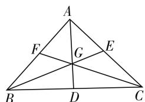
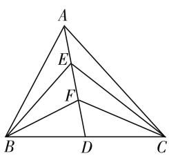
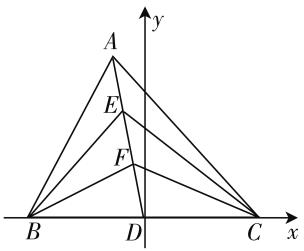

# 平面向量部分解题研究

# 湖北省枣阳市第一中学 陈刚明

平面向量部分内容是高中数学教学的重要组成部分,也是近代数学中的重要概念.向量部分知识还具有较强的工具性,它能够沟通代数、几何和三角函数三部分知识,它与几何部分知识密切相关,是解决几何问题的一种重要工具.学好向量部分知识,对学生提高数学解题能力具有重要意义.

# 一、平面向量部分知识概述

根据教材的设置和多年的教学经验,我们可以将平面向量部分知识分为四部分:第一,就是向量垂直的判定,其中主要包括几何法 $a \cdot b = 0$ 和坐标法 $a \cdot b = (x_{1}, y_{1}) \cdot (x_{2}, y_{2})$ 两种方法.第二,就是向量共线的判定,主要包括几何法 a = kb、坐标法 $(x_{1}, y_{1}) = k(x_{2}, y_{2})$ 和三点共线定理 (A、B、C 三点共线,则存在 $\lambda + \mu = 1$ 使得 $\overrightarrow{OC} = \lambda \overrightarrow{OA} + \mu \overrightarrow{OB}$ ). 第三,就是求目标向量的模长,主要包括几何法 $|a|^{2} = a \cdot a$ 和坐标法 $|a|^{2} = (x_{1}, y_{1}) \cdot (x_{1}, y_{1}) = x_{1}^{2} + y_{1}^{2}$ . 第四,就是求两个向量的夹角,主要包括几何法 $\cos\langle a, b \rangle = \frac{a \cdot b}{|a| \cdot |b|}$ 和坐标法 $\cos\langle a, b \rangle = \frac{x_{1} \cdot x_{2} + y_{1} \cdot y_{2}}{\sqrt{x_{1}^{2} + y_{1}^{2}} \cdot \sqrt{x_{2}^{2} + y_{2}^{2}}}$ 两种方法.

# 二、平面向量解题方法

# 1. 几何法

几何法是通过建立平面几何与向量之间的关系，将几何问题与向量问题进行灵活转化，进而求解的过程。一般情况下，在利用几何法进行向量求解的过程中，可以仿照笛卡儿建立解析几何的思路进行求解：首先，在平面几何中设定一个方向，这样结合图形中的线段就可以用向量表示出来。然后，将平面中各线段之间的关系转化成代数运算关系，以此来解决图形的平移、相似、垂直等问题。最后，将向量运算的结果转化为几何关系。需要注意的是，在利用几何法进行求解的过程中，应用局限性较强，当图形中的线段涉及的数量关系较多，关系不明朗的时候，就很难找到解题的突破口,我们一旦确立了方向和数量关系,需要做进一步的分析,使问题表征更加清晰.

# 2. 基底法

基底法与单增在《数学解题研究》中提出的基本量概念相似,都是在寻找问题中的基本量,平面向量基本定理就是围绕着这一思想展开的,在任意一个平面中,如果选定了一组基底,那么平面中的其他向量都可以通过这一组基底表示出来.因此,在利用基底法进行求解的过程中主要是围绕这一组基底展开.在具体的解题过程中,如果已知基底的模和夹角,我们就可以将向量的运算转化为代数运算,然后借助方程进行求解.一般情况下,在使用基底法解决向量问题时主要过程如下:首先,将要研究的几何图形向量化,在向量化的图形中选择两个不共线的向量作为基底向量.然后,以这一基底向量为基础,将其他的目标向量表示出来.第三,借助向量运算来厘清图形中的几何关系,并把运算的结果向基底靠拢.最后,再将运算出来的结果转化为几何关系.在具体的应用中需要注意:由于我们在解题过程中选取的基底向量不同,因此其他向量的表示方法也不尽相同,有时候即使能够完成解题,运算量也较大,寻找最佳的基底是解题的关键.因此,在平时的教学过程中,要培养学生正确寻找基底的能力,同时还要加强学生计算能力的训练,进而提高解题的正确率.

例 1 如图 1, 在 $\triangle ABC$ 中, AD, BE, CF 分别为 $\triangle ABC$ 的中线, 求证: AD, BE, CF 相交于一点.

问题分析:拿到这一问题后,我们第一感觉就会联想到:要证明两条直线共线,我们需要证明这两条直线上的两个点重合;要证明两点重合就需要去证明所在图形全等,

text_image

A
F
G
E
B
D
C

图 1

这样的话,解题过程非常烦琐,已经超出了一般学生的思维能力.在向量空间中,我们只需要去证明它们在具有共同起点下还具有成倍数量关系即可.题目中要求AD,BE,CF相交于一点,我们只需要证明 $\overrightarrow{AD}=$ $k\overrightarrow{AG}$ 即可，为了能够对这两个向量建立起联系，我们可以借助基底法，寻找出一组基底将 $\overrightarrow{AD}$ 和 $\overrightarrow{AG}$ 表示出来，这样就能够相对容易地证明 $\overrightarrow{AD}=k\overrightarrow{AG}$ . 通过对图像的观察和对题目的思考，我们可以将 $\overrightarrow{AB}$ 和 $\overrightarrow{AC}$ 作为基底，因为 D 为 BC 的中点，那么 $\overrightarrow{AD}=\frac{1}{2}\overrightarrow{AB}+\frac{1}{2}\overrightarrow{AC}$ ，又因为 B,G,E 三点在一条直线上，那么 $\overrightarrow{AG}=x_{1}\overrightarrow{AB}+y_{1}\overrightarrow{AE},x_{1}+y_{1}=1$ ，进一步化简可得 $\overrightarrow{AG}=x_{1}\overrightarrow{AB}+\frac{1}{2}y_{1}\overrightarrow{AC}$ . 又因为 C,G,F 三点在一条直线上，那么 $\overrightarrow{AG}=x_{2}\overrightarrow{AF}+y_{2}\overrightarrow{AC},x_{2}+y_{2}=1$ ，进一步化简可得 $\overrightarrow{AG}=\frac{1}{2}x_{2}\overrightarrow{AB}+y_{2}\overrightarrow{AC}$ ，化简可得 $x_{1}\overrightarrow{AB}+\frac{1}{2}y_{1}\overrightarrow{AC}=\frac{1}{2}x_{2}\overrightarrow{AB}+y_{2}\overrightarrow{AC}.x_{1}=\frac{1}{2}x_{2},\frac{1}{2}y_{1}=y_{2}$ ，那么 $x_{1}=\frac{1}{3},y_{1}=\frac{2}{3}.$ 解得 $\overrightarrow{AG}=\frac{1}{3}\overrightarrow{AB}+\frac{1}{3}\overrightarrow{AC}.$ $\overrightarrow{AD}=\frac{1}{2}\overrightarrow{AB}+\frac{1}{2}\overrightarrow{AC}=\frac{3}{2}\overrightarrow{AG}$ ，那么线段 AG 和 AD 共线.

# 3. 坐标法

在利用基底法解决问题的时候,我们需要准确地寻找便捷的基底,同时还要考虑如何去优化运算程序和运算结果.为了简化运算,我们可以通过构建垂直向量的方式来达到目的.另外,我们可以选择基底模均为1,这样运算结果只与系数有关.为此,我们根据平面解析几何中的知识,在平面内建立平面直角坐标系,选择与x轴和y轴重合的两个单位向量i,j作为基底,然后就可以通过向量i,j来表示平面中任一向量.以此,我们就可以得到一个映射, $a = xi + yj$ 中a与有序数对 $(x,y)$ 可以建立一一对应的关系,我们就将有序数对 $(x,y)$ 叫做向量a的坐标,进而成为向量运算的坐标法.借助坐标法,我们能够将向量问题彻底转化为代数问题,并且运算结果和运算过程相对较为简化.从本质上来说,坐标法可以看做基底法的一种特殊情况.一般情况下,利用坐标法解决向量问题时,首先,在目标几何图形所处的平面中选择一组相互垂直的向量作为基底,并将这组基底单位化,建立平面直角坐标系.第二,在平面直角坐标系中,表示出几何图形中各点的坐标,同时转化从原点到该点的向量坐标.第三,通过对平面向量的运算,去求目标向量的坐标.最后,将向量之间的运算转化为坐标之间的运算,再将最终的运算结果转化为几何关系.

例 2 如图 2 所示, 在 $\triangle ABC$ 中, AD 为 BC 的中线，E, F 分别是线段 AD 上的两个不同的三等分点，连接 BE, BF, CE, CF. 已知 $\overrightarrow{BA} \cdot \overrightarrow{CA} = 4, \overrightarrow{BF} \cdot \overrightarrow{CF} = -1$ ，求： $\overrightarrow{BE} \cdot \overrightarrow{CE}$ .

text_image

A
E
F
B
D
C

图2

text_image

A
E
F
B
D
C
x
y

图3

问题分析:根据题意先建立直角坐标系,由于题目和图形中并没有给出直角的相关信息,我们需要另外寻找突破口,题中“已知AD为BC的中线”,那么我们可以借助对称的特性,以D为原点建立直角坐标系.根据坐标系的设置,目标各点可表示为:D(0,0),设C(a,0),B(-a,0),A(b,c),因为“E,F分别是线段AD上的两个不同的三等分点”那么 $E\left(\frac{2}{3}b,\frac{2}{3}c\right)$ , $F\left(\frac{1}{3}b,\frac{1}{3}c\right)$ .目标向量用坐标表示可得: $\overrightarrow{BA}=(a+b,c),\overrightarrow{CA}=(b-a,c),\overrightarrow{BF}=\left(\frac{1}{3}b+a,\frac{1}{3}c\right),\overrightarrow{BE}=\left(\frac{2}{3}b+a,\frac{1}{3}c\right),\overrightarrow{CF}=\left(\frac{1}{3}b-a,\frac{1}{3}c\right),\overrightarrow{CE}=\left(\frac{2}{3}b-a,\frac{2}{3}c\right)$ ,然后对坐标表示的向量进行运算 $\overrightarrow{BA}\cdot\overrightarrow{CA}=b^{2}+c^{2}-a^{2}=4,\overrightarrow{BF}\cdot\overrightarrow{CF}=\frac{1}{9}b^{2}+\frac{1}{9}c^{2}-a^{2}=-1,\overrightarrow{BE}\cdot\overrightarrow{CE}=\frac{4}{9}b^{2}+\frac{4}{9}c^{2}-a^{2}$ ,根据上式就可以求出 $\overrightarrow{BE}\cdot\overrightarrow{CE}=\frac{7}{8}$ .

# 三、小结

平面向量部分教学内容是高中数学教学的重要组成部分,该部分内容具有较强的工具性,它能够沟通几何、代数、三角函数等部分的知识,是学生数学学习的重要保障.另外,平面向量部分解题方法的选择直接关系着做题的效率,很多时候学生会因为没有选择正确的解题方法导致运算量过大,而出现解题错误,还有些学生会因为没有找到解题思路而不能够得分,向量部分知识也是学生解题的一个难点.因此,在高中数学教学中,教师要将向量教学中常见的几种解题方法及它们的应用条件,给学生讲清楚,提高学生向量部分的解题能力.F