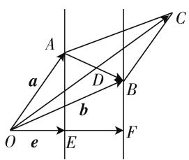

# 开展研究学习,自主探索问题

—— 对一道向量最值问题的研究型教学设计与思考

● 广东省深圳市龙华高级中学 刘勃

向量最值问题是高中数学较为典型的问题,其解法和思路具有一定的代表性,具有极高的研究价值.下面通过讲解一道向量最值问题的研究型学习过程来浅谈学生自主探究、主动构建知识框架、获取解题方法的教学策略.

# 一、问题引入，思路启迪

# 1. 问题引入

问题: a, b, c 是三个平面向量, e 为单位向量, 如果三向量之间满足条件: $a \cdot e = 1$ , $b \cdot e = 2$ , $a \cdot b = 3$ , 那么 $|a + b|$ 的最小值为 \_\_\_\_.

本向量最值问题中引入了单位向量 e，条件是关于向量的数量积，需要从向量的数量积入手来分析向量和的模的最小值，常规来看需要采用对应的转化策略。虽然问题较为简单直接，但实则含有丰富的知识技巧，同时富含一定的思想方法，要善于读题分析。

# 2. 思维启发

从学生的解答情况来看主要存在两大类问题:一是基础知识掌握不到位,对向量知识的相关定理和运算法则运用不娴熟;二是转化技巧缺失,不能精准定位向量数量积问题的通性通法,难以从条件中提炼核心内容.

基于上述学情分析,在实际教学中需要设置两个引导环节,一是回顾向量的运算方法,二是启发学生探究与向量数量积相关的最值问题的解法策略.

设问 1: 回顾向量积的运算法则, 如何进行坐标运算?

教学引导:教学时引导学生写出向量积的相关法则,然后结合直角坐标系来完成坐标运算,并将其推广到一般情形下,如 $\boldsymbol{a}=(a_{1},a_{2}),\boldsymbol{b}=(b_{1},b_{2})$ , 则 $a\cdot b=a_{1}b_{1}+a_{2}b_{2}$ .

设问 2: 对于与向量数量积相关的计算问题, 思路构建的策略有哪些?

教学引导:引导时可以从两个方向进行:一是按照向量数量积处理的思路,显然可以利用平面向量的基本定理,利用运算性质来转化条件,也可以建立相应的坐标系,实现向量坐标化;二是按照向量的属性进行引导,向量具有代数和几何的双重特性,因此在解题时可以向代数方向转化,也可以利用向量的几何意义进行解题.

# 二、教学引导，解法探究

在解法探究阶段需要按照上述探索的解题思路，结合问题特点开展多解探究，使学生充分感受思路探讨的重要性.

解法 1: 利用向量的运算法则、相应的性质来突破.

根据已知条件,利用相应的运算性质,结合向量数量积的定义可获得条件 $|b-a|\geqslant1$ ,后续只需要结合模的关系式变换法则来分析最值即可.

因此,教学中可以进行如下追问引导:

① 对于条件“ $a \cdot e = 1, b \cdot e = 2, a \cdot b = 3$ ”，从中可以提炼出哪些结论？

由于 $a \cdot e = 1, b \cdot e = 2$ ，可得 $(b - a) \cdot e = b \cdot e - a \cdot e = 1$ ，则有 $|b - a| \geqslant 1$ ，当且仅当 $b - a$ 与单位向量 $e$ 的方向一致时等号成立.

② 对于向量模的平方 $\left|a+b\right|^{2}$ ，如何处理可建立与 $\left|b-a\right|^{2}$ 之间的关联，能得出什么结论？

$\left|a+b\right|^{2}=\left|a-b\right|^{2}+4a\cdot b\geqslant13$ ，因此 $\left|a+b\right|\geqslant\sqrt{13}$ ，当且仅当b-a与单位向量e的方向一致时等号成立，即 $\left|a+b\right|$ 的最小值为 $\sqrt{13}$ .

解法 2: 设出向量坐标, 利用向量数量积的坐标运算完成问题转化.

问题涉及三个向量, 可设单位向量 $e=(1,0)$ , 根据条件来设出向量 a, b 的坐标, 利用向量数量积的坐标运算可以提炼出关于向量 a, b 坐标参数之间的关系式, 然后结合向量模运算和基本不等式性质即可解决对应的最值问题.

教学中可以进行如下设问引导：

① 若设向量 $e = (1,0)$ ，根据条件“ $a \cdot e = 1, b \cdot e = 2$ ”，如何利用参数 $m$ 和 $n$ 来设出向量 $a, b$ 的坐标？

由于 $\boldsymbol{e}=(1,0)$ ，则可设 $\boldsymbol{a}=(1,m)$ ， $\boldsymbol{b}=(2,n)$ .

② 根据条件“ $a \cdot b = 3$ ”可得出什么结论？

已知 $a \cdot b = 3$ ，则 $a \cdot b = 2 + mn = 3$ ，即 mn = 1，而 $a + b = (3, m + n)$ ，所以 $|a + b| = \sqrt{9 + (m + n)^{2}}$ .

③mn=1, 如何求代数式 $\sqrt{9+(m+n)^{2}}$ 的取值范围?

利用不等式的基本性质, 可知 $\sqrt{9+(m+n)^{2}} \geqslant \sqrt{9+4mn} = \sqrt{13}$ ，当且仅当 $m = n = \pm 1$ 时等号成立，则 $|a + b|$ 的最小值为 $\sqrt{13}$ .

解法 3: 利用向量的几何属性, 根据向量数量积的投影定义来分析.

上述两种解法主要将向量向代数方向转化,根据分析可知同样可以利用向量数量积的几何意义进行分析,转化为动点分析问题.具体思路:数形结合,利用数量积的投影来定义向量a和b的终点A和B的位置变化,然后通过恒等变化来确定模的关系.

教学中进行如下设问引导：

① 根据条件构建图 1 所示图像, 其中取 $\overrightarrow{OE} = e$ , 结合条件可确定向量 a 和 b 终点的运动情况是什么?

$\overrightarrow{OE}=e$ , 已知 $a \cdot e=1$ , $b \cdot e=2$ , 结合向量数量积的投影定义可知, 向量 a 和 b 终点 A 和 B 分别在 OE 的垂线 AE, BF 上运动, 且 OE = EF = 1, 而 $\overrightarrow{OC} = a + b$ , $|AB| \geqslant 1$ .

text_image

A
a
D
B
C
b
O
e
E
F

图 1

② 根据图中条件如何用 $a + b$ 和已知向量来转化 $a \cdot b$ ?

根据极化恒等式可得

$$
\boldsymbol {a} \cdot \boldsymbol {b} = \frac {(\boldsymbol {a} + \boldsymbol {b}) ^ {2} - (\boldsymbol {a} - \boldsymbol {b}) ^ {2}}{4} = \frac {(\boldsymbol {a} + \boldsymbol {b}) ^ {2} - \overrightarrow {B A ^ {2}}}{4}.
$$

③已知 $|AB|\geqslant1$ ，求 $\frac{(a+b)^{2}-\overrightarrow{BA^{2}}}{4}$ 的取值范围？

$|a+b|^{2}=4a\cdot b+\overrightarrow{BA^{2}}\geqslant13$ ，所以 $|a+b|\geqslant\sqrt{13}$ ，当且仅当 $\overrightarrow{AB}$ 与单位向量e的方向一致时等号成立，则 $|a+b|$ 的最小值为 $\sqrt{13}$ .

# 三、深入思考,问题变式

对问题进行变式探讨是试题教学的关键环节,也是拓展学生思维的有效方式,而在问题变式时需要基于考题核心,按照一定的变式方向进行.

变式 1: 围绕向量数量积的坐标运算进行变式.

问题: 已知 a, b, c 是三个平面向量, e 为单位向量, 满足条件 $a \cdot b = 3$ , 若设 $a = (1, m)$ , $b = (2, n)$ , 则 $|a + b|$ 的最小值为 \_\_\_\_.

设计意义:该变式是围绕原问题解法2开展的,其核心内容就是考查学生对向量数量积坐标运算的掌握情况,其解法思路与解法2是完全一致的.

解题引导:教学时让学生回顾向量数量积的坐标运算,然后结合题目从中提炼与向量坐标参数相关的条件,结合不等式的性质加以突破.

变式 2: 围绕向量数量积与向量模开展变式.

问题:已知 a, b, c 是三个平面向量, e 为单位向量, 若满足 $a \cdot e = 1, b \cdot e = 2, |a - b| = 3$ , 则 $|a + b|$ 的最小值为 \_\_\_\_, $a \cdot b$ 的最小值为 \_\_\_\_.

设计意义:该变式是建立在向量数量积与向量模之间的关联上,目的在于考查学生对两者运算转化的掌握情况.

解题引导:教学中同样可以引入向量坐标,通过坐标运算来处理向量数量积,求解向量模,最终同样需要将其转化为代数不等式,需要关注其等号成立的条件.

# 四、教后反思，教学提升

# 1. 研究型的教学应确立学生的主体地位

本节课教学中设计了问题引入、思路启迪、多解探究和问题变式等环节，学生充分参与整个教学过程，进行了独立思考、合作交流，充分发挥了学生的主观能动性。教师引导、学生探究的方式有利于定义归纳、定理调用、知识综合等技能的强化，同时可使学生的思维得到极大的锻炼。上述解题教学中教师作为引导者，适时点拨、重点释义，不仅有利于构建和谐的课堂氛围，还可以有效提升课堂教学效率。

# 2. 课堂教学应注重学生思维的深层发展

课改提出要将学生的素质提升放在第一位,对于数学教学应重视学生的思维发展,不仅是培养学生的解题思维,还要注重培养学生的创新思维,拓展学生思维的维度和宽度.因此在实际教学中需要教师不断地优化教学方式,立足考题开展变式探究,让学生主动反思,自主构建,逐步形成自我的思维方式.同时教学中注意渗透数学思想,让学生感悟数学思想解决问题的内涵,实现思想与知识的融合,引导学生从“浅层思维”向“深层思维”递进,真正意义上获得思维能力的提升.F