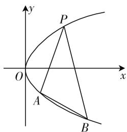

# 解析几何计算化简方法小结

● 江苏省宜兴市和桥高级中学 缪泽娟  
江苏省宜兴市和桥高级中学 吴艳炜

解析几何是高考必考内容,一般作为压轴题出现在高考或者各大模拟考试中,能有效考查学生的计算化简、转化与化归、信息挖掘等重要的数学能力,尤其是计算化简的能力.学生需要具备较强的计算能力,同时掌握一定的化简方法,才能高效高质量地解决解析几何问题,而恰恰很多学生缺少这方面的经验.因此本文将结合具体的例题(包括高考真题节选改编和经典模拟题)对解析几何计算化简方法进行一定的总结.

# 一、基本性质化简法

例 1 已知平面直角坐标系中有一双曲线 $\frac{x^{2}}{a^{2}} - \frac{y^{2}}{b^{2}} = 1 (a > 0, b > 0)$ ，其右支与抛物线（焦点为 F） $x^{2} = 2py (p > 0)$ 相交于不重合的两点 A, B，若已知关系式 $|AF| + |BF| = 4|OF|$ ，试求该双曲线渐近线的方程.

问题解答: 由抛物线的基本性质可得 $\left|AF\right| + \left|BF\right| = y_{A} + \frac{p}{2} + y_{B} + \frac{p}{2} = 2p$ ，即 $y_{A} + y_{B} = p$ ，①再联立双曲线和抛物线方程 $\left\{\begin{aligned}\frac{x^{2}}{a^{2}} - \frac{y^{2}}{b^{2}} &= 1, \\ x^{2} &= 2py,\end{aligned}\right.$ 可得 $a^{2}y^{2} - 2pb^{2}y + a^{2}b^{2} = 0$ ，故可得 $y_{A} + y_{B} = \frac{2pb^{2}}{a^{2}}$ 。②由①和②可得 $p = \frac{2pb^{2}}{a^{2}}$ ，可解得 $a = \sqrt{2}b$ ，所以所求的渐近线方程为 $y = \pm \frac{\sqrt{2}}{2}x$ 。

方法简评:圆锥曲线的定义明确具体,本身就附带有丰富的性质,因此在处理圆锥曲线背景下的解析几何问题时,不妨多利用其本身的几何或代数性质简化计算,如本题中通过利用抛物线的基本定义避免了复杂的距离计算,学生要对焦点、对称轴等特殊信息保持较高的敏感度,充分利用其固有的性质.

# 二、整体求解化简法

例 2 平面直角坐标系 xOy 中, 已知曲线 $C: y^{2} = 2px$ 经过点 $P(1,1)$ , 过 $\left(0, \frac{1}{2}\right)$ 作直线 l 与 C 相交于不重合的两点 M, N, 经过点 M 作横轴的垂线, 假设该垂线分别与直线 OP, ON 相交于 A, B, 求出 C 的方程以及对应的焦点坐标和准线方程, 并证明点 A 是 BM 的中点.

问题解答:(1)(本题重点不在该小问, 过程省略) $C: y^{2}=x$ , 焦点 $F\left(\frac{1}{4},0\right)$ , 准线为 $l_{1}: x=-\frac{1}{4}$ .

(2) 设直线 $l: y = kx + \frac{1}{2} (x \neq 0)$ ，将其与抛物线方程联立 $\left\{\begin{aligned} y &= kx + \frac{1}{2}, \\ y &= x, \end{aligned}\right.$ 可得方程 $4k^{2}x^{2} + (4k - 4)x + 1 = 0$ 。设 $M(x_{1}, y_{1}), N(x_{2}, y_{2})$ ，可得 $\left\{\begin{aligned} x_{1} + x_{2} &= \frac{1 - k}{k^{2}}, \\ x_{1}x_{2} &= \frac{1}{4k}, \end{aligned}\right.$ 易知 $l_{OP}: y = x, l_{ON}: y = \frac{y_{2}}{x_{2}}x$ ，联立可得 $B\left(x_{1}, \frac{y_{2}x_{1}}{x_{2}}\right)$ ，则可设 $A(x_{1}, y_{1})$ ，问题转化为证明 $y_{M} + y_{B} = 2y_{A}$ 。

代入得 $y_{1}+\frac{y_{2}x_{1}}{x_{2}}-2x_{1}=\frac{y_{1}x_{2}+y_{2}x_{1}-2x_{1}x_{2}}{x_{2}}$

$$
\begin{array}{l} = \frac {\left(k x _ {1} + \frac {1}{2}\right) x _ {2} + \left(k x _ {2} + \frac {1}{2}\right) x _ {1} - 2 x _ {1} x _ {2}}{x _ {2}} \\ = \frac {(2 k - 2) x _ {1} x _ {2} + \frac {1}{2} \left(x _ {1} + x _ {2}\right)}{x _ {2}} \\ = \frac {(2 k - 2) \cdot \frac {1}{4 k ^ {2}} + \frac {1 - k}{2 k ^ {2}}}{x _ {2}} = 0, \text {即} y _ {1} + \frac {y _ {2} x _ {1}}{x _ {2}} = \\ \end{array}
$$

$2x_{1}$ ，亦即 $y_{M} + y_{B} = 2y_{A}$ ，所以点 A 为 BM 的中点.

方法简评:上面的解法巧妙地运用了韦达定理,对 $x_{1}+x_{2}, x_{1}x_{2}$ 进行整体求解,再结合题设条件中的几何性质与代数关系,客观上避免了大量烦琐的计算,提高了解决问题的效率.

# 三、设而不求化简法

例3 已知 $O(0,0), R(-2,1), Q(2,1)$ ，若曲线 $C$ 上的任意一点 $M(x,y)$ 都满足关系式 $\mid \overrightarrow{MR} + \overrightarrow{MQ} \mid = \overrightarrow{OM} \cdot (\overrightarrow{OR} + \overrightarrow{OQ}) + 2$ ，又点 $A, B$ 在 $C$ 上且分别位于 $Q$ 的两边，以 $A, B$ 为切点作 $C$ 的切线 $l_1, l_2$ ，设这两条直线相交于点 $P$ . (1) 求 $C$ 的方程；(2) 若 $l_{AB}$ 经过 $(0,1)$ ，试证明点 $P$ 的轨迹是一条定直线.

问题解答:(1) $x^{2}=4y$ .(过程略)

(2) 由 $x^{2} = 4y$ 可得 $y = \frac{1}{4} x^{2}$ , 则 $y' = \frac{1}{2} x$ , 设 $A(x_{1}, y_{1}), B(x_{2}, y_{2}), P(x_{0}, y_{0})$ , 则 $l_{PA}$ 的斜率是 $\frac{1}{2} x_{1}$ , 则 $l_{PA}: y - y_{1} = \frac{x_{1}}{2}(x - x_{1})$ , 即 $x_{1}x - 2y - 2y_{1} = 0$ . 同理可得 $l_{PB}: x_{2}x - 2y - 2y_{2} = 0$ , 由于 $l_{PA}, l_{PB}$ 均经过点 $P(x_{0}, y_{0})$ , 所以代入两直线方程中可得: $x_{1}x_{0} - 2y_{0} - 2y_{1} = 0, x_{2}x_{0} - 2y_{0} - 2y_{2} = 0$ , 即 $(x_{1}, y_{1}), (x_{2}, y_{2})$ 是方程 $x_{0}x - 2y_{0} - 2y = 0$ 的两解, 由于两个不重合的点可以确定一条直线, 所以可得 $l_{AB}: x_{0}x - 2y - 2y_{0} = 0, l_{AB}$ 经过 $F(0,1)$ , 代入可得 $y_{0} = -1$ , 所以 $P$ 的轨迹是定直线 $y = -1$ .

方法简评:本题采用了设而不求的解题方法:要求 $l_{AB}$ 的方程,设出点A,B的坐标并求出了 $l_{PA},l_{PB}$ 后,并没有选择求出A,B的具体坐标,而是通过挖掘方程解的含义与直线的基本性质巧妙地得出了 $l_{AB}$ .

# 四、点差构造化简法

例 4 设曲线 $C: y^{2} = x$ 上存在两个不重合的点 A, B，且这两点关于直线 $y = m(x - 3)$ 对称，试求 m 的范围.

问题解答:(1) 当 m=0 时, 直线方程为 y=0, 与抛物线对称轴重合, 所以显然 C 上存在两点 A, B 满足条件.

(2) 当 $m \neq 0$ 时，设 $A(x_{1}, y_{1}), B(x_{2}, y_{2})$ ，AB 的中点 $M(x_{0}, y_{0})$ ，则 $\left\{\begin{aligned} y_{1}^{2} &= x_{1}, \\ y_{2}^{2} &= x_{2}, \end{aligned}\right.$ 相减可得 $y_{1}^{2} - y_{2}^{2} = x_{1} -$

$x_{2}$ ，即 $k_{AB} = \frac{y_1 - y_2}{x_1 - x_2} = \frac{1}{y_1 + y_2} = \frac{1}{2y_0} = -\frac{1}{m}$ 所以易知 $y_0 = -\frac{m}{2}$ ，①又 $M$ 在直线 $y = m(x - 3)$ 上，所以 $y_{0}$ $= m(x_{0} - 3)$ .②综合①和②可知， $x_0 = \frac{5}{2}$ ，所以 $M\left(\frac{5}{2}, - \frac{m}{2}\right)$ ，又点 $M$ 落在抛物线内，所以 $y_M^2 < x_M$ 即 $\left(-\frac{m}{2}\right)^2 < \frac{5}{2}$ 解得 $m\in (-\sqrt{10},\sqrt{10})$

方法简评: 在第二种情况下解决问题的一般手段: 先设出 $l_{AB}$ 的方程, 再将其分别与抛物线和 $y = m(x - 3)$ 联立求解, 步骤烦琐且计算量较大; 求抛物线上两点确定的直线的方程, 点差法是一个实用而高效的方法.

# 五、图像性质化简法

例 5 如图 1 所示, 平面直角坐标系上存在抛物线 C: $y^{2}=x$ , 过其上一点 $P(1,1)$ 作两条直线 $l_{PA}, l_{PB}$ , 且已知 $l_{PA}, l_{PB}$ 倾斜角之和为 $180^{\circ}$ , 试证明 $k_{AB}$ 为定值.

text_image

y
P
O
x
A
B

图 1

问题解答: 由于倾斜角之和为 $180^{\circ}$ ，所以易知 $l_{PA}, l_{PB}$ 的斜率互为相反数，则可设 $k_{PA} = k, k_{PB} = -k$ ，设 $l_{PA}: x = t(y - 1) + 1$ ，此处 $t = \frac{1}{k_{1}}$ ，联立 $\left\{\begin{aligned}x &= t(y - 1) + 1, \\ y^{2} &= x,\end{aligned}\right.$ 可得 $y^{2} - ty + t - 1 = 0$ ，由于 P, A 是直线与抛物线的两个交点，所以 $\left\{\begin{aligned}y_{A} + y_{P} &= t, \\ y_{A} & \cdot y_{P} &= t - 1.\end{aligned}\right.$ 又 $y_{P} = 1$ ，所以 $y_{A} = t - 1$ ，即 $A((t - 1)^{2}, t - 1), B((-t - 1)^{2}, -t - 1)$ ，则直线 AB 的斜率可化简为 $k_{AB} = \frac{y_{A} - y_{B}}{x_{A} - x_{B}} = \frac{t - 1 - (-t - 1)}{(t - 1)^{2} - (-t - 1)^{2}} = -\frac{1}{2}$ ，为定值 $-\frac{1}{2}$ ，即证.

笔者曾专门就上述化简方法给学生上过一堂总结课,学生反馈良好,解决相似问题的正确率和效率得到了较大的提升.总而言之,解析几何类问题中计算和化归的能力都是考查的重点,教师在锻炼学生核心计算能力的同时,也需要重视培养其化归问题的能力.W