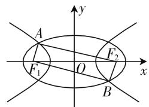

# 链接真题,研究结论,拓展应用

—— 圆锥曲线的离心率问题

山东省平度市第九中学 史桂香

众所周知,圆锥曲线一直是高中数学的重点和难点之一,也是高考中的热点问题,是高考中区分度较大的问题,难度一般是中档及以上,备受关注.圆锥曲线中,往往代数与几何交汇,既有“数”又有“形”,既有“动”又有“静”,而且一部分题目有着很强的结论性背景,是考查能力,体现选拔的好载体.下面结合一道高考真题,通过研究一般性结论,并加以拓展与应用.

# 一、真题链接

高考真题:(2018年高考数学全国卷Ⅱ文科第11题)已知 $F_{1},F_{2}$ 是椭圆C的两个焦点,P是C上的一点,若 $PF_{1}\perp PF_{2}$ ,且 $\angle PF_{2}F_{1}=60^{\circ}$ ,则椭圆C的离心率为().

A. $1-\frac{\sqrt{3}}{2}$

B. $2 - \sqrt{3}$

C. $\frac{\sqrt{3}-1}{2}$

D. $\sqrt{3}-1$

解析：在 $\triangle F_{1}PF_{2}$ 中，由于 $PF_{1} \perp PF_{2}$ ，且 $\angle PF_{2}F_{1} = 60^{\circ}$ ，设 $|PF_{2}| = m$ ，则 $2c = |F_{1}F_{2}| = 2m$ ， $|PF_{1}| = \sqrt{3}m$ 。又由椭圆的定义可知， $2a = |PF_{1}| + |PF_{2}| = \sqrt{3}m + m = (\sqrt{3} + 1)m$ ，所以椭圆 $C$ 的离心率 $e = \frac{c}{a} = \frac{2c}{2a} = \frac{2m}{(\sqrt{3} + 1)m} = \frac{2}{\sqrt{3} + 1} = \sqrt{3} - 1.$

故选 D.

点评:椭圆的焦点三角形问题,是椭圆问题中的常考知识点之一,在解决这类问题时经常会用到正弦定理或余弦定理,以及椭圆的定义与基本性质等,用来求解对应的三角形问题以及椭圆的离心率或相关的弦长等.

# 二、结论总结

结论 1: 已知 $F_{1}, F_{2}$ 是椭圆 $C: \frac{x^{2}}{a^{2}} + \frac{y^{2}}{b^{2}} = 1 (a > b > 0)$ 的两个焦点, P 是 C 上的一点, 且 $\angle PF_{1}F_{2} = \alpha$ , $\angle PF_{2}F_{1} = \beta$ , 则椭圆 C 的离心率 $e = \frac{\sin(\alpha + \beta)}{\sin\alpha + \sin\beta}$ .

证明：在 $\triangle F_{1}PF_{2}$ 中，由于 $\angle PF_{1}F_{2} = \alpha$ ， $\angle PF_{2}F_{1} = \beta.$ 设 $|PF_1| = m, |PF_2| = n$ ，而 $2c = |F_{1}F_{2}|$ ，结合正弦定理可得 $\frac{m}{\sin\beta} = \frac{n}{\sin\alpha} = \frac{2c}{\sin[\pi - (\alpha + \beta)]} = 2R$ （其中 $R$ 为 $\triangle F_{1}PF_{2}$ 的外接圆半径），则有 $\frac{m}{\sin\beta} = \frac{n}{\sin\alpha} = \frac{2c}{\sin(\alpha + \beta)} = 2R.$ 又由椭圆的定义可知， $2a = |PF_1| + |PF_2| = m + n = 2R(\sin\beta + \sin\alpha)$ ，所以椭圆 $C$ 的离心率 $e = \frac{c}{a} = \frac{2c}{2a} = \frac{2c}{m + n} = \frac{2R\sin(\alpha + \beta)}{2R(\sin\beta + \sin\alpha)} = \frac{\sin(\alpha + \beta)}{\sin\alpha + \sin\beta}.$

点评:根据已知椭圆的焦点三角形中两内角的值,可以直接来确定相应椭圆的离心率.这里综合应用了三角形的性质、正弦定理、诱导公式、椭圆的定义与基本性质等.其实,通过探究与拓展,双曲线中也有类似的结论.

结论2:已知 $F_{1},F_{2}$ 是双曲线 $C:\frac{x^{2}}{a^{2}}-\frac{y^{2}}{b^{2}}=1(a>0,b>0)$ 的两个焦点,P是C上的一点,且 $\angle PF_{1}F_{2}=\alpha,\angle PF_{2}F_{1}=\beta$ ,则双曲线C的离心率 $e=\frac{\sin(\alpha+\beta)}{|\sin\alpha-\sin\beta|}$ .

具体证明过程可参考以上结论 1 的证明过程, 这里不再赘述.

# 三、结论应用

# 1. 离心率的求解

例 1 （原创题）已知 $F_{1}, F_{2}$ 是双曲线 $C: \frac{x^{2}}{a^{2}} - \frac{y^{2}}{b^{2}} = 1 (a > 0, b > 0)$ 的两个焦点，P 是 C 上的一点，若 $PF_{1} \perp PF_{2}$ ，且 $\angle PF_{2}F_{1} = 60^{\circ}$ ，则双曲线 C 的离心率为（）.

A. $1 + \frac{\sqrt{3}}{2}$ B. $2 + \sqrt{3}$ C. $\frac{\sqrt{3} + 1}{2}$ D. $\sqrt{3} + 1$

分析:结合题目条件,先确定 $\alpha$ 与 $\beta$ 的值,直接利用结论 2,代入双曲线 C 的离心率公式加以运算求解,即可得以确定对应的离心率的值.

解析：在 $\triangle F_{1}PF_{2}$ 中，由于 $PF_{1} \perp PF_{2}$ ，且 $\angle PF_{2}F_{1} = 60^{\circ}$ 可知， $\angle PF_{1}F_{2} = \alpha = 30^{\circ}, \angle PF_{2}F_{1} = \beta = 60^{\circ}$ ，根据结论2，可得双曲线 $C$ 的离心率 $e = \frac{\sin(\alpha + \beta)}{|\sin\alpha - \sin\beta|} = \frac{\sin(30^{\circ} + 60^{\circ})}{|\sin 30^{\circ} - \sin 60^{\circ}|} = \sqrt{3} + 1.$

故选择答案 D.

点评:利用相应的结论,可以简单快捷求解相应圆锥曲线的离心率问题.利用结论1,也可以简单快捷求解对应高考真题:在 $\triangle F_{1}PF_{2}$ 中,由于 $PF_{1}\perp PF_{2}$ ,且 $\angle PF_{2}F_{1}=60^{\circ}$ ,可知 $\angle PF_{1}F_{2}=\alpha=30^{\circ}$ , $\angle PF_{2}F_{1}=\beta=60^{\circ}$ ,根据结论1,可得椭圆C的离心率 $e=\frac{\sin(\alpha+\beta)}{\sin\alpha+\sin\beta}=\frac{\sin(30^{\circ}+60^{\circ})}{\sin30^{\circ}+\sin60^{\circ}}=\sqrt{3}-1.$

# 2. 角度的确定

例 2 （原创题）已知 $F_{1}, F_{2}$ 是椭圆 $C: \frac{x^{2}}{a^{2}} + \frac{y^{2}}{b^{2}} = 1 (a > b > 0)$ 的两个焦点，P 是 C 上的一点，若椭圆 C 的离心率 $e = \frac{\sqrt{3}}{2}$ ，且 $\angle PF_{1}F_{2} = 30^{\circ}$ ，则 $\angle F_{1}PF_{2} =$ \_\_\_\_.

分析:结合题目条件,先设出相应 $\alpha$ 与 $\beta$ 的值,直接利用结论 1,代入椭圆 C 的离心率公式加以运算求解,结合同角三角函数的基本关系式及其三角形的内角和公式,即可确定角 $\beta$ 的值,进而确定 $\angle F_{1}PF_{2}$ 的值.即可得以确定对应的离心率的值.

解析: 在 $\triangle F_{1}PF_{2}$ 中, 由于 $\angle PF_{1}F_{2}=30^{\circ}$ , 可知 $\angle PF_{1}F_{2}=\alpha=30^{\circ}$ , 设 $\angle PF_{2}F_{1}=\beta$ , 根据结论 1, 可得椭圆 C 的离心率 $e=\frac{\sin(\alpha+\beta)}{\sin\alpha+\sin\beta}=\frac{\sin(30^{\circ}+\beta)}{\sin30^{\circ}+\sin\beta}=\frac{\sqrt{3}}{2}$ , 解得 $\beta=30^{\circ}$ , 则有 $\angle F_{1}PF_{2}=180^{\circ}-\alpha-\beta=120^{\circ}$ .

故填答案 $120^{\circ}$ .

点评:巧妙借助相应的结论,可以有效降低问题难度,破解思路明确,利用已知条件建立相应的关系式,并利用三角函数的相关关系加以综合处理,为确定此类圆锥曲线中角的角度问题提供一种全新的思路与方法.

# 3. 综合应用问题

例 3 （2013 年高考数学浙江卷理科第 9 题）如图 1， $F_{1}, F_{2}$ 是椭圆 $C_{1}:\frac{x^{2}}{4}+y^{2}=1$ 与双曲线 $C_{2}$ 的公共焦点，A，B 分别是 $C_{1}, C_{2}$ 在第二、四象限的公共点. 若四边形 $AF_{1}BF_{2}$ 为矩形, 则 $C_{2}$ 的离心率是().

text_image

y
A
F₁
O
x
B
F₂

图1

A. $\sqrt{2}$

B. $\sqrt{3}$

C. $\frac{3}{2}$

D. $\frac{\sqrt{6}}{2}$

分析:结合题目条件,先设出相应的 $\alpha$ 与 $\beta$ ,根据条件确定两者互余,分别利用结论1与结论2建立相应的关系式,结合三角函数的相关关系加以链接,并借助三角公式的应用加以等量代换,从而得以确定对应的离心率的值.

解析:由于四边形 $AF_{1}BF_{2}$ 为矩形, 设 $\angle AF_{1}F_{2} = \alpha$ , $\angle AF_{2}F_{1} = \beta$ (根据对称性, 不失一般性, 不妨设 $\alpha > \beta$ ), 则有 $\alpha + \beta = 90^{\circ}$ . 由题可知, 椭圆 $C_{1}$ 的离心率 $e_{1} = \frac{\sqrt{3}}{2}$ , 设双曲线 $C_{2}$ 的离心率为 $e_{2}$ , 根据结论 1, 可得椭圆 $C_{1}$ 的离心率 $e_{1} = \frac{\sin(\alpha + \beta)}{\sin\alpha + \sin\beta} = \frac{1}{\sin\alpha + \cos\alpha} = \frac{\sqrt{3}}{2}$ , 则有 $\sin\alpha + \cos\alpha = \frac{2}{\sqrt{3}}$ , 两边平方整理可得 $2\sin\alpha\cos\alpha = \frac{1}{3}$ , 而根据结论 2, 可得双曲线 $C_{2}$ 的离心率 $e_{2} = \frac{\sin(\alpha + \beta)}{\sin\alpha - \sin\beta} = \frac{1}{\sin\alpha - \cos\alpha} = \frac{1}{\sqrt{1 - 2\sin\alpha\cos\alpha}} = \frac{\sqrt{6}}{2}$ .

故选 D.

点评:破解此题的方法较多,通过椭圆、双曲线的定义,以及直角三角形的特征建立相应的关系式,求解过程比较烦琐,计算量比较大,相关量比较多,容易导致思维混乱与运算错误.而利用相应的结论,设出对应的角,借助两个结论以及三角函数的相关知识加以分析与转化,思路明确,运算量小,过程简单.

借助一些基本的、常见的圆锥曲线的结论，可以进一步理解与掌握圆锥曲线的相关知识，有效融合数学不同知识点，并加以合理转化，巧妙求解，简化过程，提升速度，从而有效提升学生的推理论证能力与创新意识，促进思维能力和思维品质的全面提高，培养数学核心素养. W