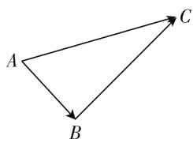
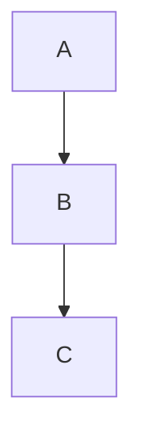
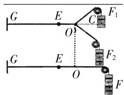

# 高中数学概念教学的四种策略浅析

# ● 江苏省徐州市第三中学 郭琪

高中数学相较于浅显而又简单的初中数学,它更为深刻全面地阐述了知识. 众所周知,数学是科学的思维,而数学概念是思维的“细胞”,是思想方法的“载体”,是定理导出的“基石”,是法则应用的“依托”,是问题解决的基础. 同时,概念教学也是高中数学教学的重点,它可以帮助学生建立完善的数学知识网络. 然数学概念较为抽象,语言也尽显枯燥,但由于它巨大的功用,广大教师需要不惜时力深度思考如何落实概念教学的有效性. 下面笔者从平时的教学经验出发,谈谈如何有效进行高中数学概念教学.

# 一、情境:在导入中有所感知

当下,仍然有相当一部分数学教师采用传统教学模式引入概念,在学生还未厘清概念的来龙去脉时就将概念和盘托出,从而导致了学生无法参透其本质,仅仅借助死记硬背的方法来掌握.这样死板的教学模式显然与新课程标准的要求相背驰.新课程标准要求从学生感兴趣的事物中找到导入概念的媒介,自然创设教学情境,从而促进概念本质的理解,也就是说,合情导入是概念教学的首要步骤,对理解和感知的程度有着直接的影响.一个好的教学情境可以深度激发学生的数学思考和自主探究.因此,在课堂教学中,需从高中生的心理特征和课程内容着手,创设一定的情境,为概念供给方法的知识背景,让学生在个性化的探究中有所感知,这往往是促进学概念生成的前提.

案例 1 函数这一章节是高中数学重要章节,学好函数也就迈出了学好高中数学的关键一步.教学函数奇偶性概念,笔者通过多媒体设计生动形象的图片导入课堂,有具有中心对称设计的火箭尾翼,具有轴对称的蝴蝶标本等等,通过多个图片的展现,学生自然感知到函数图像的一个重要特征——对称,从而生成函数值变化的又一重要性质.

案例 2 教学向量加法的概念,笔者设计以下物理情境导入课堂:

情境 1: 如图 1, 一对象从点 A 出发经过点 B 到达点 C，两次位移 $\overrightarrow{AB}, \overrightarrow{BC}$ 的结果与点 A 直接位移到点 C 的结果相同.

情境2:如图2,图中为两个力作用下的橡皮条,它沿GC的方向变长了EO.若 $F_{1}$ 与 $F_{2}$ 这两个力消失,仅仅用力F进行作用,也使橡皮条沿相同方法变长相同的长度,那么 $F,F_{1}$ 和 $F_{2}$ 三者存在什么样的关系?

flowchart

图 1

text_image

G
E
C
F₁
O
F₂
G
E
O
F

图 2

在教学过程中,通过情境的创设,调动了学生思维积极性,不仅在数学内部建构普遍联系和应用,还关注到概念和物理学背景的关联性,引领学生从现实模型中逐步抽象出数学概念,有助于学生理解数学本质.

# 二、探究:在实践中有所感悟

教学过程中,仅仅创设情境是远远不够的,教师还需发挥好教学活动先行组织者的角色,鼓励学生深入探究,勇于阐明自身的见解和观点,进行持续互动,在探究和解决问题的过程中有所感悟,搭建素养养成路径.

案例 3 定义函数奇偶性, 在情境导入充分激趣后, 教师可安排学生动手操作, 首先以描点法作图的步骤进行列表、描点、连线和作函数 $y = x^{2}$ 的图像这一系列活动过程, 在活动中深入观察, 并思考问题: 当自变量 x 不断改变时, 函数值 y 如何变化? 图像的特征是怎么样子的? 在观察中有何发现? 学生经过思考, 得出函数图像关于 y 轴对称, 且当自变量 x 的值互为相反数时, 函数值相等, 从而得出 $f(-x) = f(x)$ . 从数量关系来看, 函数对定义域中所有的 x 都有 $f(-x) = f(x)$ , 这样的函数称之为偶函数. 同样的, 笔者再引入 $y = \frac{1}{x}$ , 学生又一次通过观察、操作、归纳

和总结,建构奇函数的定义.

在上述例子中从数与形两个角度着手,引领学生经历观察、实验、猜想、抽象、概括、反思等过程,让学生深刻体会到概念的来龙去脉.由此不难看出,通过关注概念的产生和发展过程,可以让学生更深刻地理解概念本质,内化为自己的数学知识结构.

# 三、体验: 在问题中有所领悟

在揭示概念时,我们不仅需要关注到概念的导入和学生的探究,更需关注到学生的体验,从而达到揭示概念本质的目的,让学生在体验中有所生成,凸显数学应有的生命力.由于每个概念都有独特的“个性”,即自身的限制条件,而一旦忽略其“独特个性”就会导致这样或那样的解题错误.因此,教师在概念教学中不仅需赋予概念的本质属性,还需在问题解决中澄清对数学概念的认识误区,从而达到预期的教学效果.通过多个问题的解决让学生反复体味其本质,内化概念,上升到理性认识的飞跃.

案例 4 教学指数函数概念后,笔者出示以下题目来深化学生的体验.

问题呈现: 判断以下函数是否为指数函数:

(1) $y=2\cdot3^{x}$ ，(2) $y=3^{x-1}$ ，(3) $y=x^{3}$   
(4) $y = -3^{x}$ , (5) $y = (-4)^{x}$ , (6) $y = \pi^{x}$ ,   
(7) $y=4^{x}$ ，(8) $y=x^{x}$ ，  
(9) $y=(2a-1)^{x}\left(a>\frac{1}{2},\text{且}a\neq1\right).$

在解决问题的同时, 教师有针对性地追问, 帮助学生快速建构概念. 首先, 针对 $y = a^{x}$ 这类形式, 教师可以创设问题: (1) 和 (4) 都具有 $a^{x}$ 的形式, 那它们是否为指数函数? 由此学生不难得出, 判定指数函数并非只需观察底数和指数, 前面的系数也不可忽视; 其次, 针对常数 a > 0 且 $a \neq 1$ 这类形式, 教师创设以下问题: (3), (5) 和 (8) 系数是 1, 也具备 $a^{x}$ 的形式, 那它们都为指数函数吗? 据此学生得出, 底数不符合条件时, 也不为指数函数; 最后, 针对指数 x 为自变量这一要点, 教师可以继续提问: 问题 (2) 和 (7) 是否符合指数为自变量? 此时, 在不断辨析中学生整体把握住指数函数的本质特点, 深刻认识到判断是否为指数函数需三个条件同时考虑, 缺一不可, 认知又提升了一个层次.

由此可以看出,执教者大篇幅呈现给学生反例,其实都是对概念本质的透析.因此,执教者在本节课中注重新概念、关注问题类比已然为其后的教学定下了返璞归真、融会贯通的“基调”.

# 四、变式:促进概念的深化

为了让学生在概念应用中具有更为广阔的思维空间,笔者可以采用变换问题的形式,从一个问题的解决中进行延展,牵引出一个问题链,从对不同问题的分析中深化概念结构的认识,形成完善的知识链,发展学生的能力,最终形成完整的认知结构.

案例 5 教学双曲线及其标准方程,不少学生对概念的记忆较为深刻,却易忽略其中的一些条件,为了进一步深化概念的理解,笔者编制以下变式题组进行深化:

问题1:如果平面内的一点P到点 $A(-3,0)$ 和点 $B(3,0)$ 的距离之差为4,那么点P的轨迹是什么?

问题2:如果平面内的一点P到点 $A(-3,0)$ 和点 $B(3,0)$ 的距离之差的绝对值为6,那么点P的轨迹是什么?

问题3:如果平面内的一点P到点 $A(-3,0)$ 和点 $B(3,0)$ 的距离之差的绝对值为8,那么点P的轨迹又是什么?

问题4:如果平面内的一点P到点 $A(-3,0)$ 和点 $B(3,0)$ 的距离之差的绝对值为4,那么点P的轨迹是什么?

在以上变式问题的解决过程中,学生积极参与到概念的生成中去,加深了对双曲线概念的理解,并体会到概念中蕴含的思想方法,掌握了概念的实际应用性,促进了思维的发展.

总之,数学概念的有效建构对于学生学习积极性的提升、学习兴趣的培养和探究精神的养成都具有一定的价值.在概念教学中,我们首先需关注到概念的引入方式,向学生展示概念的本质,激发学生的感知;其次需关注到概念的探究、体验和变式,在这样的情况下,概念的建立和建构就是“见木又见林”.

# 参考文献：

[1] 李祎, 曹益华. 概念的本质与定义方式探究 [J]. 数学教育学报, 2013(6).  
[2] 邵光华, 章建跃. 数学概念的分类、特征及其教学探讨 [J]. 课程·教材·教法, 2009(7).   
[3] 匡继昌. 如何理解和掌握数学概念的教学实践与研究 [J]. 数学教育学报, 2013(6). F