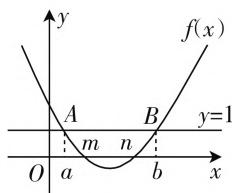

# 一元二次不等式难点突破

# ● 甘肃省武威第六中学 于仁

由于一元二次不等式是高考数学必考的重要知识点,所以我们很有必要加强对一元二次不等式的难点突破,有利于巩固基础知识,提高对所学数学知识、方法的灵活运用能力.

# 类型一、如何求解给定一元二次不等式的解集问题？

求解此类问题需要“逆向”应用一元二次不等式的解题方法，侧重考虑该不等式对应的一元二次方程的实数解或者对应一元二次函数的图像，以便灵活分析、求解目标问题.

# 1. 含参一元二次不等式给定解集

例 1 已知一元二次不等式 $ax^{2} + bx + c < 0$ 的解集为 $\{x \mid x < m, \text{或 } x > n\}$ ，其中 m < n < 0，求一元二次不等式 $cx^{2} - bx + a > 0$ 的解集.

解析:由题设得 a<0，且方程 $ax^{2}+bx+c=0$ 的两根为 m, n (m<n<0). 又 $mn=\frac{c}{a}>0$ ，从而可知 c<0. 于是，根据方程 $cx^{2}-bx+a=0$ 的两根分别为 $-\frac{1}{m}, -\frac{1}{n}\left(\text{其中 } -\frac{1}{m} < -\frac{1}{n}\right)$ ，可知一元二次不等式 $cx^{2}-bx+a>0$ 的解集为 $\left\{x\left|-\frac{1}{m}<x<-\frac{1}{n}\right.\right\}$ .

评注:如果二次方程 $ax^{2}+bx+c=0$ 有两个非零实数根分别为 $x_{1}, x_{2}$ ，那么二次方程 $ax^{2}-bx+c=0$ 的两根分别为 $-x_{1}, -x_{2}$ ; 二次方程 $cx^{2}+bx+a=0$ 的两根分别为 $\frac{1}{x_{1}}, \frac{1}{x_{2}}$ ; 二次方程 $cx^{2}-bx+a=0$ 的两根分别为 $-\frac{1}{x_{1}}, -\frac{1}{x_{2}}$ .

# 2. 含参分式不等式给定解集

例2 已知 $a, b$ 为实常数，若关于 $x$ 的不等式 $\frac{x - b}{x - a} \geqslant 0$ 的解集为 $\{x \mid x \leqslant -1$ 或 $x > 2\}$ ，求关于 $x$ 的不等式 $\frac{x + a}{x + b} \leqslant 0$ 的解集.

解析: 因为 $\frac{x-b}{x-a} \geqslant 0 \Leftrightarrow (x-b)(x-a) \geqslant 0$ ，且 x

$\neq a$ , 所以根据题意知, a=2, b=-1.

于是，不等式 $\frac{x + a}{x + b} \leqslant 0$ 可化为 $\frac{x + 2}{x - 1} \leqslant 0 \Rightarrow (x + 2)(x - 1) \leqslant 0$ ，且 $x \neq 1 \Rightarrow -2 \leqslant x < 1$ .

故关于 $x$ 的不等式 $\frac{x + a}{x + b} \leqslant 0$ 的解集为 $\{x \mid -2 \leqslant x < 1\}$ .

评注:(1) 将分式不等式转化为整式不等式, 需要灵活运用结论“ $\frac{b}{a} \geqslant 0 \Leftrightarrow ab \geqslant 0$ , 且 $a \neq 0$ ”, 其优点是可帮助我们对问题进行简单、明了的分析与求解.

(2) 由分母 $x - a \neq 0$ 及题设可求得 $a = 2$ , 这是本题整个分析、求解的切入点.

# 3. 数形结合, 比较大小

例3 已知 $a < b$ ，函数 $f(x) = (x - a)(x - b) + 1$ ，且不等式 $f(x) < 0$ 的解集为 $\{x \mid m < x < n\} (m < n)$ ，求实数 $a, b, m, n$ 的大小关系.

解析: 在平面直角坐标系内, 先作 $f(x)$ 的图像, 再作直线 y=1 与之交于 A, B 两点, 如图 1 所示. 易知方程 $f(x)=0$ 的两根分别为 m 和 n, 且 m<n, 所以函数 $f(x)$ 的图像与 x 轴的两个交点的横坐标分别为 m 和 n，且 m < n。

text_image

y
f(x)
A
m
n
B
y=1
O
a
b
x

图1

注意到方程 $f(x) = 1$ ，即 $(x - a)(x - b) = 0$ 的两根分别为 $a$ 和 $b$ ，且 $a < b$ ，所以可知点 $A, B$ 的横坐标分别为 $a, b$ ，且 $a < b$ .

故由图知， $a < m < n < b$ ，此即为所求大小关系.

评注:本题借助“数形结合法”分析、解决问题时，必须明确方程 $f(x)=c$ 的根就是对应函数 $f(x)$ 的图像与直线 y=c 的交点的横坐标.

# 类型二、如何求解含参一元二次不等式？

求解含参一元二次不等式时,最关键的就是要明确为什么要讨论,按什么标准去讨论.此外,我们还必须注意:若对参数讨论,则最后总结叙述原不等式的解集时一定要分开写,绝不能仅用一个集合加以表

示.

# 1. 按对应方程两根的大小关系讨论

例4 解关于 $x$ 的不等式: $x^{2} + (a^{2} + a)x + a^{3} < 0$ .

解析: 因对应方程的两根 $-a$ 和 $-a^{2}$ 大小不确定, 所以应按它们的大小关系讨论.

令 $x^{2} + (a^{2} + a)x + a^{3} = 0$

则 $x = -a$ 或 $x = -a^2$ .

当 a=0 或 a=1 时，由 $-a^{2}=-a$ ，即对应二次函数的图像与 x 轴相切，易知 $x \in \varnothing$ ;

当 a > 1 或 a < 0 时，由 $-a^{2} < -a$ ，易知 $-a^{2} < x < -a$ ;

当 0 < a < 1 时，由 $-a < -a^{2}$ ，易知 $-a < x < -a^{2}$ 。

综上可知，当 $a = 0$ 或 $a = 1$ 时，原不等式的解集为 $\varnothing$ ；当 $a > 1$ 或 $a < 0$ 时，原不等式的解集为 $\{x \mid -a^2 < x < -a\}$ ；当 $0 < a < 1$ 时，原不等式的解集为 $\{x \mid -a < x < -a^2\}$ .

评注:两根相等是特殊情形,两根不等是一般情形,但都要借助对应函数图像确定结论.

# 2. 按二次项系数与零的大小关系讨论

例 5 解关于 x 的不等式: $ax^{2} + 2x > 0$ .

解析: 因二次项系数 a 与 0 的大小不确定, 所以应按它们的大小关系讨论.

当 a=0 时，原不等式即为 $2x>0 \Rightarrow x>0$ ; 当 a>0 时，因为方程 $ax^{2}+2x=0$ 的两根分别为 $-\frac{2}{a}$ 和 0，且 $-\frac{2}{a}<0$ ，所以由原不等式得 $x<-\frac{2}{a}$ 或 x>0；当 a<0 时，因为方程 $ax^{2}+2x=0$ 的两根分别为 $-\frac{2}{a}$ 和 0，且 $-\frac{2}{a}>0$ ，所以由原不等式得 $0<x<-\frac{2}{a}$ .

综上可知，当 $a = 0$ 时，原不等式的解集为 $\{x\mid x > 0\}$ ；当 $a > 0$ 时，原不等式的解集为 $\left\{x\mid x < -\frac{2}{a}\text{或} x > 0\right\}$ ；当 $a < 0$ 时，原不等式的解集为 $\left\{x\mid 0 < x < -\frac{2}{a}\right\}$ .

评注:二次项系数为零是特殊情形,可直接求解;二次项系数不为零是一般情形,可借助对应函数图像确定结论.

# 类型三、如何借助导数确定函数的单调区间？

利用导数求函数 $f(x)$ 单调区间的具体步骤:(1) 求解自变量的取值范围, 即函数 $f(x)$ 的定义域; (2) 求解导函数 $f'(x)$ ; (3) 考虑函数的定义域, 求解不等式 $f'(x) > 0$ , 可得函数的单调递增区间; (4) 考虑函数的定义域, 求解不等式 $f'(x) < 0$ , 可得函数的单调递减区间.

# 1. 求定义域为 $\mathbf{R}$ 的复杂函数的单调区间

例6 求函数 $f(x) = (x^2 + 3x + 1)\mathrm{e}^{-x}$ 的单调区间.

解析: 因为 $f'(x) = (2x + 3)e^{-x} - (x^{2} + 3x + 1)e^{-x} = e^{-x}(-x^{2} - x + 2) = e^{-x}(x + 2)(1 - x)$ ，又函数 $f(x)$ 的定义域为 R，且 $e^{-x} > 0$ ，所以令 $f'(x) < 0$ ，则 $-x^{2} - x + 2 < 0$ ，解得 x < -2 或 x > 1；令 $f'(x) > 0$ ，则 $-x^{2} - x + 2 > 0$ ，解得 -2 < x < 1。

故所求函数 $f(x)$ 的递减区间为 $(-∞, -2)$ 和 $(1, +∞)$ ，递增区间为 $(-2, 1)$ .

评注:具体求解本题时,需要关注以下两点:一是熟记导数运算法则和求导公式,以便准确计算导函数;二是结合指数式的值恒大于零,简化求解不等式的具体过程.

# 2. 求定义域不为 $\mathbf{R}$ 的函数的单调区间

例7 求函数 $f(x) = \ln x + 3x^{2} - 5x + 1$ 的单调区间.

解析: 因为 $f'(x)=\frac{1}{x}+6x-5=\frac{6x^{2}-5x+1}{x}=\frac{(2x-1)(3x-1)}{x}$ ，又注意到 $f(x)$ 的定义域为 $(0,+\infty)$ ，所以令 $f'(x)>0$ ，解得 $0<x<\frac{1}{3}$ 或 x> $\frac{1}{2}$ ; 令 $f'(x)<0$ ，解得 $\frac{1}{3}<x<\frac{1}{2}$ .

故函数 $f(x)$ 的单调递增区间为 $\left(0, \frac{1}{3}\right)$ 和 $\left(\frac{1}{2}, +\infty\right)$ ，单调递减区间为 $\left(\frac{1}{3}, \frac{1}{2}\right)$ .

评注:本题应特别注意函数的定义域不是实数集R,而是 $(0,+\infty)$ ;否则,极易出错!

总之,结合以上归类举例解析,我们应熟练掌握以下三类问题的解题思路:(1)给定一元二次不等式的解集问题;(2)求解含参一元二次不等式;(3)借助导数求函数的单调区间.

此外,还需要关注“数形结合思想”“分类与整合思想”在解题中的灵活运用,以便有效提高处理一元二次不等式的技能技巧,进一步较好地培养数学运算、直观想象方面的核心素养.