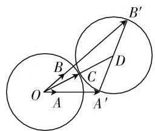
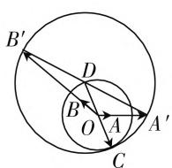
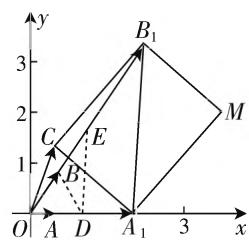

# 代数与几何齐飞,技能共素养一色\*

—— 一道向量试题的破解

● 福建省南平市高级中学 陈军

平面向量既有“数”的形式，又有“形”的直观，是数学中代数与几何融合一体的最佳代表。在具体破解平面向量的综合问题时，经常可以优先从代数与几何这两个角度切入，都能达到很好破解的目的，或从“数”的角度入手，利用代数的运算形式，通过代数运算或坐标表示等形式来转化与解决；或从“形”的角度入手，结合几何的直观形象，通过几何特征或图形直观等形象来分析与处理。

# 一、问题呈现

问题 （2021届浙江省义乌中学高三第一次月考数学试卷第16题）已知平面向量 a, b, c 满足 $\left|b\right|=2\left|a\right|=1,\left|c\right|=\sqrt{2},(c-4a)\cdot(c-4b)=0$ ，则 $\left|2a-b\right|$ 的取值范围为 \_\_\_\_.

此题以已知平面向量的模为问题背景,结合两对应平面向量的线性关系所对应的向量的数量积为0来展开,通过不同思维视角切入,从数量积性质、建系、平面几何等角度来分析,通过对应不等式的放缩或极端位置所对应的值的求解来分析与处理,从而得以确定对应平面向量的线性关系所对应的向量的模的取值范围.

# 二、问题破解

# 思维视角(一)平面向量思维

解法1:(数量积性质放缩法)由于 $(c-4a)\cdot(c-4b)=0$ ，展开可得 $c^{2}-4c\cdot(a+b)+16a\cdot b=0$ ，结合 $|b|=2|a|=1,|c|=\sqrt{2}$ ，整理可得 $1+8a\cdot b=2c\cdot(a+b)\leqslant2|c||a+b|=2\sqrt{2}\cdot\sqrt{a^{2}+2a\cdot b+b^{2}}=2\sqrt{2}\cdot\sqrt{\frac{5}{4}+2a\cdot b}$ ，当且仅当 $(a+b)/c$ 时，等号成立，解得 $-\frac{3}{8}\leqslant a\cdot b\leqslant\frac{3}{8}$ ，所以 $|2a-b|^{2}=4a^{2}-$ $4a \cdot b + b^{2} = 2 - 4a \cdot b \in \left[\frac{1}{2}, \frac{7}{2}\right]$ ，解得 $\left|2a - b\right| \in \left[\frac{\sqrt{2}}{2}, \frac{\sqrt{14}}{2}\right]$ .

故填答案: $\left[\frac{\sqrt{2}}{2},\frac{\sqrt{14}}{2}\right]$ .

点评:根据题目条件中的平面向量的数量积关系式以及题设条件,进行合理的变形与转化,借助数量积的性质加以合理的不等式放缩变换,结合求解关于变量 $a\cdot b$ 的一元二次不等式,进而结合平面向量关系式的变形求出 $|2a-b|^{2}$ 的取值范围,为确定 $|2a-b|$ 的取值范围指明方向.

# 思维视角(二) 直角坐标思维

解法2:(建系法)由于 $|b|=2|a|=1,|c|=\sqrt{2}$ ，建立平面直角坐标系，设 $a=\left(\frac{1}{2},0\right),b=(\cos\alpha,\sin\alpha),c=(\sqrt{2}\cos\beta,\sqrt{2}\sin\beta)$ ，结合 $(c-4a)\cdot(c-4b)=0$ ，可得 $(\sqrt{2}\cos\beta-2)(\sqrt{2}\cos\beta-4\cos\alpha)+\sqrt{2}\sin\beta(\sqrt{2}\sin\beta-4\sin\alpha)=0$ ，展开并整理有 $(2\sqrt{2}\cos\alpha+\sqrt{2})\cos\beta+2\sqrt{2}\sin\alpha\sin\beta=1+4\cos\alpha$ ，根据三角函数的辅助角公式，可得 $(2\sqrt{2}\cos\alpha+\sqrt{2})^{2}+(2\sqrt{2}\sin\alpha)^{2}\geqslant(1+4\cos\alpha)^{2}$ ，整理有 $\cos^{2}\alpha\leqslant\frac{9}{16}$ ，解得 $-\frac{3}{4}\leqslant\cos\alpha\leqslant\frac{3}{4}$ ，而 $2a-b=(1-\cos\alpha,-\sin\alpha)$ ，所以 $|2a-b|^{2}=(1-\cos\alpha)^{2}+(-\sin\alpha)^{2}=2-2\cos\alpha\in\left[\frac{1}{2},\frac{7}{2}\right]$ ，解得 $|2a-b|\in\left[\frac{\sqrt{2}}{2},\frac{\sqrt{14}}{2}\right]$ .

故填答案: $\left[\frac{\sqrt{2}}{2},\frac{\sqrt{14}}{2}\right]$ .

点评:根据题目条件进行合理建系,结合三角函数确定对应平面向量的坐标,利用平面向量的数量积的坐标运算加以应用与转化,并根据三角函数的辅助角公式加以合理的不等式放缩变换,进而确定 $\cos\alpha$ 的取值范围,再结合平面向量的坐标表示与模公式的应用求出 $|2a-b|^{2}$ 的取值范围,从而得以确定 $|2a-b|$ 的取值范围.

# 思维视角(三) 平面几何思维

解法3:(平面几何——两圆位置关系法)设平面向量a与b的夹角为 $\theta$ ，则有 $\left|2a-b\right|^{2}=4a^{2}-4a\cdot b+b^{2}=2-4a\cdot b=2-2\cos\theta$ ，设 $a=\overrightarrow{OA},b=\overrightarrow{OB},4a=\overrightarrow{OA^{\prime}},4b=\overrightarrow{OB^{\prime}},c=\overrightarrow{OC}$ ，结合 $(c-4a)\cdot(c-4b)=0$ ，得 $\overrightarrow{A^{\prime}C}\cdot\overrightarrow{B^{\prime}C}=0$ ，可知点C在以线段 $A^{\prime}B^{\prime}$ 为直径的圆上运动，记线段 $A^{\prime}B^{\prime}$ 的中点为D，而 $\left|A^{\prime}B^{\prime}\right|^{2}=(4b-4a)^{2}=16a^{2}-32a\cdot b+16b^{2}=20-32a\cdot b=20-16\cos\theta$ ，在 $\triangle OA^{\prime}B^{\prime}$ 中，根据中线性质可得 $4\left|OD\right|^{2}+\left|A^{\prime}B^{\prime}\right|^{2}=2(\left|OA^{\prime}\right|^{2}+\left|OB^{\prime}\right|^{2})$ ，解得 $|OD|=\sqrt{5+4\cos\theta}$ ，由于点C在以线段 $A^{\prime}B^{\prime}$ 为直径的圆D上运动，那么只要圆O(半径为 $\sqrt{2}$ 的圆)与圆D有公共点即可.

(1) 当圆 O 与圆 D 外切时, 此时夹角 $\theta$ 为锐角, 结合两圆的位置关系可知, $|OD| - |CD| = \sqrt{2}$ , 即 $\sqrt{5 + 4\cos\theta} - \sqrt{5 - 4\cos\theta} = \sqrt{2}$ , 解得 $\cos\theta = \frac{3}{4}$ , 此时 $|2a - b|^{2} = 2 - 2\cos\theta = \frac{1}{2}$ , 可得 $|2a - b| = \frac{\sqrt{2}}{2}$ ;

text_image

Geometric diagram showing two intersecting circles with labeled points and vectors, including triangle ABC and auxiliary points A', B', C, D.

图1

  
图2

(2) 当圆 O 与圆 D 内切时, 此时夹角 $\theta$ 为钝角, 结合两圆的位置关系可知 $\left|OD\right| + \sqrt{2} = \left|CD\right|$ , 即 $\sqrt{5 + 4\cos\theta} + \sqrt{2} = \sqrt{5 - 4\cos\theta}$ , 解得 $\cos\theta = -\frac{3}{4}$ , 此时 $\left|2a - b\right|^2 = 2 - 2\cos\theta = \frac{7}{2}$ , 可得 $\left|2a - b\right| = \frac{\sqrt{14}}{2}$ .

综上分析，结合点 $C$ 的运动情况，可知 $\vert 2a - b\vert \in \left[\frac{\sqrt{2}}{2},\frac{\sqrt{14}}{2}\right].$

故填答案: $\left[\frac{\sqrt{2}}{2},\frac{\sqrt{14}}{2}\right]$ .

点评:根据题目条件,设出相应的平面向量,借助平面向量的线性运算与数量积加以转化,得以确定两向量的数量积为0,结合几何意义确定点C在以线段 $A^{\prime}B^{\prime}$ 为直径的圆上运动,结合线段长度的确定以及中线性质的应用来确定对应的圆D的半径,利用两圆的位置关系,分别借助两圆外切与内切两个极端点来求解此时 $\cos\theta$ 的值以及对应的 $|2a-b|$ 的值,利用点C的运动情况得以确定 $|2a-b|$ 的取值范围.

解法4:(平面几何——矩形性质法1)设 $a=\overrightarrow{OA}$ ， $b=\overrightarrow{OB}$ ， $4a=\overrightarrow{OA_{1}}$ ， $4b=\overrightarrow{OB_{1}}$ ， $c=\overrightarrow{OC}$ ，根据 $|b|=2|a|=1$ ，可得 $|\overrightarrow{OA_{1}}|=2,|\overrightarrow{OB_{1}}|=4$ ，结合 $(c-4a)\cdot(c-4b)=0$ ，可得 $\overrightarrow{A_{1}C}\cdot\overrightarrow{B_{1}C}=0$ ，即 $\overrightarrow{A_{1}C}\perp\overrightarrow{B_{1}C}$ .

如图 3 所示，作矩形 $A_{1}CB_{1}M$ ，根据矩形的平面向量性质，可得 $\left|OM\right|^{2}=\left|OA_{1}\right|^{2}+\left|OB_{1}\right|^{2}-\left|OC\right|^{2}=2^{2}+4^{2}-(\sqrt{2})^{2}=18$ ，即 $\left|OM\right|=3\sqrt{2}$ ，根据平面向量的三角形性质，可得 $\left|OM\right|-\left|OC\right|\leqslant\left|CM\right|\leqslant\left|OM\right|+\left|OC\right|$ ，则有 $2\sqrt{2}\leqslant$ $|CM| \leqslant 4\sqrt{2}$ . 结合矩形的性质可知， $|A_{1}B_{1}| = |CM|$ ，则有 $2\sqrt{2} \leqslant |A_{1}B_{1}| \leqslant 4\sqrt{2}$ ，分别取 $OA_{1}, OB_{1}$ 的中点D，E，连接DE，BD，结合三角形的中位线定理可知， $|DE| = \frac{1}{2} |A_{1}B_{1}| \in [\sqrt{2}, 2\sqrt{2}]$ . 在 $\triangle ODE$ 中，根据中线性质可得 $4|BD|^{2} + |OE|^{2} = 2(|OD|^{2} + |DE|^{2})$ ，则有 $|BD|^{2} = \frac{1}{2} (|DE|^{2} - 1) \in \left[\frac{1}{2}, \frac{7}{2}\right]$ ，解得 $|BD| \in \left[\frac{\sqrt{2}}{2}, \frac{\sqrt{14}}{2}\right]$ ，所以 $|2a - b| = |\overrightarrow{BD}| \in \left[\frac{\sqrt{2}}{2}, \frac{\sqrt{14}}{2}\right]$ .

text_image

y
3
B₁
2
C
E
1
O A D A₁ 3 x
M

图3

故填答案: $\left[\frac{\sqrt{2}}{2},\frac{\sqrt{14}}{2}\right]$ .

# 三、解后反思

涉及平面向量的综合问题,问题背景可以有机整合平面向量、平面几何、不等式等数学知识,结合平面向量的定义、性质、公式等,创新融合,合理交汇;破解思维可以代数或几何思维,巧妙转化,综合应用.此类平面向量的综合问题,从知识、方法、技能与能力等方面合理设置,能在有效考查数学知识的基础上,拓展数学能力,提升数学思维,培养思维品质,充分体现数学中代数与几何的互联互通,达到数学技能与学科素养的完美统一.