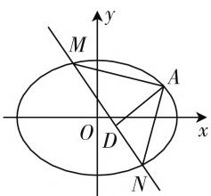

# 例谈解析几何定点定值问题

# ● 甘肃省武山县第一高级中学 郭丽珍

解析几何中的“两定”（定点、定值）问题是历年高考数学试卷中的热点问题之一，主要以解答题的压轴题形式出现，对考生的代数恒等变形能力、化归与转化能力、数学运算能力、推理论证能力等有较高的要求，突出数学思想方法、数学核心素养的考查，具有较好的选拔性与区分度，备受命题者青睐。下面结合2020年高考真题实例，就解析几何中常见的“两定”（定点、定值）问题加以剖析，归纳破解策略与技巧方法。

# 一、定点问题

定点问题: 在解析几何中, 对于一些含有参数的直线或曲线的方程, 不论对应的参数如何变化, 其都过某一定点, 这类问题统称为定点问题. 特别地, 若得到了直线的点斜式方程: $y - y_{0} = k(x - x_{0})$ , 则该直线必过定点 $(x_{0}, y_{0})$ ; 若得到了直线的斜截式方程: $y = kx + m$ , 则该直线必过定点 $(0, m)$ .

例 1 （2020 年高考数学全国卷 I 理科第 20 题，文科第 21 题）已知 A, B 分别为椭圆 $E: \frac{x^{2}}{a^{2}} + y^{2} = 1 (a > 1)$ 的左、右顶点，G 为 E 的上顶点， $\overrightarrow{AG} \cdot \overrightarrow{GB} = 8, P$ 为直线 x = 6 上的动点，PA 与 E 的另一交点为 C, PB 与 E 的另一交点为 D.

(1) 求 E 的方程;  
(2) 证明: 直线 CD 过定点.

分析:此题以平面直角坐标系中相关的点、直线、椭圆为问题背景,结合平面向量的数量积关系式来确定对应的椭圆方程,在此基础上,借助定直线上的动点的“动”、产生的新直线的“动”、以及动直线所过定点的“静”这一系列的动静结合的元素,来构造一幅完美和谐、辩证统一的美妙“画卷”.

解:(1)由题设得 $A(-a,0)$ , $B(a,0)$ , $G(0,1)$ ，则 $\overrightarrow{AG}=(a,1)$ , $\overrightarrow{GB}=(a,-1)$ ，由 $\overrightarrow{AG}\cdot\overrightarrow{GB}=8$ 得 $a^{2}-1=8$ ，即 a=3，所以椭圆 E 的方程为 $\frac{x^{2}}{9}+y^{2}=1$ .  
(2) 证明: 设 $P(6, t)$ , 则直线 $PA$ 的方程为 $y = \frac{t}{9} (x + 3)$ , 与椭圆 $E: \frac{x^2}{9} + y^2 = 1$ 联立, 消元整理可得

$(t^{2}+9)x^{2}+6t^{2}x+9t^{2}-81=0$ , 解得 x=-3(舍去)
或 $x=-\frac{3(t^{2}-9)}{t^{2}+9}$ ，代入 $y=\frac{t}{9}(x+3)$ 可得 $y=\frac{6t}{t^{2}+9}$ ，即 $C\left(-\frac{3(t^{2}-9)}{t^{2}+9},\frac{6t}{t^{2}+9}\right)$ 。同理可得 $D\left(\frac{3(t^{2}-1)}{t^{2}+1},-\frac{2t}{t^{2}+1}\right)$ ，所以直线 CD 的方程为 $y+\frac{2t}{t^{2}+1}=\frac{\frac{6t}{t^{2}+9}+\frac{2t}{t^{2}+1}}{-\frac{3(t^{2}-9)}{t^{2}+9}-\frac{3(t^{2}-1)}{t^{2}+1}}\left(x-\frac{3(t^{2}-1)}{t^{2}+1}\right)$ ，整
理可得 $y=\frac{4t}{3(3-t^{2})}x-\frac{2t}{3-t^{2}}=\frac{4t}{3(3-t^{2})}\left(x-\frac{3}{2}\right)$ .
故直线 CD 过定点 $\left(\frac{3}{2},0\right)$ .

总结归纳:(1) 若确定动直线 l 过定点问题, 可设动直线方程(斜率存在)为 $y=kx+t$ , 由题设条件将 t 用 k 表示为 t=mk, 得到 $y=k(x+m)$ , 即可说明动直线过定点 $(-m,0)$ .

(2) 若确定动曲线 C 过定点问题, 可引入参变量建立曲线 C 的方程, 再根据其对参变量恒成立, 令其系数等于零, 得出对应的定点.

# 二、定值问题

定值问题: 在解析几何中, 对于一些几何量, 如直线中的斜率、两点间的距离或点到直线的距离、三角形或四边形的面积、线段的比值、平面向量的数量积等基本量和动点坐标或动直线中的参变量无关, 这类问题统称为定值问题.

例 2 （2020 年高考数学新高考卷 I（山东卷）第 22 题）已知椭圆 $C: \frac{x^{2}}{a^{2}} + \frac{y^{2}}{b^{2}} = 1 (a > b > 0)$ 的离心率为 $\frac{\sqrt{2}}{2}$ ，且过点 A(2,1).

(1) 求 C 的方程；  
(2) 点 M, N 在 C 上, 且 $AM \perp AN, AD \perp MN$ , D 为垂足. 证明: 存在定点 Q, 使得 $|DQ|$ 为定值.

分析: 此题背景设置常规自然, 切入平和, 第一小问简单易懂,而第二小问中巧妙把平面解析几何中的特殊热点问题——“定值问题”加以合理融合,开拓一个融合数学知识、数学方法与数学能力交汇的场景,很好考查学生各方面的能力,有较好的选拔性与区分度,是一道高质量的创新题.

解:(1)由题意可得 $\left\{\begin{aligned}\frac{c}{a}&=\frac{\sqrt{2}}{2},\\\frac{4}{a^{2}}&+\frac{1}{b^{2}}=1,\\ a^{2}&=b^{2}+c^{2},\end{aligned}\right.$ 解得 $a^{2}=6,b^{2}$ $=c^{2}=3$ ，故椭圆C的方程为 $\frac{x^{2}}{6}+\frac{y^{2}}{3}=1$ .

(2)①当直线MN的斜率存在时，设其方程为 $y = kx + m$ ，联立 $\left\{ \begin{array}{l} y = kx + m, \\ \frac{x^2}{6} + \frac{y^2}{3} = 1, \end{array} \right.$ 得 $(1 + 2k^2)x^2 + 4kmx + 2m^2 - 6 = 0$ . 由 $\Delta = (4km)^2 - 4(1 + 2k^2)(2m^2 - 6) > 0$ 知， $m^2 < 8k^2 + 3$ .

设 $M(x_{1},y_{1}),N(x_{2},y_{2})$ ，则 $x_{1} + x_{2} = -\frac{4km}{1 + 2k^{2}}$ $x_{1}x_{2} = \frac{2m^{2} - 6}{1 + 2k^{2}}.$ 因为 $AM\bot AN$ ，则有 $\overrightarrow{AM}\cdot \overrightarrow{AN} = 0,$ 即 $(x_{1} - 2)(x_{2} - 2) + (y_{1} - 1)(y_{2} - 1) = 0$ ，可得 $(1+$ $k^2)x_1x_2 + (km - k - 2)(x_1 + x_2) + m^2 -2m + 5 = 0,$ 则有 $(1 + k^2)\cdot \frac{2m^2 - 6}{1 + 2k^2} +(km - k - 2)\cdot$ $\left(-\frac{4km}{1 + 2k^2}\right) + m^2 -2m + 5 = 0.$

整理化简有 $4k^{2} + 8km + 3m^{2} - 2m - 1 = (2k + m - 1)(2k + 3m + 1) = 0$ ，可得 $m = 1 - 2k$ 或 $m = -\frac{2k + 1}{3}$ .当 $m = 1 - 2k$ 时， $y = kx - 2k + 1$ ，过定点 $A(2,1)$ ，不符合题意，舍去；当 $m = -\frac{2k + 1}{3}$ 时， $y = kx-\frac{2k + 1}{3}$ ，过定点 $\left(\frac{2}{3}, - \frac{1}{3}\right)$ .设 $D(x_0,y_0)$ ，则 $y_{0} = kx_{0} + m$

（i）若 $k \neq 0$ ，由于 $AD \perp MN$ ，则有 $\frac{kx_0 + m - 1}{x_0 - 2} \cdot k = -1$ ，解得 $x_0 = \frac{2k^2 + 4k + 6}{3k^2 + 3}$ $y_0 = \frac{3k^2 + 4k - 1}{3k^2 + 3}$ ，所以

text_image

M
A
O
D
x
y
N

图1

$$
\left(x _ {0} - \frac {4}{3}\right) ^ {2} + \left(y _ {0} - \frac {1}{3}\right) ^ {2} = \left(\frac {- 2 k ^ {2} + 4 k + 2}{3 k ^ {2} + 3}\right) ^ {2} +
$$

$\left(\frac{2k^2 + 4k - 2}{3k^2 + 3}\right)^2 = \frac{8(k^4 + 2k^2 + 1)}{9(k^2 + 1)^2} = \frac{8}{9}$ , 故点 $D$ 在以 $\left(\frac{4}{3}, \frac{1}{3}\right)$ 为圆心, $\frac{2\sqrt{2}}{3}$ 为半径的圆上, 故存在 $Q\left(\frac{4}{3}, \frac{1}{3}\right)$ , 使得 $|DQ| = \frac{2\sqrt{2}}{3}$ , 为定值.

（ii）若 $k = 0$ ，则直线 $MN$ 的方程为 $y = -\frac{1}{3}$ 由于 $AD \perp MN$ ，则有 $D\left(2, -\frac{1}{3}\right)$ ，所以 $|DQ| = \sqrt{\left(\frac{4}{3} - 2\right)^2 + \left(\frac{1}{3} + \frac{1}{3}\right)^2} = \frac{2\sqrt{2}}{3}$ ，为定值.

② 当直线 $MN$ 的斜率不存在时，设其方程为 $x = t, M(t, s), N(t, -s)$ ，且 $\frac{t^2}{6} + \frac{s^2}{3} = 1$ ，因为 $AM \perp AN$ 则有 $\overrightarrow{AM} \cdot \overrightarrow{AN} = (t - 2, s - 1) \cdot (t - 2, -s - 1) = t^2 - 4t - s^2 + 5 = \frac{3}{2} t^2 - 4t + 2 = 0$ ，解得 $t = \frac{2}{3}$ 或 $t = 2$ （舍去），即 $D\left(\frac{2}{3}, 1\right)$ . 此时 $|DQ| = \sqrt{\left(\frac{4}{3} - \frac{2}{3}\right)^2 + \left(\frac{1}{3} - 1\right)^2} = \frac{2\sqrt{2}}{3}$ ，为定值.

综上所述，存在定点 $Q\left(\frac{4}{3}, \frac{1}{3}\right)$ ，使得 $|DQ|$ 为定值，且该定值为 $\frac{2\sqrt{2}}{3}$ .

总结归纳:(1) 求解析几何中的定值问题常见的破解方法有以下两种: ① 从特殊入手, 求出对应的定值, 再证明这个值与变量无关; ② 直接推理与计算, 并在计算与推理的过程中消去对应的变量, 从而得到定值.

（2）解析几何中的定值问题求解的基本思路：使用参数表示所要解决的问题，然后通过计算或证明其与参数无关，这类问题选择消元的方向是非常关键的.

解析几何中的“两定”（定点、定值）问题充分体现了平面解析几何中“动”与“静”的完美统一，“几何”与“代数”的深度融合，是平面解析几何知识的综合与交汇问题，是高考数学的常见题型之一，也是备受命题者、老师与学生关注的热点与焦点之一，难度一般中等、中等偏上或较难层次。此类问题出现方式各异，往往可以发现点、直线、圆、圆锥曲线等知识之间的内在联系与规律，从而加强对相关内容的正确理解与掌握，有助于数学解题能力、应用能力、综合能力与应变能力的提高，真正提升数学能力，培养数学核心素养。W