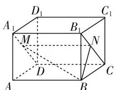
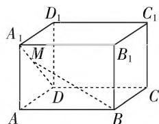
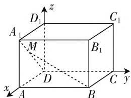

# 多思维,巧方法,妙破解

—— 一道线面角试题的处理

● 安徽省界首第一中学 孙晓洁

立体几何中的空间角(包括异面直线所成的角、线面角、二面角等)，可以集中有效地考查学生的空间想象能力、逻辑推理能力以及数学运算能力等，一直是历年高考试卷中的“常客”，备受高考命题者青睐，考查背景创新新颖，设问角度丰富多彩.

# 一、问题呈现

问题 （2020 年 11 月华大新高考联盟 2021 届高三教学质量测评数学试卷·16）已知长方体 ABCD-A₁B₁C₁D₁ 的体积为 40，外接球表面积为 $45\pi, AB = 5, BC < AA_{1}$ ，点 M 在线段 A₁D 上，记直线 BM 与平面 BCC₁B₁ 所成的角为 $\theta$ ，则 $\tan\theta$ 的取值范围为 \_\_\_\_.

此题是一道以长方体为背景的线面角的动态问题,是各地大型综合模拟题以及高考试题中的一类比较常见的热点问题,涉及空间中的线面角问题,主要考查推理论证能力、空间想象能力和数学运算能力等.破解此类问题的数学思维主要是借助几何思维、向量思维等切入,常见方法有:定义法、函数法、基底法、坐标法等.

# 二、问题破解

# 思维视角(一) 几何思维

解法1:(定义法)设AB=a=5,BC=b, $AA_{1}=c(b<c)$ ，可得长方体的对角线 $d=\sqrt{a^{2}+b^{2}+c^{2}}$ ，则长方体的外接球的半径 $R=\frac{1}{2}d=\frac{1}{2}\sqrt{a^{2}+b^{2}+c^{2}}$

结合 $\left\{\begin{aligned}a&=5,\\ abc&=40,\\ 4\pi R^{2}&=45\pi,\end{aligned}\right.$ 可得 $\left\{\begin{aligned}a&=5,\\ b&=2,\\ c&=4.\end{aligned}\right.$

如图 1 所示, 连接 $B_{1}C$ , 在矩形 $A_{1}B_{1}CD$ 中, 过点 M 作 $MN \parallel CD$ 交 $B_{1}C$ 于点 N, 根据

text_image

D₁
A₁
M
B₁
C₁
N
D
A
B
C

图1

空间线面角的定义,结合直线 BM 与平面 $BCC_{1}B_{1}$ 所成的角为 $\theta$ , 可知 $\angle MBN = \theta$ , 则有 $\tan\theta = \frac{MN}{BN} = \frac{5}{BN}$ ,
当 $BN \perp B_{1}C$ 时，利用等面积法可得 $BN=\frac{BC\cdot BB_{1}}{B_{1}C}=\frac{2\times4}{\sqrt{2^{2}+4^{2}}}=\frac{4}{\sqrt{5}}$ ，此时 $\tan\theta$ 取最大值为 $\frac{5}{\frac{4}{\sqrt{5}}}=\frac{5\sqrt{5}}{4}$ ;

当点 N 与点 $B_{1}$ 重合时，可得 BN = c = 4，此时 $\tan\theta$ 取最小值为 $\frac{5}{4}$ .

所以 $\tan \theta$ 的取值范围为 $\left[\frac{5}{4},\frac{5\sqrt{5}}{4}\right]$

故填答案: $\left[\frac{5}{4},\frac{5\sqrt{5}}{4}\right]$ .

点评:根据题目条件确定长方体的长、宽、高,结合辅助线的构造,根据空间线面角的定义来确定角 $\theta$ 所对应的角,利用三角函数的定义并结合动点的变化分别确定 $\tan\theta$ 的最大值与最小值,从而得以确定对应角的正切值的取值范围.

# 思维视角(二) 向量思维

解法 2:(基底法) 设 AB = a = 5, BC = b, $AA_{1} = c (b < c)$ , 可得长方体的对角线 $d = \sqrt{a^{2} + b^{2} + c^{2}}$ , 则长方体的外接球的半径 $R = \frac{1}{2}d = \frac{1}{2}\sqrt{a^{2} + b^{2} + c^{2}}$ ,

结合 $\left\{\begin{aligned}a=5,\\ abc=40,\\ 4\pi R^{2}=45\pi,\end{aligned}\right.$ 可得 $\left\{\begin{aligned}a=5,\\ b=2,\\ c=4.\end{aligned}\right.$

如图2所示，平面 $BCC_{1}B_{1}$ 的一个法向量为 $\overrightarrow{DC}$ ，可知 $|\overrightarrow{DC}| = 5$ ，设 $|\overrightarrow{DM}| = x \in [0, 2\sqrt{5}]$ .

text_image

D₁
A₁ M B₁ C₁
D C
A B

图2

又 $\overrightarrow{MB} = \overrightarrow{MD} +\overrightarrow{DB} = -\overrightarrow{DM} +\overrightarrow{DA} +\overrightarrow{DC}$ ，则

$$
\begin{array}{l} 2 5, \left| \overrightarrow {M B} \right| ^ {2} = (- \overrightarrow {D M} + \overrightarrow {D A} + \overrightarrow {D C}) ^ {2} = \overrightarrow {D M ^ {2}} + \overrightarrow {D A ^ {2}} \\ + \overrightarrow {D C ^ {2}} - 2 \overrightarrow {D M} \cdot \overrightarrow {D A} - 2 \overrightarrow {D M} \cdot \overrightarrow {D C} + 2 \overrightarrow {D A} \cdot \overrightarrow {D C} = x ^ {2} + \\ \cos \langle \overrightarrow {D C}, \overrightarrow {M B} \rangle = \frac {\overrightarrow {D C} \cdot \overrightarrow {M B}}{| \overrightarrow {D C} | | \overrightarrow {M B} |} = \frac {2 5}{5 \cdot \sqrt {x ^ {2} - \frac {4 \sqrt {5}}{5} x + 2 9}} \\ = \frac {5}{\sqrt {x ^ {2} - \frac {4 \sqrt {5}}{5} x + 4}} = \frac {5}{\sqrt {\left(x - \frac {2 \sqrt {5}}{5}\right) ^ {2} + \frac {1 6}{5}}} \in \\ \end{array}
$$

有 $\overrightarrow{DC} \cdot \overrightarrow{MB} = \overrightarrow{DC} \cdot (-\overrightarrow{DM} + \overrightarrow{DA} + \overrightarrow{DC}) = \overrightarrow{DC^2} =$

$4 + 25 - 2x \cdot 2 \cdot \frac{2}{2\sqrt{5}} = x^{2} - \frac{4\sqrt{5}}{5}x + 29$ ，可得

$= \frac{5}{\sqrt{x^2 - \frac{4\sqrt{5}}{5}x + 29}}$ ，而直线 $BM$ 与平面 $BCC_{1}B_{1}$ 所

成的角为 $\theta$ ，则有 $\sin \theta = \frac{5}{\sqrt{x^2 - \frac{4\sqrt{5}}{5}x + 29}}$ ，所以 $\tan \theta$

$\left[\frac{5}{4}, \frac{5\sqrt{5}}{4}\right]$ , 当 $x = \frac{2\sqrt{5}}{5}$ 时, $\tan \theta$ 取得最大值 $\frac{5\sqrt{5}}{4}$ ; 当 $x$

$= 2\sqrt{5}$ 时， $\tan \theta$ 取得最小值 $\frac{5}{4}$

所以 $\tan \theta$ 的取值范围为 $\left[\frac{5}{4},\frac{5\sqrt{5}}{4}\right]$

故填答案: $\left[\frac{5}{4},\frac{5\sqrt{5}}{4}\right]$ .

点评:根据题目条件确定长方体的长、宽、高,先确定平面 $BCC_{1}B_{1}$ 的一个法向量,再通过平面向量的线性关系结合对应的基底来确定 $\overrightarrow{MB}$ , 利用向量的夹角公式来确定两向量的夹角的余弦值, 结合空间线面角的定义转化为 $\sin\theta$ 的值, 利用三角函数的关系来建立 $\tan\theta$ 的函数关系式, 结合自变量的取值情况, 利用二次函数的图像与性质来确定对应角的正切值的取值范围.

解法 3:(坐标法) 设 AB = a = 5, BC = b, $AA_{1} = c (b < c)$ , 可得长方体的对角线 $d = \sqrt{a^{2} + b^{2} + c^{2}}$ , 则长方体的外接球的半径 R =

$\frac{1}{2} d = \frac{1}{2}\sqrt{a^2 + b^2 + c^2}$ ，结

合 $\left\{\begin{aligned}a=5,\\ abc=40,\\ 4\pi R^{2}=45\pi,\end{aligned}\right.$ 可得 $\left\{\begin{aligned}a=5,\\ b=2,\\ c=4.\end{aligned}\right.$

如图 3 所示, 以点 D 为坐

text_image

z
D₁
A₁
M
B₁
C₁
x
D
A
B
C
y

图3

标原点， $\overrightarrow{DA}$ 的方向为 $x$ 轴正方向建立空间直角坐标系 $D - xyz$ ，则 $B(2,5,0)$

设 $M(x,0,2x)(0\leqslant x\leqslant 2)$ ，可得 $\overrightarrow{MB} = (2-$ $x,5, - 2x)$ ，而平面 $BCC_{1}B_{1}$ 的一个法向量为 $\overrightarrow{DC} =$ $(0,5,0)$ ，可得 $\cos \langle \overrightarrow{DC},\overrightarrow{MB}\rangle = \frac{\overrightarrow{DC}\cdot\overrightarrow{MB}}{|\overrightarrow{DC}||\overrightarrow{MB}|} =$ $\frac{25}{5\cdot\sqrt{(2 - x)^2 + 25 + 4x^2}} = \frac{5}{\sqrt{5x^2 - 4x + 29}}$ ，而直线BM与平面 $BCC_{1}B_{1}$ 所成的角为 $\theta$ ，则有 $\sin \theta =$ $\frac{5}{\sqrt{5x^2 - 4x + 29}}$ ，所以 $\tan \theta = \frac{5}{\sqrt{5x^2 - 4x + 4}} =$ $\frac{5}{\sqrt{5(x - \frac{2}{5})^2 + \frac{16}{5}}} \in \left[\frac{5}{4},\frac{5\sqrt{5}}{4}\right]$ 当 $x = \frac{2}{5}$ 时， $\tan \theta$ 取得最大值 $\frac{5\sqrt{5}}{4}$ ；当 $x = 2$ 时， $\tan \theta$ 取得最小值 $\frac{5}{4}$

所以 $\tan \theta$ 的取值范围为 $\left[\frac{5}{4},\frac{5\sqrt{5}}{4}\right]$

故填答案： $\left[\frac{5}{4},\frac{5\sqrt{5}}{4}\right]$

点评:根据题目条件确定长方体的长、宽、高,通过空间直角坐标系的建立,先确定平面 $BCC_{1}B_{1}$ 的一个法向量,再确定向量 $\overrightarrow{MB}$ 的坐标,利用向量的夹角公式来确定两向量的夹角的余弦值,结合空间线面角的定义转化为 $\sin\theta$ 的值,利用三角函数的关系来建立 $\tan\theta$ 的函数关系式,结合自变量的取值情况,利用二次函数的图像与性质来确定对应角的正切值的取值范围.

# 三、解后反思

破解空间中直线和平面所成的线面角时,主要是借助几何思维、向量思维等数学思维切入,结合一些常见的方法与技巧来分析与处理,主要从定义法、等积法与坐标法等来具体处理,根据不同题目条件也有其他相应的特殊方法.理解与掌握破解空间线面角的数学思维与数学方法,有效实现空间与平面的化归与转化,充分考查学生的空间想象能力、逻辑推理能力以及数学运算能力等,增强良好的数学品质,培养数学核心素养.W