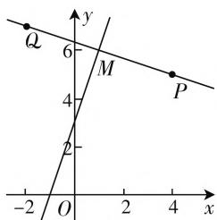

# 对称之美,美在多解

—— 点关于直线对称点的求法

● 武汉市第二十三中学 金波  
● 武汉市第二十三中学 何红梅

数学的对称美源于生活的美,也基于数学本身的规律性.对称之所以被认为美,是人类对美的主观感受,对称形成的整齐性让人类感受到美的愉悦.点关于直线对称是一种轴对称,点关于直线对称点的求法是高中数学的基础题型,是求直线和直线对称的基础,本文给出学生的多种解题思路,兼顾了解题的通性通法和常用解题方法的理性思考,培养学生的数学核心素养.

# 一、问题呈现

问题 求 $P(4,5)$ 关于直线 l:3x-y+3=0 的对称点 Q \_\_\_\_.

这是一道已知点的坐标和直线方程,求点关于直线对称点的典型题目.

# 二、解法剖析

# 思维角度(一)常规解法

设出对称点坐标,利用垂直和平分得到斜率乘积为-1,线段PQ的中点在对称直线上,解出对称点的坐标.

解法 1: 设 P 关于直线 l 的对称点为 $Q(x_{0}, y_{0})$ ，因为直线 PQ 和直线 l 垂直，所以直线 PQ 和直线 l 的斜率之积为 -1，线段 PQ 的中点在直线 l 上.

$$
\text {所以} \left\{ \begin{array}{l l} \frac {y _ {0} - 5}{x _ {0} - 4} \cdot 3 = - 1, \\ 3 \cdot \frac {4 + x _ {0}}{2} - \frac {y _ {0} + 5}{2} + 3 = 0 \end{array} \right. \Rightarrow \left\{ \begin{array}{l l} x _ {0} = - 2, \\ y _ {0} = 7, \end{array} \right.
$$

所以 $Q(-2,7)$ .

# 思维角度(二)交点法

利用直线 PQ 和直线 l 垂直, 求出直线 PQ 的斜率, 写出直线 PQ 的方程, 利用中点坐标公式写出 Q 点坐标.

解法 2: 如图 1, 设 P 关于直线 l 的对称点 $Q(x_{0}, y_{0})$ , PQ 交 l 于 M, 直线 PQ 的方程为 $y - 5 = -\frac{1}{3}(x$ -4),

联立 $\left\{\begin{aligned}y-5&=-\frac{1}{3}(x-4),\\ 3x-y+3&=0\end{aligned}\right.\Rightarrow\left\{\begin{aligned}x&=1,\\ y&=6,\end{aligned}\right.$

所以 $M(1,6)$ .

因为 M 是线段 PQ 的中点，
所以 $\left\{\begin{aligned}x_{0}&=2\times1-4=-2,\\ y_{0}&=2\times6-5=7,\end{aligned}\right.$

所以 $Q(-2,7)$ .

# 思维角度(三) 向量法

利用 $\overrightarrow{PQ}$ 等于 $\overrightarrow{PQ}$ 的模乘以 l 的单位法向量，而 $\overrightarrow{PQ}$ 的模等于 P 到 l 的距离的 2 倍.

text_image

Q
6
M
4
P
2
-2 O 1 2 3 4 x
y

图1

解法 3: 设 P 关于直线 l 的对称点 $Q(x_{0}, y_{0})$ ,

因为 l 的方向向量是 $(-1, -3)$ ，所以 l 的单位法向量是 $n = \left( \frac{3\sqrt{10}}{10}, -\frac{\sqrt{10}}{10} \right)$ ，P 到直线 l 的距离 $d = \frac{|3 \times 4 - 5 + 3|}{\sqrt{3^2 + (-1)^2}} = \sqrt{10}$ ，

$$
\overrightarrow {P Q} = - 2 d \boldsymbol {n} = - 2 \times \sqrt {1 0} \left(\frac {3 \sqrt {1 0}}{1 0}, \frac {\sqrt {1 0}}{1 0}\right) = (- 6, 2),
$$

所以 $(x_0 - 4, y_0 - 5) = (-6, 2)$ ,

所以 $\left\{\begin{aligned}x_{0}&=-2,\\ y_{0}&=7,\end{aligned}\right.$ 所以 $Q(-2,7)$ .

# 思维角度(四) 参数方程法

利用 l 的法向量写出 PQ 的参数方程, 设出 Q 点的坐标, 写出线段 PQ 的中点坐标, 利用中点在 l 上, 求出参数 t 得到 Q 的坐标.

解法四: 因为直线 PQ 的斜率为 $-\frac{1}{3}$ ，所以设直线 PQ 的参数方程为 $\left\{\begin{aligned}x &= 4 - 6t, \\ y &= 5 + 2t,\end{aligned}\right.$ 所以设 $Q(4 - 6t, 5 + 2t)$ ，PQ 的中点是 $M(4 - 3t, 5 + t)$ .

因为 M 在直线 l 上, 所以 $3(4-3t)-(5+t)+3=0$ , 解得 t=1, 所以 $Q(-2,7)$ .

# 三、归纳结论

结论1: $P(x_{0},y_{0})$ 关于直线 $l:Ax+By+C=0$ 的对称点 $Q(x',y')(A^{2}+B^{2}\neq0)$ ,

$$
\text {有} \left\{ \begin{array}{l l} x = x _ {0} - 2 A \cdot \frac {A x _ {0} + B y _ {0} + C}{A ^ {2} + B ^ {2}}, \\ y = y _ {0} - 2 B \cdot \frac {A x _ {0} + B y _ {0} + C}{A ^ {2} + B ^ {2}}. \end{array} \right.
$$

证明 1: 因为直线 PQ 和直线 l 垂直, 所以它们的斜率之积为 -1,

线段 PQ 的中点在直线 l 上，

$$
\begin{array}{l} \text {所以} \left\{ \begin{array}{l l} \frac {y _ {0} - y ^ {\prime}}{x _ {0} - x ^ {\prime}} \cdot \left(- \frac {A}{B}\right) = - 1, \\ A \cdot \frac {x _ {0} + x ^ {\prime}}{2} + B \cdot \frac {y _ {0} + y ^ {\prime}}{2} + C = 0 \end{array} \right. \\ \Rightarrow \left\{ \begin{array}{l} x ^ {\prime} = x _ {0} - 2 A \cdot \frac {A x _ {0} + B y _ {0} + C}{A ^ {2} + B ^ {2}}, \\ y ^ {\prime} = y _ {0} - 2 B \cdot \frac {A x _ {0} + B y _ {0} + C}{A ^ {2} + B ^ {2}}. \end{array} \right. \\ \end{array}
$$

证明 2: 设 PQ 交 l 于 M,

直线 $PQ$ 为 $y - y_0 = \frac{B}{A} (x - x_0)$

联立 $\left\{\begin{aligned}y-y_{0}&=\frac{B}{A}(x-x_{0}),\\ Ax+By+C&=0\end{aligned}\right.$

$$
\Rightarrow \left\{ \begin{array}{l} x = x _ {0} - A \cdot \frac {A x _ {0} + B y _ {0} + C}{A ^ {2} + B ^ {2}}, \\ y = y _ {0} - B \cdot \frac {A x _ {0} + B y _ {0} + C}{A ^ {2} + B ^ {2}}, \end{array} \right.
$$

所以 $M\left(x_{0}-A\cdot\frac{Ax_{0}+By_{0}+C}{A^{2}+B^{2}},y_{0}-B\cdot\frac{Ax_{0}+By_{0}+C}{A^{2}+B^{2}}\right)$ ,

$$
\text {所以} \left\{ \begin{array}{l l} x = x _ {0} - A \cdot \frac {A x _ {0} + B y _ {0} + C}{A ^ {2} + B ^ {2}}, \\ y = y _ {0} - B \cdot \frac {A x _ {0} + B y _ {0} + C}{A ^ {2} + B ^ {2}}. \end{array} \right.
$$

因为 $M$ 线段 $PQ$ 的中点，

$$
\text {所以} \left\{ \begin{array}{l l} x ^ {\prime} = 2 \Big (x _ {0} - A \cdot \frac {A x _ {0} + B y _ {0} + C}{A ^ {2} + B ^ {2}} \Big) - x _ {0} \\ \quad = x _ {0} - 2 A \cdot \frac {A x _ {0} + B y _ {0} + C}{A ^ {2} + B ^ {2}}, \\ y ^ {\prime} = 2 \Big (y _ {0} - B \cdot \frac {A x _ {0} + B y _ {0} + C}{A ^ {2} + B ^ {2}} \Big) - y _ {0} \\ \quad = y _ {0} - B \cdot \frac {A x _ {0} + B y _ {0} + C}{A ^ {2} + B ^ {2}}, \end{array} \right.
$$

所以 $Q\left(x_0 - 2A \cdot \frac{Ax_0 + By_0 + C}{A^2 + B^2}, y_0 - 2B \cdot \frac{Ax_0 + By_0 + C}{A^2 + B^2}\right)$ ,

$$
\text {所以} \left\{ \begin{array}{l l} x = x _ {0} - 2 A \cdot \frac {A x _ {0} + B y _ {0} + C}{A ^ {2} + B ^ {2}}, \\ y = y _ {0} - 2 B \cdot \frac {A x _ {0} + B y _ {0} + C}{A ^ {2} + B ^ {2}}. \end{array} \right.
$$

# 四、解后反思

本题题干简洁明了,难度不大,是一道常规题目.可以通过设出点的坐标求方程,也可以用向量和参数方程来解,向量法要考虑法向量的方向以及点在直线的哪一侧,一题多解教学是整个数学教学中的一个重要环节.在解题教学过程中,不仅要向学生传授数学的基础知识和解题的基本技能,更需要通过解题教学来培养学生的逻辑思维能力,进一步使数学思想的传授由简单的抽象的理性的说教转化成具体的感性的具有可操作性的客观存在.在高三复习过程中一题多解可以让学生把各个知识点联系起来,培养学生的发散性思维.

在教学中教师要适当的一题多解,一题多变来发散学生思维,帮助学生多方位思考问题,用数学的视野分析问题,从而指向数学学科的关键能力,教师在平时的教学中要欣赏和表扬学生提出不同的解题方法,引导学生从多方面思考数学问题,深化对知识的理解,发挥题目的价值,长期坚持让学生的知识可以内化,促进学生的数学学科素养的提升.

解完题目后要反思总结规律,提炼一般的结论并证明,并对方法总结,提升自己对知识和方法的理解.学生在长期的一题多解和从特殊到一般的训练中会提升自己的解题能力,拓展思维,数学学科素养也会在无形中升华.

# 参考文献：

[1] 胡接春. 点关于直线对称的一个新公式 [J]. 数学教学通讯, 2020(30).  
[2] 史红静, 王学一. 一类关于直线对称问题的简便求法 [J]. 中小学数学 (高中版), 2018(3). W