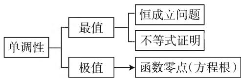
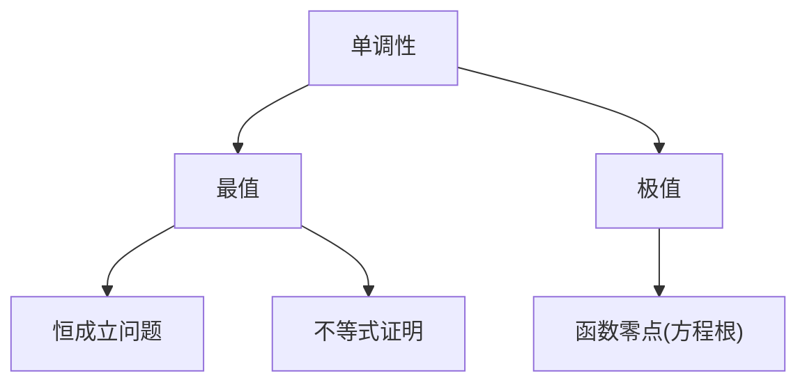
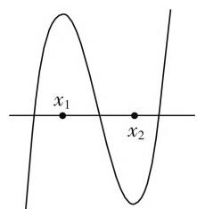

# 巧用“两招”突破高考函数单调性的讨论问题

# ● 北京师范大学(珠海) 附属高级中学 黄 晓

函数单调性是函数的关键性质. 因此, 讨论含参函数单调性成为高考的常考问题, 本文通过例子说明讨论含参函数单调的技巧及其使用方法.

flowchart

图1

# 一、函数单调性在高考中如何考

由图 1 可知:一方面,由函数的单调性,可以解决函数的最值问题,从而解决恒成立和不等式的证明问题;另一方面,由函数单调性,可以解决函数的极值问题,从而解决函数零点(方程根)的问题.比如:

(1) $a \geqslant f(x)$ 恒成立 $\Leftrightarrow a \geqslant f(x)_{\max}$ ，恒成立问题转化为求函数的最值问题，进而转为讨论函数单调性的问题.  
(2) $f(x) \geqslant g(x) \Leftrightarrow (f(x) - g(x))_{\min} \geqslant 0$ ，该类函数不等式的证明问题，往往转化为求函数的最值，最终转化为讨论函数的单调性.

(3) 如图 2 所示, 函数 $f(x)$

存在两个零点 $\Leftrightarrow \left\{ \begin{array}{l} f(x_{1}) > 0, \\ f(x_{2}) < 0, \end{array} \right.$ （ $x_{1} < x_{2}, x_{1}, x_{2}$ 分别为极大值点和极小值点）. 由此可见，函数的单调性是函数的关键性质，是高考重点考查对象，在高考中一般会把单调性问题与函数零点及不等式证明等问题结合在一起综合考查,通常是以单调性为基础解决其他问题,要求考生能熟练讨论函数的单调性尤其是含参函数的单调性.

text_image

x₁
x₂

图2

# 二、讨论函数单调性的技巧

对函数单调性,高考中常考方向是:(1)讨论含参函数的单调性;(2)讨论 $f'(x)=0$ 有隐形根的函数的单调性,常用的两招是:“临界状态法”和“二次求导”,下面我们举例分析.

# （一）临界状态法找分类的界点—— $f'(x)=0$ 的根可求

例 1 已知函数 $f(x)=\ln x+ax^{2}-(2a+1)x(a \in \mathbf{R})$ ，试讨论 $f(x)$ 的单调性.

解:由题知,函数的定义域为 $(0,+\infty)$ ,且 $f'(x)=\frac{1}{x}+2ax-(2a+1)=\frac{2ax^{2}-(2a+1)x+1}{x}=\frac{(2ax-1)(x-1)}{x}$ .

(1) 当 a<0 时，由 $f'(x)=0$ ，得 $x_{1}=1, x_{2}=\frac{1}{2a}<0$ ，所以 $f(x)$ 在区间 $(0,1)$ 上单调递增，在区间 $(1,+\infty)$ 上单调递减；  
(2) 当 a=0 时, $f(x)$ 在区间 $(0,1)$ 上单调递增, 在区间 $(1,+\infty)$ 上单调递减;  
(3) 当 $0 < a < \frac{1}{2}$ 时, $f(x)$ 在区间 $(0,1)$ 上单调递增, 在区间 $\left(1,\frac{1}{2a}\right)$ 上单调递减, 在区间 $\left(\frac{1}{2a},+\infty\right)$ 上单调递增;  
(4) 当 $a = \frac{1}{2}$ 时, $f(x)$ 在区间 $(0, +\infty)$ 上单调递增;  
(5) 当 $a > \frac{1}{2}$ 时, $f(x)$ 在区间 $\left(0, \frac{1}{2a}\right)$ 上单调递增, 在区间 $\left(\frac{1}{2a}, 1\right)$ 上单调递减, 在区间 $(1, +\infty)$ 上单调递增.

点评:(1)本例需要分类讨论函数的单调性,分类的关键是找到分界点,该题的界点“0”和“1”是怎么出来的呢?我们是通过考虑“临界状态”求出来.何为临界状态?在本例中,我们需要讨论 $(2ax-1)(x-1)>0$ 的解集,当a>0时,相应二次函数开口向上,而当a<0时,相应二次函数开口向下,临界状态就是a=0;另外 $a\neq0$ 时,相应二次方程有两根 $x_{1}=1,x_{2}=\frac{1}{2a},x_{1}$ 可大于 $x_{2}$ ,也可小于 $x_{2}$ ,其临界状态就是 $x_{1}=$

$x_{2}$ ，这时 $a=\frac{1}{2}$ ，由此我们得到了 a 的两个特殊值，这两个特殊值恰好是分类的“界点”。一般地，对于不等式 $ax^{2}+bx+c>0$ ，若其相应方程根可求，则其临界状态为 a=0（二次项系数为 0）和 $x_{1}=x_{2}$ （两根相等）；(2) 如果求导后的式子为二次三项式的结构，一般先考虑用“十字相乘法”进行因式分解，我们可以通过计算“判别式”来判断能否使用“十字相乘法”，如果“判别式”为一个完全平方数，则可以使用“十字相乘法”。如本例的判别式 $\Delta=(2a-1)^{2}$ 为一个完全平方数，可用“十字相乘法”。

# （二）临界状态法找分类的界点—— $f'(x)=0$ 的根未定

例2 已知函数 $f(x) = \frac{\ln x - a}{x} (a \in \mathbf{R})$ ，试讨论 $g(x) = \frac{f(x)}{x}$ 在区间 $(1, +\infty)$ 上的单调性.

解:由题知, $g(x)$ 的定义域为 $(0,+\infty)$ 且 $g'(x)=\frac{2a+1-2\ln x}{x^{3}}$ .

(1) 当 $a \leqslant -\frac{1}{2}$ 时, $2a + 1 \leqslant 0$ , 又因为 $x > 1$ , 所以 $2\ln x > 0$ , 所以 $2a + 1 - 2\ln x < 0$ , 所以 $g'(x) < 0$ , 所以 $g(x)$ 在区间 $(1, +\infty)$ 单调递减.  
(2) 当 $a > \frac{1}{2}$ 时, 由 $g'(x) = 0$ , 得 $x = \mathrm{e}^{a + \frac{1}{2}}$ , 当 $1 < x < \mathrm{e}^{a + \frac{1}{2}}, g'(x) > 0$ , 当 $x > \mathrm{e}^{a + \frac{1}{2}}, g'(x) < 0$ , 所以 $g(x)$ 在区间 $(1, \mathrm{e}^{a + \frac{1}{2}})$ 上单调递增; 在区间 $(\mathrm{e}^{a + \frac{1}{2}}, +\infty)$ 上单调递减.

点评: 当 $2a+1<0$ 时, $g'(x)=0$ 无实数根; 当 $2a+1>0$ 时, $g'(x)=0$ 有实数根, 所以临界状态为 $2a+1=0$ , 即 $a=-\frac{1}{2}$ , 即为分类的“界点”.

# (三) 二次求导 —— $f'(x)=0$ 存在隐形根

例 3 （2013 年全国新课标卷 Ⅱ（理数）21 题）已知函数 $f(x)=\mathrm{e}^{x}-\ln(x+m)$ . 设 x=0 是 $f(x)$ 的极值点，求 m 并讨论 $f(x)$ 的单调性

解:由题知, $f'(x)=\mathrm{e}^{x}-\frac{1}{x+m}$ . 因为 x=0 是 $f(x)$ 的极值点,所以 $f'(0)=0$ ,所以 m=1,

所以 $f(x)$ 的定义域为 $(-1, +\infty)$ , $f'(x) = \mathrm{e}^{x} - \frac{1}{x+1}$ , 所以 $f''(x) = \mathrm{e}^{x} + \frac{1}{(x+1)^{2}} > 0$ ,

所以 $f'(x)$ 在区间 $(-1, +\infty)$ 上单调递增，又因为 $f'(0) = 0$ ，所以 $f'(x)$ 在区间 $(-1, +\infty)$ 上有唯一的零点 $x_0 = 0$ ，所以当 $x \in (-1,0)$ 时， $f'(x) < 0$ ，当 $x \in (0, +\infty)$ 时， $f'(x) > 0$

所以 $f(x)$ 在区间 $(-1,0)$ 上单调递减，在区间 $(0,+\infty)$ 上单调递增.

点评:本例的 $f'(x)=0$ 存在隐形根,通过二次求导判断 $f'(x)$ 的单调性,然后根据零点存在定理确定根所在区间或代特殊值找出隐形根,然后根据 $f'(x)$ 单调性和根的情况,判断 $f(x)$ 的单调性.

例 4 （2019 年全国卷 I（理数）21 题改编）已知函数 $f(x)=\sin x-\ln(x+1)$ ， $f'(x)$ 为 $f(x)$ 的导数。讨论 $f'(x)$ 在区间 $\left(-1,\frac{\pi}{2}\right)$ 上的单调性。

解: $f(x)$ 的定义域为 $(-1,+\infty)$ , 设 $g(x)=f'(x)$ , 则 $g(x)=\cos x-\frac{1}{1+x}$ , $g'(x)=-\sin x+\frac{1}{(1+x)^2}$ , $g''(x)=-\cos x-\frac{2}{(1+x)^3}$ , 当 $x\in\left(-1,\frac{\pi}{2}\right)$ 时, $g''(x)<0$ , 所以 $g'(x)$ 在区间 $\left(-1,\frac{\pi}{2}\right)$ 上单调递减, 而 $g'(0)>0$ , $g'\left(\frac{\pi}{2}\right)<0$ , 所以 $g'(x)$ 在 $\left(-1,\frac{\pi}{2}\right)$ 有唯一零点设为 $\alpha$ . 则当 $x\in(-1,\alpha)$ 时, $g'(x)>0$ ; 当 $x\in\left(\alpha,\frac{\pi}{2}\right)$ 时, $g'(x)<0$ .

所以 $g(x)$ 即 $f'(x)$ 在 $(-1, \alpha)$ 上单调递增，在 $\left(\alpha, \frac{\pi}{2}\right)$ 上单调递减.

点评:本例中 $g'(x)=0$ 存在隐形根但不像例3那样能猜出精确解,我们先借助二阶导数判断一阶导函数的单调性,然后借助零点存在定理判断 $g'(x)=0$ 的根的存在性,从而确定函数的单调性.

# 三、反思总结

单调性是函数的关键性质, 是高考常考问题, 也是一个难点问题. 命题者在设置问题时, 一般是先讨论函数的单调性, 然后利用单调性解决零点 (方程根)、不等式证明以及恒成立等问题. 高考中比较常见的考法: (1) 分类讨论含参函数单调性, 这类问题的关键是找到分类的界点, 而“临界状态法”是行之有效的方法; (2) 讨论 $f'(x) = 0$ 有隐形根的函数的单调性, 而“二次求导”是解决这类问题的有效方法. F