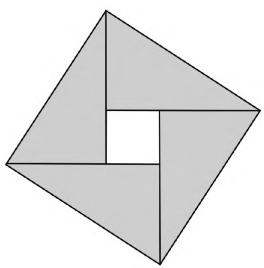

# 延续浙江特色,实现平稳过渡

——2021年高考数学浙江卷评析与教学启示

● 江苏省宿迁中学 彭清峰

2021年高考数学浙江卷依然延续了历年单独命题的浙江命题风格，很好地落实了“立德树人，服务选才，引导教学”的核心功能，坚持高考的核心价值，突出数学的学科特色，关注数学学科素养，发挥了数学学科高考的选拔功能，对深化中学数学教学改革发挥了积极的导向作用，有很好的信度与区分度，有利于高校选拔优秀人才、中学新课程的改革与推进，也有利于实现向全国统一高考的平稳过渡。

# 一、结构合理，凸显主干

2021年高考数学浙江卷试题灵活多变，结构合理，思维含量高，知识与方法交汇融合度较高，对高中数学中的主干知识进行重点考查，考试目标定位合理，聚集高中数学的核心内容，发挥高考评价的核心功能与核心价值.

<table><tr><td>知识板块</td><td>题型</td><td>题号</td><td>分值</td><td>占比</td></tr><tr><td>三角(含解三角形)</td><td>1大题2小题</td><td>8,14,18</td><td>24</td><td>16%</td></tr><tr><td>数列</td><td>1大题1小题</td><td>10,20</td><td>19</td><td>12.7%</td></tr><tr><td>立体几何</td><td>1大题2小题</td><td>4,6,19</td><td>23</td><td>15.3%</td></tr><tr><td>概率统计</td><td>2小题</td><td>13,15</td><td>12</td><td>8%</td></tr><tr><td>解析几何</td><td>1大题1小题</td><td>16,21</td><td>21</td><td>14%</td></tr><tr><td>函数与导数</td><td>1大题3小题</td><td>7,9,12,22</td><td>27</td><td>18%</td></tr><tr><td>集合与常用逻辑</td><td>2小题</td><td>1,3</td><td>8</td><td>5.3%</td></tr><tr><td>复数</td><td>1小题</td><td>2</td><td>4</td><td>2.7%</td></tr><tr><td>平面向量</td><td>1小题</td><td>17</td><td>4</td><td>2.7%</td></tr><tr><td>推理与证明、不等式</td><td>2小题</td><td>5,11</td><td>8</td><td>5.3%</td></tr></table>

2021年高考数学浙江卷中考查知识板块及分值统计如下：

从上表可以看出,整份试卷对于高中数学的主干知识,如函数与导数、三角、数列、立体几何、解析几何等核心内容进行重点考查,其中三角(含解三角形)、解析几何、函数与导数、立体几何这四个知识板块的试题分值均在20分以上,其中函数与导数的分值最高为27分,数列与概率统计这两个知识板块的试题分值均有10～20分,主干知识考查总分值为126分,占全卷的84%左右,基本维持浙江卷历年高考对主干知识考查分值的大体比例;剩下的24分分别是集合、复数、平面向量以及推理与证明(含不等式)等知识板块.

# 二、保持风格，适当变革

2021年高考数学浙江卷中，依旧保持了“低起点、缓坡度、多层次、区分好”的试题风格，如第1,2,3,4,5,11,12,18等题起点较低，着重考查高中数学的基本概念和基础知识，彰显了试卷的人文关怀；第 $6\sim 9$ $11\sim 16$ 等题难度逐步提升，对数学思维能力、运算能力、空间想象等数学能力进行考查；各种题型都设置把关题，如第10、17、22题，其中第10题需要对数列进行巧妙放缩，第17题综合了平面向量与多元不等式问题，难度较大，第21题对计算能力要求较高，第22题（特别是其中的第二问与第三问）的函数与导数，承载了压轴的重任，这些梯度的设置很好体现了试题良好的区分度.第 $13\sim 16$ 题一题两空的设计让不同层次的学生都能有所收获，不仅可以提高得分率，而且具有很好的区分度.

另外,我们也发现前几年高考浙江卷中热度不减、难度较大的题目类型,比如绝对值函数与绝对值不等式,动态几何(立体几何的翻折、旋转与射影,空间角比大小等)等问题,在今年的高考试卷中热度有所减退,进行一些可行的适应变革,可能是为了更好地向新高考进行无缝对接.

例 1 （2021 年高考数学浙江卷第 10 题）已知数列 $\{a_{n}\}$ 满足 $a_{1}=1, a_{n+1}=\frac{a_{n}}{1+\sqrt{a_{n}}}(n\in\mathbf{N}^{*})$ . 记数列 $\{a_{n}\}$ 的前 n 项和为 $S_{n}$ ，则（）.

A. $\frac{1}{2}<S_{100}<3$

B. $3 <   S_{100} <   4$

C. $4 < S_{100} < \frac{9}{2}$

D. $\frac{9}{2} < S_{100} < 5$

解析: 因为 $a_{1}=1, a_{n+1}=\frac{a_{n}}{1+\sqrt{a_{n}}}(n\in\mathbf{N}^{*})$ ，所以 $a_{n}>0$ ，且 $a_{2}=\frac{1}{2}$ ，则 $S_{100}>\frac{1}{2}$ 。由 $a_{n+1}=\frac{a_{n}}{1+\sqrt{a_{n}}}$ 取倒数得 $\frac{1}{a_{n+1}}=\frac{1}{a_{n}}+\frac{1}{\sqrt{a_{n}}}=\left(\frac{1}{\sqrt{a_{n}}}+\frac{1}{2}\right)^{2}-\frac{1}{4}<\left(\frac{1}{\sqrt{a_{n}}}+\frac{1}{2}\right)^{2}$ ，所以 $\frac{1}{\sqrt{a_{n+1}}}-\frac{1}{\sqrt{a_{n}}}<\frac{1}{2}$ 。

根据累加法可得 $\frac{1}{\sqrt{a_n}} \leqslant 1 + \frac{n-1}{2} = \frac{n+1}{2}$ , 当且仅当 $n=1$ 时取等号, 所以 $a_n \geqslant \frac{4}{(n+1)^2}$ , 则 $a_{n+1} = \frac{a_n}{1 + \sqrt{a_n}} \leqslant \frac{a_n}{1 + \frac{2}{n+1}} = \frac{n+1}{n+3} a_n$ , 所以 $\frac{a_{n+1}}{a_n} \leqslant \frac{n+1}{n+3}$ .

由累乘法可得 $a_{n} \leqslant \frac{6}{(n + 1)(n + 2)}$ ，当且仅当 $n = 1$ 时取等号.

由裂项求和法得 $S_{100} \leqslant 6\left(\frac{1}{2} - \frac{1}{3} + \frac{1}{3} - \frac{1}{4} + \frac{1}{4} - \frac{1}{5} + \cdots + \frac{1}{101} - \frac{1}{102}\right) = 6\left(\frac{1}{2} - \frac{1}{102}\right) < 3$ ，即 $\frac{1}{2} < S_{100} < 3$ .

故选A.

# 三、关注素养，落实精神

《普通高中数学课程标准(2017年版)》指出高考命题要注重对学生数学学科素养的考查，围绕数学内容主线，聚焦学生对重要数学概念、定理、方法、思想的理解和应用，强调基础性、综合性。《中国高考评价体系》也指出高考考查要求的“四翼”，即基础性、综合性、应用性和创新性。浙江高考数学卷充分地落实了新课程标准和高考评价体系的指导精神，试卷关注数学学科素养的考查（如下表），很好地体现了从能力立意向素养立意的新特点；试题在知识的交汇点命制，体现知识与方法融合性，反映了数学知识、数学能力的内部整合及其综合运用。如第3题把充要条件的判断与平面向量的性质加以融合；第8题综合运用三角函数与基本不等式知识；第9题把函数、等比数列、平面解析几何中的轨迹问题等知识进行综合运用；第17题把平面向量与不等式求最值问题等综合运用。

<table><tr><td>数学核心素养</td><td>题号</td></tr><tr><td>数学抽象</td><td>11,15,22</td></tr><tr><td>逻辑推理</td><td>3,7,9,10,19,20,21,22</td></tr></table>

<table><tr><td>数学建模</td><td>4,15</td></tr><tr><td>直观想象</td><td>4,6,7,11,14,16,19,21</td></tr><tr><td>数学运算</td><td>8,9,16,17,18,20,21,22</td></tr><tr><td>数据分析</td><td></td></tr></table>

例 2 （2021 年高考数学浙江卷第 9 题）已知 a, b ∈ R, ab > 0，函数 $f(x) = ax^{2} + b (x \in \mathbb{R})$ 。若 $f(s - t)$ , $f(s)$ , $f(s + t)$ 成等比数列，则平面上点 $(s, t)$ 的轨迹是（）.

A. 直线和圆

B. 直线和椭圆

C. 直线和双曲线

D. 直线和抛物线

解析: 函数 $f(x)=ax^{2}+b$ ，因为 $f(s-t)$ ， $f(s)$ ， $f(s+t)$ 成等比数列，则有 $[f(s)]^{2}=f(s-t)f(s+t)$ ，即 $(as^{2}+b)^{2}=[a(s-t)^{2}+b][a(s+t)^{2}+b]$ ，展开有 $a^{2}s^{4}+2abs^{2}+b^{2}=a^{2}[(s-t)^{2}(s+t)^{2}]+ab(s-t)^{2}+ab(s+t)^{2}+b^{2}$ ，整理可得 $a^{2}t^{4}-2a^{2}s^{2}t^{2}+2abt^{2}=0$ 。

因为 $a \neq 0$ ，故 $at^4 - 2as^2t^2 + 2bt^2 = 0$ ，即 $t^2(at^2 - 2as^2 + 2b) = 0$ ，所以 $t = 0$ 或 $at^2 - 2as^2 + 2b = 0$ .

当 t=0 时，点 $(s,t)$ 的轨迹是直线；

当 $at^{2}-2as^{2}+2b=0$ ，即 $\frac{as^{2}}{b}-\frac{at^{2}}{2b}=1$ ，

因为 ab < 0，故点 $(s, t)$ 的轨迹是双曲线.

综上分析,平面上点 $(s,t)$ 的轨迹是直线或双曲线.

故选C.

# 四、渗透文化，关注创新

作为数学知识的载体的数学文化,丰富了数学教育的内涵.2021年高考浙江数学试卷关注我国优秀数学文化成果的渗透.该试卷第11题以我国古代数学家赵爽用弦图给出了勾股定理的证明为背景,数形结合,考查考生综合运用数学知识解决问题的能力,让考生充分感悟到我国古代数学家的聪明才智.

创新一直是浙江卷的一大优良传统，通过问题的设计考查学生的创新思维能力，通过知识交汇的题型创新（如第8～10题），考查学生的创新意识与知识的创新应用。对学生来说，能够综合运用所学知识解决遇到的数学问题，就是创新思维的应用。选择题和填空题强调概念的理解，知识点清晰不堆砌，解答题设问清楚有梯度。对不同基础、不同能力水平的学生都提供了适当的思考空间，提供创新意识与应用的施展场所。如第8题设计新颖，对学生的数学对称直觉思维和估算能力有很好的考查。

例 3 （2021 年高考数学浙江卷第 11 题）我国古代数学家赵爽用弦图给出了勾股定理的证明. 弦图是由四个全等的直角三角形和中间的一个小正方形拼成的一个大正方形(如图 1 所示). 若直角三角形直角边的长分别为 3,4, 记大正方形的面积为 $S_{1}$ ，小正方形的面积为 $S_{2}$ ，则 $\frac{S_{1}}{S_{2}} =$ \_\_\_\_ .

natural_image

Geometric diagram of a square divided into triangles and a central square (no text or symbols)

图1

解析:由于直角三角形直角边的长分别为3,4,则知直角三角形斜边的长为 $\sqrt{3^{2}+4^{3}}=5$ ,则其面积为 $S_{1}=5^{2}=25$ ,又小正方形的面积 $S_{2}=25-4\times\frac{1}{2}\times3\times4=1$ ,所以 $\frac{S_{1}}{S_{2}}=25$ .

故填答案:25.

# 五、教学启示，平稳过渡

从 2023 年高考开始, 浙江高考的语文、英语、数学试卷不再进行独立的自主命题,从而回归改用全国卷.从近两年(2020年和2021年)浙江高考试卷来看,都给出我们很好的教学启示.

首先要立足教材、回归课本，重视数学基础知识、基本方法、基本能力和基本解题经验，教学中要熟知每个章节的知识点在课程标准中不同层次的教学要求，以此指导我们的教学活动；其次，注重数学本质，以培养学生数学学科素养为导向，淡化解题技巧，认真研究新高考试题，通过试题考点的分析，厘清高考的重点、难点和热点，结合新课程标准，明确相关的知识要求层次，弄清能力和数学思想方法的具体要求，把数学核心素养要求具体落实到解题教学中去，做到科学备考；再者，研究新《普通高中课程标准》和《中国高考评价体系》，在平时数学教学与复习备考时，教师一定要以数学课程标准为准，以高考评价体系为纲，要教会学生思考，让学生全身心参与学习过程、获得成功体验、理解数学核心知识与思想，提高学生自主探究的能力，让他们的思维具有独立性、批判性和创新性，这样才能在高考中展现自我风采，永葆初心，不迷失自我，不迷失方向，实现自主命题向统一命题的平稳过渡。F

# (上接第30页)

问:证明 $l \parallel BC$ 还有没有其他方法?

答: 另证 1: 可以通过线面平行的性质定理得出 $l \parallel BC$ .

在正方形中， $BC \parallel AD, BC \not\subset$ 平面 PAD, $AD \subset$ 平面 PAD, 所以 BC ∥ 平面 PAD.

又因为 $BC \subset$ 平面 PBC，平面 PAD $\cap$ 平面 PBC = l，所以 $BC \parallel l$ .

另证 2: BC // 平面 PAD, $l \subset$ 平面 PAD, 则 BC 与 l 无交点.

又因为 BC 与 l 同时在平面 PBC 内, 则 BC // l.

依据思维导图 3, 证明线面垂直有四种基本方法, 刚才的证明是依据线面垂直的性质定理. 你能以不同的方式证明这个结论吗? 换句话说, 难点的突破还有没有其他方法?

答: 另证 3: 可证明 $CD \perp$ 平面 PAD, $l \subset$ 平面 PAD, 所以 $CD \perp l$ .

又 $l \parallel BC \parallel AD, PAD$ , 所以 $PD \perp l, PD \cap CD = D$ , 所以 $l \perp$ 平面 $PDC$ .

另证 4: 过 D 作 $DM \perp PC$ 交 PC 于 M 点, 可证明平面 $PDC \perp$ 平面 PBC, 平面 $PDC \cap$ 平面 PBC =$PC$ ，则 $DM \perp$ 平面 $PBC, l \subset$ 平面 $PBC$ ，所以 $DM \perp l.$ 又 $PD \perp l, DM \cap PD = D$ ，所以 $l \perp$ 平面 $PDC$ .

经过以上的教学过程,学生对立体几何的证明问题有了更深刻的理解,从问题的分析到问题的解答,通过对学生提出问题的方式来开拓学生的思维,教会学生思考的方法.通过解题过程中思维导图的制作,让学生整节课处于思索状态,帮助学生在轻松的环境中掌握知识.教师作为问题的提问者,能清楚地看到学生在整个解题过程中出现的矛盾,并将其转化为学生认知发展的动力.

本高考题通过波利亚解题法的介入,引导学生对问题进行思索,并为学生以后解题过程中能够独立思考打下基础.教师是引导者,学生是解题的主体.

在回顾反思中通过思维导图的制作,帮助学生对整个立体几何的相关知识点进行梳理,从宏观上把握全局,梳理抽象的知识体系,培养学生的知识整合能力,空间想象能力,逻辑推理能力.能够通过思维导图运用图形语言进行交流,从而有效提高学生的学习效率,并借助思维导图有效训练学生的形象思维,提高学生的逻辑思维能力. $^{F}$