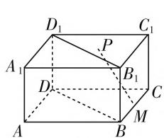
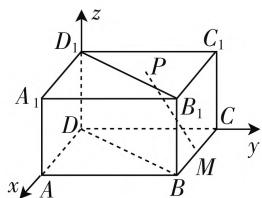
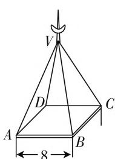
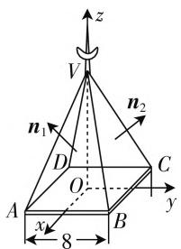
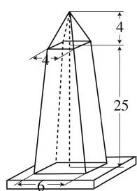
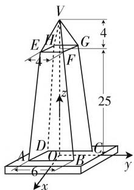

# 建筑中空间向量的巧妙应用

# ● 江苏省沭阳高级中学 徐东辉

我们知道, 空间向量是处理空间问题的重要方法, 通过空间向量将空间元素间的位置关系转化为数量关系, 将过去的形式逻辑证明转化为数值计算, 化繁难为简易, 化复杂为简单, 为处理某些立体几何问题提供了新的视角. 而在实际的建筑中, 特别在确定建筑中的点的位置、长度、角度等问题中, 经常碰到一些可以用空间向量来处理的实际应用问题.

# 一、建筑中的点位置问题

例 1 在长方体大型框架建筑 $ABCD-A_{1}B_{1}C_{1}D_{1}$ 中，如图 1，已知点 M 为长方体 $ABCD-A_{1}B_{1}C_{1}D_{1}$ 的底面上的棱 BC 的中点，点 P 在长方体 $ABCD-A_{1}B_{1}C_{1}D_{1}$ 的墙面 $CC_{1}D_{1}D$ 内，且 $PM \parallel$ 平面 $BB_{1}D_{1}D$ ，试探讨点 P 在墙面 $CC_{1}D_{1}D$ 内的确切位置.

text_image

D₁
C₁
A₁
P
B₁
D
C
A
B
M

图1

text_image

z
D₁ C₁
P
A₁ B₁ C
D y
x A B M

图2

分析:对于空间建筑中点的位置的确定问题,可以通过建立空间直角坐标系,把条件中的平行关系转化为坐标参数,通过对应平面法向量与直线的方向向量之间的数量积关系,通过计算达到解答的目的.

解:设长方体大型框架建筑 $ABCD-A_{1}B_{1}C_{1}D_{1}$ 的长、宽、高分别为 a, b, c，如图 2，以 D 为原点，分别沿 DA、DC、 $DD_{1}$ 方向为 x 轴、y 轴、z 轴的正方向，建立空间坐标系，则得坐标 $D(0,0,0)$ ， $B(b,a,0)$ ， $C(0,a,0)$ ， $D_{1}(0,0,c)$ ，则 $\overrightarrow{DB}=(b,a,0)$ ， $\overrightarrow{DD_{1}}=(0,0,c)$ ，由于点 M 为长方体 $ABCD-A_{1}B_{1}C_{1}D_{1}$ 的底面上的棱 BC 的中点，则 $M\left(\frac{b}{2},a,0\right)$ .

设点 $P$ 的坐标为 $(0, y, z)$ ，则有 $\overrightarrow{PM} = \left(\frac{b}{2}, a - y, -z\right)$ ，设平面 $BB_{1}D_{1}D$ 所在平面的法向量为 $\pmb{n}_{1} = (1, y_{1}, z_{1})$ ，则 $\overrightarrow{DB} \cdot \pmb{n}_{1} = b + ay_{1} + 0 = 0, \overrightarrow{DD_{1}}$

\- $n_1 = 0 + 0 + cz_1 = 0$ ，解得 $y_1 = -\frac{b}{a}, z_1 = 0$ ，所以 $n_1 = \left(1, -\frac{b}{a}, 0\right)$ .

由于 $PM \parallel$ 平面 $BB_{1}D_{1}D$ , 则有 $\overrightarrow{PM} \cdot \boldsymbol{n}_{1} = \frac{b}{2} - \frac{b}{a}(a - y) + 0 = 0$ , 解得 $y = \frac{a}{2}$ , 则点 $P$ 的坐标为 $\left(0, \frac{a}{2}, z\right)$ , 即点 $P$ 在墙面 $CC_{1}D_{1}D$ 内的确切位置是在墙面 $CC_{1}D_{1}D$ 内线段 $CD$ 的垂直平分线上.

点评:对于空间的点的位置问题,除了可以利用立体几何的相应知识点来分析处理外,有时通过空间向量的引入,把平行、垂直等相关问题转化为有关向量的运算内容,达到非常好的处理效果.这样,可以把立体几何中的分析与证明问题通过相应的计算来达到目的,省去立体几何中作出相应的辅助线及相应的证明叙述.

# 二、建筑中的长度问题

例 2 如图 3, 尖顶房屋的屋顶呈正四棱锥形状, 底面是一个边长为 8 米的正方形. 为了使顶面(棱锥侧面)之间变成 $120^{\circ}$ 角, 屋顶应多高?

text_image

V
D
C
A
B
8

图3

text_image

z
V
n₁
n₂
D
O
A
B
C
y
x
8

图4

分析:对于空间建筑问题,可以通过建立空间直角坐标系,把要求的长度问题转化为坐标参数,通过对应平面法向量之间的数量积关系,通过计算达到解答的目的.

解:如图4,以底面正方形ABCD的中心O为原点,z轴垂直向上,建立空间坐标系,则得坐标A(4,

$$
- 4, 0), B (4, 4, 0), C (- 4, 4, 0).
$$

设屋顶尖为 $V(0,0,z)$ ，则 $\overrightarrow{AV} = (-4,4,z),\overrightarrow{BV} =$ $(-4, - 4,z),\overrightarrow{CV} = (4, - 4,z).$

设 $\triangle VAB$ 所在平面的法向量为 $n_1 = (x_1, y_1, 1)$ ，则 $\overrightarrow{AV} \cdot n_1 = -4x_1 + 4y_1 + z = 0, \overrightarrow{BV} \cdot n_1 = -4x_1 - 4y_1 + z = 0$ ，解得 $x_1 = \frac{z}{4}, y_1 = 0$ ，所以 $n_1 = \left(\frac{z}{4}, 0, 1\right)$ .

设 $\triangle VBC$ 所在平面的法向量为 $n_2 = (x_2, y_2, 1)$ ，则 $\overrightarrow{BV} \cdot n_2 = -4x_2 - 4y_2 + z = 0, \overrightarrow{CV} \cdot n_2 = 4x_2 - 4y_2 + z = 0$ ，解得 $x_2 = 0, y_2 = \frac{z}{4}$ ，所以 $n_2 = \left(0, \frac{z}{4}, 1\right)$ .

二面角 $\triangle VAB - VB - \triangle VBC$ 的平面角为 $120^{\circ}$ 则平面 $VAB$ 与平面 $VBC$ 所成的角为 $60^{\circ}$ ，所以 $\cos \langle n_1, n_2 \rangle = \frac{1}{\sqrt{1 + \frac{z^2}{16}} \cdot \sqrt{1 + \frac{z^2}{16}}} = \frac{1}{1 + \frac{z^2}{16}} = \frac{1}{2}$ ，解得

$z = \pm 4$ ，舍去负值，得 $z = 4$

因此,为了使顶面之间交成 $120^{\circ}$ 角,屋顶应高 4 米.

点评:对于空间的长度问题,除了可以利用立体几何的相应知识点来分析处理外,有时通过空间向量的引入,结合向量的相关知识,也可以达到非常好的处理效果.思路比较清晰,只要通过相关的计算就可以达到解答问题的目的,省去立体几何中相关的证明叙述.

# 三、建筑中的角度问题

例 3 如图 5, 一座方尖形纪念碑的底面是边长为 6m 的正方形, 顶面是边长为 4m 的正方形, 碑体高 25m; 尖顶部分是高为 4m 的正四棱锥.

(1) 求碑体各棱的长及相邻两面所成的角；  
(2) 求尖顶部分各棱的长及相邻两侧棱的交角；  
(3) 求尖顶部分各棱与底面所成的角(保留两位小数, 角度精确到分).

text_image

4
25

图 5

text_image

V
E F G
4
F
z
25
A D O B C
y
x

图6

分析:通过建立空间直角坐标系,把要求解的长度与角度问题转化为相应的坐标问题,通过空间直角坐标系中的两点间的距离公式求角相关的长度问题，通过相关的向量的数量积求解对应的角度问题.

解:如图6,以底面正方形ABCD的中心O为原点,z轴垂直向上,建立空间坐标系,则得点的坐标为 $A(3,-3,0)$ , $B(3,3,0)$ , $C(-3,3,0)$ , $E(2,-2,25)$ , $F(2,2,25)$ , $G(-2,2,25)$ , $V(0,0,29)$ .

(1) 则碑体各棱的长为

$|AE|=\sqrt{(2-3)^{2}+(-2+3)^{2}+(25-0)^{2}}=\sqrt{627}\approx25.04(m)$ ，则 $\overrightarrow{AB}=(0,6,0),\overrightarrow{BC}=(-6,0,0),\overrightarrow{BF}=(-1,-1,25)$ .

设平面 ABFE 的法向量为 $\boldsymbol{n}_{1}=(x_{1},y_{1},1)$ ，则 $\overrightarrow{AB}\cdot\boldsymbol{n}_{1}=0+6y_{1}+0=0,\overrightarrow{BF}\cdot\boldsymbol{n}_{1}=-x_{1}-y_{1}+25=0$ ，解得 $x_{1}=25,y_{1}=0$ ，所以 $\boldsymbol{n}_{1}=(25,0,1)$ .

设平面 BCGF 的法向量为 $\boldsymbol{n}_{2}=(x_{2},y_{2},1)$ ，则 $\overrightarrow{BC}\cdot\boldsymbol{n}_{2}=-6x_{2}+0+0=0,\overrightarrow{BF}\cdot\boldsymbol{n}_{2}=-x_{2}-y_{2}+25=0$ ，解得 $x_{2}=0,y_{2}=25$ ，所以 $\boldsymbol{n}_{2}=(0,25,1)$ ，所以 $\cos\langle\boldsymbol{n}_{1},\boldsymbol{n}_{2}\rangle=\frac{1}{\sqrt{25^{2}+1}\cdot\sqrt{25^{2}+1}}=\frac{1}{626}$ ，即 $\langle n_{1},n_{2}\rangle=\arccos\frac{1}{626}\approx89^{\circ}55'$ ，则碑体相邻两面所成的角约为 $89^{\circ}55'$ .

(2) 尖顶部分各棱的长为

$$
\begin{array}{r l} & | V E | = \sqrt {(2 - 0) ^ {2} + (- 2 - 0) ^ {2} + (2 5 - 2 9) ^ {2}} = \\ & \sqrt {2 4} \approx 4. 9 0 (\mathrm{m}), \end{array}
$$

由于 $\overrightarrow{VE} = (2, -2, -4), \overrightarrow{VF} = (2, 2, -4)$ ，则 $\cos \langle \overrightarrow{VE}, \overrightarrow{VF} \rangle = \frac{2 \times 2 - 2 \times 2 - 4 \times (-4)}{\sqrt{2^2 + (-2)^2 + (-4)^2} \cdot \sqrt{2^2 + 2^2 + (-4)^2}} = \frac{2}{3}$ ，即 $\langle \overrightarrow{VE}, \overrightarrow{VF} \rangle = \arccos \frac{2}{3} \approx 48^\circ 11'$ ，所以尖顶部分相邻两侧棱的交角约为 $48^\circ 11'$ .

(3) 由于底面的法向量为 $\boldsymbol{n}=(0,0,1)$ ,

而 $\overrightarrow{VE} = (2, -2, -4)$

则 $\cos \langle \overrightarrow{VE},\pmb {n}\rangle = \frac{-4\times 1}{\sqrt{2^2 + (-2)^2 + (-4)^2}\cdot\sqrt{1^2}}$ $= -\frac{\sqrt{6}}{3}$ ，即 $\langle \overrightarrow{VE},\pmb {n}\rangle = \arccos \left(-\frac{\sqrt{6}}{3}\right)\approx 144^{\circ}44^{\prime}$ ，所以尖顶部分各棱与底面所成的角约为 $180^{\circ} - 144^{\circ}44^{\prime} =$ $35^{\circ}16^{\prime}$

点评:利用空间向量可以很快地解答空间的对应长度问题.而对于空间两平面之间的夹角、空间两直线之间的夹角、空间直线与平面的夹角等对应的角度问题,求解起来思路统一,方法一致,都是通过对应的向量,结合数量积知识与对应夹角的要求加以分析求解.W