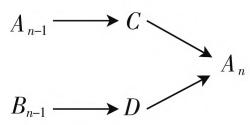
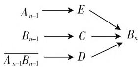

# 数列概率,两翼齐飞

—— 品味一道高考题的命制过程

# ● 深圳市华中师范大学龙岗附属中学 包兵

# 一、试题研究

(2020年江苏卷)甲口袋中装有2个黑球和1个白球,乙口袋中装有3个白球.现从甲、乙两口袋中各任取一个球交换放入另一口袋,重复n次这样的操作,记甲口袋中黑球个数为 $X_{n}$ ,恰有2个黑球的概率为 $p_{n}$ ,恰有1个黑球的概率为 $q_{n}$ .

(1) 求 $p_{1}, q_{1}$ 和 $p_{2}, q_{2}$ ;  
(2) 求 $2p_{n} + q_{n}$ 与 $2p_{n-1} + q_{n-1}$ 的递推关系式和 $X_{n}$ 的数学期望 $E(X_{n})$ (用 $n$ 表示).

试题分析:本题考查计数原理,古典概型,数列的递推公式和随机变量的期望.这道题难度较大,此题涉及数列中的递推公式问题和概率运算中全概率公式的使用,这两个问题都是教学中的重难点.学生对于这两块知识的理解不透彻,知识学习没能到位,再加上处于应用题中对题目意思的理解和把握缺乏,造成大量的失分.

难点突破:通过分析题目意思,我们发现直接计算 $p_n$ 与 $q_n$ 有困难,因为我们并不知道在开始第 $n$ 次操作之前袋子里到底有多少黑球和白球.对袋子中球的个数情况进行分类讨论,甲口袋中的黑球的个数只有0,1,2三种情况,只要甲口袋中的黑球的个数确定,甲、乙两袋子的球的黑白球个数完全确定.于是开始在完成第 $(n-1)$ 次操作后,得到甲口袋中有2个黑球的概率为 $p_{n-1}$ ,甲口袋中有1个黑球的概率为 $q_{n-1}$ ,甲口袋中有0个黑球的概率为 $1-p_{n-1}-q_{n-1}$ .尝试计算事件 $A_n$ 的概率 $p_n$ ,分如下三种情况:当第 $(n-1)$ 次操作后,甲口袋有2个黑球,只需要来个白球同时取一个白球就完成,概率公式 $P(A_{n-1}C)=P(A_{n-1})P(C|A_{n-1})$ ;当第 $(n-1)$ 次操作后,甲口袋有1个黑球,只需要来个黑球取个白球就完成,概率公式 $P(B_{n-1}D)=P(B_{n-1})P(D|B_{n-1})$ ;当第 $(n-1)$ 次操作后,甲口袋有0个黑球,不可能取一次球得到两个球,这种情况不满足(其中 $A_n$ 表示 $n$ 次取球后甲口袋有2个黑球, $B_n$ 表示 $n$ 次取球后甲口袋有1个黑球, $C$ 表示一次操作甲乙都取的是白球， $D$ 表示一次操作甲取的是白球同时乙取的是黑球， $E$ 表示一次操作甲取的是黑球同时乙取的是白球).类似可以计算事件 $B_{n}$ 的概率 $q_{n}$ 如图1所示.

  
$A_{n}$ 的分类图式

  
$B_{n}$ 的分类图式  
图1

最后应用全概率公式计算

$$
p _ {n} = P \left(A _ {n}\right) = P \left(A _ {n - 1} C\right) + P \left(B _ {n - 1} D\right)
$$

$$
P _ {n} = P (C \mid A _ {n - 1}) P \left(A _ {n - 1}\right) + P (D \mid B _ {n - 1}) \cdot
$$

$$
P \left(B _ {n - 1}\right) = P \left(C \mid A _ {n - 1}\right) p _ {n - 1} + P \left(D \mid B _ {n - 1}\right) q _ {n - 1},
$$

$$
q _ {n} = P \left(B _ {n}\right) = P \left(A _ {n - 1} E\right) + P \left(B _ {n - 1} C\right) +
$$

$$
P \left(\overline {{{A _ {n - 1} B _ {n - 1}}}} D\right) = P (E \mid A _ {n - 1}) P \left(A _ {n - 1}\right) + P (C \mid
$$

$$
\left. B _ {n - 1}\right) P \left(B _ {n - 1}\right) + P (D \mid \overline {{{A _ {n - 1} B _ {n - 1}}}}) P \left(\overline {{{A _ {n - 1} B _ {n - 1}}}}\right) =
$$

$$
P (E \mid A _ {n - 1}) p _ {n - 1} + P (C \mid B _ {n - 1}) q _ {n - 1} + P (D
$$

$$
\left| \overline {{{A _ {n - 1} B _ {n - 1}}}}\right) \left(1 - p _ {n - 1} - q _ {n - 1}\right).
$$

利用上面的式子可以得到 $p_n, q_n$ 的递推公式，根据题目的提示，我们主动寻找 $2p_n + q_n$ 与 $2p_{n-1} + q_{n-1}$ 的递推关系式，进而求出 $2p_n + q_n$ 的通项公式，从而解决问题.

解析:(1) $p_{1}=\frac{1\times3}{3\times3}=\frac{1}{3},q_{1}=\frac{2\times3}{3\times3}=\frac{2}{3},p_{2}=p_{1}$

$$
\times \frac {1 \times 3}{3 \times 3} + q _ {1} \times \frac {1 \times 2}{3 \times 3} = \frac {1}{3} \times \frac {1}{3} + \frac {2}{3} \times \frac {2}{9} = \frac {7}{2 7},
$$

$$
q _ {2} = p _ {1} \times \frac {2 \times 3}{3 \times 3} + q _ {1} \times \frac {1 \times 1 + 2 \times 2}{3 \times 3} + 0 = \frac {2}{3} \times \frac {2}{3}
$$

$$
+ \frac {2}{3} \times \frac {5}{9} = \frac {1 6}{2 7}.
$$

(2) $p_{n} = p_{n - 1}\times \frac{1\times 3}{3\times 3} +q_{n - 1}\times \frac{1\times 2}{3\times 3} = \frac{1}{3} p_{n - 1}+$

$$
\frac {2}{9} q _ {n - 1},
$$

$$
q _ {n} = p _ {n - 1} \times \frac {2 \times 3}{3 \times 3} + q _ {n - 1} \times \frac {1 \times 1 + 2 \times 2}{3 \times 3} + (1 -
$$

$$
p _ {n - 1} - q _ {n - 1}) \times \frac {3 \times 2}{3 \times 3} = - \frac {1}{9} q _ {n - 1} + \frac {2}{3}.
$$

因此 $2p_{n} + q_{n} = \frac{2}{3} p_{n - 1} + \frac{1}{3} q_{n - 1} + \frac{2}{3}$

从而 $2p_{n} + q_{n} = \frac{1}{3} (2p_{n - 1} + q_{n - 1}) + \frac{2}{3},$

所以 $2p_{n} + q_{n} - 1 = \frac{1}{3} (2p_{n - 1} + q_{n - 1} - 1)$

即 $2p_{n} + q_{n} - 1 = (2p_{1} + q_{1} - 1)\frac{1}{3^{n - 1}}$

所以 $2p_{n} + q_{n} = 1 + \frac{1}{3^{n}}.$

又 $X_{n}$ 的分布列为

<table><tr><td> $X_n$ </td><td>0</td><td>1</td><td>2</td></tr><tr><td>P</td><td> $1 - p_n - q_n$ </td><td> $q_n$ </td><td> $p_n$ </td></tr></table>

故 $E(X_{n}) = 2p_{n} + q_{n} = 1 + \frac{1}{3^{n}}.$

# 二、试题命制分析

教育部考试中心对于高考试题命制遵循“一核四层四翼”的原则，试题应该体现对必备知识、关键能力、学科素养、核心价值的考查，并同时兼具基础性、综合性、应用性、创新性特点。此题以应用题的形式出现，综合考查数列和概率统计等知识，着重考查概率统计中的重要知识点，渗透数学建模、逻辑推理等核心素养的考查，考查学生分类讨论的数学思想方法。

本题从学生熟悉的背景袋子取球问题出发，用简单的例子展示随机现象，揭示随机现象产生规律。每一轮取球交换后，袋子中各种颜色球的个数是随机的，这对同学的理解是个挑战。细细读题，我们会发现袋子里的球的个数只有三种情况，考查下一次取球后的结果前，必须根据这次袋子里球的个数思考，随着实验次数增多，每一轮取球后球的个数也是随机现象，如果陷入这样的思考，会发现我们再不可能回到“正轨”，但是如果把问题始终看成三种情形中的一种，这样就化繁为简，有迹可循。在数学的学习中，我们经常遇到这样的模糊的问题，很多时候受题目思维的影响不能自拔，从而走入不能解决的境地。这个题目的考查方式，考验学生能否从烦琐的题目模型跳脱出来，发现问题的实质的能力，这也是数学能够锻炼我们智慧的重要方面，这样的思维习惯能帮助学生形成素养。

本题将数列中的递推公式和概率中全概率公式完美结合. 递推公式经常呈现的形式是一项与前几项的关系, 借此给定起始项, 形成整个数列. 全概率公式体现后一件事与前几件事的因果关系, 前面发生的事情影响了后面事情的发生, 欲求结果先找造成结果的原因, 逐个考察. 将两个重要板块的知识巧妙结合, 体现知识之间的联系, 发挥每个板块知识的优势, 递推公式中体现巧妙代数运算, 全概率公式帮助我们建立数学模型, 相互配合, 相得益彰. 这种出题思想体现在2019年全国卷Ⅰ的第22题等题目中.

# 三、新内容出现对命题的影响

目前全国已经有多个省市启用了数学新教材. 在概率统计部分内容, 变化最大的是加入了如下两个公式:

全概率公式: $P(B)=\sum_{i=1}^{n}P(A_{i})P(B\mid A_{i})$ (由因导果)

贝叶斯公式: $P(A_{i} \mid B) = \frac{P(A_{i}B)}{P(B)} = \frac{P(B \mid A_{i})P(A_{i})}{P(B)} = \frac{P(B \mid A_{i})P(A_{i})}{\sum_{i=1}^{n}P(B \mid A_{i})P(A_{i})}$ (执果索

因)(选学). 这两个公式是概率论非常重要的公式, 全概率公式在目前人工智能问题中应用广泛, 贝叶斯公式更是统计推断和纠错问题中经常使用的方法. 公式虽然在新教材中第一次出现, 但是其理论已经很早被用于概率高考题. 在数学中, 如果两事件独立, 运用概率公式 $P(AB) = P(A)P(B)$ , 很容易得出积事件的概率; 如果两事件不独立, 求积事件的概率就变得很困难, 尤其是复杂概率问题. 全概率公式加入高中数学教材, 可以用于解决复杂事件的概率, 尤其是受前面种种原因影响的概率问题, 这样的背景在现实生活中广泛存在.

在今后概率统计的命题中,可以设计更加符合现实情况的模型,以这样的模型为背景设计高考试题成为可能.一直以来,笔者认为全国卷的概率统计题的创新是所有题型中最大的,在生产生活中应用广泛的模型在概率统计题中都有体现,高中数学与现实生活模型完美结合,体现高中数学试题源于生活和高于生活的特点.

每一次课改都会带来题型的重大改变,新一轮的课改也会如此.教师研究新旧教材的基础上,更要需要关注新旧教材所引起的题型的变化.F