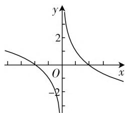
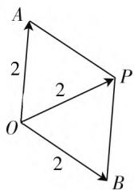
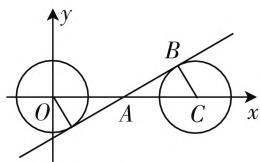
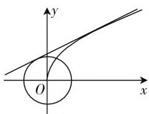
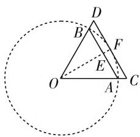

# 数形结合显身手,数学思维妙提升

# 广东省深圳科学高中 黄华胜

新一轮课程改革凝练了各学科的核心素养,其核心理念就是发展学生的核心素养.承载着“立德树人、服务选才和引导教学”功能的高考,借助数学试题的创新与变革,加强对学生数学思想方法的考查,包括数形结合思想.数形结合思想是数学的规律性与灵活性的有机结合与合理应用,也是历年高考数学中常考常新的数学思想方法之一.本文结合2020年高考数学真题,实例剖析利用数形结合思想来实现对数学能力和学科素养的检测与应用.

# 一、借助数形结合思想考查思维的形象性

例 1 （2020 年高考数学新高考山东卷第 8 题）若定义在 R 的奇函数 $f(x)$ 在 $(-∞,0)$ 上单调递减，且 $f(2)=0$ ，则满足 $xf(x-1)≥0$ 的 x 的取值范围是（）.

A. $\left[-1,1\right]\cup\left[3,+\infty\right)$

B. $\left[-3,-1\right]\cup\left[0,1\right]$

C. $[-1,0] \cup [1, +\infty)$

D. $[-1,0] \cup [1,3]$

分析: 借助特殊函数图像的直观性加以数形结合, 结合奇函数的性质分类讨论相应的不等式的正负取值情况, 确定满足对应的不等式的取值范围.

解：依题意，画出函数 $f(x)$ 的草图，如图1所示，则当x<0时，此时 $-2\leqslant x-1\leqslant0$ ，解得 $-1\leqslant x\leqslant1$ ；当x>0时，此时 $0\leqslant x-1\leqslant2$ ，解得 $1\leqslant x\leqslant3$ ；当x=0时，显然成立.

line

| x | y |
|---|---|
| -3 | 0 |
| -2 | 1 |
| -1 | 2 |
| 0 | 3 |
| 1 | 2 |
| 2 | 1 |
| 3 | 0 |

图1

综上分析, 满足 $xf(x-1) \geqslant 0$ 的 x 的取值范围是 $[-1,0] \cup [1,3]$ .

故选 D.

点评:借助函数图像的直观性来数形结合,使得相关的问题更加直观,处理起来更有方向性和目的性.数形结合思想的应用,很好训练与提升思维的形象性.

# 二、借助数形结合思想考查思维的简单性

例 2 （2020 年高考数学全国卷 II 理科第 15 题）设复数 $z_{1}, z_{2}$ 满足 $\left|z_{1}\right| = \left|z_{2}\right| = 2, z_{1} + z_{2} = \sqrt{3} + i$ ，则 $\left|z_{1} - z_{2}\right| =$ \_\_\_\_.

分析:借助复数的几何意义加以数形结合,使得问题更为直观、简单,实现“数”的特征向“形”的直观的转化,结合菱形所对应的几何特征性质简单化处理两复数差的模问题.

解:由于 $z_{1}+z_{2}=z_{3}=\sqrt{3}+i$ ，在复平面内，坐标原点为 O，设复数 $z_{1}$ ， $z_{2}$ ， $z_{3}$ 所对应的点分别为 A, B, P，结合复数的几何意义可知， $|z_{1}+z_{2}|$ 和 $|z_{1}-z_{2}|$ 是以向量 $\overrightarrow{OA}$ 和 $\overrightarrow{OB}$ 为两邻边的平行四边形的两条对角线的长，由于 $|z_{1}|=|z_{2}|=|z_{3}|=2$ ，则平行四边形 OAPB 是边长为 2，一条对角线为2的菱形，所以该菱形的另一条对角线长为 $|z_{1} - z_{2}| = 2\sqrt{3}$

text_image

A
2
O
2
P
2
B

图2

故填答案: $2\sqrt{3}$ .

点评:借助复数的几何意义以及代数运算的几何意义的简单性来数形结合,使得相关的问题更加直观,有图有住所,方便操作与破解.利用数形结合思想的应用,很好训练与提升思维的简单性.

# 三、借助数形结合思想考查思维的直观性

例 3 （2020 年高考数学浙江卷第 15 题）已知直线 $y = kx + b (k > 0)$ 与圆 $x^{2} + y^{2} = 1$ 和圆 $(x - 4)^{2} + y^{2} = 1$ 均相切，则 k = \_\_\_\_，b = \_\_\_\_.

分析:借助一含参数的直线“撑起”二圆的问题背景加以数形结合,使得具体元素更为直观,结合直观图形的对称性从“形”的角度进行合理几何推理,进一步转化为从“数”的角度进行代数运算,达到解决问题的目的.

解：依题意可知，圆心 $C_{1}(0,0)$ ， $C_{2}(4,0)$ ，两圆的半径均为1，而两圆的圆心距 $\left|C_{1}C_{2}\right|=4>2=1+1$ ，可知两圆相离，根据图形的对称性可知，直线 $l:y = kx + b(k > 0)$ 过线段 $C_1C_2$ 的中点 $A(2,0)$ ，则直线 $l$ 的方程为 $y = k(x - 2)$ .再由题意可知，圆心 $C_1$ 到直线 $l:y = k(x - 2)$ 的距离等于半径1，可得 $\frac{| - 2k|}{\sqrt{k^2 + 1}} = 1$ ，结合 $k > 0$ ，解得 $k = \frac{\sqrt{3}}{3}$ 此时 $b = -$ $2k = -\frac{2\sqrt{3}}{3}.$

text_image

y
O
A
B
C
x

图3

故填答案: $\frac{\sqrt{3}}{3},-\frac{2\sqrt{3}}{3}.$

点评:借助直线、圆这些基本的解析几何图形的直观性来数形结合,合理利用图形的几何特征与性质,综合代数推理与运算来分析与处理问题.

# 四、借助数形结合思想考查思维的批判性

例 4 （2020 年高考数学全国卷Ⅲ 理科第 10 题）若直线 l 与曲线 $y=\sqrt{x}$ 和 $x^{2}+y^{2}=\frac{1}{5}$ 都相切，则 l 的方程为（）.

A. $y = 2x + 1$

B. $y = 2x + \frac{1}{2}$

C. $y = \frac{1}{2} x + 1$

D. $y = \frac{1}{2} x + \frac{1}{2}$

分析:借助直线、曲线与圆的直观图形与位置关系加以数形结合,综合思维的批判性利用切线在 y 轴上的截距以及斜率的大致取值范围来直观分析,结合选项中的直线方程特征来合理排除与选择.

解: 在平面直角坐标系中, 作出曲线 $y=\sqrt{x}$ 和圆 $x^{2}+y^{2}=\frac{1}{5}$ 的草图, 如图 4 所示, 依题意可知, 切线 l 在 y 轴上的截距在 $(0,1)$ 之间, 可以直接排除选项 A, C; 同时切线 l 的斜率为正数,且小于1,可以直接排除选项B.

text_image

y
O
x

图4

故选 D.

点评:借助直线、曲线与圆的直观图形与位置关系的批判性来数形结合,结合排除法来处理相应的选择题,直观有效,处理起来也简单快捷.

# 五、借助数形结合思想考查思维的创新性

例 5 （2020 年高考数学北京卷第 10 题）2020 年 3 月 14 日是全球首个国际圆周率日 ( $\pi$ Day). 历史上，求圆周率 $\pi$ 的方法有多种，与中国传统数学中的“割圆术”相似,数学家阿尔·卡西的方法是:当正整数 n 充分大时,计算单位圆的内接正 6n 边形的周长和外切正 6n 边形(各边均与圆相切的正 6n 边形)的周长,将它们的算术平均数作为 $2\pi$ 的近似值.按照阿尔·卡西的方法, $\pi$ 的近似值的表达式是().

A. $3n\left(\sin \frac{30^{\circ}}{n} +\tan \frac{30^{\circ}}{n}\right)$

B. $6n\left(\sin \frac{30^{\circ}}{n} +\tan \frac{30^{\circ}}{n}\right)$

C. $3n\left(\sin \frac{60^{\circ}}{n} +\tan \frac{60^{\circ}}{n}\right)$

D. $6n\left(\sin \frac{60^{\circ}}{n} +\tan \frac{60^{\circ}}{n}\right)$

分析:借助创新背景中的单位圆以及内接、外切正6n边形的图形直观加以数形结合,把问题转化到具体的三角形内,结合三角函数的定义来分析与求解,实现创新问题的破解与应用.

解: 如图 5 所示, 单位圆的内接正 6n 边形与外切正 6n 边形的边长分别为 AB, CD, 结合三角函数的定义, 可得单位圆的内接正 6n 边形的边长为 $AB = a = 2\sin \frac{30^{\circ}}{n}$ , 单位圆的外切正 6n

text_image

Geometric diagram showing a triangle inscribed in a circle with labeled points and dashed construction lines

图5

边形的边长为 $CD=b=2\tan\frac{30^{\circ}}{n}$ . 根据阿尔·卡西的方法可得 $2\pi=\frac{1}{2}(6na+6nb)=6n\left(\sin\frac{30^{\circ}}{n}+\tan\frac{30^{\circ}}{n}\right)$ ，所以 $\pi=3n\left(\sin\frac{30^{\circ}}{n}+\tan\frac{30^{\circ}}{n}\right)$ .

故选A.

点评:借助数学文化背景的三角问题的创新性来数形结合,使得抽象问题直观化,无限问题有限化,回归三角形,利用三角函数的定义来分析与求解.

借助数形结合思想的考查与应用,巧妙用来解决创新与应用问题,实现“数”与“形”的相互转化,“以形助数”或“以数解形”,使得复杂的数学问题简单化,抽象的数学问题形象化,具体的数学问题直观化,进而有助于把握数学问题的本质属性,从而达到有效解决问题的目的,合理考查学生的关键能力和学科素养.因而在平时的教学与复习中,从教材的知识内容中提炼数学思想,从教材的例题和习题中提炼数学思想,从高考试题中提炼数学思想,并将这些数学思想归类并迁移,合理运用,熟练掌握,有效实现提升思维品质、培养关键能力、发展数学核心素养的目的.