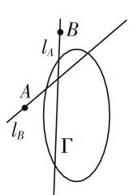
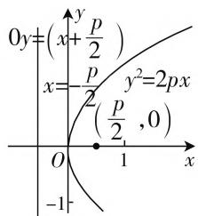
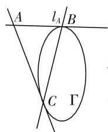
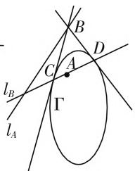
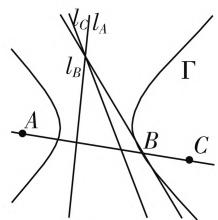
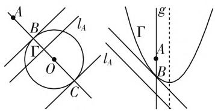
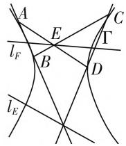
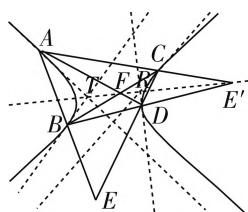
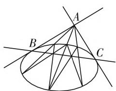
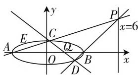

# 浅论射影几何中的极点与极线

# 江西省九江第一中学 张义瑛

圆锥曲线在几何学中占有重要地位,从古希腊起直至今日,人们对圆锥曲线的探索从未停止.本文借用射影几何中的极限思想及方法研究圆锥曲线的极点与极线,对传统纯解析几何方法进行完善,并追求所有圆锥曲线形式上的统一.

# 一、预备理论

预备理论 1: 每一有穷直线有且只有一个“方向”，每一方向上有且只有一个无穷远点.

预备理论 2: 所有无穷远点的集合是无穷远直线, 无穷远直线的方向为任意方向.

预备理论 3: 经过同一无穷远点的两直线方向相同, 即互相平行(包括重合).

预备理论 4: 双曲线经过两渐近线方向上的无穷远点, 并与渐近线在此相切; 抛物线经过其对称轴方向上的无穷远点, 并与对称轴在此相交, 与无穷远直线在此相切.

预备理论 5: 任意曲线均存在中心、两焦点及两准线, 其中抛物线的中心和一焦点均为其上的无穷远点, 一准线为无穷远直线; 圆的两焦点均与中心重合, 其所连直线方向为任意方向, 两准线均与无穷远直线重合.

预备理论 6: 直线与曲线相切的充要条件是其与曲线有且只有一个公共点.

预备理论7:建立平面直角坐标系时,规定与y轴平行的直线的斜率为 $\infty$ ,其中 $\infty\times0$ 的值可为任意实数.

预备推论 1: 与曲线有两个公共点的直线与之相交, 没有公共点的直线与之相离.

注:(1)本文所涉及的“点”均包括无穷远点,“直线”均包括无穷远直线;(2)本文所涉及的“方向”与“平行”均如上所述,而非一般定义.

# 二、极点、极线的有关说明

定义:对于曲线 $\Gamma:Ax^{2}+By^{2}+Cxy+Dx+Ey+F=0$ ，称直线 $Ax_{0}x+By_{0}y+C\cdot\frac{y_{0}x+x_{0}y}{2}+E\cdot\frac{y_{0}+y}{2}+F=0$ 为点 $(x_{0},y_{0})$ 对曲线 $\Gamma$ 的极线；同时，

称该点为该直线对曲线的极点. 特别地, 曲线中心所对的极线是无穷远直线, 任意无穷远点所对的极线经过中心; 与曲线对称轴垂直方向上无穷远点所对的极线是该对称轴.

注:(1) 默认方程系数满足一定条件, 使得 $\Gamma$ 为曲线;(2) 下文简记点 X 对曲线的极线为 $l_{X}$ , 直线 $l_{X}$ 对曲线的极点为 X.

关于此定义有如下“公理”(较为简单,请读者自证):

公理 1: 平面内任意一点对曲线均存在极线, 任意直线对曲线均存在极点; 对同一曲线的极点与极线一一对应.

公理2:如图1,若平面内一条直线 $l_{A}$ 经过点B,则直线 $l_{B}$ 亦经过点A(该公理又称配极原理).

（注：我们称此时A，B两点对曲线 $\Gamma$ 共轭， $l_{A}$ 与 $l_{B}$ 对 $\Gamma$ 共轭）

公理 3: 平面内一点在曲线上等价于该点在其极线上.

公理 4: 如图 2, 曲线焦点的极线是其对应的准线.

  
图1

text_image

0y=(x+p/2)
x=-\frac{p}{2}
y^2=2px
(\frac{p}{2},0)
O
1
x
-1

图2

# 三、极点、极线的基本性质及推论

基本性质 1: 点在曲线上等价于其极线与曲线切于该点.

（注:下文不再区分曲线过其上一点的切线与该点的极线）

基本性质 2: 如图 3, 点在曲线外等价于其极线与曲线相交, 此时极线与该点的切点弦直线重合.

基本性质 3: 如图 4, 点在曲线内等价于其极线与曲线相离.

基本性质4:如图5,共点线的极点共线,共线点的极线共点.

text_image

A
l_A B
C Γ

图 3

text_image

l_B
l_A
C
A
B
D
Γ

图 4

text_image

l_{A}l_{B}
l_{B}
A
B
C
\Gamma

图 5

基本推论 1: 在平面内任意一条直线位于曲线外的部分上任取一点, 则该直线的极点在所取点对曲线的切点弦直线上.

# 四、基本性质及推论的证明

# 1. 对基本性质 1 的证明

① 设点 A 在曲线 $\Gamma$ 上, 结合公理 3 可知, $l_{A}$ 经过点 A, 即与 $\Gamma$ 至少有一个公共点.  
② 假设存在第二个公共点 B，由 B 在 $l_{A}$ 上，结合公理 2 可知，A 在 $l_{B}$ 上；由 B 在 $\Gamma$ 上，结合公理 3 可知，B 在 $l_{B}$ 上.  
③ 由两点确定一条直线可知， $l_{A}$ 与 $l_{B}$ 重合，与公理1矛盾，可知 $l_{A}$ 与 $\Gamma$ 有且只有一个公共点，即 A.  
④ 由预备推论1可知， $l_{A}$ 与 $\Gamma$ 相切，证毕.

# 2. 对基本性质 2 的证明

① 设点 A 在曲线 $\Gamma$ 外, 故必存在经过点 A 的直线 l 与 $\Gamma$ 相切, 设切点为 B.  
② 由基本性质1可知， $l_{B}$ 与 $\Gamma$ 相切于 $B$ ，故 $l_{B}$ 与 $l$ 重合，经过点 $A$   
③ 由公理2可知 $l_{A}$ 经过点B，即与 $\Gamma$ 至少有一个公共点.  
④ 假设 $l_{A}$ 与 $\Gamma$ 相切，则 $l_{A}$ 与 $l_{B}$ 重合，与公理1矛盾，可知 $l_{A}$ 与 $\Gamma$ 相交于 B，直线 AB 与 $\Gamma$ 相切于 B.  
⑤ 同理可得 $l_{A}$ 与 $\Gamma$ 的另一交点，两交点连线 $l_{A}$ 即为 A 对 $\Gamma$ 的切点弦直线，证毕.

# 3. 对基本性质 3 的证明

① 假设点 A 在曲线 $\Gamma$ 内且 $l_{A}$ 与 $\Gamma$ 有公共点，设为点 B，由 B 在 $l_{A}$ 上，结合公理 2 可知，A 在 $l_{B}$ 上；由 B 在 $\Gamma$ 上，结合基本性质 1 可知， $l_{B}$ 与 $\Gamma$ 相切.  
② 由 A 在 $l_{B}$ 上，显然 $l_{B}$ 与 $\Gamma$ 相交，矛盾，可知 $l_{A}$ 与 $\Gamma$ 相离，证毕.

# 4. 对基本性质 4 的证明

① 设 A, B, C 为同一直线 $l_{P}$ 上的三点，结合公理 2 可知， $l_{A}, l_{B}, l_{C}$ 均经过点 P，证毕.

# 五、极点、极线的进阶性质

进阶性质1:如图6,若点A是平面内不在曲线 $\Gamma$ 上的一点,作 $\Gamma$ 平行于 $l_{A}$ 的切线,有两种情况:(1)若 $\Gamma$ 为有心曲线,且可作两条这样的切线 $l_{B}$ 与 $l_{C}$ , 则有 A, B, C, O 四点共线; (2) 若 $\Gamma$ 为无心曲线, 则只可作一条这样的切线 $l_{B}$ , 有直线 AB 与 $\Gamma$ 的对称轴平行.

进阶性质 2: 如图 7, 曲线内接四边形对边交点共轭.

text_image

A
B
lₐ
Γ
O
C
lₐ
Γ
A
B
g

图6

  
图7

# 六、进阶性质的证明

# 1. 对进阶性质 1 的证明

(1)①由 $l_{A} / / l_{D} / / l_{E}$ 可知，三线交于该方向上的同一无穷远点 $P$   
② 由三线均经过点 P，结合公理 2 可知，A, D, E 均在 $l_{P}$ 上.  
③ 由 P 是无穷远点, 结合定义和公理 2 可知, $l_{P}$ 经过原点 O, 证毕.  
(2)① 由 $l_{A} \parallel l_{D}$ 可知, 两线交于该方向上的无穷远点 $P$ .  
② 由两线均经过点 P，结合公理 2 可知，A, D 均在 $l_{P}$ 上.  
③ 由 P 是无穷远点, 结合定义和公理 2 可知, $l_{P}$ 与对称轴平行, 证毕.

注: 可利用此性质的原理确定任意给定方向上无穷远点的极线位置.

# 2. 对进阶性质 2 的证明

① 如图8, 设ABDC是曲线内接四边形, 两组对边的交点分别为 $E, E'$ , 其对角线交点为F; 作 $l_{A}, l_{B}$ 交于点T, 作 $l_{C}, l_{D}$ 交于点R.

text_image

Geometric diagram with labeled points and intersecting lines, likely from a math problem or proof

图8

②由A,B,E三点共线,结

合基本性质 4, 可知 T 在 $l_{E}$ 上, 同理可得 R 在 $l_{E}$ 上.

③ 由 AACBBD 是曲线内接六边形, 结合帕斯卡定理可知, T, F, $E'$ 三点共线, 同理可由六边形 CCDDB 得出 R, F, $E'$ 三点共线.  
④ 由两点确定一条直线可知， $F, E'$ 均在直线 TR 即 $l_{E}$ 上，证毕.

注:该内接四边形中存在对边平行,若干顶点重合或为无穷远点时,可同理证明该性质仍成立.

# 七、极点、极线性质及射影几何思想的应用

# 1. 仅用无刻度的直尺作过曲线外一点的切线

过曲线外一点 A 任意作三条割线，(下转第 94 页)

分析2:(坐标法)以直线BC为x轴,线段BC的中点为原点,建立平面直角坐标系,则 $C(1,0),A(0,\sqrt{3})$ ,设 $P(x,0),\overrightarrow{PA}\cdot\overrightarrow{PC}=(-x,\sqrt{3})(1-x,0)=x^{2}-x=\left(x-\frac{1}{2}\right)^{2}+\frac{1}{4}\geqslant\frac{1}{4}$ ,当 $x=\frac{1}{2}$ ,此时 $\frac{|\overrightarrow{PC}|}{|\overrightarrow{BC}|}=\frac{1}{4}$ .

运用坐标法, 将向量的相关计算转化为代数运算, 函数与方程的运算与处理.

# 3. 基底意识

平面向量基本定理的本质:任意向量在基底下可以唯一分解,这样可减少变量,降低难度.

例 3 在 $\triangle ABC$ 中, M 为 BC 的中点, 点 N 在 AC 上, 且 $\overrightarrow{AN} = 2\overrightarrow{NC}$ , AM 与 BN 交点为 P, 求点 P 分向量 $\overrightarrow{AM}$ 所成比 $\mu$ 的值.

解析: 主要求点 P, 假设 $\overrightarrow{AP} = \lambda \overrightarrow{AM}$ , 因为 B, P, N 三点共线, 所以 $\overrightarrow{BP}, \overrightarrow{BN}$ 用基向量 $\overrightarrow{BA}, \overrightarrow{BC}$ 表示, 再用待定系数法求得 $\lambda$ 的值.

$$
\begin{array}{l} \overrightarrow {B P} = \overrightarrow {B M} + \overrightarrow {M P} = \frac {1}{2} \overrightarrow {B C} - (1 - \lambda) \overrightarrow {A M} = \frac {1}{2} \overrightarrow {B C} - \\ \frac {1}{2} (1 - \lambda) (\overrightarrow {A C} + \overrightarrow {A B}) = \frac {1}{2} \overrightarrow {B C} - \frac {1}{2} (1 - \lambda) (\overrightarrow {A B} + \overrightarrow {B C} \\ + \overrightarrow {A B}) = \frac {\lambda}{2} \overrightarrow {B C} - (1 - \lambda) \overrightarrow {A B}; \\ \end{array}
$$

$$
\overrightarrow {B N} = \overrightarrow {B C} + \overrightarrow {C N} = \overrightarrow {B C} - \frac {1}{3} \overrightarrow {A C} = \overrightarrow {B C} - \frac {1}{3} (\overrightarrow {A B}
$$

$$
+ \overrightarrow {B C}) = \frac {2}{3} \overrightarrow {B C} - \frac {1}{3} \overrightarrow {A B}.
$$

所以 $\frac{\frac{\lambda}{2}}{\frac{2}{3}} = \frac{-(1 - \lambda)}{-\frac{1}{3}}\Rightarrow \frac{\lambda}{2} = 2(1 - \lambda)\Rightarrow \lambda = \frac{4}{5}$ ，所

以分向量 $\overline{AM}$ 所成的比 $\mu$ 的值为 $\frac{1}{4}$ .

# 二、注重复习例题选编

华罗庚先生指出：“取法乎上得其中，取法乎中得其下。”教师在选取试题的时候，要切入点多，解法多样。要关注学生的实际，加深学生对基础概念的理解，从而提高学生分析数学问题和解决数学问题的能力。试题应该注重变式，侧重延伸，把握数学本质。高三数学专题复习就是希望从典型例题（基础问题）入手，通过一题多变、试题改编与延伸，进行有效的变式教学，这种变式改编的例题既能帮助学生巩固已学知识，更能促使学生提高思维能力；既有利于改变高三复习中学生只愿做题，不会反思的现象，也能激发学生学习的兴趣，提高复习的积极性。

在教学过程中,我们紧紧抓住概念教学,引领学生思考,拓展学生的视野,提升学生的思维能力和自主学习能力.当我们找到了源,分清了流,自有源头活水流.学生在数学学习中就会以“不变”应“万变”,摆脱题海战术,真正做到:“考试考得好,数学成就好.”W

(上接第83页) 按如图9所示方法连接,则直线AB,AC即为曲线的切线.

此作图方法有如下优点：

① 适用范围广. 此法适用于所有圆锥曲线.

② 所需工具少. 此法仅需无刻度的直尺.

③ 作图步骤简.与过圆外一点作切线的传统方法（先找到圆心，然后以圆心与该点所连线段为直径作圆，最后连接该点与两圆交点）相比，此法步骤更少，操作更简单.

2.“动直线恒过定点,动点恒在定直线上”问题

例 1 （2020·全国卷 I·20）已知 A, B 分别为椭圆 $E: \frac{x^{2}}{a^{2}} + y^{2} = 1 (a > 1)$ 的左、右顶点，G 为 E 上顶点， $\overrightarrow{AG} \cdot \overrightarrow{GB} = 8$ . P 为 x = 6 上的动点，PA 与 E 的另一交点为 C, PB 与 E 的另一交点为 D.

text_image

Geometric diagram showing intersecting lines and a circle with labeled points A, B, and C

图9

(1) 求 E 的方程; (2) 求证: 直线 CD 过定点.

解答:(1) $\frac{x^{2}}{9}+y^{2}=1$ ,
过程略.

text_image

y
x=6
A E C P
O Q B x
D

图10

(2)①设 CD 与 AB 交

于点 $Q$ ，由ACBD是椭圆内接四边形，结合进阶性质2可知， $P,Q$ 共轭，即 $l_{P}$ 恒过点 $Q$

② 设直线 $x = 6$ 所对的极点为 $R$ （显然在 $x$ 轴上），由 $P$ 在 $l_{R}$ 上，结合公理2，可知 $l_{P}$ 恒过点 $R$ .  
③ 假设 Q 与 R 不重合，则 $l_{P}$ 恒与直线 QR，即 y = 0 重合，矛盾，可知 Q 与 R 重合，即 CD 恒过定点 R，证毕.

极点与极线所展现出的某种简便性和对称性, 是其吸引人的重要原因之一; 相关结论具有高度普适性, 揭示了圆锥曲线紧密的内在联系. 在某些问题中应用, 可以方便地求出切线方程、切点弦方程及动直线所恒过的定点、动点所恒在的定直线等, 为证明或进一步计算提供帮助. W