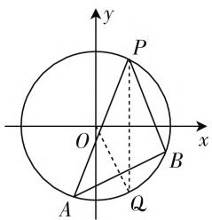
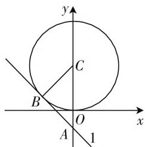

# 破解直线与圆的位置关系的策略

# 江苏省连云港市赣榆区海头高级中学 朱学任

直线与圆的位置关系问题历来是高考中的“常客”之一,考查方式多样,背景创设新颖.在破解直线与圆的位置关系问题中,如何有效借助一些常用的技巧与策略来分析与处理问题,优化解题方法,开拓解题思路.本文结合几个破解直线与圆的位置关系问题中常用策略加以实例剖析,供大家参考.

# 一、利用平几性质

利用平面几何性质来破解直线与圆的位置关系问题,可以有效揭示直线与圆之间的几何特征,借助直线的几何性质,圆的几何性质,对称以及勾股定理等平几性质来破解是一些常见的思维方式.

例 1 已知圆 $O: x^{2} + y^{2} = 5, A, B$ 是圆 O 上异于点 $P(1, 2)$ 的两点，若直线 PA, PB 所对应的倾斜角互补，试判断直线 AB 的斜率是否为定值？若是定值，请求出该定值；若不是定值，请说明理由.

分析:通过结合平面几何中的对称性、圆的几何性质,并结合直线的斜率公式以及两直线垂直的关系来转化,从而得以判断与确定相应的定值问题.

解:由于直线 PA, PB 所对应的倾斜角互补, 则知直线 PA, PB 与 x 轴围成一个等腰三角形, 作点 $P(1,2)$ 关于 x 轴的对称点 $Q(1,-2)$ (点 Q 也在圆 O 上), 连接 OQ.

由于 PQ 平分 $\angle APB$ ，则知点 Q 为弧 AB 的中点，结合圆的几何性质可得 $OQ \perp AB$ ，又点 $Q(1, -2)$ ，可得 $k_{OQ} = \frac{-2 - 0}{1 - 0} = -2$ ，所以 $k_{AB} = -\frac{1}{k_{OQ}} = \frac{1}{2}$ 为定值.

点评: 平几性质经常与解析几何初步中直线的倾斜角、斜率、截距等概念, 圆中的圆心、半径等元素之间存在一定的有机联系, 充分挖掘它们之间的联系, 借助平几性质来解决直线与圆的位置关系问题, 操作起来更为简单快捷, 效果明显. 几何性质巧应用, 解几问题妙破解.

text_image

y
P
O
x
A
Q
B

图 1

# 二、借助数形结合

借助数形结合来破解直线与圆的位置关系问题，可以建立起直观模型，把相应的问题直观化，进而利用图形的直观性，数形结合而使问题获得巧解。数形结合，直观操作，简单易懂。

例 2 设实数 x, y 满足 $x^{2} + (y - 1)^{2} = 1$ ，若对于不等式 $x + y + c \geqslant 0$ 恒成立，则实数 c 的取值范围为 \_\_\_\_.

分析: 结合题目条件加以合理转化, 把对应不等式中的恒成立问题求解参数的值, 转化为直线和圆的位置关系, 借助数形结合来处理.

解:由于圆 $x^{2}+(y-1)^{2}=$ 1 上的点都适合不等式 $x+y+c\geqslant0$ ，即圆上的点都在直线 $x+y+D=0$ 的上方，则知圆 C: $x^{2}+(y-1)^{2}=1$ 应落在直线 l: $x+y+D=0$ 的上方区域，如图所 2 示，当直线 l: $x+y+D=0$ 与圆 C: $x^{2}+(y-1)^{2}=1$ 相切，且在圆 C 的下方，由于圆 C 的半径为 r=1，可得 $d=\frac{|0+1+D|}{\sqrt{2}}=r=1$ ，解得 $D=-1+\sqrt{2}$ ，即 $x+y-1+\sqrt{2}=0$ ，结合题目条件，可得 $c\geqslant-x-y=\sqrt{2}-1$ ，即 $c\in[\sqrt{2}-1,+\infty)$ .

text_image

y
C
B
O
x
A
1

图2

故填答案: $\left[\sqrt{2}-1,+\infty\right)$ .

点评: 数形结合经常与解析几何初步中的直线与圆的位置关系加以有机联系, 借助数形结合, 可以直观处理涉及直线与圆中的参数问题、位置关系判断以及其他一些相关问题. 数形结合巧应用, 解几问题妙破解.

# 三、设置曲线系方程

设置曲线系方程,有效串联起直线与圆的位置关系问题,形式简单易记忆,可以达到简化运算、快捷求解的目的. 灵活应用曲线系方程来处理问题是解析几何中一种重要的解题方法和技巧.

例 3 已知圆 $C: x^{2} + y^{2} + x - 6y + m = 0$ 与直线 l: $x + 2y - 3 = 0$ 的两个交点分别为 P, Q，若以线段 PQ 为直径的圆经过坐标原点，则实数 m 的值为 \_\_\_\_.

分析: 结合题目条件设出满足条件的曲线系方程, 根据条件知, 圆心 D 在直线 $x + 2y - 3 = 0$ 上及圆 D 经过坐标原点, 进而建立相应的方程组, 得以求解参数 m 的值.

解:设所求圆的方程为 $x^{2}+y^{2}+x-6y+m+\lambda(x+2y-3)=0$ ，即圆 $D:x^{2}+y^{2}+(\lambda+1)x+(2\lambda-6)y+(m-3\lambda)=0$ ，配方可得该圆的圆心为 $D\left(-\frac{\lambda+1}{2},3-\lambda\right)$ ，结合条件知，圆心 D 在直线 $x+2y-3=0$ 上及圆 D 经过坐标原点，则有 $\left\{\begin{aligned}-\frac{\lambda+1}{2}+2(3-\lambda)-3=0,\\ m-3\lambda=0,\end{aligned}\right.$ 解得 $\left\{\begin{aligned}\lambda&=1,\\ m&=3.\end{aligned}\right.$

故填答案:3.

点评:曲线系方程经常与直线的方程、圆的方程加以有机联系,借助曲线系方程的设置,简捷明快,有效减少破解直线与圆的位置关系问题中的运算量,提高解题效益,提升解题速度.曲线系方程巧应用,解几问题妙破解.

# 四、巧用设而不求

巧用设而不求,通过设出相应的参数,利用题设条件加以巧妙转化,以参数为过渡,借助直线与圆的位置关系的相关知识,以及其他相关的知识等来设而不求,从而达到破解问题的目的.

例 4 已知圆 $C: x^{2} + y^{2} - 6x - 2y + 1 = 0$ 与直线 $l: x - y + c = 0$ 相交于 P, Q 两点, O 为坐标原点, 且 $OP \perp OQ$ , 则实数 c 的值为 \_\_\_\_.

分析: 结合题目条件设出 P, Q 两点的坐标, 通过直线与圆的方程的联立消去参数 y 得到关于 x 的二次方程, 结合韦达定理加以转化, 利用 $OP \perp OQ$ 的条件的转化得到 $x_{1}x_{2} + y_{1}y_{2} = 0$ 加以转化, 得以求解实数 c 的值. 使用设而不求的技巧, 巧破参数值.

解: 设 $P(x_{1}, y_{1})$ , $Q(x_{2}, y_{2})$ ，由直线 $l: x - y + c = 0$ ，可得 $y = x + c$ ，将 $y = x + c$ 代入圆 $C: x^{2} + y^{2} - 6x - 2y + 1 = 0$ ，消去参数 y，整理可得方程 $2x^{2} + (2c - 8)x + c^{2} - 2c + 1 = 0$ ，结合已知条件，可得判别式 $\Delta = (2c - 8)^{2} - 8(c^{2} - 2c + 1) = -4c^{2} - 16c + 56$

>0，而 $x_{1} + x_{2} = 4 - c, x_{1}x_{2} = \frac{c^{2} - 2c + 1}{2}$ ，可得 $y_{1}y_{2} = (x_{1} + c)(x_{2} + c) = x_{1}x_{2} + c(x_{1} + x_{2}) + c^{2} = \frac{c^{2} + 6c + 1}{2}$ . 由于 $OP \perp OQ$ ，可得 $x_{1}x_{2} + y_{1}y_{2} = \frac{c^{2} - 2c + 1}{2} + \frac{c^{2} + 6c + 1}{2} = c^{2} + 2c + 1 = 0$ ，解得 $c = -1$ ，满足 $\Delta > 0$ ，所以实数 $c$ 的值为-1.

故填答案: -1.

点评:设而不求经常在直线与圆的位置关系问题中出现,借助方程、不等式等的应用来转化与处理.本题中借助垂直关系,根据根与系数的关系,结合平面向量的数量积等,整体代入,设而不求,很好达到解决问题的目的.设而不求巧应用,解几问题妙破解.

# 五、合理构造模型

合理构造模型, 把有关直线或圆的问题加以转化, 转化为直线与圆的位置关系问题, 再借助直线与圆的位置关系来分析与处理. 构造模型法不仅有“化繁为简”、“化难为易”之作用, 甚至可能收到“柳暗花明”使难题迎刃而解之奇效.

例 5 已知实数 x, y 满足圆 C 的方程 $(x-1)^{2}+(y-1)^{2}=2$ ，则 $\left|x-y+6\right|$ 的最小值是 \_\_\_\_.

分析：结合题目条件可知 $|x - y + 6| = \sqrt{2} \times \frac{|x - y + 6|}{\sqrt{2}}$ ，其所对应的几何意义就是圆 $C$ 上的点到直线 $x - y + 6 = 0$ 的距离的 $\sqrt{2}$ 倍，借助直线 $x - y + 6 = 0$ 模型的构造，结合直线与圆的位置关系问题来处理，进而达到求解的目的。

解: 圆 C 的方程 $(x-1)^{2}+(y-1)^{2}=2$ 表示圆心 C(1,1)，半径 $r=\sqrt{2}$ 。因为 $\left|x-y+6\right|=\sqrt{2}\times\frac{\left|x-y+6\right|}{\sqrt{2}}$ ，其表示的是圆 C 上的任意一点到直线 x-y+6=0 的距离的 $\sqrt{2}$ 倍，而圆心 C(1,1) 到直线 x-y+6=0 的距离为 $d=\frac{\left|1-1+6\right|}{\sqrt{2}}=3\sqrt{2}$ ，所以 $\left|x-y+6\right|$ 的最小值是 $\sqrt{2}\times(d-r)=4$ 。

故填答案:4.

点评:合理构造模型法是数学解题中经常用到的一种技巧性较高的特殊方法,也是破解直线与圆的位置关系问题中的一大技巧.构造数学模型法破解解析几何问题时,一定要熟悉掌握具体的数、式、形等数学模型的特征,巧妙与相关的数学问题加以有机结合来分析与处理.构造模型巧应用,解几问题妙破解.W