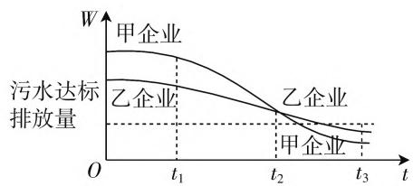

# “四翼”巧引领,选拔妙落实\*

# ● 浙江省舟山中学 黄明才

随着高考新课标改革与创新的不断推进,针对高考数学评价体系以六个字“一核四层四翼”来总结与归纳,其中“四翼”是通过明确四个方面“基础性、综合性、应用性、创新性”考查要求,回答了“怎么考”的问题.那么“四翼”是如何巧妙引领高考,选拔性功能是如何真实得以落实呢?下面以2020年新课标高考数学试卷中的真题为例,笔者从“四翼”的四个基本性质方面进行剖析与阐述,抛砖引玉.

# 一、落实“双基”，夯实基础性

高考选拔出来的学生必须具备适应大学学习与生活、社会发展的“三基”——基础知识、基本能力和基本素养，落实“双基”（基本知识与基本技能）是教育的根本，也是“四翼”中基础性的充分体现。

例 1 （2020 年高考数学江苏卷第 7 题）已知 $y = f(x)$ 是奇函数，当 $x \geqslant 0$ 时， $f(x) = x^{\frac{2}{3}}$ ，则 $f(-8)$ 的值是 \_\_\_\_.

分析:结合奇函数的定义 $f(-x) = -f(x)$ ，通过函数关系式的转化与运算来确定相应的函数值问题.

解析:由于 $y=f(x)$ 是奇函数,则知 $f(-8)=-f(8)=-8^{\frac{2}{3}}=-4.$

故填-4.

# 二、巧妙融合，呈现综合性

学生能够综合运用不同的学科知识、数学思想方法、数学思维技巧等，多角度观察，多方位切入，多方向思考，多层次发现，从而得以有效理解、准确分析和正确解决问题，巧妙融合是知识的综合与应用，也是“四翼”中综合性的具体体现。

例2（2020年高考数学全国卷Ⅱ文科第9题，理科第8题）设 $O$ 为坐标原点，直线 $x = a$ 与双曲线 $C: \frac{x^2}{a^2} - \frac{y^2}{b^2} = 1 (a > 0, b > 0)$ 的两条渐近线分别交于 $D, E$

两点, 若 $\triangle ODE$ 的面积为 8, 则 C 的焦距的最小值为 ( ).

A. 4

B. 8

C. 16

D. 32

分析:先确定双曲线的两条渐近线的方程,与直线x=a联立确定线段DE的长度,结合三角形的面积加以确定参数的关系式,通过双曲线的几何性质并结合基本不等式的应用,来确定相应的最值.

解析:由题可得双曲线 $C:\frac{x^{2}}{a^{2}}-\frac{y^{2}}{b^{2}}=1(a>0,b>0)$ 的两条渐近线的方程为 $y=\pm\frac{b}{a}x$ ，将 x=a 代入，分别可得 $y=\pm b$ ，则有 $|DE|=2b$ ，那么 $S_{\triangle ODE}=\frac{1}{2}|DE|\cdot a=ab=8$ ，结合基本不等式，可得 C 的焦距 $2c=2\sqrt{a^{2}+b^{2}}\geqslant2\sqrt{2ab}=8$ ，当且仅当 $a=b=2\sqrt{2}$ 时等号成立，所以 C 的焦距的最小值为 8.

故选 B.

# 三、联系实际，拓展应用性

学生必须具备较好的阅读理解能力,善于理解题目实质与挖掘题目条件,灵活地应用所学数学知识来分析和解决实际问题,学以致用,从而具备较强的理论联系实际的能力、实践能力和创新能力,也是“四翼”中应用性的实际表现.

例 3 （2020 年高考数学北京卷第 15 题）为满足人民对美好生活的向往，环保部门要求企业加强污水治理，排放未达标的企业要限期整改。设企业的污水排放量 W 与时间 t 的关系为 $W = f(t)$ ，用 $-\frac{f(b) - f(a)}{b - a}$ 的大小评价在 $[a, b]$ 这段时间内企业污水治理能力的强弱。已知整改期内，甲、乙两企业的污水排放量与时间的关系如图 1 所示。

line

| t    | 甲企业 | 乙企业 | 污水达标排放量 |
| ---- | ------ | ------ | -------------- |
| t₁   | W      | W      | W              |
| t₂   | W      | W      | W              |
| t₃   | W      | W      | W              |

图1

给出下列四个结论：

① 在 $\left[t_{1},t_{2}\right]$ 这段时间内，甲企业的污水治理能力比乙企业强；  
② 在 $t_{2}$ 时刻，甲企业的污水治理能力比乙企业强；  
③ 在 $t_{3}$ 时刻，甲、乙两企业的污水排放都已达标；  
④ 甲企业在 $\left[0,t_{1}\right],\left[t_{1},t_{2}\right],\left[t_{2},t_{3}\right]$ 这三段时间中，在 $\left[0,t_{1}\right]$ 的污水治理能力最强.

其中所有正确结论的序号是\_\_\_\_。

分析:抓住企业污水治理能力的强弱的表达式的几何意义,结合题目中相关函数图像加以直观分析,通过函数图像的切线的斜率大小关系,来确定相应的企业污水治理能力的强弱问题.

解析：由于企业污水治理能力的强弱用 $-\frac{f(b)-f(a)}{b-a}$ 表示的污水排放量 $W=f(t)$ 的图像的切线的斜率的相反数，结合图形可知，在 $\left[t_{1},t_{2}\right]$ 这段时间内，甲企业的污水排放量函数图像的切线的斜率小，则其相反数大，则其比乙企业强，①正确；

在 $t_{2}$ 时刻,甲企业的污水排放量函数图像的的切线的斜率小,则其相反数大,则其比乙企业强,②正确;

在 $t_{3}$ 时刻，甲、乙企业的污水排放量都在达标排放量下面，都已达标，③正确；

对于甲企业,在这三个时间段内,在 $\left[t_{1},t_{2}\right]$ 这段时间内,甲企业的污水排放量函数图像的切线的斜率最大,则其相反数最小,此时污水治理能力最弱,④错误.

故填答案:①②③.

# 四、把握实质，展示创新性

学生必须具有独立思考能力和探究能力,具备批判性和创新性等思维方式,具有创新意识与创新精神,而高考题目在形式内容、思维方法、解题技巧等方面的创新性,也是“四翼”中创新性的展示形式.

例 4 （2020年高考数学全国卷Ⅱ理科第12题）0-1周期序列在通信技术中有着重要应用. 若序列 $a_{1}a_{2}\cdots a_{n}\cdots$ 满足 $a_{i}\in\{0,1\}(i=1,2,\cdots)$ ，且存在正整数m，使得 $a_{i+m}=a_{i}(i=1,2,\cdots)$ 成立，则称其为0-1周期序列，并称满足 $a_{i+m}=a_{i}(i=1,2,\cdots)$ 的最小正整数m为这个序列的周期. 对于周期为m的0-1序列

$$
a _ {1} a _ {2} \dots a _ {n} \dots , C (k) = \frac {1}{m} \sum_ {i = 1} ^ {m} a _ {i} a _ {i + k} (k = 1, 2, \dots , m - 1)
$$

是描述其性质的重要指标. 下列周期为 5 的 0-1 序列中, 满足 $C(k) \leqslant \frac{1}{5} (k = 1,2,3,4)$ 的序列是( ).

A. 11010…

B. 11011…

C. 10001…

D. 11001…

分析:通过创新定义,结合选项中给出的0-1周期序列,通过特殊值法,分别选取k=1和k=2,确定各选项序列中相关的值,与已知不等式 $C(k)\leqslant\frac{1}{5}$ 加以对比,结合排除法来分析与判断.

解析: 分别选取特殊值 k=1 和 k=2,

选项A中， $C(1) = \frac{1}{5}\sum_{i = 1}^{5}a_ia_{i + 1} = \frac{1}{5} (a_1a_2 + a_2a_3$ $+a_{3}a_{4} + a_{4}a_{5} + a_{5}a_{1}) = \frac{1}{5} (1 + 0 + 0 + 0 + 0) = \frac{1}{5}\leqslant$ $\frac{1}{5},C(2) = \frac{1}{5}\sum_{i = 1}^{1}a_ia_{i + 1} = \frac{1}{5} (a_1a_3 + a_2a_4 + a_3a_5+$ $a_4a_1 + a_5a_2) = \frac{1}{5} (0 + 1 + 0 + 1 + 0) = \frac{2}{5} >\frac{1}{5}$ ，不满足 $C(k)\leqslant \frac{1}{5}$ ，排除；

选项B中， $C(1) = \frac{1}{5}\sum_{i = 1}^{5}a_{i}a_{i + 1} = \frac{1}{5} (a_{1}a_{2} + a_{2}a_{3}+$ $a_3a_4 + a_4a_5 + a_5a_1) = \frac{1}{5} (1 + 0 + 0 + 1 + 1) = \frac{3}{5} >$ $\frac{1}{5}$ ，不满足 $C(k)\leqslant \frac{1}{5}$ ，排除；

选项D中， $C(1) = \frac{1}{5}\sum_{i = 1}^{5}a_{i}a_{i + 1} = \frac{1}{5} (a_{1}a_{2} + a_{2}a_{3}$ $+a_{3}a_{4} + a_{4}a_{5} + a_{5}a_{1}) = \frac{1}{5} (1 + 0 + 0 + 0 + 1) = \frac{2}{5} >$ $\frac{1}{5}$ ，不满足 $C(k)\leqslant \frac{1}{5}$ ，排除.

故选 C.

利用高考来选拔高一层次人才, 是高中教育中的一个重要环节, 备受各方关注. 每年高考过后, 高考试题都成为大家分析、谈论、研究的对象. 作为学生、家长、专家以及社会各方关注的高考试卷, 积累了一线教师与专家、高校教师等群体的智慧, 借助试题的展示, 巧妙设置问题, 既要引领与总结高中数学教学, 又要充分体现高考数学的指导性功能、方向性意义与选拔性目的. 随着新课程标准的改革与创新的进一步深入与明确, 涉及“四翼”这四个基本性质方面的渗透与考查会得到更好的深入, 从而充分展示数学的创新拓展, 形成高考的一大特色. W