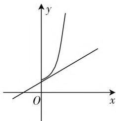
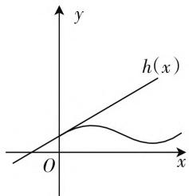

# 一花一世界，一题释全景

—— 一道含参恒成立问题的多种解法及解题感悟

● 武汉市黄陂区第一中学盘龙校区 李红春  
● 武汉市教育科学研究院 孔峰  
● 武汉市教育科学研究院 郭晓凌

波利亚有一句名言: 掌握数学就意味着善于解题. 数学教师每日都离不开解题, 解题是教师数学活动的基本形式和主要内容, 也是职业幸福感的源泉. 在众多数学问题中, 含参恒成立问题一直是高考中的热点和难点, 尤其当这类问题与导数结合起来时, 解题方法更显得灵活多变, 难度不容小觑. 尽管关于这类问题的研究在报刊上屡见不鲜, 但考题越来越活, 方法常用常新, 还是给不少教师, 尤其是年轻教师的教学工作带来巨大的挑战.

数学试题浩如烟海，在有限的时间做很多题，浅尝辄止，一知半解，倒不如以一道典型试题为抓手，从不同的角度进行思考分析，领悟其中的方法与规律，这既能优化思维品质，又有利于加强数学知识和方法之间的内在联系，促进知识网络的有效构建。本文通过对一道含参恒成立问题多种解法的展示，揭示了求解这类问题的基本策略。

题目 已知 $a \ln (x + 1) - 2(x + 1) - ax + 2\mathrm{e}^x > 0$ 对 $x \in (0, +\infty)$ 恒成立，求实数 $a$ 的取值范围.

本题以不等式为载体,结构简洁巧妙,以指数、对数混合形式出现,主要考查利用导数研究函数的性质,考查学生逻辑思维能力、化归与转化能力、运算求解能力,以及分类讨论、数形结合等思想,是一道难度较大,区分度较高的试题,下面说说本题的解法.

# 策略一、分类讨论,逐步深入

含参数的问题,往往因为参数的存在,导致函数的性质具有不确定性,这时可通过“分类讨论,逐步深入”的方法,将含糊的问题具体化,让解题得以继续.

解法1:设 $g(x)=a\ln(x+1)-2(x+1)-ax+2e^{x}$ ，则 $g(x)>0$ 恒成立， $g'(x)=a\left(\frac{1}{1+x}-1\right)+2e^{x}-2, g''(x)=-\frac{a}{(1+x)^{2}}+2e^{x}$ .

(1) 当 $a \leqslant 0$ 时, $g''(x) > 0$ 恒成立, 则 $g'(x)$ 在 $(0, +\infty)$ 递增, 则 $g'(x) > g'(0) = 0$ , 故 $g(x)$ 在 $(0, +\infty)$ 上单调递增, 则 $g(x) > g(0) = 0$ , 满足题意.  
(2) 当 a > 0 时, $g''(x)$ 单调递增, 且有 $g''(0) = 2 - a$ .

① 若 $2 - a \geqslant 0$ ，即 $0 < a \leqslant 2$ 时， $g''(x) > g''(0) = 2 - a > 0$ ，则 $g'(x)$ 在 $(0, +\infty)$ 上单调递增；于是 $g'(x) > g'(0) = 0$ ，所以 $g(x)$ 在 $(0, +\infty)$ 上单调递增，故 $g(x) > g(0) = 0$ ，满足题意。

② 若 $2 - a < 0$ ，即 $a > 2$ 时，由“ $x > 0$ 时 $\mathrm{e}^x > 1 + x$ ”，得 $g''(x) = 2\mathrm{e}^x - \frac{a}{(1 + x)^2} > 2(1 + x) - \frac{a}{(1 + x)^2} = \frac{2(1 + x)^3 - a}{(1 + x)^2}$ . 令 $\frac{2(1 + x)^3 - a}{(1 + x)^2} = 0$ ，得 $x = \sqrt[3]{\frac{a}{2}} - 1$ ，则 $g''\left(\sqrt[3]{\frac{a}{2}} - 1\right) > 0$ ，又易知 $g''(0) = 2 - a < 0$ ，由零点存在定理知，存在 $x_0 \in \left(0, \sqrt[3]{\frac{a}{2}} - 1\right)$ ，使得 $g''(x_0) = 0$ ，从而 $x \in (0, x_0)$ 时， $g''(x) < 0$ ，则 $g'(x)$ 单调递减，于是 $g'(x) < g'(0) = 0$ ，则 $g(x)$ 单调递减，则 $g(x) < g(0) = 0$ ，不满足题意.

综上可知， $a\leqslant 2$

评析:以上解法有两点值得注意,首先端点处的函数值比较特殊: $g(0)=0$ , $g'(0)=0$ ;其次通过“x>0时, $e^{x}>1+x$ ”这一关系将超越函数 $g''(x)$ 缩小为有理函数,为 $g''(x)$ 寻找零点创造了条件.

# 策略二、数形结合，以形助数

数学是研究数量关系与空间形式的科学. 华罗庚先生曾感叹道: “数无形时少直观, 形无数时难入微, 数形结合百般好, 割裂分开万事休.” 通过挖掘数学式子背后形的特征, 以形助数, 是解决数学问题中的一种常用方法.

解法 2:(1) 当 $a \leqslant 0$ 时, 由于 x > 0 时, $\ln(x + 1) < x, e^{x} > 1 + x, \frac{a}{2}[\ln(x + 1) - x] + e^{x} - (x + 1) > 0$ 显然成立.

(2) 当 $a > 0$ 时，由已知得 $\frac{a}{2} [\ln (x + 1) - x] + \mathrm{e}^x$ $>1 + x$ ，设 $g(x) = \frac{a}{2} [\ln (x + 1) - x] + \mathrm{e}^x, h(x) = x + 1, g'(x) = \frac{a}{2}\left(\frac{1}{x + 1} - 1\right) + \mathrm{e}^x$ ，显然 $g(0) = h(0) = 1, g'(0) = h'(0) = 1$ ，则 $h(x)$ 为 $g(x)$ 在 $x = 0$ 处的切线，由已知可得 $g(x)$ 的图像始终在 $h(x)$ 的上方.

由 $g''(x) = -\frac{a}{2} \cdot \frac{1}{(1 + x)^2} + e^x$ ，由 $g'''(x) = \frac{a}{(x + 1)^3} + e^x > 0$ ，所以 $g''(x)$ 在 $(0, +\infty)$ 上单调递增，则 $g''(x) > g''(0) = 1 - \frac{a}{2}$ .

① 当 $1 - \frac{a}{2} \geqslant 0$ ，即 $0 < a \leqslant 2$ 时， $g''(x) > 0$ ，此时 $g(x)$ 的图像随 $x$ 值的增大，切线的斜率也随之增大，图像呈“下凸”趋势，如图1所示，满足题意.

text_image

Mathematical graph showing two curves on a Cartesian coordinate system with x and y axes labeled.

图1

text_image

y
h(x)
O
x

图2

② 当 $1 - \frac{a}{2} < 0$ ，即 $a > 2$ 时， $g''(0) = 1 - \frac{a}{2} < 0$ ，而 $g''\left(\ln \frac{a}{2}\right) = \frac{a}{2} - \frac{a}{2} \cdot \frac{1}{\left(1 + \ln \frac{a}{2}\right)^2} = \frac{a}{2}\left[1 - \frac{1}{\left(1 + \ln \frac{a}{2}\right)^2}\right] > 0$ ，所以由零点存在定理知，存在 $x_0 \in \left(0, \ln \frac{a}{2}\right)$ ，使得 $g''(x_0) = 0$ ，由于 $g''(x)$ 在 $(0, +\infty)$ 上单调递增，则 $x \in (0, x_0)$ 时， $g''(x) < g''(x_0) = 0$ ，于是 $g'(x)$ 单调递减，故 $g'(x) < g'(0) = 1$ ，此时，在切点右侧存在一个区域 $(0, x_0)$ ，在该区域随着 $x$ 的增大，曲线上切线斜率逐渐减小，图像呈现出“上凸”的趋势，在该区间 $g(x)$ 的图像位于 $h(x)$ 图像的下方，如图2，显然不符合题意。

综上可知， $a \leqslant 2$ .

评析: 将原不等式移项重新组合, 得到 $g(x) \geqslant h(x)$ 恒成立, 观察出 $h(x)$ 的图像为函数 $g(x)$ 在 x = 0 处的切线, 从形的角度分析问题, 找准解题思路.

# 策略三、先求充分，再证必要

数学解题讲究等价转化,即含参数问题中求得的结果应该是使得原不等式成立的“充要条件”,解题时可先求出原不等式成立的“充分条件”,然后证明其“必要条件”.

解法3:由题意知, $a[x-\ln(x+1)]-2(e^{x}-x-1)<0$ 在 $x\in(0,+\infty)$ 时恒成立.设 $g(x)=a[x-\ln(x+1)]-2(e^{x}-x-1)$ ，则 $g'(x)=a\left(1-\frac{1}{1+x}\right)-2(e^{x}-1)$ , $g''(x)=\frac{a}{(1+x)^{2}}-2e^{x}$ .由 $g(0)=0$ ，则原不等式等价为 $g(x)<g(0)$ ，一方面，由x>0, $g(x)<g(0)$ 成立的充分条件是 $g'(x)<0$ ，而 $g'(0)=0$ ，即 $g'(x)<g'(0)$ ，该式成立的充分条件是 $g''(x)<0$ ，即 $a\leqslant2e^{x}(1+x)^{2}$ 恒成立.设 $m(x)=2e^{x}(1+x)^{2},x\in(0,+\infty)$ ，由 $m'(x)=2e^{x}(1+x)^{2}+4e^{x}(1+x)>0$ 知， $m(x)$ 在 $(0,+\infty)$ 上单调递增，于是 $m(x)>m(0)=2$ ，故 $a\leqslant2$ ，这是符合题意的一个充分条件.

另一方面，当 $a > 2$ 时， $g''(0) = a - 2 > 0$ ，由连续函数的性质可知，一定存在 $x_0 > 0$ ，使得 $x \in (0, x_0)$ 时， $g''(x) > 0$ ，此时 $g'(x)$ 单调递增，于是 $g'(x) > g'(0) = 0$ ，故 $g(x)$ 单调递增，则 $g(x) > g(0) = 0$ ，这与已知条件矛盾，故 $a \leqslant 2$ 是原式成立的一个必要条件。

综上可知， $a\leqslant 2$

评析:关注函数取端点值的特殊性,先通过式子成立的充分条件求出参数的取值范围,再证明其必要性.充分性表明:有了就足够;必要性表明:少了就不行.先求充分条件,再证明其必要性,是一种逐步降低解题难度的方法.

本文的几种解题方法充分展示了解决含参恒成立问题的几种基本策略:分类讨论、以形助数、参变量分离、运用充要条件.解题过程使我们充分感受到了数学思维的灵活性与多样性.总之,解题首先要根据已知条件选准策略,然后再立足已有条件,紧盯求解目标,围绕当前障碍,探寻处理方法.

另外，“工欲善其事，必先利其器”，求解含参恒成立问题还需要自身具备几个能力，即观察能力、猜想能力、反思能力、化归能力和运算能力。观察、猜想和反思为我们的解题指引了可能的方向，化归和运算则是检验猜想方向是否正确，完成解题过程的基本保障。W