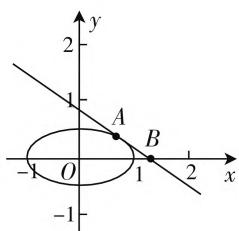
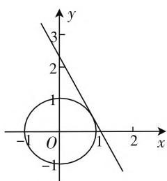

# 一道最值问题的错解分析与应对策略

● 浙江省湖州市菱湖中学 张战桥  
● 浙江省湖州市菱湖中学 吴 凯

题目 设 x, y 为实数, 若 $x^{2} + 4y^{2} = 1$ , 则 $x + y$ 的最大值是 \_\_\_\_.

# 一、题目分析

本题是一道常见的双元最值问题,在给定条件下求双元和的最大值.本题的解题方法较多,主要考查学生转化问题本质的能力,能全方位考查学生的数学综合应用的能力.我们可以尝试运用高中数学知识进行多角度的分析,在教学中能培养学生发现问题、研究问题和解决问题的综合能力,促进数学核心素养的达成.

# 二、常见错解及分析

常见的错误认识往往是将本题误以为基本不等式题型，比如出现这样的解答：因为 $x^{2} + 4y^{2}\geqslant 2x$ $(2y) = 4xy$ ，所以 $4xy\leqslant 1$ ，即 $xy\leqslant \frac{1}{4}$ 而 $x + y\geqslant 2$ $\sqrt{xy}$ ，所以 $x + y$ 的最大值为 $2\sqrt{\frac{1}{4}} = 1.$ 上述解答过程看似很有道理，但是这样的解题过程犯了较多的逻辑错误：错误点1，混淆了最大值与最小值的概念；错误点2，解答过程中连续用了两次基本不等式，况且两次取等的条件不一致，也就是说是不能同时取到最值.

这个错例暴露出学生解题中的两个常见症结:症结1,思维单一,不能及时发现问题所在,“认死理”;症结2,解法单一,即使发现了问题,也不能解决问题,“黔驴技穷”.

# 三、应对策略及多解赏析

这样的解题是片面的、无效的，这就需要教师能够针对学生的症结对症下药，在解题教学中，可以尝试采用一题多解教学，从多角度研究问题，着重培养学生的数学学科核心素养，积极引导学生善于去发现问题，遇到问题要会选择恰当的切入点来分析问题，或换位思考，或将问题转化为其他的数学模型，从而才能解决问题,确定正确解法,获得正确答案.

解法1: 令 $x + y = t$ ，则 $y = -x + t$ ，代入方程得 $x^2 + 4(-x + t)^2 = 1$ ，化简得 $5x^2 - 8tx + 4t^2 - 1 = 0$ 即对于任意的 $x \in \mathbf{R}$ 有解，则 $\Delta = (-8t)^2 - 4 \cdot 5 \cdot (4t^2 - 1) = 16t^2 - 20 \geqslant 0$ ，即 $t^2 \leqslant \frac{5}{4}$ ，所以 $t \in \left[-\frac{\sqrt{5}}{2}, \frac{\sqrt{5}}{2}\right]$ ，即 $x + y$ 的最大值为 $\frac{\sqrt{5}}{2}$ .

解法2: 将方程 $x^{2} + 4y^{2} = 1$ 化为椭圆标准方程 $C: x^{2} + \frac{y^{2}}{\frac{1}{4}} =$

1, 其中 $a = 1, b = \frac{1}{2}, c = \frac{\sqrt{3}}{2}$ , 再令 $x + y = Z$ , 利用线性规划模型解题, 求目标函数 $Z = x + y$ 的

text_image

y
2
1
A
B
-1 O 1 2 x
-1

图1

最大值,等价于求直线 $l: y = -x + Z$ 的截距 Z 的最大值,如图 1,当直线 l 与椭圆 C 相切时即为所求.则联立方程 $\left\{\begin{aligned}y &= -x + Z,\\ x^{2} &+4y^{2} = 1,\end{aligned}\right.$ 消 x 可得 $5y^{2}-2Zy+Z^{2}-1=0.$

因为相切,所以此时 $\Delta=(-2Z)^{2}-4\cdot5\cdot(Z^{2}-1)=0$ , 解得 $Z=\frac{\sqrt{5}}{2}$ (负值舍去), 即为 $x+y$ 的最大值.

解法3: 令 $\left\{\begin{aligned}x^{\prime}&=x,\\ y^{\prime}&=2y,\end{aligned}\right.$ 则 $x^{\prime2}+y^{\prime2}=1$ 即为单位圆，而 $x+y=x^{\prime}+\frac{y^{\prime}}{2}$ ，令 $x^{\prime}+\frac{y^{\prime}}{2}=Z$ ，记直线l为 $y^{\prime}=-2x^{\prime}+2Z$ ，即求截距2Z的最大值。如图2，此时直线l与单位圆相切，利用原点到直线l的距离 $d = \frac{|2Z|}{\sqrt{5}} = 1$ ，解得 $|Z| = \frac{\sqrt{5}}{2}$

text_image

y
3
2
1
O
-1
-1
x
1
2

图2

故 $(x + y)_{\max} = \frac{\sqrt{5}}{2}$ .

解法4:令 $\left\{\begin{aligned}x&=\cos\alpha,\\ 2y&=\sin\alpha,\end{aligned}\right.$ 则 $\left\{\begin{aligned}x&=\cos\alpha,\\ y&=\frac{1}{2}\sin\alpha,\end{aligned}\right.$ 则 $x+y=$ $\cos\alpha+\frac{1}{2}\sin\alpha=\frac{1}{2}\sin\alpha+\cos\alpha=\frac{\sqrt{5}}{2}\sin(\alpha+\varphi)$ （其中 $\tan\varphi=2)$ ，所以 $x+y$ 的最大值为 $\frac{\sqrt{5}}{2}$ .

解法 5: 构造柯西不等式可得 $(x^{2}+4y^{2})\cdot\left(1+\frac{1}{4}\right)\geqslant(x+y)^{2}$ ，则 $(x+y)^{2}\leqslant\frac{5}{4}$ ，即 $(x+y)_{\max}=\frac{\sqrt{5}}{2}$ ，当且仅当 $x\cdot\frac{1}{2}=(2y)\cdot1$ ，即当 x=4y 时取到最大值，此时 $x=\frac{2\sqrt{5}}{5}, y=\frac{\sqrt{5}}{10}$ .

解法6: $(x+y)^{2}=\frac{x^{2}+2xy+y^{2}}{x^{2}+4y^{2}}=\frac{\left(\frac{x}{y}\right)^{2}+2\frac{x}{y}+1}{\left(\frac{x}{y}\right)^{2}+4}.$ 令 $\frac{x}{y}=t$ ，则 $\frac{t^{2}+2t+1}{t^{2}+4}=1+\frac{2t-3}{t^{2}+4}=1+$ $\frac{2(t-\frac{3}{2})}{(t-\frac{3}{2})^{2}+3(t-\frac{3}{2})+\frac{25}{4}}$ ，再令 $t-\frac{3}{2}=m$ ，则 $1+$ $\frac{2m}{m^{2}+3m+\frac{25}{4}}=1+\frac{2}{m+\frac{25}{4m}+3}\leqslant1+\frac{2}{2\sqrt{\frac{25}{4}+3}}=$

$\frac{5}{4}$ , 当且仅当 $m = \frac{25}{4m}$ 时, 即 $m = \frac{5}{2}$ (舍负), 即 $t = 4$ , 即 $x = 4y$ 时取到等号, 故 $(x + y)_{\max} = \frac{\sqrt{5}}{2}$ .

# 四、解题感悟

思考本试题的各种解法不难发现,不同的解法可以锻炼学生不同的解题能力,培养学生数学核心素养,如解法2和解法3通过数形结合的方式,将代数问题转化为几何模型,通过图形之间的位置关系寻求等价关系,能培养学生数学建模能力和直观想象能力;其余解法均是通过代数知识形成丰富的逻辑运算,能培养学生数学抽象、逻辑推理以及数学运算等核心素养.

在教学中,通过一题多解的教学形式,教师若从多角度来引导学生认识题目的多元背景知识,在学习中感知知识点的内在联系,做题因不同解法而能将高中数学的各章节知识串联起来,打通章节壁垒,真正起到了融会贯通的学习效果,在高三复习课上效果尤为明显.

# 参考文献：

[1] 吴凯. 一道双元二次方程求范围试题的多视角解析 [J]. 试题与研究, 2019(20).  
[2] 邓聪富. 试论高中数学核心素养的教育价值及教学渗透策略 [J]. 数学学习与研究, 2019(14). W

(上接第44页) (0,2) 上单调递减，在 $(2,2a + 1)$ 上单调递增，在 $(2a + 1, +\infty)$ 上单调递减，只需 $F(2a + 1) \leqslant 1$ 即可.于是 $\frac{2a^2 + 4a + \frac{5}{2}}{\mathrm{e}^{2a + 1}} \leqslant 1$ ，研究函数 $H(a) = \frac{2a^2 + 4a + \frac{5}{2}}{\mathrm{e}^{2a + 1}}, H'(a) = \frac{-(2a + 1)^2}{\mathrm{e}^{2a + 1}} < 0$ 恒成立，因而 $H(a)$ 在 $\left(\frac{1}{2}, +\infty\right)$ 上单调递减， $H(a) < H\left(\frac{1}{2}\right) = \frac{5}{\mathrm{e}^2} < 1$ 满足题意.

综上可知， $a$ 的取值范围是 $\left[\frac{7 - \mathrm{e}^2}{4}, + \infty\right)$

通过对本题的分析,进一步提醒我们在平时的解题教学中切忌“套路化”“秒杀”等一蹴而就的方式.现在的高考题正在不断地破套路化,将考查的重点依旧落在学生的思维品质上. 波利亚曾说: 老师在讲授方法的时候, 不能像魔术师一样, 忽然从袋子里掏出一个兔子, 让学生不明所以, 莫名其妙. 我们面对难题时 (如本文例题), 应该不断设问: 这是一个什么问题? (一个恒成立求参数范围的问题) 已知、可知、未知之间有怎样的联系? (0 的时候不等式成立) 我有什么解题规划? (分离参数或者基本函数) 怎样实施我的规划? 有哪些困难? (分参函数复杂, 直接研究函数分类讨论复杂) 解后有怎样的反思? (为什么导函数恰好可以因式分解) 是不是有一类的问题? 通性通法和个性化的方法是什么? 以前遇到过类似的问题吗? 可以不可以迁移? 等等一系列的问题, 从而知其然而知其所以然. 即使这样的步骤看起来笨笨的, 但这恰是一种返璞归真, 俗到家时自入时的体现. 这也是我们教师在平时解题教学的重心所在. W