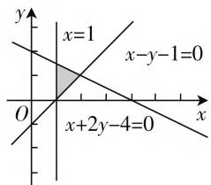

# 二轮复习:应注重四种能力的提升

# ● 南京师大附中江宁分校 纪晖

高考复习一般分为两个阶段,第一阶段称为一轮复习阶段,第二阶段称为二轮复习阶段.如果说一轮复习的主要任务是引导学生厘清知识体系,掌握三基(基础知识、基本技能和基本方法),那么二轮复习的目的就是提升学生的能力!主要有哪些能力,又该如何提升?本文谈几点不成熟的看法,供大家参考.

# 一、提升运算能力

高考数学,考查考生的运算能力,一直是命题的重要原则.运算求解有哪些呢?一是会依据法则与公式准确运算,包括公式的变形能力和数据的处理能力;二是能从问题的条件出发,找到合理的运算方法,实施简捷运算;三是能根据实际的要求对有关数据实施近似计算.其实,运算能力的提升,涉及知识与能力的诸多方面,如数学思维能力的形成与数学运算技巧的融合,提升运算能力是提升多种能力的综合结果.

例 1 已知 $0 < \alpha < \frac{\pi}{2} < \beta < \pi, \sin\alpha = \frac{3}{5}, \cos(\alpha + \beta) = -\frac{4}{5}$ ，则 $\sin\beta =$ \_\_\_\_ .

分析:本题的运算对象是求钝角 $\beta$ 的正弦值,而不是 $\beta$ 的值,主要考查三角恒等变换公式的灵活应用.针对运算对象,确定运算方法.

解法 1: 因为 $\beta=(\alpha+\beta)-\alpha$ ，所以 $\sin\beta=\sin[(\alpha+\beta)-\alpha]=\sin(\alpha+\beta)\cos\alpha-\cos(\alpha+\beta)\sin\beta.$

因为 $\alpha \in \left(0, \frac{\pi}{2}\right)$ ，所以 $\cos \alpha = \sqrt{1 - \sin^2 \alpha} = \frac{4}{5}$ .

因为 $\alpha \in \left(0, \frac{\pi}{2}\right), \beta \in \left(\frac{\pi}{2}, \pi\right)$ 所以 $\alpha + \beta \in \left(\frac{\pi}{2}, \frac{3\pi}{2}\right)$ ，所以 $\sin (\alpha + \beta) = \pm \sqrt{1 - \cos^2 (\alpha + \beta)} = \pm \frac{3}{5}$ .

当 $\sin (\alpha +\beta) = \frac{3}{5}$ 时， $\sin \beta = \frac{3}{5}\times \frac{4}{5} -\left(-\frac{4}{5}\right)\times$ $\frac{3}{5} = \frac{24}{25}$ ，当 $\sin (\alpha +\beta) = -\frac{3}{5}$ 时， $\sin \beta = -\frac{3}{5}\times \frac{4}{5}-$ $\left(-\frac{4}{5}\right)\times \frac{3}{5} = 0.$

因为 $\beta \in \left(\frac{\pi}{2},\pi\right)$ ，所以 $\sin \beta \neq 0$ ，所以 $\sin \beta = \frac{24}{25}$

解法2: 因为 $\alpha\in\left(0,\frac{\pi}{2}\right)$ ，所以 $\cos\alpha=\sqrt{1-\sin^{2}\alpha}=\frac{4}{5}$ ，所以 $\cos(\alpha+\beta)=-\cos\alpha=\cos(\alpha+\pi)$ ，所以 $\alpha+\beta=(\alpha+\pi)+2k\pi$ 或 $\alpha+\beta=-(\alpha+\pi)+2k\pi,k\in\mathbf{Z}$ .

若 $\alpha + \beta = (\alpha + \pi) + 2k\pi$ 即 $\beta = \pi + 2k\pi (k \in \mathbf{Z})$ ，与 $\frac{\pi}{2} < \beta < \pi$ 矛盾，故舍去，若 $\alpha + \beta = -(\alpha + \pi) + 2k\pi$ 即 $\beta = -2\alpha + (2k - 1)\pi$ ，则： $\sin \beta = \sin[-2\alpha + (2k - 1)\pi] = \sin 2\alpha = 2\sin \alpha \cos \alpha = \frac{24}{25}$ .

点评:本题主要考查三角函数的运算.三角函数一直是高考的命题热点,主要考查三角函数图像与性质的应用和三角恒等变换公式的应用.本例是一个三角函数的求值问题,解法1采用了“变角”的常规思路,根据两角差的正弦公式的要求按部就班进行运算,不难获解;而解法2的运算方法则更上一个层次,利用两个角的余弦值相等时它们之间的关系,揭示出 $\beta$ 与 $\alpha$ 之间的内在联系,从而缩短了运算的路程.从本例可以看出,提升运算能力,不仅仅是做到会解题,更要做到善于优解题.

# 二、提升分析问题与解决问题的能力

或许有人认为,经过了一轮复习后,学生的分析问题与解决问题的能力已经到了瓶颈期,已经无法提高.其实不然,一轮复习往往把重点放在知识点的复习上,对能力的培养往往没有做到位,因此,在二轮复习中还是有很大提升空间的,如审题能力,阅读理解能力,一题多解能力,一题多变能力等,都可以作为二轮复习的培养目标.在二轮复习中,解题的目的不再是为了求得一个答案,而是通过解题提高分析问题与解决问题的能力,因此不可忽视解题的任何一个环节,审题能力要培养,解题后的反思也不可忽视,只有不断总结,才有进步.

例2 已知 $x, y \in \mathbb{R}$ , 且满足当 $\left\{ \begin{array}{l} x + 2y - 4 \leqslant 0, \\ x - y - 1 \leqslant 0, \\ x \geqslant 1 \end{array} \right.$ 时, $1 \leqslant ax + y \leqslant 4$ 恒成立, 求实数 $a$ 的取值范围.

解法1:(分类讨论法)如图1,在坐标系中画出条件中的不等式组所表示的平面区域,令 $z=ax+y$ ,那么 $z_{\min}\geqslant1,z_{\max}\leqslant4,y=-ax+z$ ,于是只需对斜率-a的符号分三种情形进行讨论:当-a>0⇒a<0时,直接从图上看出 $z_{\min} < 0$ ，不满足题意；当 $a = 0$ 时， $z_{\min} = 0 < 1$ ，也不满足题意；当 $a > 0$ ，无论 $a$ 取何值，最优解都在顶点处取得，故代入三角形区域的三个顶点（1，0）， $\left(1, \frac{3}{2}\right)$ ，(2,1)，得到不等式组 $\left\{ \begin{array}{l} 1 \leqslant a \leqslant 4, \\ 1 \leqslant a + \frac{3}{2} \leqslant 4, \\ 1 \leqslant 2a + 1 \leqslant 4, \end{array} \right.$ 是解得 $a \in \left[1, \frac{3}{2}\right]$ .

text_image

x=1
x-y-1=0
O
x+2y-4=0
x
y

图1

解法2:(参变量分离法)从不等式恒成立角度思考,可以参变分离.根据约束条件知 $x\geqslant1$ ,故恒成立不等式为 $1\leqslant ax+y\leqslant4\Rightarrow\frac{1-y}{x}\leqslant a\leqslant\frac{4-y}{x}$ ,于是
有 $\left\{\begin{aligned}&a\geqslant\left(-\frac{y-1}{x}\right)_{\max},\\ &a\leqslant\left(-\frac{y-4}{x}\right)_{\min},\end{aligned}\right.$ 由分式形式可联想到直线的斜率,故可作出平面区域,并分别求出区域中的点 $(x,y)$ 与点 $(0,1)$ 与 $(0,4)$ 连线斜率的最值. $\left(-\frac{y-1}{x}\right)_{\max}=1,\left(-\frac{y-4}{x}\right)_{\min}=\frac{3}{2}$ ,于是 $a\in\left[1,\frac{3}{2}\right]$ .

故答案为 $\left[1,\frac{3}{2}\right]$ .

点评:本题第一种方法是常规思路,看见不等式组就想到线性规划;而第二种方法却打破常规,从不等式恒成立角度看,采用参变量分离法照样可以解决问题.在二轮复习中,我们就是学会多角度思考问题,从而提高分析问题与解决问题的能力.

# 三、提升综合能力

高考试题一年一个样，但基本考点“岿然不动”，将命题设置在知识的交汇点上，一直是高考命题的原则与热点。如三角函数与平面向量的综合，函数与导数的交汇，等差数列与等比数列的交汇，数列与不等式的综合, 函数与不等式的综合, 解析几何与平面向量的综合, 概率与统计的交汇等, 一直是近几年高考的命题热点. 为此, 考生应该有意识地选择有关题目进行针对性“保温训练”, 但训练的量不可过大, 一种类型只需训练一到两题, 训练时力求一气呵成, 千万不可再陷“题海”.

例 3 已知在直角坐标系中, 点 A(-1,1), P 是动点, 且 $\triangle POA$ 的三边所在直线的斜率满足如下关系: $k_{OP} + k_{OA} = k_{PA}$ .

(1) 求点 P 的轨迹方程.  
(2) 若 Q 是轨迹 C 上不同于点 P 的一个点，且 $\overrightarrow{PQ} = \lambda \overrightarrow{OA}$ ，直线 OP 与 QA 相交于点 M，请问是否存在点 P 使得 $\triangle PQA$ 和 $\triangle PAM$ 的面积满足 $S_{\triangle PQM} = 2S_{\triangle PAM}$ 。若存在，则求点 P 的坐标；否则，请说明理由。

解析:(1)采用设点法,设 $P(x,y)$ ,再根据点 O 与 A 已知,由条件列等式再化简.

设 $P(x,y)$ ，由 $A(-1,1),O(0,0)$ 可得： $k_{OP} = \frac{y}{x},$ $k_{OA} = -1,k_{PA} = \frac{y - 1}{x + 1}$ ，依题意 $k_{OP} + k_{OA} = k_{PA}$ 可得 $\frac{y}{x}$ $-1 = \frac{y - 1}{x + 1}\Rightarrow y(x + 1) - x(x + 1) = x(y - 1)$ ，整理后可得 $y = x^2$ ，其中 $x\neq 0,x\neq -1$ ，所以 $P$ 的轨迹方程为 $y = x^{2}(x\neq 0,x\neq -1)$

(2) 由图(此略)发现 $\triangle PQA$ 和 $\triangle PAM$ 等高, 于是将面积之比转化成对应底边之比, 即 $S_{\triangle PQM} = 2S_{\triangle PAM} \Rightarrow QA = 2AM$ , 再由 $\overrightarrow{PQ} = \lambda \overrightarrow{OA} \Rightarrow \overrightarrow{PQ} // \overrightarrow{OA}$ , 于是 $QA = 2AM \Rightarrow OP = 2OM$ , 由 $O, P, M$ 共线得向量关系式, 进而再求点 $P$ 坐标.

设 $P(x_{1},x_{1}^{2}),Q(x_{2},x_{2}^{2})$ ，因为 $\overrightarrow{PQ}=\lambda\overrightarrow{OA}$ ，所以 $\overrightarrow{PQ}\parallel\overrightarrow{OA},k_{PQ}=k_{OA}=-1$ ，即 $\frac{x_{2}^{2}-x_{1}^{2}}{x_{2}-x_{1}}=-1\Rightarrow x_{2}=-x_{1}-1$ ，所以 $k_{QA}=\frac{x_{2}^{2}-1}{x_{2}+1}=x_{2}-1=-x_{1}-2$ ，所以 QA: $y+1=(-x_{1}-2)(x-1)$ 。因为 OP: $y=x_{1}x$ ，所以 M: $\left\{\begin{aligned}y+1&=(-x_{1}-2)(x-1),\\ y=x_{1}x,\end{aligned}\right.$ 可解得 $x_{M}=-\frac{1}{2}$ 。

因为 $S_{\triangle PQM} = \frac{1}{2}|QA| \cdot d_{P - QM}, S_{\triangle PAM} = \frac{1}{2} \cdot |AM| \cdot d_{P - QM}$ 且 $S_{\triangle PQM} = 2S_{\triangle PAM}$ ，所以 $|QA| = 2|AM|$ .

因为 $\overrightarrow{PQ} // \overrightarrow{OA}$ , 所以 $|QA| = 2|AM| \Rightarrow |OP| = 2|OM|$ , 即 $\overrightarrow{OP} = -2\overrightarrow{OM}$ , 所以 $x_{P} = -2x_{M} = 1$ , 所以

$P(1,1)$ ，因此存在符合条件的 $P(1,1)$ .

点评:本题属于高考中最常见的定点问题,这类问题往往与平面向量综合在一起,体现了解析几何与平面向量的交汇,在考查解析几何的同时,也考查了平面向量的“工具性”,但最终解决问题的“主角”是解析几何,这类问题也应引起大家的注意.

# 四、提升创新能力

创新,是时代的要求,是社会发展的内驱力,也是高考命题的风向标.回顾历年高考,无论是试题给出的问题情境,还是考生的作答形式,都体现了数学高考对创新能力的培养.因此在二轮复习中,重视自身创新能力的提升不可懈怠.高考中的创新题一般源于课本或源于社会热点,有些创新题充满数学文化的味儿.而最常见的是一类新定义创新题,要求考生读懂题目,并利用题中的有关信息解决相关问题.这类问题能更好地考查考生创新性解决问题的能力.

例 4 设 $[x]$ 表示不超过 $x$ 的最大整数 (如 $[2] = 2, \left[\frac{3}{2}\right] = 1$ ), 对于给定的 $n \in \mathbf{N}^*$ , 定义 $\mathrm{C}_n^x = \frac{n(n - 1)\cdots(n - [x] + 1)}{x(x - 1)\cdots(x - [x] + 1)}, x \in [1, +\infty)$ , 则当 $x \in \left[\frac{5}{4}, 3\right)$ 时, 函数 $f(x) = \mathrm{C}_8^x$ 的值域为 ( ).

A. $\left(4,\frac{32}{5}\right]$

B. $\left(4,\frac{32}{5}\right]\cup\left(\frac{28}{3},28\right]$

C. $\left[\frac{28}{3},28\right]$

D. $\left[4,\frac{32}{5}\right)\cup\left(\frac{28}{3},28\right]$

解析:根据定义的式子 $C_{n}^{x}=\frac{n(n-1)\cdots(n-[x]+1)}{x(x-1)\cdots(x-[x]+1)}$

可以知道分子与分母含的项数，与 $[x]$ 的取值有关，即分子与分母分别为 $[x]$ 个项的乘积，所以根据 $[x]$ 的定义将 $x \in \left[\frac{5}{4}, 3\right)$ 分为 $\left[\frac{5}{4}, 2\right)$ 和 $[2, 3)$ 两个区间段处理。当 $x \in \left[\frac{5}{4}, 2\right)$ 时， $[x] = 1$ ，所以 $\mathrm{C}_{8}^{x} = \frac{8}{x}$ ，故 $f(x)$ 在 $\left[\frac{5}{4}, 2\right)$ 的值域为 $\left(4, \frac{32}{5}\right]$ ；当 $x \in [2, 3)$ 时， $[x] = 2$ ，故 $\mathrm{C}_{8}^{x} = \frac{8 \cdot 7}{x (x - 1)} = \frac{56}{x^{2} - x} = \frac{56}{\left(x - \frac{1}{2}\right)^{2} - \frac{1}{4}}$ ，于是 $f(x)$ 在区间 $[2, 3)$ 上单调递减，所以 $f(x) \in \left(\frac{28}{3}, 28\right]$ .

综上可知， $f(x)\in \left(4,\frac{32}{5}\right]\cup \left(\frac{28}{3},28\right].$

故选 B.

点评:解答本题的关键是根据题中的新定义,先写出目标函数 $f(x)$ 的表达式,再求这个函数的最值.只要领会题意,对于大多数考生来说,难度不是很大.

在高考二轮复习中, 教师注重提升能力的同时, 不要忘记每天的基础训练. 其实要想提升能力, 必须要有扎实的基础, 只有正确处理好基础与能力的关系, 复习效果才能更上一层楼. 作为二轮复习的指导者, 教师必须保持清醒的头脑, 不可将难题与能力题混为一谈, 不可把主要矛盾放在复习内容的难度上, 应该放在查漏补缺上, 从而让学生满怀信心走进考场. F

(上接第11页) 的最大值为 $\frac{\sqrt{2}-1}{2}$ .

故填 $\frac{\sqrt{2}-1}{2}$ .

点评: 结合以上问题和破解过程, 自主探究, 细心观察, 发现问题, 提出问题, 分析问题, 深入探究, 解决问题, 可以得到以下相应的变式问题:

变式1: 在 $\triangle ABC$ 中, 若 $\sin B + \cos B = \sqrt{2}$ , 则 $2\cos A\cos B\cos C$ 的最大值为 \_\_\_\_. (答案: $\frac{\sqrt{2} - 1}{2}$ )

变式 2: 在 $\triangle ABC$ 中, 若 $\sin B + \cos B = \sqrt{2}$ , 则

$2\sin A\sin B\sin C$ 的最大值为 \_\_\_\_. (答案: $\frac{\sqrt{2}+1}{2}$ )

提升高三数学复习课的质量，在全面提升数学知识、数学思想和数学方法的基础上，渗透数学核心素养，不断提高学生理解数学问题的思维能力和解决数学问题的能力，真正能够从数学思想、数学观点上启发和引导学生本质地思考数学问题，进行有效的数学抽象、直观想象以及数学建模，合理地逻辑推理与数学运算以及数据分析等，改变应试考试中的竞争倾向，将学生个体间的比拼，合理引导为同学互助、合作同行，使得高三应试复习过程升华为同伴成长，结成情谊，领悟合作，培养核心素养的成长历程。F