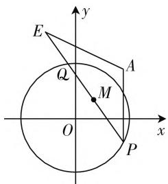

# 以一道江苏解几题为例谈多解思维

# ● 江苏省常熟外国语学校 毛妨妨

直线与圆是解析几何中的最简单的图形之一，又是平面几何中的两大基本图形，两者之间的位置关系问题能有效链接起初中与高中的相关知识，同时又可以融合平面向量、解三角形、函数与导数等众多的知识，充分渗透函数与方程、数形结合等基本数学思想，数学运算能力等。此类问题新颖创新，难度中等，一直成为各级各类考试的必考内容和热点内容之一，要引起高度重视。

# 一、问题呈现

问题:(2020届江苏省南京市十校高三下学期5月调研数学试题·13)已知圆 $O:x^{2}+y^{2}=4$ ,点A(2,2),直线l与圆O交于P,Q两点,点E在直线l上且满足 $\overrightarrow{PQ}=2\overrightarrow{QE}$ .若 $AE^{2}+2AP^{2}=48$ ,则弦PQ中点M的横坐标的取值范围为\_\_\_\_.

此题以直线与圆的位置关系为问题背景,结合平面向量的线性关系,线段的长度关系等条件,进而来确定对应点的横坐标的取值范围问题.巧妙把解析几何中的直线、圆、线段的距离,以及平面向量的线性关系等合理融合,交汇点较多,难度中等.

text_image

E
y
Q
A
M
O
x
P

图1

# 二、问题破解

# 思维视角(一)解析几何思维

解法1: 当直线 l 的斜率存在时, 设其方程为 $y = kx + m$ , 由于直线 l 与圆 O 有两个不同交点, 则知 $\frac{|m|}{\sqrt{k^{2} + 1}} < 2$ , 即 $m^{2} < 4k^{2} + 4$ , 将 $y = kx + m$ 代入 $x^{2} + y^{2} = 4$ , 整理可得 $(1 + k^{2})x^{2} + 2kmx + m^{2} - 4 = 0$ , 设 $P(x_{1}, y_{1}), Q(x_{2}, y_{2})$ , 则 $x_{1} + x_{2} = -\frac{2km}{1 + k^{2}}, x_{1}x_{2} = \frac{m^{2} - 4}{1 + k^{2}}$ , 所以 $y_{1} + y_{2} = kx_{1} + m + kx_{2} + m = \frac{2m}{1 + k^{2}}$ ,

$y_{1}y_{2}=(kx_{1}+m)(kx_{2}+m)=\frac{m^{2}-4k^{2}}{1+k^{2}}$ ，结合 $\overrightarrow{PQ}=2\overrightarrow{QE}$ ，可得 $E\left(\frac{3x_{2}-x_{1}}{2},\frac{3y_{2}-y_{1}}{2}\right)$ ，而 $AE^{2}+2AP^{2}=48$ ，所以 $\left(\frac{3x_{2}-x_{1}}{2}-2\right)^{2}+\left(\frac{3y_{2}-y_{1}}{2}-2\right)^{2}+2(x_{1}-2)^{2}+2(y_{1}-2)^{2}=48$ ，整理可得 $9(x_{1}+x_{2})^{2}+9(y_{1}+y_{2})^{2}-24x_{1}x_{2}-24y_{1}y_{2}-24(x_{1}+x_{2}+y_{1}+y_{2})=96$ ，代入整理有m=4k-4，结合 $m^{2}<4k^{2}+4$ 整理可得 $3k^{2}-8k+3<0$ ，解得 $\frac{4-\sqrt{7}}{3}<k<\frac{4+\sqrt{7}}{3}$ ，那么弦PQ中点M的横坐标为 $\frac{x_{1}+x_{2}}{2}=-\frac{km}{1+k^{2}}=\frac{4k-4k^{2}}{1+k^{2}}=-4+4\cdot\frac{1+k}{1+k^{2}}=-4+4\cdot\frac{1}{(1+k)+\frac{2}{1+k}-2}$ 在区间 $\left(\frac{4-\sqrt{7}}{3},\frac{4+\sqrt{7}}{3}\right)$ 上单调递减，则知 $\frac{x_{1}+x_{2}}{2}\in\left(\frac{-1-\sqrt{7}}{2},\frac{-1+\sqrt{7}}{2}\right)$ .

故填答案: $\left(\frac{-1-\sqrt{7}}{2},\frac{-1+\sqrt{7}}{2}\right)$ .

解法2：设 $P(x_{1},y_{1}),Q(x_{2},y_{2})$ ，结合 $\overrightarrow{PQ} = 2\overrightarrow{QE}$ ，可得 $E\left(\frac{3x_2 - x_1}{2},\frac{3y_2 - y_1}{2}\right)$ ，而 $AE^2 +2AP^2$ $= 48$ ，所以 $\left(\frac{3x_2 - x_1}{2} -2\right)^2 +\left(\frac{3y_2 - y_1}{2} -2\right)^2 +$ $2(x_{1} - 2)^{2} + 2(y_{1} - 2)^{2} = 48$ ，整理可得 $9(x_{1} + x_{2})^{2}$ $+9(y_{1} + y_{2})^{2} - 24x_{1}x_{2} - 24y_{1}y_{2} - 24(x_{1} + x_{2} + y_{1}$ $+y_{2}) = 96$ ，结合 $x_{1}^{2} + y_{1}^{2} = x_{2}^{2} + y_{2}^{2} = 4$ ，化简整理可得 $(x_{1}x_{2} + y_{1}y_{2}) + 4(x_{1} + x_{2}) + 4(y_{1} + y_{2}) = -4,$ 则有 $\frac{1}{2} [(x_1 + x_2)^2 -(x_1^2 +x_2^2)] + \frac{1}{2} [(y_1 + y_2)^2 -$ $(y_1^2 +y_2^2)] + 4(x_1 + x_2) + 4(y_1 + y_2) = -4.$

设 $M(x,y)$ ，从而 $\frac{1}{2} (4x^2 + 4y^2 - 8) + 8x + 8y$ $= -4$ ，即 $x^{2} + y^{2} + 4x + 4y = 0$ ，与方程 $x^{2} + y^{2} = 4$ 联立，可得 $x + y + 1 = 0$ ，将 $x + y + 1 = 0$ 代入方程 $x^{2} + y^{2} = 4$ 消元并整理可得 $2x^{2} + 2x - 3 = 0$ ，解得 $x = \frac{-1\pm\sqrt{7}}{2}.$

由于点 M 在圆 O 内, 可得 M 的横坐标 $x \in \left(\frac{-1 - \sqrt{7}}{2}, \frac{-1 + \sqrt{7}}{2}\right)$ .

故填答案: $\left(\frac{-1-\sqrt{7}}{2},\frac{-1+\sqrt{7}}{2}\right)$ .

点评:根据题目条件,回归本质,结合直线方程的设置或点坐标的设置,函数直线与圆的位置关系或点的坐标的关系等相关的解析几何知识展开,进而利用题目中的条件并通过两点间的距离公式加以转化,结合二次不等式的求解以及相应点M的横坐标所对应的函数的单调性来确定相应的横坐标的取值范围问题;或确定点M的轨迹方程,再利用两圆方程的联立,通过方程思维,利用解方程并利用点M的位置关系来确定其横坐标的取值范围问题.

# 思维视角(二) 轨迹思维

解法3:由于点E在直线l上且满足 $\overrightarrow{PQ}=2\overrightarrow{QE}$ ，可得M,Q为线段EP的三等分点.

在 $\triangle AEM$ 中，由中线长定理，可得 $AE^{2} + AM^{2} = 2AQ^{2} + 2QM^{2}$

在 $\triangle AQP$ 中，由中线长定理，可得 $AQ^2 + AP^2 = 2AM^2 + 2QM^2$ .

那么 $AE^2 + 2AP^2 = (2AQ^2 + 2QM^2 - AM^2) + 2AP^2 = 2(AQ^2 + AP^2) + 2QM^2 - AM^2 = 2(2AM^2 + 2QM^2) + 2QM^2 - AM^2 = 3AM^2 + 6QM^2 = 48$ ，即 $AM^2 + 2QM^2 = 16$ ，亦即 $AM^2 + 2(4 - OM^2) = 16$ ，所以 $AM^2 - 2OM^2 = 8$ .

设 $M(x,y)$ ，可得 $(x - 2)^{2} + (y - 2)^{2} - 2(x^{2} + y^{2}) = 8$ ，整理可得 $x^{2} + y^{2} + 4x + 4y = 0.$ 下同解法2.

故填答案: $\left(\frac{-1-\sqrt{7}}{2},\frac{-1+\sqrt{7}}{2}\right)$ .

解法4:由于点E在直线l上且满足 $\overrightarrow{PQ}=2\overrightarrow{QE}$ ，可得M,Q为线段EP的三等分点，连接AQ,AM，结合

余弦定理，可得 $\cos \angle AEP = \frac{AE^2 + EP^2 - AP^2}{2AE\cdot EP} =$ $\frac{AE^2 + \frac{4}{9} EP^2 - AM^2}{2AE\cdot \frac{2}{3} EP}$ ，则有 $AE^{2} + 2AP^{2} = \frac{2}{3} EP^{2}+$ $3AM^{2} = 6QM^{2} + 3AM^{2} = 6(4 - OM^{2}) + 3AM^{2} = 48,$ 所以 $AM^2 -2OM^2 = 8.$ 下同解法2.

故填答案: $\left(\frac{-1-\sqrt{7}}{2},\frac{-1+\sqrt{7}}{2}\right)$ .

# 思维视角(三) 参数思维

解法 5: 设 $P(2\cos\alpha, 2\sin\alpha)$ , $Q(2\cos\beta, 2\sin\beta)$ ，结合 $\overrightarrow{PQ} = 2\overrightarrow{QE}$ ，可得 $E(3\cos\beta - \cos\alpha, 3\sin\beta - \sin\alpha)$ ，而 $AE^{2} + 2AP^{2} = 48$ ，所以 $(3\cos\beta - \cos\alpha - 2)^{2} + (3\sin\beta - \sin\alpha - 2)^{2} + 2(2\cos\alpha - 2)^{2} + 2(2\sin\alpha - 2)^{2} = 48$ ，整理可得 $\cos\alpha\cos\beta + \sin\alpha\sin\beta + 2(\cos\alpha + \sin\alpha + \cos\beta + \sin\beta) + 1 = 0$ ，设 $M(x, y)$ ，则 $x = \cos\alpha + \cos\beta$ , $y = \sin\alpha + \sin\beta$ ，从而 $x^{2} + y^{2} = 2 + 2(\cos\alpha\cos\beta + \sin\alpha\sin\beta)$ ，则知 $\frac{1}{2}(x^{2} + y^{2}) + 2(x + y) = 0$ ，即 $x^{2} + y^{2} + 4x + 4y = 0$ 。下同解法 2。

故填答案: $\left(\frac{-1-\sqrt{7}}{2},\frac{-1+\sqrt{7}}{2}\right)$ .

点评:根据题目条件,引入三角参数,结合平面向量的线性关系确定点E的坐标,再利用线段之间的关系加以合理转化,设出点M的坐标加以变换,进而确定点M的轨迹方程,再利用两圆方程的联立,通过方程思维,利用解方程并利用点M的位置关系来确定其横坐标的取值范围问题.

# 三、解后反思

该题采用解析几何思维中的直线法或坐标法的常规方法来求解，对数学运算能力要求较高；而结合轨迹思维，利用中线长定理、平面向量或余弦定理等相关知识的转化，变换自然，更易运算；通过圆方程所对应的三角参数引入，也是一种不错的破解思维。通过巧妙合理的设置，有效考查数学运算能力，数据处理能力，以及化归与转化思想，对数学运算、数据分析等数学核心素养的考查都有完美的体现。F