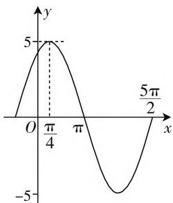
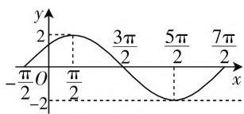
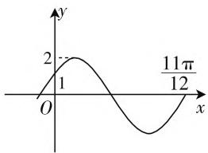
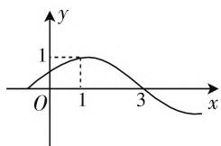
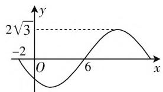

# 例谈函数 $y = A \sin (\omega x + \varphi)$ 的初相的确定

# ● 江苏省张家港高级中学 张惠

在三角函数问题中,经常会碰到由已知函数的图像求 $y = A \sin(\omega x + \varphi)$ 的解析式,其中初相 $\varphi$ 的确定是学习中的难点,又是高考中的热点,对此谈谈我对求初相法的认识.

题目 图1是函数 $y = A\sin (\omega x + \varphi)(A > 0,\omega >0,$ $|\varphi | <   \pi)$ 的一段图像，由图中条件，写出该函数解析式.

错解:由图1知, $A=5,\frac{T}{2}=\frac{5\pi}{2}-\pi=\frac{3\pi}{2}$ ，得 $T=3\pi$ ，所以

line

| x | y |
|---|---|
| 0 | 0 |
| π/4 | 5 |
| π | 0 |
| 5π/2 | -5 |

图1

$\omega=\frac{2\pi}{T}=\frac{2}{3}$ ，从而 $y=5\sin\left(\frac{2}{3}x+\varphi\right)$ 。将 $(\pi,0)$ 代入该式得 $5\sin\left(\frac{2}{3}\pi+\varphi\right)=0$ ，则得 $\frac{2}{3}\pi+\varphi=k\pi,\varphi=k\pi-\frac{2}{3}\pi(k\in\mathbf{Z})$ 。因为 $|\varphi|<\pi$ ，所以 $\varphi=-\frac{2\pi}{3}$ 或 $\varphi=\frac{\pi}{3}$ 。所以 $y=5\sin\left(\frac{2}{3}x-\frac{2\pi}{3}\right)$ 或 $y=5\sin\left(\frac{2}{3}x+\frac{\pi}{3}\right)$ 。

分析:由题意知,点 $\left(\frac{\pi}{4},5\right)$ 在此函数的图像上,但在 $y=5\sin\left(\frac{2}{3}x-\frac{2\pi}{3}\right)$ 中,令 $x=\frac{\pi}{4}$ ,则 $y=5\sin\left(\frac{2}{3}\times\frac{\pi}{4}-\frac{2\pi}{3}\right)=-5$ ,由此, $y=5\sin\left(\frac{2}{3}x-\frac{2\pi}{3}\right)$ 不合题意.

那么问题出在哪里呢？我们知道，已知三角函数值求角，在一个周期内一般总有两个解，只有在限定的范围内才能得出唯一解。换言之，函数 $y = \sin x$ 在一个周期内的零点不唯一，这是引起增根的根本原因。显然，函数 $y = \sin x$ 在一个周期内的最大（小）值点是唯一的。下面分类给出几种解法并提供相应训练供大家参考。

# 一、最值法

如果给定图像中的点有五个关键点中的最值点，则可以代入最值点坐标来确定初相.

解法1:由图像求出 $A, \omega$ 的过程此略. 将最高点坐标 $\left(\frac{\pi}{4}, 5\right)$ 代入 $5\sin\left(\frac{2}{3} \times \frac{\pi}{4} + \varphi\right) = 5$ , 得 $\frac{\pi}{6} + \varphi = 2k\pi + \frac{\pi}{2} (k \in \mathbf{Z}), \varphi = 2k\pi + \frac{\pi}{3} (k \in \mathbf{Z})$ . 因为 $|\varphi| < \pi$ , 所以 $\varphi = \frac{\pi}{3}$ , 所以取 $y = 5\sin\left(\frac{2}{3}x + \frac{\pi}{3}\right)$ .

训练1 已知函数 $f(x) = A\sin (\omega x + \varphi)(A > 0, \omega > 0, |\varphi| \leqslant \frac{\pi}{2})$ 在一个周期内的图像（如图2所示），求直线 $y = \sqrt{3}$ 与函数 $f(x)$ 图像的所有交点的坐标.

line

| x | y |
|---|---|
| -π/2 | 0 |
| π/2 | 2 |
| 3π/2 | 0 |
| 5π/2 | -2 |
| 7π/2 | 0 |

图2

解析:由图2知, $A=2,T=\frac{7\pi}{2}-\left(-\frac{\pi}{2}\right)=4\pi,\omega=\frac{1}{2}$ ，所以 $f(x)=2\sin\left(\frac{1}{2}x+\varphi\right)$ 。因为图像经过最高点 $\left(\frac{\pi}{2},2\right),2\sin\left(\frac{1}{2}\times\frac{\pi}{2}+\varphi\right)=2$ ，所以 $\frac{1}{2}\times\frac{\pi}{2}+\varphi=2k\pi+\frac{\pi}{2},k\in\mathbf{Z}$ ，所以 $\varphi=2k\pi+\frac{\pi}{4},k\in\mathbf{Z}$ 。又 $|\varphi|\leqslant\frac{\pi}{2},\varphi=\frac{\pi}{4},f(x)=2\sin\left(\frac{1}{2}x+\frac{\pi}{4}\right)$ 。

由题意, 得 $\sqrt{3}=2\sin\left(\frac{1}{2}x+\frac{\pi}{4}\right)$ , $\frac{1}{2}x+\frac{\pi}{4}=\frac{\pi}{3}+2k\pi$ 或 $\frac{2\pi}{3}+2k\pi (k\in\mathbf{Z})$ , 所以 $x=\frac{\pi}{6}+4k\pi$ 或 $x=\frac{5\pi}{6}+4k\pi (k\in\mathbf{Z})$ , 所以交点坐标为 $\left(\frac{\pi}{6}+4k\pi,\sqrt{3}\right)$ 或 $\left(\frac{5\pi}{6}+4k\pi,\sqrt{3}\right) (k\in\mathbf{Z})$ .

# 二、五点法

如果图像给出的点中有关键点,则可以通过结合五点法来确定 $\varphi$ . 此类问题,解题的关键是从图像特征

入手,寻找解题突破口.

解法 2:A 和 $\omega$ 的求解过程此略. 函数 $y = A \sin(\omega x + \varphi) (A > 0, \omega > 0)$ 的图像一般由“五点法”作出, 所以可以将 $\omega x + \varphi$ 与五点法中的具体的点联系起来, 由图像得 $\frac{2\pi}{3} + \varphi = \pi$ , 所以 $\varphi = \frac{\pi}{3}$ , 所以 $y = 5 \sin\left(\frac{2}{3}x + \frac{\pi}{3}\right)$ .

训练 2 如图 3 所示, 函数 $y = 2 \sin(\omega x + \varphi)$ $\left(|\varphi| < \frac{\pi}{2}\right)$ 的图像, 则 $\varphi =$ \_\_\_\_ .

line

| x | y |
|---|---|
| 0 | 2 |
| 1 | 2 |
| 12 | 11π/12 |

图3

略解:由已知易得 A=2，而函数图像过(0,1)和 $\left(\frac{11\pi}{12},0\right)$ ，再考虑到 $\left|\varphi\right|<\frac{\pi}{2}$ ，所以 $\omega\cdot\frac{11}{12}\pi+\varphi=2\pi$ ， $2\sin(0\cdot\omega+\varphi)=1$ ，所以 $\omega=2,\varphi=\frac{\pi}{6}$ .

# 三、单调性法

解法3:由图像求出A和 $\omega$ 的过程此略.因为点 $(\pi,0)$ 在单调递减的那段曲线上，所以 $\frac{2}{3}\pi+\varphi\in\left[\frac{\pi}{2}+2k\pi,\frac{3\pi}{2}+2k\pi\right](k\in\mathbf{Z})$ ，由 $\sin\left(\frac{2}{3}\pi+\varphi\right)=0$ ，得 $\frac{2}{3}\pi+\varphi=2k\pi+\pi(k\in\mathbf{Z})$ ，所以 $\varphi=2k\pi+\frac{1}{3}\pi(k\in\mathbf{Z})$ .因为 $|\varphi|<\pi$ ，所以 $\varphi=\frac{\pi}{3}$ .所以 $y=5\sin\left(\frac{2}{3}x+\frac{\pi}{3}\right)$ .

训练3 函数 $y = \sin (\omega x + \varphi) (x \in \mathbf{R}, \omega > 0, 0 \leqslant \varphi < 2\pi)$ 的部分图像如图4所示，则 $\omega =$ ， $\varphi =$ \_\_\_\_.

line

| x | y |
|---|---|
| 0 | 0 |
| 1 | 1 |
| 3 | 0 |

图4

解析:由图4知, $\frac{T}{4}=3-1=2$ ,所以 $T=8,\omega=\frac{2\pi}{T}=\frac{\pi}{4}$ .因为点(3,0)是在函数 $y=\sin\left(\frac{\pi}{4}x+\varphi\right)$ 的单调

递减的那段曲线上，所以 $3 \times \frac{\pi}{4} + \varphi \in \left[2k\pi + \frac{\pi}{2}, 2k\pi + \frac{3\pi}{2}\right], (k \in \mathbf{Z})$ ，因此 $\frac{3\pi}{4} + \varphi = 2k\pi + \pi, \varphi = 2k\pi + \frac{\pi}{4}, (k \in \mathbf{Z}).$ 因为 $0 \leqslant \varphi < 2\pi$ ，所以令 $k = 0$ ，得 $\varphi = \frac{\pi}{4}$ .

就算题目所给图像给定的点不是五个关键点中的任何一个,这种用函数的单调性确定 $\varphi$ 的方法依然非常有效.

# 四、平移法

当然如果图像给定的点是五个关键点中的非最值点,那么还可以通过平移法来确定 $\varphi$ .

解法 4: A 和 $\omega$ 的求解过程此处从略. 已经有 $y = 5\sin\left(\frac{2}{3}x + \varphi\right)$ ，通过图像可以看出它是由 $y = 5\sin\frac{2}{3}x$ 向左平移了 $\frac{\pi}{2}$ 个单位，所以 $y = 5\sin\frac{2}{3} \cdot \left(x + \frac{\pi}{2}\right) = 5\sin\left(\frac{2}{3}x + \frac{\pi}{3}\right)$ .

训练 4 根据图 5 写出函数 $f(x)=A\sin(\omega x+\varphi)(A>0,\omega>0)$ 的表达式.

line

| x | y |
|---|---|
| 0 | -2 |
| 6 | 2√3 |

图5

略解: $A=2\sqrt{3},\frac{T}{2}=6-(-2)=8$ ,所以T=16, $\omega=\frac{\pi}{8}$ ，所以 $f(x)=2\sqrt{3}\sin\left(\frac{\pi}{8}x+\varphi\right)$ .

又 $f(x)$ 的图像可由函数 $y = 2\sqrt{3}\sin \left(\frac{\pi}{8} x\right)$ ，向右平移6个单位，所以 $f(x) = 2\sqrt{3}\sin \left[\frac{\pi}{8}(x - 6)\right] = 2\sqrt{3}\sin \left(\frac{\pi}{8} x - \frac{3\pi}{4}\right)(k\in \mathbf{Z})$

从以上求初相的方法中可以体会到，函数 $y = A\sin (\omega x + \varphi)$ 与 $y = \sin x$ 有着紧密的联系， $y = A\sin (\omega x + \varphi)$ 的性质正是在 $y = \sin x$ 基础上用整体代换的思想延伸推广而来。因此研究 $y = A\sin (\omega x + \varphi)$ 时不能将 $y = \sin x$ 丢在一边。教学中和学生一起应用不同方法，感受各种方法的异同，可以提高学生学习兴趣，开拓学生眼界，更能让学生从不同角度理解和掌握函数 $y = \sin x$ 的性质，增强学生知识的迁移与拓展的能力。W