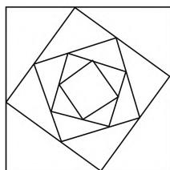
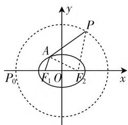

# 借助概念应用,培养数学抽象

# ● 江苏省海门市证大中学 丁伙健

数学抽象作为《普通高中数学课程标准(2017年版)》一书在“课程基本理念”中创新性地提出六大“数学学科核心素养”之一，是除去事物的一切物理属性后所得到的数学研究对象的思维过程与素养，主要涉及从数量关系、图形关系等中抽象出数学概念的关系、规律和结构等。而数学概念往往揭示了相关事物之间的数量、规律、结构、空间形式等关系的本质属性，因而成为培养与提升学生的数学抽象素养的一个重要环节。

借助数学概念,巧妙从具体事物中区分、抽象出研究对象的本质特征,进行合理的抽象概括,进而认识和理解所研究的对象,形成数学知识,得以分析与解决相应的数学问题.数学概念完全离不开数学抽象的思维过程,两者联系密切.

# 一、逻辑推理

在破解一些数学问题时,借助逻辑推理,实现数量关系、等式关系、图形关系等与数学概念之间的有机联系,利用数学概念的应用来分析与求解相应的数学问题,真正提高学生的核心素养.

例 1 （湖南省长沙市雅礼中学 2020 届高三月考试卷(七)数学理科·16）定义在实数集 R 上的偶函数 $f(x)$ 满足 $f(x+2)=2+\sqrt{4f(x)-f^{2}(x)}$ ，则 $f(2021)=$ \_\_\_\_.

分析:根据题目条件,合理逻辑推理,根据偶函数的性质得到 $f(-x)=f(x)$ , 结合根式递推式的特征代入得到代数递推式 $f(-x+2)=f(x+2)$ , 进而利用代数递推式来确定函数的周期性, 并结合条件确定 $f(1)$ 的值, 从而得以函数值的求解.

解析:由于函数 $f(x)$ 是定义在实数集 R 上的偶函数, 可得 $f(-x)=f(x)$ , 结合 $f(x+2)=2+\sqrt{4f(x)-f^{2}(x)}$ , 可得 $f(-x+2)=2+\sqrt{4f(-x)-f^{2}(-x)}=2+\sqrt{4f(x)-f^{2}(x)}=f(x+2)$ , 则有 $f(x+4)=f(x+2+2)=f[-(x+2)+2]=f(-x)=f(x)$ , 则知函数 $y=f(x)$ 是周期为 4 的周期函数, 而 $f(-1+2)=2+\sqrt{4f(-1)-f^{2}(-1)}$ , 即 $f(1)=2+\sqrt{4f(1)-f^{2}(1)}$ , 整理可得 $f^{2}(1)-$ $4f(1)+2=0$ , 解得 $f(1)=2\pm\sqrt{2}$ . 又 $f(x+2)=2+\sqrt{4f(x)-f^{2}(x)}\geqslant2$ , 则有 $f(1)=2+\sqrt{2}$ , 所以 $f(2021)=f(505\times4+1)=f(1)=2+\sqrt{2}$ .

故填 $2 + \sqrt{2}$

# 二、参数引入

在破解一些数学问题中,借助参数引入,利用条件以及合理的逻辑推理与运算转化,可以建立参数之间的关系,得以满足相应的数学概念,再借助数学的相关概念加以合理推理与应用,真正提高学生的核心素养.

例 2 （2020 届湖北省黄冈市八模高考数学模拟试卷文科·10）如图 1，方格蜘蛛网是由一族正方形环绕而成的图形。每个正方形的四个顶点都在其外接正方形的四边上，且分边长为 3:4。现用 13 米长的铁丝材料制作一个方格蜘蛛网，若最外边的正方形边长为1米,由外到内顺序制作,则完整的正方形的个数最多为().(参考数据: $\lg\frac{7}{5}\approx0.15$ )

natural_image

Geometric pattern of nested squares forming a spiral (no text or symbols)

图1

A.6个 B.7个 C.8个 D.9个

分析:根据题目条件,合理引入参数,根据信息建立相应的关系式,进而结合等比数列的概念以抽象概括,构建等比数列,再通过等比数列的求和以及不等式的求解来分析与应用.

解析:依题意,设外层正方形的边长为 a, 其内接小正方形的边长为 b, 则 $b = \sqrt{\left(\frac{3}{7}a\right)^{2} + \left(\frac{4}{7}a\right)^{2}} = \frac{5}{7}a$ , 故每个小正方形的周长为其外接正方形周长的 $\frac{5}{7}$ , 即方格蜘蛛网的正方形的周长由外到内组成一个以 4 为首项, 以 $\frac{5}{7}$ 为公比的等比数列, 设为 $\{a_{n}\}$ , 其前 n 项和为 $S_{n}$ , 则 $S_{n} = \frac{4\left[1 - \left(\frac{5}{7}\right)^{n}\right]}{1 - \frac{5}{7}} \leqslant 13$ , 整理可得

$\left(\frac{5}{7}\right)^n \geqslant \frac{1}{14}$ , 所以 $n \leqslant \frac{\lg \frac{1}{14}}{\lg \frac{5}{7}} = \frac{\lg 14}{\lg \frac{7}{5}} = \frac{\lg 2 + \lg 7}{\lg \frac{7}{5}} =$ $\frac{1 - \lg 5 + \lg 7}{\lg \frac{7}{5}} = \frac{1 + \lg \frac{7}{5}}{\lg \frac{7}{5}} \approx \frac{1 + 0.15}{0.15} \approx 7.67$ ，即完整的正方形的个数最多为7个.

故选 B.

# 三、形象思维

在破解一些数学问题中,借助形象思维,有效转化相应的数学概念,使得抽象问题形象化,增强数形直观,方便寻找问题的突破口与切入点,掌握本质属性,有效认知学科知识,真正提高学生的核心素养.

例 3 （广东省深圳市 2020 年普通高中高三年级线上统一测试(文科)数学·16）设椭圆 $C: \frac{x^{2}}{a^{2}} + \frac{y^{2}}{b^{2}} = 1 (a > b > 0)$ 的左、右焦点分别为 $F_{1}, F_{2}$ ，其焦距为 2c，O 为坐标原点，点 P 满足 $|OP| = 2a$ ，点 A 是椭圆 C 上的动点，且 $|PA| + |AF_{1}| \leqslant 3 |F_{1}F_{2}|$ 恒成立，则椭圆 C 离心率的取值范围是 \_\_\_\_.

分析:根据题目条件,通过形象思维,利用椭圆的定义的相关概念,以及三角形的基本性质,数形巧妙结合,形象直观来分析与处理,从而实现不等式恒成立转化为相应的最值问题的目的.

解析: 如图 2 所示, 连接 $AF_{2}, PF_{2}$ , 设 $P_{0}(-2a,0)$ , 由于点 P 满足 $|OP|=2a$ , 可得点 P 的轨迹是以坐标原点 O 为圆心, 2a 为半径的圆.

text_image

y
P
A
F₁ O F₂ x
P₀

图2

由于 $|PA| + |AF_1| \leqslant$ 3 $\left|F_{1}F_{2}\right|$ 恒成立，可得 $\left(\left|PA\right|+\left|AF_{1}\right|\right)_{\max}\leqslant$ 3 $\left|F_{1}F_{2}\right|=6c$ ，根据椭圆的定义可知 $\left|AF_{1}\right|+\left|AF_{2}\right|=2a$ ，结合三角形的基本性质，可得 $\left|PA\right|+\left|AF_{1}\right|=\left|PA\right|+2a-\left|AF_{2}\right|=\left|PA\right|-\left|AF_{2}\right|+2a\leqslant\left|PF_{2}\right|+2a$ ，当且仅当P，A， $F_{2}$ 三点共线时等号成立。又 $\left|PF_{2}\right|\leqslant\left|P_{0}F_{2}\right|=2a+c$ ，所以 $\left(\left|PA\right|+\left|AF_{1}\right|\right)_{\max}=2a+c+2a=4a+c$ ，当且仅当P与 $P_{0}$ 重合且A位于椭圆C的右顶点时等号成立，则有 $4a+c\leqslant6c$ ，即 $e=\frac{c}{a}\geqslant\frac{4}{5}$ 。又由椭圆离心率的性质知，0<e<1，所以 $\frac{4}{5}\leqslant e<1$ 。

故填 $\left[\frac{4}{5},1\right)$ .

# 四、知识迁移

在破解一些数学问题中,借助知识迁移,利用数学概念及其应用,可以合理构建不同知识之间的信息沟通,正确转化,把较为陌生的概念与知识转化为熟悉的概念与知识,再加以巧妙处理与应用,真正提高学生的核心素养.

例 4 （2020 届贵州省贵阳一中高考适应性月考理科数学 · 16）已知平面单位向量 $e_{1}, e_{2}$ 的夹角为 $60^{\circ}$ ，向量 c 满足 $c^{2} - (2e_{1} + e_{2}) \cdot c + \frac{3}{2} = 0$ ，若对任意的 $t \in R$ ，记 $|c - te_{1}|$ 的最小值为 M，则 M 的最大值为 \_\_\_\_.

分析:根据题目条件,合理迁移知识,把对应的平面向量问题转化为平面解析几何问题,进而利用平面向量的模的概念与圆的概念加以合理转化与迁移,利用圆上的点到直线的距离关系来确定相应的最值问题.

解析:建立平面直角坐标系,设 $e_{1}=(1,0)$ , $e_{2}=\left(\frac{1}{2},\frac{\sqrt{3}}{2}\right)$ , $c=(x,y)$ , 由 $c^{2}-(2e_{1}+e_{2})\cdot c+\frac{3}{2}=0$ , 可得 $x^{2}+y^{2}-\left(\frac{5}{2}x+\frac{\sqrt{3}}{2}y\right)+\frac{3}{2}=0$ , 配方可得 $\left(x-\frac{5}{4}\right)^{2}+\left(y-\frac{\sqrt{3}}{4}\right)^{2}=\frac{1}{4}$ , 它表示以点 $\left(\frac{5}{4},\frac{\sqrt{3}}{4}\right)$ 为圆心, $r=\frac{1}{2}$ 为半径的圆, 而 $\left|c-te_{1}\right|=\sqrt{(x-t)^{2}+y^{2}}$ 表示圆上的点 $C(x,y)$ 到点 $(t,0)(t\in\mathbf{R})$ 的距离, 那么 $\left|c-te_{1}\right|$ 的最小值 M 即表示圆上的点 $C(x,y)$ 到直线 y=0 的距离, 而圆心 $\left(\frac{5}{4},\frac{\sqrt{3}}{4}\right)$ 到直线 y=0 的距离为 $d=\frac{\sqrt{3}}{4}$ , 那么 M 的最大值为 $d+r=\frac{\sqrt{3}+2}{4}$ .

故填 $\frac{\sqrt{3}+2}{4}$ .

数学概念是贯穿整个高中数学学习的一条主要链条,借助数学概念应用,抽象出数学概念、命题、方法和体系等一系列过程,进而形成高度概括、准确表达的数学知识,从具体到抽象,从一般到特殊,有效把握事物本质,以简驭繁,形成理性思维,把握数学本质特征.在新课标指引下,巧妙借助数学概念的应用,通过不同角度的教学实践与经验交流,形成有效成果,培养数学抽象,增强品质,培养素养,共同提高.W