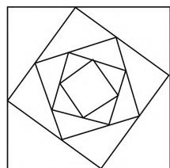

# 借助高三复习课堂,落实数学核心素养

山东省垦利第一中学 曹 红

众所周知，高三数学复习课的质量是高中数学课堂教学研究的一个非常重要的课题，备受关注。提高数学课堂复习质量的要素很多，而其中的一个关键点就在于数学复习课的定位要准确，与学生的复习产生共振，不仅要在有限的课堂教学中告诉学生如何破解问题，还要把课堂教学的落脚点放在数学思维过程的揭示与数学核心素养的落实上。通过典型问题的选取，从如何理解问题，如何切入问题，如何寻找解决问题的方法，以及如何充分展示方法背后的思维价值与核心素养等方面提高高三复习课堂质量。

# 一、整体把握数学课程

作为一个有机而统一整体的高中数学课程,要充分理解数学课程的理念与性质、目标定位、内容结构、知识体系等,进而整体设计并实施高三数学的复习教学.在实际高三复习课堂中,通过整体把握数学课程,抓住数学本质,凸显数学知识的网络体系与脉络,弄清数学研究问题的方法与思维,从而在更深层次上充分把握与理解数学.

例 1 （2019 年天津卷文、理科第 14 题）在四边形 ABCD 中， $AD \parallel BC, AB = 2\sqrt{3}, AD = 5, \angle A = 30^{\circ}$ ，点 E 在线段 CB 的延长线上，且 AE = BE，则 $\overrightarrow{BD} \cdot \overrightarrow{AE} =$ \_\_\_\_.

分析:以平面四边形为几何背景,通过相应的边角关系,进而来求解对应向量的数量积的值.结合数学课程可知该问题入口宽,方法多,可以从多个角度多种方法来处理,有效考查直观想象能力、逻辑推理能力、化归与转化思想以及数形结合思想等.

解析:由于 $AD \parallel BC, AE = BE, \angle A = 30^{\circ}$ ，则在等腰三角形 ABE 中，有 $\angle AEB = 120^{\circ}$ ，结合 AB = $2\sqrt{3}$ ，可得 AE = 2，而 $AD \parallel BC, AD = 5$ ，则有 $\overrightarrow{BE} = -\frac{2}{5}\overrightarrow{AD}$ ，那么 $\overrightarrow{AE} = \overrightarrow{AB} + \overrightarrow{BE} = \overrightarrow{AB} - \frac{2}{5}\overrightarrow{AD}$ ，所以 $\overrightarrow{BD} \cdot \overrightarrow{AE} = (\overrightarrow{AD} - \overrightarrow{AB}) \cdot \left( \overrightarrow{AB} - \frac{2}{5}\overrightarrow{AD} \right) = \frac{7}{5}\overrightarrow{AB} \cdot \overrightarrow{AD} - \overrightarrow{AB^{2}} - \frac{2}{5}\overrightarrow{AD^{2}} = \frac{7}{5} \times 2\sqrt{3} \times 5 \times \cos30^{\circ} -$

$$
(2 \sqrt {3}) ^ {2} - \frac {2}{5} \times 5 ^ {2} = - 1.
$$

故填-1.

点评:其实,破解此类平面向量的数量积问题的主要策略有以下几种:一是从平面几何入手,利用基底的选取,借助平面向量的线性运算的转化,结合数量积的定义来求解;二是从平面几何入手,通过垂直的应用,利用平面向量数量积的几何意义来转化与求解;三是从平面解析几何入手,通过建立对应的平面直角坐标系,通过坐标运算,达到几何问题代数化来处理;四是从平面几何入手,通过中点的选取,利用极化恒等式来简化,从而得以解决.关键是整体掌握数学课程,利用数学课程的相关知识,多层面、多角度来处理.

# 二、注重引导学生思维

在高三数学复习教学中，紧紧抓住数学课程目标，强调发展学生的发现问题、提出问题、分析问题和解决问题的能力，在数学问题的解决过程中充分落实数学核心素养。在高三数学复习过程中，教师要引导学生充分分析观察、理解问题，在此基础上提出猜想、逻辑推理等，进而得以破解。这个过程，充分经历了数学概念的形成过程，数学规律的发现过程，以及数学问题的解决过程，从而得以不断积累和总结破解数学问题的经验、方法等，充分感悟数学思想方法，养成数学核心素养，切实体验严谨求实的科学态度和探究真理的科学精神。

例 2 （2019 年全国卷Ⅲ文科第 10 题）已知 F 是双曲线 $C: \frac{x^{2}}{4} - \frac{y^{2}}{5} = 1$ 的一个焦点，点 P 在 C 上，O 为坐标原点。若 $|OP| = |OF|$ ，则 $\triangle OPF$ 的面积为（）。

A. $\frac{3}{2}$

B. $\frac{5}{2}$

C. $\frac{7}{2}$

D. $\frac{9}{2}$

分析:破解本题时,可以利用点 P 的坐标的引入,结合坐标法来求解;也可以利用双曲线的定义,通过直角三角形的变换,结合平面几何知识来求解.

解析:依题意,可得 $a^{2}=4,b^{2}=5$ ,则 $c^{2}=a^{2}+b^{2}=9$ ,即c=3.设F为左焦点,则 $F(-3,0)$ ,由 $|OP|=|OF|$ ,结合对称性,可知点P有四个位置,但 $\triangle OPF$ 的面积是一样的,不失一般性,取点P在第一象限,根据 $|OP|=|OF|$ ,则以点O为圆心,以3为半径的圆的方程为 $x^{2}+y^{2}=9$ .

联立 $\left\{ \begin{array}{l} x^{2} + y^{2} = 9, \\ \frac{x^{2}}{4} - \frac{y^{2}}{5} = 1, \end{array} \right.$ 解得 $P\left(\frac{2\sqrt{14}}{3}, \frac{5}{3}\right)$ ，可得$\sin \angle POF = \frac{\frac{5}{3}}{c} = \frac{5}{9}$ 所以 $\triangle OPF$ 的面积 $S = \frac{1}{2} |OF| \cdot |OP|\sin \angle POF = \frac{1}{2} \times 3 \times 3 \times \frac{5}{9} = \frac{5}{2}$ .

故选 B.

点评:合理引导学生对问题加以正确破解,并在此基础上,引导学生利用其他方法,比如双曲线的定义法等来处理.深入思考,随着双曲线方程的改变,其三角形的面积是否是一个定值问题呢?对于椭圆问题是否也有类似的定值问题呢?从而可以得到以下两个相应的结论:

结论 1: 已知 F 是双曲线 $C: \frac{x^{2}}{a^{2}} - \frac{y^{2}}{b^{2}} = 1 (a > 0, b > 0)$ 的一个焦点，点 P 在 C 上，O 为坐标原点。若 $|OP| = |OF|$ ，则 $\triangle OPF$ 的面积为定值 $\frac{1}{2} b^{2}$ 。

结论2:已知F是椭圆 $C:\frac{x^{2}}{a^{2}}+\frac{y^{2}}{b^{2}}=1(a\geqslant\sqrt{2}b>0)$ 的一个焦点,点P在C上,O为坐标原点.若 $|OP|=|OF|$ ,则 $\triangle OPF$ 的面积为定值 $\frac{1}{2}b^{2}$ .

# 三、适当增加数学建模

数学教学是一种在数学文化背景下的思维活动，其是以数学知识为核心的一种文化教学活动。对于一些数学史与数学建模等方面的教学，可以有效回归数学知识的发现、发展与应用的整体过程，充分体现理解问题，切入问题，科学建模，寻找破解问题的方法等这一系列过程，不仅是数学知识与数学思维交汇与融合程度的综合体现，又能充分引导学生多读书、多思考、多总结，对于提高学生的数学素质与核心素养有很大的效果。

例 3 （2020 届湖北省黄冈市八模高考数学模拟试卷文科·10）如图 1，方格蜘蛛网是由一族正方形环绕而成的图形。每个正方形的四个顶点都在其外接正方形的四边上，且分边长为 3:4。现用 13 米长的铁丝材料制作一个方格蜘蛛网，若最外边的正方形边长为1米，由外到内顺序制作，则完整的正方形的个数最多为（ ）.（参考数据： $\lg\frac{7}{5}\approx0.15$ ）

A. 6 个

B. 7 个

C. 8 个

D. 9 个

natural_image

Geometric pattern of nested squares forming a spiral (no text or symbols)

图1

分析:借助“方格蜘蛛网”进行数学建模,以平面几何为背景,结合正方形的周长之间的关系设置等比数列模型,通过学生的观察、归纳、猜想,并利用等比数列的相关知识来分析与破解问题,充分考查逻辑推理以及数学运算能力.

解析:依题意,设外层正方形的边长为a,其内接小正方形的边长为b,则 $b\sqrt{\left(\frac{3}{7}a\right)^{2}+\left(\frac{4}{7}a\right)^{2}}=\frac{5}{7}a$ ,故每个小正方形的周长为其外接正方形周长的 $\frac{5}{7}$ ,即方格蜘蛛网的正方形的周长由外到内组成一个以4为首项,以 $\frac{5}{7}$ 为公比的等比数列,设为 $\{a_{n}\}$ ,其前n项和为 $S_{n}$ ,则 $S_{n}=\frac{4\left[1-\left(\frac{5}{7}\right)^{n}\right]}{1-\frac{5}{7}}\leqslant13$ ,整理可得 $\left(\frac{5}{7}\right)^{n}\geqslant\frac{1}{14}$ ,所以 $n\leqslant\frac{\lg\frac{1}{14}}{\lg\frac{5}{7}}=\frac{\lg14}{\lg\frac{7}{5}}=\frac{\lg2+\lg7}{\lg\frac{7}{5}}=$

$\frac{1-\lg5+\lg7}{\lg\frac{7}{5}}=\frac{1+\lg\frac{7}{5}}{\lg\frac{7}{5}}\approx\frac{1+0.15}{0.15}\approx7.67$ , 即完整的正方形的个数最多为7个, 故选择答案: B.

点评:根据题目条件,通过合理的数学建模,严格按照等比数列的定义加以操作,通过计算找到方格蜘蛛网的正方形的周长由外到内组成一个等比数列,思维比较严谨,利用等比数列的求和、指数运算与对数运算等的合理应用,数学运算难度不大.

高三数学复习课堂的定位要以数学问题为载体，通过数学知识的主线贯通，不断提高学生分析问题、理解问题的思维能力和解决数学问题的能力，真正能够从数学思想、数学观点上启发和引导学生思考数学问题，进而达到有效的数学抽象、直观想象以及数学建模，合理的逻辑推理与数学运算以及数据分析等，进而得以解决问题. F