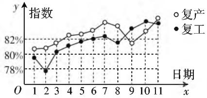

# 发挥学科特色，“战疫”科学入题

● 江苏省靖江市第一高级中学 郭剑

# 一、揭示传播规律，倡导科学防控

借助科学的数学模型来形象直观地揭示病毒传播初始阶段、疫情遏制阶段等不同阶段病毒传播的一般规律，使得我们更为直接地了解新冠肺炎疫情的传播规律，探索科学的防控措施。

# 1. 传播初级阶段

在流行病科学研究中,科学的观点就是在病毒流行与传播的初始阶段且没有人工干预的情况下,流行病毒的感染人数会呈指数级数增长.

2020 年高考数学新高考卷 I（山东卷）第 6 题的问题设置就是基于新冠肺炎疫情初始阶段的传播规律研究的具体成果而合理设计的，借助流行病学的基本参数，通过统计数学模型来描述一定时期内累计感染病例数随着时间的变化规律，有效考查对应的数学知识，以及从相关资料中分析、提取信息的能力，突出数学模型的实际应用.

例 1 （2020 年高考数学新高考卷 I（山东卷）第 6 题）基本再生数 $R_{0}$ 与世代间隔 T 是新冠肺炎的流行病学基本参数。基本再生数指一个感染者传染的平均人数，世代间隔指相邻两代间传染所需的平均时间。在新冠肺炎疫情初始阶段，可以用指数模型： $I(t) = e^{rt}$ 描述累计感染病例数 $I(t)$ 随时间 t（单位：天）的变化规律，指数增长率 r 与 $R_{0}, T$ 近似满足 $R_{0} = 1 + rT$ 。有学者基于已有数据估计出 $R_{0} = 3.28, T = 6$ 。据此，在新冠肺炎疫情初始阶段，累计感染病例数增加 1 倍需要的时间约为 $(\ln 2 \approx 0.69)$ （）。

A. 1.2 天 B. 1.8 天 C. 2.5 天 D. 3.5 天

分析:结合指数增长率 r 与 $R_{0}$ , T 近似满足的关系式, 并结合已有数据来确定参数 r 的值, 结合指数模型建立方程, 通过代数恒等变形以及对数运算等来确定相应的参数的值, 进而作出对应的预测.

解析: 将 $R_{0}=3.28, T=6$ 代入 $R_{0}=1+rT$ ，可得 $3.28=1+6r$ ，解得 r=0.38，根据条件可知 $e^{0.38t}=2$ ，两边取自然对数，有 $0.38t=\ln2\approx0.69$ ，所以 $t\approx1.8$ 天。故选 B.

点评:结合题目条件中相关的阅读材料,结合公共卫生学科中有关新冠肺炎疫情的累计感染病例数 $I(t)$ 随时间t的变化规律的指数模型以及相应的近似关系式的建立，通过已有数据的估计加以分析与预测，为进一步的判断与决策提供理论依据，有效服务社会的公共卫生领域.

# 2. 遏制疫情阶段

在严格科学防控措施下,疫情将得以有效遏制.2020年高考数学全国卷Ⅲ文、理科第4题的问题设置就是基于新冠肺炎疫情传播的动态研究为背景来设计,借助Logistic模型来巧妙设置试题,适合学生知识水平与能力,同时结合函数模型的建立、应用来确定初步遏制疫情的相关参数,在很好地考查学生理解与掌握指数函数基础知识的前提下,进一步考查学生使用数学模型解决实际应用问题的能力.

例 2 （2020 年全国卷Ⅲ文、理科第 4 题）Logistic 模型是常用数学模型之一，可应用于流行病学领域。有学者根据公布数据建立了某地区新冠肺炎累计确诊病例数 $I(t)$ (t 的单位：天) 的 Logistic 模型: $I(t) = \frac{K}{1 + e^{-0.23(t-53)}}$ ，其中 K 为最大确诊病例数。当 $I(t^{*}) = 0.95K$ 时，标志着已初步遏制疫情，则 $t^{*}$ 约为 $(\ln 19 \approx 3)$ 。

A.60 B.63 C.66 D.69

分析:结合某地区新冠肺炎累计确诊病例数 $I(t)$ 的 Logistic 模型的函数关系式,并利用已初步遏制疫情时函数值来建立关系式,通过代数恒等变形以及对数运算等来确定相应的参数的值.

解析:由题可知 $\frac{K}{1+\mathrm{e}^{-0.23(t-53)}}=0.95K$ ，整理可得 $e^{-0.23(t-53)}=\frac{1}{19}$ ，两边取自然对数，有 $-0.23(t-53)=-\ln19\approx-3$ ，解得 $t\approx66$ 。故选C。

点评: 正确阅读并理解题目条件中的 Logistic 模型及其应用, 根据医疗卫生学科中流行病学领域的相关知识以及对应的函数关系式, 结合已初步遏制疫情这一确定的函数值, 综合起来建立满足条件的方程, 利用方程的转化、对数的运算与方程的求解, 进而得以解决相应的数学应用问题.

# 二、发扬志愿精神，统筹后期保障

疫情期间，除了一线医务工作者的辛勤工作外，还有大量的志愿者在各自岗位上默默无闻地工作着，为疫情的有效防控与后期保障奠定基础。

根据需求合理调控是一项科学而繁重的任务. 2020年高考数学全国卷Ⅱ理科第3题(文科第4题)的问题设置就是基于志愿者参加某超市配货工作为背景而设计的需求调控问题, 对类似社会需求调控有类比与推广价值. 试题以发生在学生身边的真实事例为载体, 熟知度高, 切入自然, 亲切感强, 对学生稳定考试心态, 引导学生深入了解试题以及提高获得感等都有良好的作用.

例 3 （2020 年全国卷 II 理科第 3 题，文科第 4 题）在新冠肺炎疫情防控期间，某超市开通网上销售业务，每天能完成 1200 份订单的配货，由于订单量大幅增加，导致订单积压。为解决困难，许多志愿者踊跃报名参加配货工作。已知该超市某日积压 500 份订单未配货，预计第二天的新订单超过 1600 份的概率为 0.05，志愿者每人每天能完成 50 份订单的配货，为使第二天完成积压订单及当日订单的配货的概率不小于 0.95，则至少需要志愿者（）。

A. 10 名

B. 18 名

C. 24 名

D. 32 名

分析:先根据题目条件计算出第二天新增的订单数,结合志愿者每天能完成的订单配货数建立相应的不等式,通过不等式的求解即可确定至少需要的志愿者数.

解析:由题意,第二天新增订单数为 $500 + 1600 - 1200 = 900$ 份,设需要志愿者 x 名,则有 $\frac{50x}{900} \geqslant 0.95$ , 解得 $x \geqslant 17.1$ , 即至少需要志愿者 18 名. 故选 B.

点评:此题也可以直接计算:第二天的新订单超过1600份的概率为0.05,就按1600份计算,第二天完成积压订单及当日订单的配货的概率不小于0.95就按1200份计算,因为公司可以完成配货1200份订单,则至少需要志愿者为 $\frac{500+1600-1200}{50}=18$ 名.

# 三、展示中国成果，推进复工复产

我国在疫情防控基本进入常态化后，各地按防控要求高标准、全面、有序地推进复工复产复学等。2020年高考数学新高考卷Ⅱ（海南卷）第9题的问题设置就是基于复工复产为问题背景来巧妙设置，取材于真实数据，通过解读统计图表来分析复工复产情况，考查学生的统计知识与提取图表信息的能力等. 试题关注人民群众关切的国计民生, 借助数学中的复工复产指数折线图来充分展示中国的“战疫”成果.

例 4 （2020 年新高考卷 II（海南卷）第 9 题）我国新冠肺炎疫情防控进入常态化，各地有序推进复工复产，下面是某地连续 11 天复工复产指数折线图，下列说法正确的是（）.

line

| 日期 | 复产 (%) | 复工 (%) |
| ---- | -------- | -------- |
| 1    | 80       | 80       |
| 2    | 80       | 78       |
| 3    | 81       | 80       |
| 4    | 82       | 81       |
| 5    | 82       | 82       |
| 6    | 83       | 82       |
| 7    | 84       | 83       |
| 8    | 83       | 82       |
| 9    | 82       | 83       |
| 10   | 83       | 84       |
| 11   | 84       | 85       |

图1

A. 这 11 天复工指数和复产指数均逐日增加  
B. 这 11 天期间, 复产指数增量大于复工指数的增量  
C. 第 3 天至第 11 天复工复产指数均超过 80%  
D. 第 9 天至第 11 天复产指数增量大于复工指数的增量；

分析:通过复工和折线图中都有递减的部分来判断 A;根据第一天和第十一天两者指数差的大小来判断 B;根据图像结合复工复产指数的意义和增量的意义可判断 CD.

解析:由统计图可知,这11天的复工指数和复产指数有增有减,故选项A错;

由折线的变化程度可见这 11 天期间, 复产指数增量小于复工指数的增量, 故选项 B 错误;

第 3 天至第 11 天复工复产指数均超过 80%，故选项 C 正确；

第 9 天至第 11 天复产指数增量大于复工指数的增量,选项 D 正确;

故选 CD.

点评:通过折线图表示对函数的认知和理解,考查理解能力、识图能力、推理能力,难点在于指数增量的理解与观测.

通过相关的2020年高考数学试卷的实例分析，结合新冠肺炎疫情防控巧妙设置问题，发挥数学学科的特点，“战疫”科学入题，关注生活，关注民生，倡导时代主旋律，亲身体会新冠肺炎疫情的传播规律与防控措施，引导参加志愿者活动，科学复工复产复学等，关注数学科学育人的价值，贯彻全面育人的理念，充分发挥高考数学在深化中学课程改革与创新、引导中学数学课程实施、全现提高中学教育质量的引导和促进作用。F