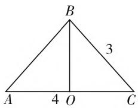
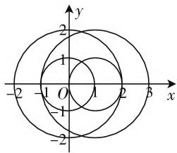

# 合理构造基本模型,凸显数学建模素养

● 江苏省句容高级中学 余飞

在解决一些数学问题时,经常借助构造适当的基本数学模型,有效建立起构造的数学模型与所求解的问题之间的联系,通过所构造的基本数学模型的破解,来达到解决原来相关问题的目的.合理构造基本数学模型,可以有效进行知识迁移,目的明确,技巧性强,优化过程,提升效益.下面结合2020年高考数学试题,就合理构造基本数学模型,借助数学建模,巧妙破解高考真题.

# 一、巧构函数模型

函数模型是数学中最基本的模型之一, 是高中数学的一条主线. 合理地构造相应的函数模型, 对于巧妙破解相关的函数、不等式、数列等问题都有奇效. 在处理函数的性质与图像、函数值的大小比较等问题中, 经常通过巧妙构造函数模型来直接处理, 更加直接有效.

例 1 （2020 年高考数学全国卷 I 理科第 12 题）若 $2^{a} + \log_{2}a = 4^{b} + 2\log_{4}b$ ，则（）.

$$
\mathrm{A.} a > 2 b \quad \mathrm{B.} a <   2 b \quad \mathrm{C.} a > b ^ {2} \quad \mathrm{D.} a <   b ^ {2}
$$

分析:根据题目已知条件,对指数、对数问题实施同底化恒等变形,通过构造函数 $f(x)=2^{x}+\log_{2}x$ , 进而确定该函数的单调性,并结合相关函数关系式的大小关系,利用函数的单调性来确定相关参数的大小关系问题.

解析:由于 $2^{a} + \log_{2}a = 4^{b} + 2\log_{4}b = 2^{2b} + \log_{2}b$ ，于是构造函数 $f(x) = 2^{x} + \log_{2}x$ ，则知函数 $f(x)$ 在区间 $(0, +\infty)$ 上单调递增，又因为 $f(2b) = 2^{2b} + \log_{2}2b = 2^{2b} + \log_{2}b + 1 > 2^{2b} + \log_{2}b = 2^{a} + \log_{2}a = f(a)$ ，可得 a < 2b.

故选 B.

点评:构造函数模型,借助函数的基本性质来分析与判断参数的大小关系,是破解此类问题的一种常见思维.特别在解答一些抽象函数或代数式的大小比较问题中,经常可选取特殊的函数模型,通过合理验证,变抽象为具体,变特殊为一般,进而借助特殊函数来发现规律,寻找破解方法.

# 二、巧构方程模型

方程模型也是数学中最基本的模型之一,与函数紧密相关.构造特殊的方程模型,把代数式、函数或不等式等相关问题方程化,借助方程思维,利用方程的判别式、方程的根、方程中的基本性质等加以巧妙转化与应用,进而得以巧妙破解相应的数学问题.

例 2 （2020 年高考数学天津卷第 14 题）已知 a > 0, b > 0，且 ab = 1，则 $\frac{1}{2a} + \frac{1}{2b} + \frac{8}{a + b}$ 的最小值为 \_\_\_\_.

分析:巧妙设参数,结合等式转化构造相应的二次方程模型,结合关于参数 $a + b$ 的二次方程有实数解,通过方程的判别式法加以转化与应用,利用二次不等式的求解以及相应的题目条件来确定相应的最值问题.

解析:由于a>0,b>0,设 $\frac{1}{2a}+\frac{1}{2b}+\frac{8}{a+b}=t>0$ ,以上式子两边同时乘以 $2ab(a+b)$ ,可得 $b(a+b)+a(a+b)+16ab=2tab(a+b)$ ,结合ab=1,整理可得 $(a+b)^{2}-2t(a+b)+16=0$ ,以上关于 $a+b$ 的二次方程有实根,可得 $\Delta=4t^{2}-64\geqslant0$ ,解得 $t\geqslant4$ ,所以 $\frac{1}{2a}+\frac{1}{2b}+\frac{8}{a+b}$ 的最小值为4.

故填 4.

点评:构造方程模型,是在直接对所求代数关系式设置参数的基础上,水到渠成,合理利用相应二次方程的判别式的条件来建立不等式,通过不等式的求解与应用来确定相应的代数关系式的最值.构造方程模型对于破解相关代数式最值、参数值的取值范围等问题有奇效,待定系数法处理,面目一新.

# 三、巧构平面几何模型

平面几何模型是大家所熟知的模型之一,基础性好,直观形象,在破解与函数、不等式、平面向量、解三角形、圆锥曲线等相关问题时，借助平面几何模型（三角形、平面四边形或圆等），数形结合，直观操作，破解问题更有直观感、方向感.

例 3 （2020 年高考数学全国卷Ⅲ文科第 11 题）在 $\triangle ABC$ 中， $\cos C = \frac{2}{3}, AC = 4, BC = 3$ ，则 $\tan B = (\quad)$ .

A. $\sqrt{5}$

B. $2\sqrt{5}$

C. $4\sqrt{5}$

D. $8\sqrt{5}$

分析:作出相应的三角形(直观图形),先确定点B在AC上的射影O,结合三角函数的定义以及三角形的性质特征来确定三角形的形状,结合三角函数的定义以及正切的二倍角公式的应用来求解对应的三角函数值.

解析: 如图 1 所示, 点 B 在 AC 上的射影为 O, 结合三角函数的定义有 $\cos C = \frac{OC}{BC} = \frac{2}{3}$ , 可得 OC = 2, 那么 $OB = \sqrt{BC^{2} - OC^{2}} = \sqrt{5}$ , 而 OA = AC - OC = 2 =$OC$ ，即 $O$ 为 $AC$ 的中点， $\triangle ABC$ 是以 $B$ 为顶点的等腰三角形，结合三角函数的定义有 $\tan \frac{B}{2} = \frac{OC}{OB} = \frac{2}{\sqrt{5}}$ ，利用二倍角公式可得 $\tan B = \frac{2\tan\frac{B}{2}}{1 - \tan^2\frac{B}{2}} = 4\sqrt{5}$

text_image

B
3
A 4 O C

图1

故选C.

点评:构造平面几何模型,抓住三角形的直观图形,利用条件来确定具体三角形的形状与特征,为进一步求解相应的三角形提供条件.构造平面几何模型在解三角形、平面向量等相关问题中,可以快速确定相应的边、角等要素,从而达到有效、直观、快捷地确定解三角形或平面向量中的相关几何量的目的,为问题的破解奠定基础.

# 四、巧构解析几何模型

解析几何模型是高中数学中的基本模型之一,包括直线、圆、椭圆、双曲线与抛物线等,在破解一些相关的三角、代数等问题时,开拓思维视野,运用丰富的想象力,借助对应的解析几何模型,把命题加以巧妙转化,可以把问题直观化,数形结合,快捷处理.

例 4 （2020 年高考数学上海卷第 12 题）已知 $a_{1}$ ， $a_{2}$ ， $b_{1}$ ， $b_{2}$ ，…， $b_{k}$ ( $k \in N^{*}$ ) 是平面内两两互不平等的向量，满足 $|a_{1} - a_{2}| = 1$ ，且 $|a_{i} - b_{j}| \in \{1, 2\}$ （其中 i = 1, 2, j = 1, 2, …, k），则 k 的最大值为 \_\_\_\_.

分析:结合条件首先确定相应的平面向量 $a_{1}, a_{2}$ ，在平面直角坐标系中，利用条件建立相应的圆的模型，结合不同圆之间的交点情况，图数形直观地呈现出交点个数，进而来确定平面向量的最多个数，即为对应参数的最大值问题.

解析: 建立如图 2 所示的平面直角坐标系, 不妨设 $a_{1} = (0,0)$ , $a_{2} = (1,0)$ , 设 $b_{j} = (x, y)$ , 对于 $a_{1} = (0,0)$ , 由 $|a_{i} - b_{j}| \in \{1,2\}$ 可得 $|b_{j}| = 1$ 或 2, 此时向量 $b_{j}$ 的对应点在以原点为圆心, 半径为 1 或 2 的圆上，相应的方程为 $x^{2} + y^{2} = 1$ 或 $x^{2} + y^{2} = 4$

text_image

y
2
1
O
-1
1
2
x
-2
-1
-2

图2

对于 $a_2 = (1,0)$ ，由 $\left|a_i - b_j\right| \in \{1,2\}$ 可得 $\left|b_j - (1,0)\right| = 1$ 或2，此时向量 $b_j$ 的对应点在以点(1,0）为圆心，半径为1或2的圆上，相应的方程为 $(x - 1)^2 + y^2 = 1$ 或 $(x - 1)^2 + y^2 = 4$

结合圆的模型的构造, 数形结合可知两者共有 6 个不同的交点, 则 k 的最大值为 6.

故填6.

点评:构造解析几何模型,抓住两个平面向量的差的模为定值,其对应的解析几何图形为圆,借助圆的直观性来分析与判断.构造解析几何模型在函数、三角函数、解三角形、数列、平面向量、不等式等相关问题中,可以快速确定直观模型,构建相应的参数、关系式等要素之间的内在联系,从解析几何图形直观入手,从而有效、直观、快捷地处理问题.

在利用巧妙构造适当的基本数学模型破解相关问题时,要熟知数学中基本的数或式、函数、方程、平面几何、解析几何、立体几何或平面向量等基本数学模型的特征与性质,合理优化,巧妙借助相关模型中的特征与相应的数学问题产生巧妙的融合,产生“火花”,合理转化,优化方法,开拓思路,柳暗花明,从而“化生为熟”“化繁为简”“化难为易”,使得问题迎刃而解.W