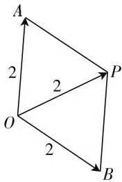
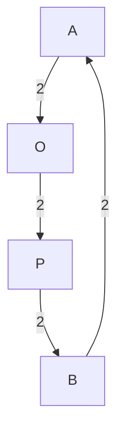

# 复数巧转化,问题妙破解

# ● 江苏省徐州市铜山区棠张中学 董客伟

复数是历年高考中的必考内容之一,主要围绕复数的运算来展开.由于复数的运算种类较多,各种运算之间又存在一定的联系,为复数问题的破解提供多种可供选择的途径和方式,从而达到简化运算、提高效率的目的.2020年高考数学全国卷Ⅱ理科第15题,以普通常见的复数四则运算与模等相关知识的方式来展示,破解方式多样,技巧方法多变,是考查数学知识与数学能力的良好载体.

# 一、真题在线

高考真题:(2020年高考数学全国卷Ⅱ理科第15题)设复数 $z_{1},z_{2}$ 满足 $|z_{1}|=|z_{2}|=2,z_{1}+z_{2}=\sqrt{3}+i$ ，则 $|z_{1}-z_{2}|=$ \_\_\_\_.

此题以复数为问题背景,结合两相关复数的模以及两复数的和的模来求解两复数的差的模问题.以两相关复数的模架起两复数的和、两复数的差之间的关系,有效实现两者之间的转化与应用问题.根据复数本身所具备的“数”的特征与“形”的直观,可以从代数思维或几何思维等相关角度切入,从而得以破解相关的复数问题.

# 二、真题破解

# 方法 1(待定系数法)

解析:由题设 $z_{1}=a+bi(a,b\in\mathbf{R})$ ，由 $z_{1}+z_{2}=\sqrt{3}+i$ 可得 $z_{2}=(\sqrt{3}-a)+(1-b)i$ ，

则有 $\left\{\begin{aligned}&|z_{1}|^{2}=a^{2}+b^{2}=4,\\&|z_{2}|^{2}=(\sqrt{3}-a)^{2}+(1-b)^{2}=4,\end{aligned}\right.$

整理有 $\left\{ \begin{array}{l}a^2 +b^2 = 4,\\ \sqrt{3} a + b = 2, \end{array} \right.$ 所以 $|z_{1} - z_{2}|^{2} = (2a -$

$$
\sqrt {3}) ^ {2} + (2 b - 1) ^ {2} = 4 \left(a ^ {2} + b ^ {2}\right) - 4 (\sqrt {3} a + b) + 4 = 1 2,
$$

解得 $|z_1 - z_2| = 2\sqrt{3}$ .

故填答案: $2\sqrt{3}$ .

点评:根据条件设出复数 $z_{1}$ ，引入对应的系数，通过条件确定复数 $z_{2}$ ，利用两复数的模建立方程组，从而整理得到参数的关系式，再利用两复数的差的模的平方加以展开,待定系数法处理,结合整体思维来转化与处理,从而得以求解.待定系数法处理是解决复数问题中最常见的一类方法与技巧.

# 方法 2(几何意义法)

解析:由于 $z_{1}+z_{2}=z_{3}=\sqrt{3}+i$ ，在复平面内，设复数 $z_{1},z_{2},z_{3}$ 所对应的点分别为 A, B, P（起点均为坐标原点 O），根据复数的几何意义可知， $\left|z_{1}+z_{2}\right|$ 和 $\left|z_{1}-z_{2}\right|$ 是以平面向量 $\overrightarrow{OA}$ 和 $\overrightarrow{OB}$ 为两邻边的平行四边形的两条对角线的长，由于 $|z_1| = |z_2| = |z_3| = 2$ ，则知平行四边形OAPB是边长为2，一条对角线为2的菱形，所以该菱形的另一条对角线长为 $|z_{1} - z_{2}| = 2\sqrt{3}$

flowchart

图1

故填答案: $2\sqrt{3}$ .

点评:根据条件利用两复数的和设出第三个复数,进而把复数放在复平面内,设出相关复数所对应的点,结合三个复数的模的关系来确定对应平面四边形的图形特征,结合菱形所对应的几何特征性质,以及两复数差所对应的图形元素来确定所求两复数差的模问题.几何意义法处理是从复数的几何意义角度出发,数形结合,直观想象,可以直观形象地处理有关复数的相关问题.

# 方法 3(复数模运算性质法)

解析:由于 $z_{1}+z_{2}=\sqrt{3}+i$ ，可得 $\left|z_{1}+z_{2}\right|=2$ ，而 $\left|z_{1}\right|=\left|z_{2}\right|=2$ ，可得 $z_{1}\cdot\bar{z}_{1}=z_{2}\cdot\bar{z}_{2}=2^{2}=4$ ，则有 $\left|z_{1}+z_{2}\right|^{2}=(z_{1}+z_{2})(\overline{z_{1}+z_{2}})=(z_{1}+z_{2})(\bar{z}_{1}+\bar{z}_{2})=z_{1}\cdot\bar{z}_{1}+z_{1}\cdot\bar{z}_{2}+z_{2}\cdot\bar{z}_{1}+z_{2}\cdot\bar{z}_{2}=z_{1}\cdot\bar{z}_{2}+z_{2}\cdot\bar{z}_{1}+8=2^{2}=4$ ，可得 $z_{1}\cdot\bar{z}_{2}+z_{2}\cdot\bar{z}_{1}=-4$ ，所以 $\left|z_{1}-z_{2}\right|^{2}=(z_{1}-z_{2})(\overline{z_{1}-z_{2}})=(z_{1}-z_{2})(\bar{z}_{1}-\bar{z}_{2})=z_{1}\cdot\bar{z}_{1}-z_{1}\cdot\bar{z}_{2}-z_{2}\cdot\bar{z}_{1}+z_{2}\cdot\bar{z}_{2}=-(z_{1}\cdot\bar{z}_{2}+z_{2}\cdot\bar{z}_{1}+8=4+8=12$ ，解得 $\left|z_{1}-z_{2}\right|=2\sqrt{3}$ .

故填答案: $2\sqrt{3}$ .

点评:根据条件先确定两复数和的模,结合复数模的计算公式 $z\cdot\overline{z}=|z|^{2}$ ,以及对应的复数的运算性质,先展开两复数和的模的平方,得到相应的关系式的值,再结合两复数差的模的平方展开,整体思维处理即可得以求解.复数模运算性质法处理是破解与复数的模有关的一种解决方法,化归与转化合理,代数运算性强.

# 方法 4(公式法)

解析:由于 $z_{1}+z_{2}=\sqrt{3}+i$ ，可得 $\left|z_{1}+z_{2}\right|=2$ ，而 $\left|z_{1}\right|=\left|z_{2}\right|=2$ ，结合公式 $\left|z_{1}+z_{2}\right|^{2}+\left|z_{1}-z_{2}\right|^{2}=2\left(\left|z_{1}\right|^{2}+\left|z_{2}\right|^{2}\right)$ ，可得 $\left|z_{1}-z_{2}\right|^{2}=2\left(\left|z_{1}\right|^{2}+\left|z_{2}\right|^{2}\right)-\left|z_{1}+z_{2}\right|^{2}=2\left(2^{2}+2^{2}\right)-2^{2}=12$ ，解得 $\left|z_{1}-z_{2}\right|=2\sqrt{3}$ .

故填答案: $2\sqrt{3}$ .

点评: 复数、平面向量的加减法的几何意义相同, 均可用平行四边形法则. 利用平行四边形的性质——平行四边形的对角线的平方和等于四边平方之和, 从而大大加快解题速度, 提高效率. 公式法处理是解决与复数、平面向量的模有关的问题中比较巧妙的一种破解方式, 技巧性强, 简单快捷. 此类方法与技巧也为相关问题的进一步拓展与提升奠定基础.

# 三、变式拓展

探究 1: 原来问题中复数模之间存在特殊的数量关系, 改变其中的数值, 一样可以用平行四边形的公式法来处理此类问题, 从而得到变式与拓展.

变式 1: 设复数 $z_{1}, z_{2}$ 满足 $\left|z_{1}\right| = \left|z_{2}\right| = 2,$ $\left|z_{1} + z_{2}\right| = \sqrt{3}$ ，则 $\left|z_{1} - z_{2}\right| =$ \_\_\_\_.

解析:由于 $|z_1| = |z_2| = 2, |z_1 + z_2| = \sqrt{3}$ , 结合公式 $|z_1 + z_2|^2 + |z_1 - z_2|^2 = 2(|z_1|^2 + |z_2|^2)$ , 可得 $|z_1 - z_2|^2 = 2(|z_1|^2 + |z_2|^2) - |z_1 + z_2|^2 = 2(2^2 + 2^2) - (\sqrt{3})^2 = 13$ , 解得 $|z_1 - z_2| = \sqrt{13}$ .

故填答案: $\sqrt{13}$ .

探究 2: 保留原来题目条件, 改变原来求解两复数差的模为两复数与共轭复数有关的运算问题, 从而得到变式与拓展.

变式2: 设复数 $z_{1}, z_{2}$ 满足 $\left|z_{1}\right| = \left|z_{2}\right| = 2, z_{1} + z_{2} = \sqrt{3} + i$ ，则 $z_{1} \cdot z_{2} + z_{1} \cdot z_{2} =$ \_\_\_\_ .

解析:由于 $z_{1}+z_{2}=\sqrt{3}+i$ ，可得 $\left|z_{1}+z_{2}\right|=2$ ，而 $\left|z_{1}\right|=\left|z_{2}\right|=2$ ，可得 $z_{1}\cdot\bar{z}_{1}=z_{2}\cdot\bar{z}_{2}=2^{2}=4$ ，则有 $\left|z_{1}+z_{2}\right|^{2}=(z_{1}+z_{2})(\overline{z_{1}+z_{2}})=(z_{1}+z_{2})(\bar{z}_{1}+\bar{z}_{2})=z_{1}\cdot\bar{z}_{1}+z_{1}\cdot\bar{z}_{2}+z_{2}\cdot\bar{z}_{1}+z_{2}\cdot\bar{z}_{2}=z_{1}\cdot\bar{z}_{2}+z_{2}\cdot\bar{z}_{1}+8=2^{2}=4$ ，可得 $z_{1}\cdot\bar{z}_{2}+z_{2}\cdot\bar{z}_{1}=-4$ 。

故填答案：-4.

探究 3: 改变原来问题中的条件与结论之间的位置关系, 也一样可以用平行四边形的公式法来处理此类问题, 从而得到变式与拓展.

变式 3: 设复数 $z_{1}, z_{2}$ 满足 $\left|z_{1}\right| = \left|z_{2}\right| = 2,$ $\left|z_{1} - z_{2}\right| = 2\sqrt{3}$ ，则 $\left|z_{1} + z_{2}\right| =$ \_\_\_\_.

解析:由于 $|z_1| = |z_2| = 2, |z_1 - z_2| = 2\sqrt{3}$ , 结合公式 $|z_1 + z_2|^2 + |z_1 - z_2|^2 = 2(|z_1|^2 + |z_2|^2)$ , 可得 $|z_1 + z_2|^2 = 2(|z_1|^2 + |z_2|^2) - |z_1 - z_2|^2 = 2(2^2 + 2^2) - (2\sqrt{3})^2 = 2$ , 解得 $|z_1 + z_2| = 2$ .

故填答案:2.

探究 4: 保留原来问题的部分条件, 进一步引入对数运算等相关知识, 合理利用复数的三角形式加以综合应用, 从而得到变式与拓展.

变式 4: 设复数 $z_{1}, z_{2}$ 满足 $\left|z_{1}\right| = \left|z_{1} + z_{2}\right| = 2,$ $\left|z_{1} - z_{2}\right| = 2\sqrt{3}$ ，则 $\log_{4}\left|\left(z_{1} \cdot \bar{z}_{2}\right)^{2020} + \left(\bar{z}_{1} \cdot z_{2}\right)^{2020}\right|$ 的值为 \_\_\_\_.

解析:根据 $|z_{1}|=|z_{1}+z_{2}|=2,|z_{1}-z_{2}|=2\sqrt{3}$ ，不妨取 $z_{1}=2=2(\cos0+\mathrm{i}\sin0)$ ， $z_{2}=2\left(\cos\frac{2\pi}{3}+\mathrm{i}\sin\frac{2\pi}{3}\right)$ ，可得 $z_{1}\cdot\bar{z}_{2}=2\cdot2\left[\cos\left(-\frac{2\pi}{3}\right)+\mathrm{i}\sin\left(-\frac{2\pi}{3}\right)\right]=-4\left(\cos\frac{\pi}{3}+\mathrm{i}\sin\frac{\pi}{3}\right)$ ， $\bar{z}_{1}\cdot z_{2}=2\cdot2\left(\cos\frac{2\pi}{3}+\mathrm{i}\sin\frac{2\pi}{3}\right)=4\left(\cos\frac{2\pi}{3}+\mathrm{i}\sin\frac{2\pi}{3}\right)$ ，可得 $(z_{1}\cdot\bar{z}_{2})^{2020}+(z_{1}\cdot z_{2})^{2020}=4^{2020}\cdot\left(\cos\frac{2020\pi}{3}+\mathrm{i}\sin\frac{2020\pi}{3}\right)+4^{2020}\cdot\left(\cos\frac{4040\pi}{3}+\mathrm{i}\sin\frac{4040\pi}{3}\right)=4^{2020}\cdot\left(\cos\frac{4\pi}{3}+\mathrm{i}\sin\frac{4\pi}{3}\right)+4^{2020}\cdot\left(\cos\frac{2\pi}{3}+\mathrm{i}\sin\frac{2\pi}{3}\right)=-4^{2020}$ ，所以 $\log_{4}|(z_{1}\cdot\bar{z}_{2})^{2020}+(\bar{z}_{1}\cdot z_{2})^{2020}|=\log_{4}|-4^{2020}|=\log_{4}4^{2020}=2020.$

故填答案:2020.

# 四、解后反思

在处理复数的相关运算问题中,关键是合理利用题目条件,利用复数所具备的“数”的特征与“形”的直观,通过一些巧妙的数学思想与方法,借助复数自身的数字特征、待定系数、整体思维、常见公式、分类讨论、几何意义等运算技巧,同时合理利用复数的运算性质等,可以使得复数相关问题的解决更为简单快捷,处理起来效果更佳,提升解题效益,提高数学能力. $^{F}$