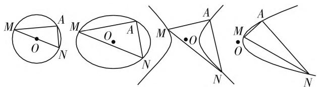

# 对 2020 年山东卷解析几何压轴题的推广

# ● 西安交通大学苏州附属中学 梁超

山东省于2020年进行了新高考，其高考试题的特点、难度等对2021年实行新高考模式的省份具有重要启示。解析几何作为教学的重要内容，在各省高考中都占有重要地位，往往处于中档题、压轴题的位置，在解析几何大题上能否拿高分很大程度上决定着考生整张试卷能否拿高分。2020年的山东卷将解析几何大题放在了第22题，研究的是定点定值问题，此类问题是平时教学的侧重点，可见高考虽然一定会有题型、考查点的创新，但更注重对基本内容、通性通法的考查。

当下的中国高考评价体系由“一核四层四翼”组成，一线教师在教学中应不断研究“为什么考”“考什么”“怎么考”等问题，将能力发展、素养培育融入到课堂教学中。圆锥曲线的专题学习，既要求学生具有扎实的基础知识和娴熟的计算能力，又突出呈现解题思维的严密与深度，能够全面地培养学生的数学运算、逻辑推理、直观想象等学科核心素养。在整个高中数学学习生涯中，圆锥曲线的学习是浓墨重彩的一笔，下面笔者以2020年的山东卷解析几何大题为例，推广一类圆锥曲线的定点问题，以期思考如何更加有效、更有深度地进行教学。

真题 (2020 山东卷) 已知椭圆 $C: \frac{x^2}{a^2} + \frac{y^2}{b^2} = 1 (a > b > 0)$ 的离心率为 $\frac{\sqrt{2}}{2}$ , 且过点 $A(2,1)$ .

(1) 求 C 的方程;  
(2) 点 M, N 在 C 上, 且 $AM \perp AN, AD \perp MN$ , D 为垂足, 证明: 存在定点 Q, 使得 $|DQ|$ 为定值.

答案:(1) $\frac{x^{2}}{6}+\frac{y^{2}}{3}=1$ ;(2) $Q\left(\frac{4}{3},\frac{1}{3}\right)$ , $|DQ|=$ $\frac{2\sqrt{2}}{3}$ .(过程略)

本题第(2)问的解题思路是先探索出直线MN过定点 $P\left(\frac{4}{3},\frac{1}{3}\right)$ ，然后取AP中点Q，则Q为定点，且 $|DQ|$ 为定值。对于该题的解法，笔者联想到近一年内在教学中先后碰到的两道例题：

例 1 已知 A 为椭圆 $C: \frac{x^{2}}{a^{2}} + \frac{y^{2}}{b^{2}} = 1 (a > b > 0)$ 的左顶点，A 到椭圆右准线的距离为 6，且椭圆离心率为 $\frac{1}{2}$ ，点 P, Q 是椭圆上的两个动点.

(1) 求椭圆 C 的方程;  
(2) 当 P, O, Q 三点共线时, 直线 AP, AQ 分别与 y 轴交于 M, N, 求证: $\overrightarrow{AM} \cdot \overrightarrow{AN}$ 为定值;  
(3) 若直线 $AP, AQ$ 的斜率分别为 $k_{1}, k_{2}$ , 且 $k_{1}k_{2} = -1$ , 求证: 直线 $PQ$ 过定点 $R$ .

答案:(1) $\frac{x^{2}}{4}+\frac{y^{2}}{3}=1$ ;(2)1;(3) $R\left(-\frac{2}{7},0\right)$ .(过程略)

例2 已知椭圆 $E: \frac{x^2}{a^2} + \frac{y^2}{b^2} = 1 (a > b > 0)$ 经过点 $\left(1, \frac{3}{2}\right)$ ，且离心率 $e = \frac{1}{2}$ .

(1) 求椭圆 E 的方程;  
(2) 设椭圆 E 的右顶点为 A，若直线 $l: y = kx + m$ 与椭圆 E 相交于 M, N 两点（异于点 A），且满足 MA ⊥ NA，证明：直线 l 经过定点，并求出该定点的坐标.

答案：(1) $\frac{x^2}{4} +\frac{y^2}{3} = 1$ (2)直线 $l$ 经过定点 $\left(\frac{2}{7},0\right)$ .（过程略）

例 1 和例 2 分别是 2016 年、2017 年某两个地区的区级模考题，对比这三道题目。可见例 2 第(2)问是例 1 第(3)问的简单变形，将左顶点变为右顶点，可视为将条件中的点 A 作关于 y 轴对称，从而相应结论中的定点坐标也关于 y 轴对称。2020 年的山东卷解析几何压轴题将点 A 的位置变得更一般，第(2)问依然保持 $AM \perp AN$ 。可见此高考题是例 1 的升华变形，并将“直线 MN 过定点”这个结论隐藏在解答过程中，要求考生有一定的探究能力。

探索问题常用的思路是从特殊到一般,先看一个特殊情况:如果点A是一个圆上的定点,动点M,N均在该圆上,且 $AM \perp AN$ ,那么直线MN过定点圆心.这些情况启发我们思考两点:

(1) 如果点 A 是任意一个确定的椭圆上的定点，动点 M, N 在椭圆 C 上，且 $AM \perp AN$ ，那么是否有直线 MN 过定点？  
(2) 把椭圆改成双曲线、抛物线, 定点 A 和动点 M, N 均在该曲线上, 且 $AM \perp AN$ , 那么是否仍然有直线 MN 过定点?

text_image

Geometric diagram showing four circles with labeled points and lines, including triangles and intersecting lines.

图1

综合以上两点猜测,如图 1 所示,我们可以研究圆、椭圆、双曲线、抛物线四类二次曲线在对应条件下是否均有“直线 MN 过定点”.为此,提出以下两个问题:

问题 1: 已知点 $A(s, t)$ 是曲线 $C: mx^{2} + ny^{2} = 1 (mn \neq 0)$ 上的定点，动点 M, N 在 C 上，且 $AM \perp AN$ . 直线 MN 是否过定点？（此类情形包括了椭圆与双曲线的标准形式）

问题 2: 已知点 $A(s, t)$ 是抛物线 $C: y^{2} = 2px (p > 0)$ 上的定点，动点 M, N 在 C 上，且 $AM \perp AN$ . 直线 MN 是否过定点？（根据对称性，我们仅考虑抛物线开口向右的情形）

问题1的探究过程:若直线MN的斜率不存在,设 $l_{MN}:x=x_{0}$ ,点 $M(x_{0},y_{0}),N(x_{0},-y_{0})$ .由 $AM\perp AN$ 知, $\overrightarrow{AM}\cdot\overrightarrow{AN}=(x_{0}-s,y_{0}-t)\cdot(x_{0}-s,-y_{0}-t)=0$ ,即: $(x_{0}-s)^{2}-(y_{0}^{2}-t^{2})=0$ .结合 $mx_{0}^{2}+ny_{0}^{2}=1$ 和 $ms^{2}+nt^{2}=1$ ,可化简得 $[(m+n)x+(m-n)s](x-s)=0$ .当x=s时,直线MN过点A,不符合;当 $(m+n)x+(m-n)s=0$ 时,易知若 $m+n=0$ ,则直线MN不过定点.所以我们研究 $m+n\neq0$ ,此时

$$
l _ {M N}: x = \frac {(n - m) s}{m + n}.
$$

若直线 $MN$ 的斜率不存在，设 $l_{MN}: y = kx + r$ ，点 $M(x_1, y_1), N(x_2, y_2)$ 。将直线 $MN$ 与曲线 $C$ 联立得 $(m + nk^2)x^2 + 2krnx + nr^2 - 1 = 0$ ，为使研究有意义，在 $m + nk^2 \neq 0$ 且 $\Delta > 0$ 的前提下有： $x_1 + x_2 = -\frac{2krn}{m + nk^2}, x_1x_2 = \frac{nr^2 - 1}{m + nk^2}$ 。又 $\overrightarrow{AM} \cdot \overrightarrow{AN} = (x_1 - s, y_1 - t) \cdot (x_2 - s, y_2 - t) = 0$ ，即 $(x_1 - s)(x_2 - s) + (y_1 - t)(y_2 - t) = 0$ ，将 $y_1 = kx_1 + r$ 和 $y_2 = kx_2 + r$ 代入上式，可以得到： $(k^2 + 1)x_1x_2 + [k(r - t) - s](x_1 + x_2) + (r - t)^2 + s^2 = 0$ ，结合韦达定理与 $ms^2 + nt^2 = 1$ ，化简得到 $(ns^2 - ms^2)k^2 + 2rnsk + m(r - t)^2 + n(r^2 -$

$t^2) = 0$ ，即 $(sk + r - t)[(n - m)sk + (m + n)r + (n - m)t] = 0.$

当 $sk + r - t = 0$ 时，直线 $MN$ 为 $y = kx + t - sk$ 即 $y = k(x - s) + t$ ，过点 $A(s,t)$ ，不符合；当 $(n - m)sk + (m + n)r + (n - m)t = 0$ 时，直线 $MN$ 为 $y = \left[x + \frac{(m - n)s}{m + n}\right] \cdot k + \frac{(m - n)t}{m + n}$ ，过定点 $\left(\frac{(n - m)s}{m + n}, \frac{(m - n)t}{m + n}\right)$ .

综上,我们可以得到如下结论:

结论 1: 已知点 $A(s, t)$ 是曲线 $C: mx^{2} + ny^{2} = 1 (mn \neq 0, m + n \neq 0)$ 上的定点，动点 M, N 在 C 上，且 $AM \perp AN$ ，则直线 MN 过定点 $\left(\frac{(n - m)s}{m + n}, \frac{(m - n)t}{m + n}\right)$ .

问题2的探究过程：可设 $l_{MN}: x = my + n$ ，点 $M(x_1, y_1), N(x_2, y_2)$ 。将直线 $MN$ 代入 $y^2 = 2px$ ，得 $y^2 - 2pmy - 2pn = 0$ ，在 $\Delta > 0$ 的前提下有： $y_1 + y_2 = 2pm, y_1y_2 = -2pn$ 。又 $\overrightarrow{AM} \cdot \overrightarrow{AN} = (x_1 - s, y_1 - t) \cdot (x_2 - s, y_2 - t) = 0$ ，即 $(x_1 - s)(x_2 - s) + (y_1 - t) \cdot (y_2 - t) = 0$ ，将 $x_1 = my_1 + n$ 和 $x_2 = my_2 + n$ 代入上式，可得 $(m^2 + 1)y_1y_2 + [m(n - s) - t](y_1 + y_2) + (n - s)^2 + t^2 = 0$ 。

类似于问题1，此处结合韦达定理与 $t^2 = 2ps$ ，化简得 $t^2 m^2 + 2ptm + 2p(n - s) - (n - s)^2 = 0$ ，即有 $(tm + n - s)(tm + 2p - n + s) = 0.$

当 $tm + n - s = 0$ 时，直线MN为 $x = my + s - tm$ 即 $x = (y - t)m + s$ ，过点 $A(s,t)$ ，不符合；当 $tm + 2p$ $-n + s = 0$ 时，直线MN为 $x = my + tm + 2p + s$ ，即 $x = (y + t)m + 2p + s$ ，过定点 $(2p + s, - t)$ .从而我们可以得到如下结论：

结论 2: 已知点 $A(s, t)$ 是抛物线 $C: y^{2} = 2px (p > 0)$ 上的定点，动点 M, N 在 C 上，且 $AM \perp AN$ ，则直线 MN 过定点 $(2p + s, -t)$ .

对于上面两个结论中的条件“ $AM \perp AN$ ”，我们可以进一步放宽，保证两者斜率之积为定值即可。若直线 AM, AN 斜率均存在，且斜率之积为定值 K，即 $\frac{y_{1}-t}{x_{1}-s} \cdot \frac{y_{2}-t}{x_{2}-s} = K$ ，也即 $K(x_{1}-s)(x_{2}-s) - (y_{1}-t)(y_{2}-t) = 0$ 。仿照上面的探究过程，可以证明如下两个结论：

结论 3: 已知点 $A(s, t)$ 是曲线 $C: mx^{2} + ny^{2} = 1 (mn \neq 0, m + n \neq 0)$ 上的定点，动点 M, N 在 C 上，直线 AM, AN 斜率均存在，且斜率（下转第 32 页）

相关参数的大小关系问题. 问题的特殊值排除法在破解选择题中有一定的用武之地, 简单易操作, 只是特殊值的选取有一定的技巧和局限性.

# 三、变式拓展

探究 1: 结合原来真题中图像分析法的破解过程, 可以进一步深入探究参数之间的大小关系, 从而得到问题的更深层次的拓展与变式, 改变原来两者之间的大小关系为三者之间的大小关系问题. 问题的难度有所提升.

变式 1: 若 $2^{a} + \log_{2}a = 4^{b} + 2\log_{4}b$ ，则（）.

A. $a > 2b > b^{2}$

B. $b < a < 2b$

C. $\sqrt{b} > a > b^2$

D. $a < b^{2} < 2a$

解析: 直接利用原真题中方法 1 的图像分析法的破解过程, 直观分析可知 a > b, 又结合函数的图像与性质可得 a < 2b, 综合可得 b < a < 2b.

故选 B.

点评:该变式是在原真题的基础上进一步加以深入与拓展,考查的数学知识与能力在原有基础上都有一定的提升,难度也有所增加,破解技巧更强,要求更高,更具有选拔性与区分度.

探究 2: 结合方程式、不等式的恒等变形, 通过构造函数, 利用函数的图像与性质来确定相应的函数值或参数的大小关系是破解问题的一种常见思维, 也是高考命题的本意. 从破解策略角度进行变式与拓展, 也有相关的高考真题, 难度相当.

变式 2: (2020 年全国卷 II 理科第 11 题, 文科第 12 题) 若 $2^{x}-2^{y}<3^{-x}-3^{-y}$ , 则().

A. $\ln (y - x + 1) > 0$

B. $\ln(y-x+1)<0$

C. $\ln|x-y|>0$

D. $\ln |x - y| < 0$

解析:由 $2^{x}-2^{y}<3^{-x}-3^{-y}$ ，可得 $2^{x}-3^{-x}<2^{y}-3^{-y}$ ，构造函数 $f(t)=2^{t}-3^{-t}$ ，则知函数 $f(t)$ 在区间 $(-∞,+∞)$ 上单调递增，又因为 $f(x)<f(y)$ ，可得 x<y，则有 y-x>0，即 $y-x+1>1$ ，可得 $\ln(y-x+1)>\ln1=0$ 。

故选A.

点评:合理构造函数,通过熟知的基本初等函数的图像与性质的应用,有效确定函数的单调性,为函数值或参数的大小关系判断指明方向.这也是破解此类函数值或参数的大小关系问题的常技常法.而破解本题时,若采取其他方法来处理,没有合理构造函数法来得简单、直接、有效.

# 四、解题反思

判断函数值或参数的大小关系问题,一直备受命题者热衷,是历年高考中的一类常见题型,一个基本题型.此类问题涉及的知识点与能力点比较丰富,变化多端,形式各异,破解问题时的切入点众多,思维方法多样,具有一定的技巧性.解决此类函数值或参数的大小关系的判断问题,常见的方法技巧是合理构造对应的函数,结合函数的图像与性质来分析与处理.而破解问题时,关键是灵活运用所学的数学知识和数学方法,结合代数运算,以及函数的图像与性质等相关内容,厘清数学知识体系,清晰解题思维,很好提升分析问题与解决问题的能力,从而有效培养数学核心素养,拓展数学品质.F

(上接第30页) 之积为定值 K，则直线 MN 过定点 $\left(\frac{(nK+m)s}{nK-m}, \frac{(nK+m)t}{m-nK}\right)$ .

结论 4: 已知点 $A(s, t)$ 是抛物线 $C: y^{2} = 2px (p > 0)$ 上的定点，动点 M, N 在 C 上，直线 AM, AN 斜率均存在，且斜率之积为定值 K，则直线 MN 过定点 $\left(s - \frac{2p}{K}, -t\right)$ .

当 K = -1 时, 结论 3 和 4 就变为结论 1 和 2. 圆锥曲线定点定值问题可谓常考常新, 教师面对高考热点问题时, 要注意新旧题型、思想方法的对比联系. 在高三复习时, 可以采用微专题形式, 充分发挥学生的主动探究精神, 深化思想方法, 促进学生学有所成功. 功在平时，摈弃填鸭式学习，突破符号表征学习的浅层教学，以生为本、深化课堂，让学习真正发生在学生身上。学生只有平时对典型例题有了全面深入的学习研究，在考场上面对全新面貌的题目时，才能临危不乱，有能力将陌生转化为熟悉、将未知转化为已知，做到学以致用。

# 参考文献：

[1] 汤明清, 李善良. 核心素养视角下数学深度教学的策略研究 [J]. 中小学教师培训, 2018(10).  
[2] 渠怀莲. 椭圆中一定点定值问题的推广与拓展 [J]. 中学数学研究, 2019(7). F