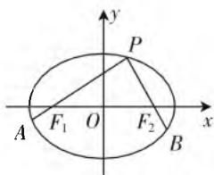

# 提升复习质量,渗透核心素养

# ● 江苏省常熟中学 钱怡

数学核心素养的落实与培养也是高三数学复习教学过程中的一大目的,如何在全面提升高三复习质量的前提下,合理渗透数学核心素养,实现两者的有机融合,通过复习过程的推进,每一道题的讲解,每一堂复习课的安排,每一个专题的突破,每一个体系的构建等,改变重结果轻过程、重技法轻想法、重记忆轻感悟的“刷题”训练模式,还原数学的全过程,强化反思归纳,概括提升环节,合理提升教学质量与渗透核心素养并行,整体稳定前行,螺旋逐步上升.

# 一、延长数学教学的历程

高三数学复习中,无论哪一个问题,哪一项内容,哪一个环节等,都有其功能作用,价值意义都不是单一的.功能作用的发挥,价值意义的大小,关键在于关注的视角以及相应的处理方式,以及还原数学应有的教学历程,落实好重要的步骤、环节、问题,充分挖掘出蕴含在其中的隐性价值,成为提升教学质量,渗透核心素养的基本过程.

例 1 （华南师大附中、广东实验中学、广雅中学、深圳中学 2020 届高三上学期期末联考数学文科卷第 12 题）已知椭圆 C 的焦点 $F_{1}(-1,0)$ ， $F_{2}(1,0)$ ，过 $F_{2}$ 的直线与 C 交于 A，B 两点。若 $\left|AF_{2}\right|=3\left|BF_{2}\right|$ ， $\left|BF_{1}\right|=5\left|BF_{2}\right|$ ，则椭圆 C 的方程为（）。

A. $\frac{x^2}{2} + y^2 = 1$

B. $\frac{x^2}{3} +\frac{y^2}{2} = 1$

C. $\frac{x^{2}}{4}+\frac{y^{2}}{3}=1$

D. $\frac{x^{2}}{5}+\frac{y^{2}}{4}=1$

分析: 此题改编于高考真题——2019年高考数学全国卷Ⅰ理科第10题(文科第12题), 通过改变线段之间的比例关系, 破解问题的基本思维方式, 破解过程比高考真题的运算显得略为简单, 难度相当.

高考真题:(2019年高考数学全国卷Ⅰ理科第10题;文科第12题)已知椭圆C的焦点 $F_{1}(-1,0)$ ， $F_{2}(1,0)$ ，过 $F_{2}$ 的直线与C交于A,B两点。若 $|AF_{2}|=2|BF_{2}|$ ， $|AB|=|BF_{1}|$ ，则椭圆C的方程为()。

A. $\frac{x^{2}}{2}+y^{2}=1$

B. $\frac{x^2}{3} +\frac{y^2}{2} = 1$

C. $\frac{x^2}{4} +\frac{y^2}{3} = 1$

D. $\frac{x^2}{5} +\frac{y^2}{4} = 1$

解析:由椭圆 C 的焦点 $F_{1}(-1,0)$ , $F_{2}(1,0)$ ，可知 c=1，又由于 $\left|AF_{2}\right|=2\left|BF_{2}\right|$ , $\left|BF_{1}\right|=3\left|BF_{2}\right|$ ，可设 $\left|BF_{2}\right|=t$ ，则 $\left|AF_{2}\right|=2t$ , $\left|BF_{1}\right|=3t$ ，根据椭圆的定义可知 $2a=\left|BF_{1}\right|+\left|BF_{2}\right|=3t+t=4t$ ，得 a=2t，则知 $\left|AF_{1}\right|=2a-\left|AF_{2}\right|=4t-2t=2t=\left|AF_{2}\right|$ ，可知 $A(0,b)$ （不失一般性，取 A 为上顶点）.

根据平面几何中的相似性质及比例关系可得 $B\left(\frac{3}{2},-\frac{b}{2}\right)$ ，将 $B\left(\frac{3}{2},-\frac{b}{2}\right)$ 代入椭圆C的方程 $\frac{x^{2}}{a^{2}}+\frac{y^{2}}{b^{2}}=1$ ，可得 $\frac{9}{4a^{2}}+\frac{1}{4}=1$ ，解得 $a^{2}=3$ ，则有 $b^{2}=a^{2}-c^{2}=2$ ，可得椭圆C的方程为 $\frac{x^{2}}{3}+\frac{y^{2}}{2}=1$ .

故选 B.

点评:通过例题分析,探求问题的“来路”,研究问题的“思路”,拓展问题的“出路”(对应下面一般性的结论),进一步延长数学教学的历程.

# 二、延伸数学问题的规律

数学学科是一个相互联系、相互交汇、相互转化的严谨的科学逻辑体系。特别，数学中的一个问题往往蕴含着一种规律（或原理），一个问题的求解，破解所获得的不仅仅是解题的结果或结论，同时也揭示出了一种数学认知的方法和规律，进而悟出其中的道理，不断渗透与沉淀数学核心素养。

例 2 （2020 年 1 月江苏省盐城市、南京市 2020 届高三年级第一次模拟考试·18）设椭圆 $C: \frac{x^{2}}{a^{2}} + \frac{y^{2}}{b^{2}} = 1 (a > b > 0)$ 的左右焦点分别为 $F_{1}$ 与 $F_{2}$ ，离心率是 $e$ ，动点 $P(x_0,y_0)$ 在椭圆 $C$ 上运动.当 $PF_{2}\perp x$ 轴时， $x_0 = 1,y_0 = e.$

text_image

y
P
A F₁ O F₂ x
B

图1

(1) 求椭圆 C 的方程；  
(2) 延长 $PF_{1}, PF_{2}$ 分别交椭圆 C 于点 A, B (A, B

不重合), 设 $\overrightarrow{AF_1} = \lambda \overrightarrow{F_1P}, \overrightarrow{BF_2} = \mu \overrightarrow{F_2P}$ , 求 $\lambda + \mu$ 的最小值.

分析:(1)通过相关参数之间的关系,以及关系式的建立来确定相应的参数值,从而求解椭圆的方程;(2)借助平面向量的线性关系来设置参数值,进而确定参数关系式的最值问题.

解析:(1)由于当 $PF_{2}\perp x$ 轴时, $x_{0}=1$ ,可得c=1,将 $P(1,e)$ 代入椭圆方程可得 $\frac{1}{a^{2}}+\frac{e^{2}}{b^{2}}=1$ ,而离心率 $e=\frac{c}{a}=\frac{1}{a},b^{2}=a^{2}-c^{2}=a^{2}-1$ ,代入上式可得 $\frac{1}{a^{2}}+\frac{1}{a^{2}(a^{2}-1)}=1$ ,解得 $a^{2}=2$ ,故 $b^{2}=1$ ,所以椭圆C的方程为 $\frac{x^{2}}{2}+y^{2}=1$ .

(2) 设 $A(x_{1},y_{1})$ ，由 $\overrightarrow{AF_1} = \lambda \overrightarrow{F_1P}$ 可得 $\left\{ \begin{array}{l} -1 - x_1 = \lambda (x_0 + 1), \\ -y_1 = \lambda y_0, \end{array} \right.$ 故 $\left\{ \begin{array}{l} x_1 = -\lambda x_0 - \lambda - 1, \\ y_1 = -\lambda y_0, \end{array} \right.$ 代入椭圆的方程可得 $\frac{(-\lambda x_0 - \lambda - 1)^2}{2} + (-\lambda y_0)^2 = 1.$

又由 $\frac{x_0^2}{2} + y_0^2 = 1$ 可得 $y_0^2 = 1 - \frac{x_0^2}{2}$ ，代入上式可得 $(\lambda x_0 + \lambda + 1)^2 + 2\lambda^2\left(1 - \frac{x_0^2}{2}\right) = 2$ ，化简可得 $3\lambda^2 + 2\lambda - 1 + 2\lambda (\lambda + 1)x_0 = 0$ ，即 $(\lambda + 1)(3\lambda - 1 + 2\lambda x_0) = 0$ ，显然 $\lambda + 1 \neq 0$ ，所以 $3\lambda - 1 + 2\lambda x_0 = 0$ ，故 $\lambda = \frac{1}{3 + 2x_0}$ .

同理可得 $\mu = \frac{1}{3 - 2x_0}$ ，故 $\lambda +\mu = \frac{1}{3 + 2x_0} +$ $\frac{1}{3 - 2x_0} = \frac{6}{9 - 4x_0^2}\geqslant \frac{2}{3} (-\sqrt{2} < x_0 <   \sqrt{2})$ ，当且仅当 $x_0 = 0$ ，即点 $P$ 运动到短轴端点时等号成立，所以 $\lambda +\mu$ 的最小值为 $\frac{2}{3}$

点评:上述问题回归到一般性的椭圆问题,在一般性条件下进行总结与归纳,可得到以下几个相关的结论:

结论1:设椭圆 $C:\frac{x^{2}}{a^{2}}+\frac{y^{2}}{b^{2}}=1(a>b>0)$ 的左右焦点分别为 $F_{1}$ 与 $F_{2}$ ，动点 P 在椭圆 C 上运动，延长 $PF_{1},PF_{2}$ 分别交椭圆 C 于点 A,B(A,B 不重合). 设 $\overrightarrow{AF_{1}}=\lambda\overrightarrow{F_{1}P},\overrightarrow{BF_{2}}=\mu\overrightarrow{F_{2}P}$ ，则 $\frac{1}{\lambda}+\frac{1}{\mu}$ 恒为定值 $\frac{4a^{2}-2b^{2}}{b^{2}}$ .

结论2:设椭圆 $C:\frac{x^{2}}{a^{2}}+\frac{y^{2}}{b^{2}}=1(a>b>0)$ 的左右焦点分别为 $F_{1}$ 与 $F_{2}$ ，动点 P 在椭圆 C 上运动，延长 $PF_{1},PF_{2}$ 分别交椭圆 C 于点 A,B(A,B 不重合). 设 $\overrightarrow{AF_{1}}=\lambda\overrightarrow{F_{1}P},\overrightarrow{BF_{2}}=\mu\overrightarrow{F_{2}P}$ ，则 $\lambda+\mu$ 的取值范围为 $\left[\frac{2b^{2}}{2a^{2}-b^{2}},\frac{4a^{2}-2b^{2}}{b^{2}}\right)$ .

# 三、延展自主意识的养成

高三数学复习中,自主学习是一种主动而积极有效的学习行为,具有强烈的求知欲、主动参与的精神和积极思考的行为.在自主意识下,学生能充分调动全部身心,投入到复习过程中,不仅仅为了应付考试和成绩,而是在这过程中亲身经历数学知识生成过程,思维的碰撞,思想的升华,享受获取知识和技能的乐趣,数学核心素养随之渗透其中.

例 3 （江苏省扬州市 2020 届高三第一次模拟考试 • 13）在 $\triangle ABC$ 中，若 $\sin B + \cos B = \sqrt{2}$ ，则 $\frac{\sin 2A}{\tan B + \tan C}$ 的最大值为 \_\_\_\_.

分析:结合辅助角公式或平方关系去求出角 B 的角度,角 A 用角 C 的三角函数关系式表示出来,转化成关于角 C 的一个三角函数式,求出相应三角函数式的最值即可.

解析：由题中条件可得 $\sin B + \cos B = \sqrt{2} \cdot \sin\left(B + \frac{\pi}{4}\right) = \sqrt{2}$ ，即 $\sin\left(B + \frac{\pi}{4}\right) = 1$ ，可得 $B + \frac{\pi}{4} = \frac{\pi}{2}$ ，解得 $B = \frac{\pi}{4}$ ，那么 $\frac{\sin 2A}{\tan B + \tan C} = \frac{\sin 2A}{\frac{\sin B}{\cos B} + \frac{\sin C}{\cos C}} =$

$$
\frac {\sin 2 A}{\frac {\sin B \cos C + \cos B \sin C}{\cos B \cos C}} = \frac {\sin 2 A}{\frac {\sin (B + C)}{\cos B \cos C}} = \frac {2 \sin A \cos A}{\frac {\sin A}{\cos B \cos C}} =
$$

$$
2 \cos A \cos B \cos C = \sqrt {2} \cos A \cos C = \sqrt {2} \cos \left(\frac {3 \pi}{4} - C\right) \cos C
$$

$$
= \frac {\sqrt {2}}{2} \left[ \cos \frac {3 \pi}{4} + \cos \left(\frac {3 \pi}{4} - 2 C\right) \right] = \frac {\sqrt {2}}{2} \cos \left(\frac {3 \pi}{4} - 2 C\right) -
$$

$\frac{1}{2}$ , 由 $C = \frac{3\pi}{4} - A \in \left(0, \frac{3\pi}{4}\right)$ , 可得 $\left(\frac{3\pi}{4} - 2C\right) \in \left(-\frac{3\pi}{4}, \frac{3\pi}{4}\right)$ , 则知当 $\frac{3\pi}{4} - 2C = 0$ , 即 $C = \frac{3\pi}{8}$ 时,

$\frac{\sin 2A}{\tan B + \tan C} = \frac{\sqrt{2}}{2}\cos \left(\frac{3\pi}{4} -2C\right) - \frac{1}{2}$ 取得最大值 $\frac{\sqrt{2}}{2}-$

$\frac{1}{2} = \frac{\sqrt{2} - 1}{2}$ , 所以 $\frac{\sin 2A}{\tan B + \tan C}$ (下转第 14 页)

$P(1,1)$ ，因此存在符合条件的 $P(1,1)$ .

点评:本题属于高考中最常见的定点问题,这类问题往往与平面向量综合在一起,体现了解析几何与平面向量的交汇,在考查解析几何的同时,也考查了平面向量的“工具性”,但最终解决问题的“主角”是解析几何,这类问题也应引起大家的注意.

# 四、提升创新能力

创新,是时代的要求,是社会发展的内驱力,也是高考命题的风向标.回顾历年高考,无论是试题给出的问题情境,还是考生的作答形式,都体现了数学高考对创新能力的培养.因此在二轮复习中,重视自身创新能力的提升不可懈怠.高考中的创新题一般源于课本或源于社会热点,有些创新题充满数学文化的味儿.而最常见的是一类新定义创新题,要求考生读懂题目,并利用题中的有关信息解决相关问题.这类问题能更好地考查考生创新性解决问题的能力.

例 4 设 $[x]$ 表示不超过 $x$ 的最大整数 (如 $[2] = 2, \left[\frac{3}{2}\right] = 1$ ), 对于给定的 $n \in \mathbf{N}^*$ , 定义 $\mathrm{C}_n^x = \frac{n(n - 1)\cdots(n - [x] + 1)}{x(x - 1)\cdots(x - [x] + 1)}, x \in [1, +\infty)$ , 则当 $x \in \left[\frac{5}{4}, 3\right)$ 时, 函数 $f(x) = \mathrm{C}_8^x$ 的值域为 ( ).

A. $\left(4,\frac{32}{5}\right]$

B. $\left(4,\frac{32}{5}\right]\cup\left(\frac{28}{3},28\right]$

C. $\left[\frac{28}{3},28\right]$

D. $\left[4,\frac{32}{5}\right)\cup\left(\frac{28}{3},28\right]$

解析:根据定义的式子 $C_{n}^{x}=\frac{n(n-1)\cdots(n-[x]+1)}{x(x-1)\cdots(x-[x]+1)}$

可以知道分子与分母含的项数，与 $[x]$ 的取值有关，即分子与分母分别为 $[x]$ 个项的乘积，所以根据 $[x]$ 的定义将 $x \in \left[\frac{5}{4}, 3\right)$ 分为 $\left[\frac{5}{4}, 2\right)$ 和 $[2, 3)$ 两个区间段处理。当 $x \in \left[\frac{5}{4}, 2\right)$ 时， $[x] = 1$ ，所以 $\mathrm{C}_{8}^{x} = \frac{8}{x}$ ，故 $f(x)$ 在 $\left[\frac{5}{4}, 2\right)$ 的值域为 $\left(4, \frac{32}{5}\right]$ ；当 $x \in [2, 3)$ 时， $[x] = 2$ ，故 $\mathrm{C}_{8}^{x} = \frac{8 \cdot 7}{x (x - 1)} = \frac{56}{x^{2} - x} = \frac{56}{\left(x - \frac{1}{2}\right)^{2} - \frac{1}{4}}$ ，于是 $f(x)$ 在区间 $[2, 3)$ 上单调递减，所以 $f(x) \in \left(\frac{28}{3}, 28\right]$ .

综上可知， $f(x)\in \left(4,\frac{32}{5}\right]\cup \left(\frac{28}{3},28\right].$

故选 B.

点评:解答本题的关键是根据题中的新定义,先写出目标函数 $f(x)$ 的表达式,再求这个函数的最值.只要领会题意,对于大多数考生来说,难度不是很大.

在高考二轮复习中, 教师注重提升能力的同时, 不要忘记每天的基础训练. 其实要想提升能力, 必须要有扎实的基础, 只有正确处理好基础与能力的关系, 复习效果才能更上一层楼. 作为二轮复习的指导者, 教师必须保持清醒的头脑, 不可将难题与能力题混为一谈, 不可把主要矛盾放在复习内容的难度上, 应该放在查漏补缺上, 从而让学生满怀信心走进考场. F

(上接第11页) 的最大值为 $\frac{\sqrt{2}-1}{2}$ .

故填 $\frac{\sqrt{2}-1}{2}$ .

点评: 结合以上问题和破解过程, 自主探究, 细心观察, 发现问题, 提出问题, 分析问题, 深入探究, 解决问题, 可以得到以下相应的变式问题:

变式1: 在 $\triangle ABC$ 中, 若 $\sin B + \cos B = \sqrt{2}$ , 则 $2\cos A\cos B\cos C$ 的最大值为 \_\_\_\_. (答案: $\frac{\sqrt{2} - 1}{2}$ )

变式 2: 在 $\triangle ABC$ 中, 若 $\sin B + \cos B = \sqrt{2}$ , 则

$2\sin A\sin B\sin C$ 的最大值为 \_\_\_\_. (答案: $\frac{\sqrt{2}+1}{2}$ )

提升高三数学复习课的质量，在全面提升数学知识、数学思想和数学方法的基础上，渗透数学核心素养，不断提高学生理解数学问题的思维能力和解决数学问题的能力，真正能够从数学思想、数学观点上启发和引导学生本质地思考数学问题，进行有效的数学抽象、直观想象以及数学建模，合理地逻辑推理与数学运算以及数据分析等，改变应试考试中的竞争倾向，将学生个体间的比拼，合理引导为同学互助、合作同行，使得高三应试复习过程升华为同伴成长，结成情谊，领悟合作，培养核心素养的成长历程。F