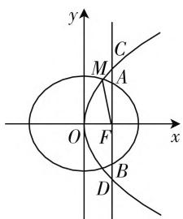

# 真题剖析,变式拓展,规律总结

——2020年全国卷Ⅱ(理)第19题

# ● 江苏省张家港高级中学 黄波

通过至少两种圆锥曲线(椭圆、双曲线和抛物线)之间的联系,结合特征点(包括中心、顶点、焦点、交点等)、特征直线(对称轴、准线或渐近线等)、特征参数 $(a,b,c,p,e$ 等)或与之相关的数学问题,构建起不同的圆锥曲线之间的桥梁,巧妙达到综合与应用的目的,是高考数学中的一大热点问题,也是历年高考中常考常新的一类创新问题,备受各方关注.

# 一、问题呈现

问题:(2020年高考数学全国卷Ⅱ理科第19题)已知椭圆 $C_{1}:\frac{x^{2}}{a^{2}}+\frac{y^{2}}{b^{2}}=1(a>b>0)$ 的右焦点F与抛物线 $C_{2}$ 的焦点重合, $C_{1}$ 的中心与 $C_{2}$ 的顶点重合.过点F且与x轴重直的直线交 $C_{1}$ 于A,B两点,交 $C_{2}$ 于C,D两点,且 $|CD|=\frac{4}{3}|AB|$ .

(1) 求 $C_{1}$ 的离心率；  
(2) 设 M 是 $C_{1}$ 与 $C_{2}$ 的公共点，若 $|MF|=5$ ，求 $C_{1}$ 与 $C_{2}$ 的标准方程.

此题以圆锥曲线中的椭圆与抛物线之间的位置关系为问题背景，主要考点为椭圆的方程、几何性质、通径和焦半径，抛物线的定义、方程、几何性质、通径和焦半径等，以及椭圆与抛物线间的位置关系，难度适中，计算量不大，属于圆锥曲线中的中规中矩的基本题。此类问题的破解过程，难度不大，运算细心一些，还是比较容易破解的。进一步加以研究，可以很好得以变式拓展，总结规律。

# 二、问题破解

解析:(1)由已知可设 $C_{2}$ 的方程为 $y^{2}=4cx$ ，其中 $c=\sqrt{a^{2}-b^{2}}$ .

不妨设 A, C 在第一象限，由题设得 A, B 的纵坐标分别为 $\frac{b^{2}}{a}$ ,

text_image

y
C
M
A
O
F
x
B
D

图1

$-\frac{b^{2}}{a};C,D$ 的纵坐标分别为 2c, -2c, 故 $\left|AB\right|=\frac{2b^{2}}{a}$ , $\left|CD\right|=4c.$ 由 $\left|CD\right|=\frac{4}{3}\left|AB\right|$ ，得 $4c=\frac{8b^{2}}{3a}$ ，即 $3\times\frac{c}{a}=2-2\left(\frac{c}{a}\right)^{2}$ ，解得 $\frac{c}{a}=-2$ （舍去）， $\frac{c}{a}=\frac{1}{2}$ .

所以 $C_{1}$ 的离心率为 $\frac{1}{2}$ .

(2) 方法1: 由(1)知, $a = 2c$ , $b = \sqrt{3}c$ , 故 $C_1: \frac{x^2}{4c^2} + \frac{y^2}{3c^2} = 1$ , $C_2: y^2 = 4cx$ , 联立两曲线的方程, 消去 $y$ 并整理可得 $3x^2 + 16cx - 12c^2 = 0$ , 所以 $(3x - 2c)(x + 6c) = 0$ , 解得 $x = \frac{2}{3}c$ 或 $x = -6c$ (舍去), 由于 $C_2$ 的准线为 $x = -c$ , 所以 $|MF| = x + c$ , 而 $|MF| = 5$ , 则 $\frac{2}{3}c + c = 5$ , 解得 $c = 3$ .

所以 $C_{1}$ 的标准方程为 $\frac{x^{2}}{36} + \frac{y^{2}}{27} = 1, C_{2}$ 的标准方程为 $y^{2} = 12x$ .

方法2：由(1)知， $a = 2c,b = \sqrt{3} c$ ，故 $C_1:\frac{x^2}{4c^2} +\frac{y^2}{3c^2}$ $= 1,C_{2}:y^{2} = 4cx.$

设 $M(x_0, y_0)$ ，由于 $C_2$ 的准线为 $x = -c$ ，所以由椭圆与抛物线的焦半径公式得 $\left\{ \begin{array}{l} |MF| = a - ex_0, \\ |MF| = x_0 + c, \end{array} \right.$ 即 $\left\{ \begin{array}{l} 5 = a - ex_0, \\ 5 = x_0 + c, \end{array} \right.$ 可得 $\left\{ \begin{array}{l} 5 = 2c - \frac{1}{2}x_0, \\ 5 = x_0 + c, \end{array} \right.$ 解得 $\left\{ \begin{array}{l} x_0 = 2, \\ c = 3, \end{array} \right.$ 所以 $C_1$ 的标准方程为 $\frac{x^2}{36} + \frac{y^2}{27} = 1, C_2$ 的标准方程为 $y^2 = 12x$ .

点评:第(1)问中,根据条件求出椭圆与抛物线的通径端点的纵坐标(用参数a,b,c表示),根据条件中的关系式建立方程，并结合参数之间的关系的转化即可求解离心率，思路比较自然，计算量较小；第(2)问中，可将椭圆与抛物线的方程联立，可通过方程或方程组不同方式处理，借助方程的转化求出点 $M$ 的横坐标满足的方程，再根据抛物线的定义加以转化与应用，建立关于参数 $c$ 的方程，进而结合方程的求解与应用来确定相应的圆锥曲线的方程；也可结合椭圆与抛物线的焦半径公式，联立方程组得以确定点 $M$ 的横坐标与参数 $c$ 的值，从而得以求解相应的圆锥曲线的方程。涉及圆锥曲线的焦半径的概念与公式问题，尽管教材上没有提及，却是高考数学中常考的对象，要加以适当补充与掌握。

# 三、变式拓展

探究 1: 保留题目条件, 改变 $C_{1}$ 与 $C_{2}$ 之间的位置关系的叙述方式, 改“设 M 是 $C_{1}$ 与 $C_{2}$ 的公共点, 若 $|MF|=5$ ”为“若 $C_{1}$ 的四个顶点到 $C_{2}$ 的准线距离之和为 12”, 得以拓展与变式, 作为文科卷题目出现. 难度与原题相比有所降低.

变式1:(2020年高考数学全国卷Ⅱ文科第19题)已知椭圆 $C_{1}:\frac{x^{2}}{a^{2}}+\frac{y^{2}}{b^{2}}=1(a>b>0)$ 的右焦点F与抛物线 $C_{2}$ 的焦点重合, $C_{1}$ 的中心与 $C_{2}$ 的顶点重合.过点F且与x轴重直的直线交 $C_{1}$ 于A,B两点,交 $C_{2}$ 于C,D两点,且 $|CD|=\frac{4}{3}|AB|$ .

(1) 求 $C_{1}$ 的离心率;  
(2) 若 $C_{1}$ 的四个顶点到 $C_{2}$ 的准线距离之和为 12，求 $C_{1}$ 与 $C_{2}$ 的标准方程.

解析:(1) 同真题解析部分, 可得 $C_{1}$ 的离心率为 $\frac{1}{2}$ .

(2) 由(1)知, $a = 2c$ , $b = \sqrt{3}c$ , 故 $C_1: \frac{x^2}{4c^2} + \frac{y^2}{3c^2} = 1$ , 所以 $C_1$ 的四个顶点坐标分别为 $(2c,0)$ , $(-2c,0)$ , $(0,\sqrt{3}c)$ , $(0,-\sqrt{3}c)$ , $C_2$ 的准线为 $x = -c$ .

由已知得 $3c + c + c + c = 12$ ，即 $c = 2$

所以 $C_1$ 的标准方程为 $\frac{x^2}{16} +\frac{y^2}{12} = 1,C_2$ 的标准方程为 $y^{2} = 8x$

点评:文科试题中巧妙借助抛物线的定义,以及点到直线的距离公式等相关条件来转化,可以更为快捷地处理问题,相比理科试题,简化过程,降低运算量,难度在一定程度上有所下降.

# 四、规律总结

探究 2: 进一步深入探究, 在椭圆的中心与抛物线的顶点重合条件下, 共焦点的椭圆与抛物线的交点到焦点的距离有何特点? 其实, 该公共焦点到两圆锥曲线的交点的距离是一个与参数 a, b, c 有关的关系式.

结论 1: 已知椭圆 $C_{1}:\frac{x^{2}}{a^{2}}+\frac{y^{2}}{b^{2}}=1(a>b>0)$ 的右焦点 F 与抛物线 $C_{2}$ 的焦点重合, $C_{1}$ 的中心与 $C_{2}$ 的顶点重合. 设 M 是 $C_{1}$ 与 $C_{2}$ 的公共点, 则 $|MF|$ 的值为一个定值 $\frac{a^{2}+c^{2}}{a+c}$ , 其中 $c=\sqrt{a^{2}-b^{2}}$ .

证明:由已知可设 $C_{2}$ 的方程为 $y^{2}=4cx$ ，其中 $c=\sqrt{a^{2}-b^{2}}$ .

设公共点 $M(x_0, y_0)$ ，由于 $C_2$ 的准线为 $x = -c$ ，焦点 $F(c, 0)$ ，所以由椭圆与抛物线的焦半径公式得 $\left\{ \begin{array}{l} |MF| = a - ex_0 = a - \frac{c}{a} x_0, \\ |MF| = x_0 + c, \end{array} \right.$ 整理可得 $x_0 = \frac{a(a - c)}{a + c}$ ，代入 $y^2 = 4cx$ ，可得 $y_0^2 = \frac{4ac(a - c)}{a + c}$ ，而 $|MF|^2 = (x_0 - c)^2 + (y_0 - 0)^2 = \left(\frac{a(a - c)}{a + c} - c\right)^2 + \frac{4ac(a - c)}{a + c} = \frac{(a^2 + c^2)^2}{(a + c)^2}$ ，所以 $|MF| = \frac{a^2 + c^2}{a + c}$ ，其是一个定值，从而结论得证。

点评:根据以上结论,在椭圆的中心与抛物线的顶点重合条件下,共焦点的椭圆与抛物线的交点到焦点的距离 $|MF|=\frac{a^{2}+c^{2}}{a+c}$ ,对于原来问题,可知a=2c,则有 $|MF|=\frac{a^{2}+c^{2}}{a+c}=\frac{5}{3}c=5$ ,解得c=3,进而可以解决对应的圆锥曲线的方程问题.

# 五、解后反思

借助圆锥曲线间的“点”“线”“数”等加以创新设置，巧妙串联与链接，合理交汇综合，把至少两种圆锥曲线（椭圆、双曲线和抛物线）加以融合，同时还可以有效融入平面解析几何的其他知识，在考查圆锥曲线的定义、方程与几何性质的同时，也很好地考查数学的思维、方法与技能。有效研究、探究与归纳此类圆锥曲线间的综合问题，在充分理解与掌握基础知识的基础上，可以很好地提升数学能力，拓展思维品质，培养数学核心素养。F